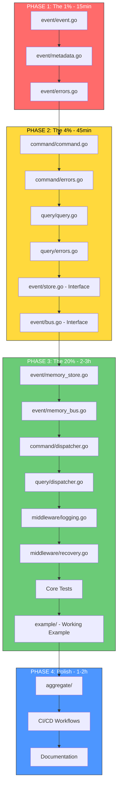

# go-cqrs-lite Implementation Plan

> Created: 2026-03-15_06-52
> Status: READY FOR EXECUTION

---

## Pareto Analysis: What Really Matters?

### The 1% That Delivers 51% of the Result

**Core Event Interface** - Everything in CQRS/ES revolves around events. Without a solid Event type, the entire library fails.

```
event/event.go (Event interface, BaseEvent)
└── This is the ATOM of the library. Everything builds on this.
```

### The 4% That Delivers 64% of the Result

**Core API Surface** - What users actually interact with:

| Component            | Purpose                            |
| -------------------- | ---------------------------------- |
| `event.Event`        | The fundamental building block     |
| `event.Store`        | Where events live (interface only) |
| `command.Command`    | Write operation definition         |
| `command.Dispatcher` | Executes commands                  |
| `query.Query`        | Read operation definition          |
| `query.Dispatcher`   | Executes queries                   |

### The 20% That Delivers 80% of the Result

**Usable Library** - Enough to be production-ready:

- All core interfaces (Event, Command, Query, Aggregate)
- In-memory implementations (for testing/prototyping)
- Event Bus (for pub/sub)
- Basic middleware (logging, recovery)
- One complete example
- 95%+ test coverage on core

### The 80% Effort for 20% Result (DEFER)

These are nice-to-haves that can be added later:

- Snapshots (optimization, not required for basic ES)
- Advanced middleware (metrics, retry, validation)
- Multiple examples
- CI/CD workflows
- Documentation polish
- PostgreSQL/SQLite adapters (separate packages)

---

## Execution Strategy

```
┌─────────────────────────────────────────────────────────────────┐
│  PHASE 1: THE 1% (51% Value)                                    │
│  event/event.go - Core Event types                              │
│  TIME: 15 min | BLOCKING: Everything                            │
└─────────────────────────────────────────────────────────────────┘
                              │
                              ▼
┌─────────────────────────────────────────────────────────────────┐
│  PHASE 2: THE 4% (64% Value)                                    │
│  Core interfaces: Store, Command, Query, Dispatchers            │
│  TIME: 45 min | BLOCKING: Most implementations                  │
└─────────────────────────────────────────────────────────────────┘
                              │
                              ▼
┌─────────────────────────────────────────────────────────────────┐
│  PHASE 3: THE 20% (80% Value)                                   │
│  In-memory impls, EventBus, Middleware, Tests, Example          │
│  TIME: 2-3 hours | RESULT: Usable library                       │
└─────────────────────────────────────────────────────────────────┘
                              │
                              ▼
┌─────────────────────────────────────────────────────────────────┐
│  PHASE 4: POLISH (Remaining 20% Value)                          │
│  CI/CD, Advanced features, Documentation                        │
│  TIME: 1-2 hours | RESULT: Production-ready                     │
└─────────────────────────────────────────────────────────────────┘
```

---

## Mermaid Execution Graph



---

## Detailed Task Breakdown (27 Tasks, 30-100 min each)

| #   | Task                                          | Phase | Priority | Est.  | Dependencies |
| --- | --------------------------------------------- | ----- | -------- | ----- | ------------ |
| 1   | Create `event/event.go` - Core Event types    | 1     | CRITICAL | 15min | None         |
| 2   | Create `event/metadata.go` - EventMetadata    | 1     | CRITICAL | 10min | 1            |
| 3   | Create `event/errors.go` - Event errors       | 1     | HIGH     | 5min  | 1            |
| 4   | Create `event/store.go` - Store interface     | 2     | CRITICAL | 15min | 3            |
| 5   | Create `event/bus.go` - Bus interface         | 2     | CRITICAL | 15min | 4            |
| 6   | Create `command/command.go` - Command types   | 2     | CRITICAL | 15min | None         |
| 7   | Create `command/errors.go` - Command errors   | 2     | HIGH     | 5min  | 6            |
| 8   | Create `command/dispatcher.go` - Dispatcher   | 2     | CRITICAL | 20min | 7            |
| 9   | Create `query/query.go` - Query types         | 2     | CRITICAL | 15min | None         |
| 10  | Create `query/errors.go` - Query errors       | 2     | HIGH     | 5min  | 9            |
| 11  | Create `query/dispatcher.go` - Dispatcher     | 2     | CRITICAL | 20min | 10           |
| 12  | Create `event/memory_store.go` - In-mem impl  | 3     | HIGH     | 25min | 4            |
| 13  | Create `event/memory_bus.go` - In-mem impl    | 3     | HIGH     | 20min | 5            |
| 14  | Create `aggregate/aggregate.go` - Core types  | 3     | HIGH     | 15min | 1            |
| 15  | Create `aggregate/repository.go` - Repository | 3     | MEDIUM   | 15min | 14           |
| 16  | Create `middleware/logging.go`                | 3     | HIGH     | 15min | 8,11         |
| 17  | Create `middleware/recovery.go`               | 3     | HIGH     | 15min | 8,11         |
| 18  | Create `event_test.go` - Event tests          | 3     | HIGH     | 20min | 12,13        |
| 19  | Create `command_test.go` - Command tests      | 3     | HIGH     | 20min | 8            |
| 20  | Create `query_test.go` - Query tests          | 3     | HIGH     | 20min | 11           |
| 21  | Create `integration_test.go` - Full flow      | 3     | HIGH     | 30min | 18,19,20     |
| 22  | Create `example/user/` - User aggregate       | 3     | HIGH     | 30min | 21           |
| 23  | Create `.github/workflows/` - CI/CD           | 4     | MEDIUM   | 15min | 22           |
| 24  | Create `Makefile` - Build targets             | 4     | MEDIUM   | 10min | None         |
| 25  | Create `.golangci.yml` - Linter config        | 4     | MEDIUM   | 10min | None         |
| 26  | Add GoDoc comments to all packages            | 4     | MEDIUM   | 30min | 22           |
| 27  | Update README.md with final API               | 4     | MEDIUM   | 15min | 26           |

**Total Estimated Time: ~7 hours**

---

## Ultra-Fine Task Breakdown (150 Tasks, max 15 min each)

### PHASE 1: The 1% (51% Value) - 30 min

| #   | Task                                | File              | Est. | Status |
| --- | ----------------------------------- | ----------------- | ---- | ------ |
| 1   | Define `EventType` type alias       | event/event.go    | 2min | TODO   |
| 2   | Define `AggregateType` type alias   | event/event.go    | 2min | TODO   |
| 3   | Define `Event` interface            | event/event.go    | 5min | TODO   |
| 4   | Define `BaseEvent` struct           | event/event.go    | 5min | TODO   |
| 5   | Implement `NewEvent()` constructor  | event/event.go    | 3min | TODO   |
| 6   | Add JSON serialization tags         | event/event.go    | 3min | TODO   |
| 7   | Define `EventMetadata` struct       | event/metadata.go | 5min | TODO   |
| 8   | Add `NewMetadata()` constructor     | event/metadata.go | 3min | TODO   |
| 9   | Define `ErrEventNotFound` error     | event/errors.go   | 2min | TODO   |
| 10  | Define `ErrVersionConflict` error   | event/errors.go   | 2min | TODO   |
| 11  | Define `ErrAggregateNotFound` error | event/errors.go   | 2min | TODO   |
| 12  | Define `ErrInvalidEventType` error  | event/errors.go   | 2min | TODO   |

### PHASE 2: The 4% (64% Value) - 95 min

| #   | Task                                       | File                  | Est. | Status |
| --- | ------------------------------------------ | --------------------- | ---- | ------ |
| 13  | Define `Store` interface                   | event/store.go        | 5min | TODO   |
| 14  | Add `Append()` to Store                    | event/store.go        | 3min | TODO   |
| 15  | Add `GetByAggregateID()` to Store          | event/store.go        | 3min | TODO   |
| 16  | Add `GetByVersion()` to Store              | event/store.go        | 3min | TODO   |
| 17  | Add `GetAll()` to Store                    | event/store.go        | 3min | TODO   |
| 18  | Define `Stream` type for iteration         | event/store.go        | 5min | TODO   |
| 19  | Define `Handler` func type                 | event/bus.go          | 3min | TODO   |
| 20  | Define `Bus` interface                     | event/bus.go          | 5min | TODO   |
| 21  | Add `Subscribe()` to Bus                   | event/bus.go          | 3min | TODO   |
| 22  | Add `Publish()` to Bus                     | event/bus.go          | 3min | TODO   |
| 23  | Add `PublishSync()` to Bus                 | event/bus.go          | 3min | TODO   |
| 24  | Add `Unsubscribe()` to Bus                 | event/bus.go          | 3min | TODO   |
| 25  | Define `CommandType` type alias            | command/command.go    | 2min | TODO   |
| 26  | Define `Command` interface                 | command/command.go    | 5min | TODO   |
| 27  | Define `BaseCommand` struct                | command/command.go    | 5min | TODO   |
| 28  | Implement `NewCommand()` constructor       | command/command.go    | 3min | TODO   |
| 29  | Define `ErrHandlerNotFound` error          | command/errors.go     | 2min | TODO   |
| 30  | Define `ErrValidation` error               | command/errors.go     | 2min | TODO   |
| 31  | Define `ErrCommandAlreadyRegistered` error | command/errors.go     | 2min | TODO   |
| 32  | Define `Handler` interface                 | command/dispatcher.go | 3min | TODO   |
| 33  | Define `Dispatcher` interface              | command/dispatcher.go | 5min | TODO   |
| 34  | Implement `NewDispatcher()`                | command/dispatcher.go | 3min | TODO   |
| 35  | Implement `Register()` with type safety    | command/dispatcher.go | 5min | TODO   |
| 36  | Implement `Dispatch()` with context        | command/dispatcher.go | 5min | TODO   |
| 37  | Implement `HasHandler()` helper            | command/dispatcher.go | 3min | TODO   |
| 38  | Define `QueryType` type alias              | query/query.go        | 2min | TODO   |
| 39  | Define `Query` interface                   | query/query.go        | 5min | TODO   |
| 40  | Define `BaseQuery` struct                  | query/query.go        | 5min | TODO   |
| 41  | Define `Pagination` struct                 | query/query.go        | 3min | TODO   |
| 42  | Define `PageResult` generic struct         | query/query.go        | 5min | TODO   |
| 43  | Define `ErrQueryHandlerNotFound` error     | query/errors.go       | 2min | TODO   |
| 44  | Define `ErrInvalidQuery` error             | query/errors.go       | 2min | TODO   |
| 45  | Define `Handler` interface                 | query/dispatcher.go   | 3min | TODO   |
| 46  | Define `Dispatcher` interface              | query/dispatcher.go   | 5min | TODO   |
| 47  | Implement `NewDispatcher()`                | query/dispatcher.go   | 3min | TODO   |
| 48  | Implement `Register()` with type safety    | query/dispatcher.go   | 5min | TODO   |
| 49  | Implement `Dispatch()` with context        | query/dispatcher.go   | 5min | TODO   |
| 50  | Implement pagination support               | query/dispatcher.go   | 5min | TODO   |

### PHASE 3: The 20% (80% Value) - 180 min

| #   | Task                               | File                      | Est.  | Status |
| --- | ---------------------------------- | ------------------------- | ----- | ------ |
| 51  | Create `MemoryStore` struct        | event/memory_store.go     | 3min  | TODO   |
| 52  | Add sync.RWMutex for thread safety | event/memory_store.go     | 2min  | TODO   |
| 53  | Implement `Append()`               | event/memory_store.go     | 5min  | TODO   |
| 54  | Implement `GetByAggregateID()`     | event/memory_store.go     | 5min  | TODO   |
| 55  | Implement `GetByVersion()`         | event/memory_store.go     | 5min  | TODO   |
| 56  | Implement `GetAll()`               | event/memory_store.go     | 3min  | TODO   |
| 57  | Add version conflict detection     | event/memory_store.go     | 5min  | TODO   |
| 58  | Create `MemoryBus` struct          | event/memory_bus.go       | 3min  | TODO   |
| 59  | Add handler map with mutex         | event/memory_bus.go       | 3min  | TODO   |
| 60  | Implement `Subscribe()`            | event/memory_bus.go       | 5min  | TODO   |
| 61  | Implement `Publish()` async        | event/memory_bus.go       | 5min  | TODO   |
| 62  | Implement `PublishSync()`          | event/memory_bus.go       | 5min  | TODO   |
| 63  | Implement `Unsubscribe()`          | event/memory_bus.go       | 5min  | TODO   |
| 64  | Define `Aggregate` interface       | aggregate/aggregate.go    | 5min  | TODO   |
| 65  | Define `BaseAggregate` struct      | aggregate/aggregate.go    | 5min  | TODO   |
| 66  | Add `ApplyEvent()` method pattern  | aggregate/aggregate.go    | 5min  | TODO   |
| 67  | Define `Repository` interface      | aggregate/repository.go   | 5min  | TODO   |
| 68  | Add `Save()` to Repository         | aggregate/repository.go   | 3min  | TODO   |
| 69  | Add `GetByID()` to Repository      | aggregate/repository.go   | 3min  | TODO   |
| 70  | Define `Middleware` type           | middleware/logging.go     | 3min  | TODO   |
| 71  | Implement logging for commands     | middleware/logging.go     | 5min  | TODO   |
| 72  | Implement logging for events       | middleware/logging.go     | 5min  | TODO   |
| 73  | Add structured log format          | middleware/logging.go     | 3min  | TODO   |
| 74  | Define recovery middleware         | middleware/recovery.go    | 3min  | TODO   |
| 75  | Implement panic recovery           | middleware/recovery.go    | 5min  | TODO   |
| 76  | Add stack trace capture            | middleware/recovery.go    | 3min  | TODO   |
| 77  | Write Event unit tests             | event_test.go             | 10min | TODO   |
| 78  | Write Store unit tests             | event_test.go             | 10min | TODO   |
| 79  | Write Bus unit tests               | event_test.go             | 10min | TODO   |
| 80  | Write Command unit tests           | command_test.go           | 10min | TODO   |
| 81  | Write Dispatcher unit tests        | command_test.go           | 10min | TODO   |
| 82  | Write Query unit tests             | query_test.go             | 10min | TODO   |
| 83  | Write pagination tests             | query_test.go             | 5min  | TODO   |
| 84  | Write full CQRS flow test          | integration_test.go       | 15min | TODO   |
| 85  | Write middleware chain test        | integration_test.go       | 10min | TODO   |
| 86  | Create example/user/ directory     | example/user/             | 2min  | TODO   |
| 87  | Create User aggregate              | example/user/aggregate.go | 10min | TODO   |
| 88  | Create CreateUser command          | example/user/commands.go  | 5min  | TODO   |
| 89  | Create UpdateUser command          | example/user/commands.go  | 5min  | TODO   |
| 90  | Create DeleteUser command          | example/user/commands.go  | 5min  | TODO   |
| 91  | Create GetUser query               | example/user/queries.go   | 5min  | TODO   |
| 92  | Create ListUsers query             | example/user/queries.go   | 5min  | TODO   |
| 93  | Create UserCreated event           | example/user/events.go    | 5min  | TODO   |
| 94  | Create UserUpdated event           | example/user/events.go    | 5min  | TODO   |
| 95  | Create UserDeleted event           | example/user/events.go    | 5min  | TODO   |
| 96  | Create command handlers            | example/user/handlers.go  | 10min | TODO   |
| 97  | Create query handlers              | example/user/handlers.go  | 10min | TODO   |
| 98  | Create main.go with full example   | example/main.go           | 10min | TODO   |

### PHASE 4: Polish (20% Value) - 90 min

| #   | Task                                | File               | Est.  | Status |
| --- | ----------------------------------- | ------------------ | ----- | ------ |
| 99  | Create .github/workflows/ directory | .github/           | 1min  | TODO   |
| 100 | Create test.yml workflow            | .github/workflows/ | 5min  | TODO   |
| 101 | Add Go version matrix               | .github/workflows/ | 3min  | TODO   |
| 102 | Create lint.yml workflow            | .github/workflows/ | 5min  | TODO   |
| 103 | Create Makefile with build target   | Makefile           | 3min  | TODO   |
| 104 | Add test target to Makefile         | Makefile           | 2min  | TODO   |
| 105 | Add lint target to Makefile         | Makefile           | 2min  | TODO   |
| 106 | Add cover target to Makefile        | Makefile           | 2min  | TODO   |
| 107 | Create .golangci.yml                | .golangci.yml      | 5min  | TODO   |
| 108 | Configure linters                   | .golangci.yml      | 3min  | TODO   |
| 109 | Add GoDoc to event package          | event/\*.go        | 5min  | TODO   |
| 110 | Add GoDoc to command package        | command/\*.go      | 5min  | TODO   |
| 111 | Add GoDoc to query package          | query/\*.go        | 5min  | TODO   |
| 112 | Add GoDoc to aggregate package      | aggregate/\*.go    | 5min  | TODO   |
| 113 | Add GoDoc to middleware package     | middleware/\*.go   | 5min  | TODO   |
| 114 | Update README quick start           | README.md          | 5min  | TODO   |
| 115 | Update README API reference         | README.md          | 10min | TODO   |
| 116 | Add badges to README                | README.md          | 3min  | TODO   |
| 117 | Update TODO_LIST.md status          | TODO_LIST.md       | 5min  | TODO   |
| 118 | Verify go build ./... passes        | -                  | 2min  | TODO   |
| 119 | Verify go test ./... passes         | -                  | 5min  | TODO   |
| 120 | Verify coverage > 80%               | -                  | 5min  | TODO   |
| 121 | Run golangci-lint and fix issues    | -                  | 10min | TODO   |
| 122 | Create git commit                   | -                  | 5min  | TODO   |
| 123 | Push to remote                      | -                  | 2min  | TODO   |

### BONUS TASKS (If time permits)

| #   | Task                          | File                     | Est.  | Status   |
| --- | ----------------------------- | ------------------------ | ----- | -------- |
| 124 | Add `Snapshot` struct         | event/snapshot.go        | 5min  | OPTIONAL |
| 125 | Add `SnapshotStore` interface | event/snapshot.go        | 5min  | OPTIONAL |
| 126 | Add validation middleware     | middleware/validation.go | 10min | OPTIONAL |
| 127 | Add retry middleware          | middleware/retry.go      | 10min | OPTIONAL |
| 128 | Add metrics middleware        | middleware/metrics.go    | 10min | OPTIONAL |
| 129 | Create CODE_OF_CONDUCT.md     | -                        | 3min  | OPTIONAL |
| 130 | Create CONTRIBUTING.md        | -                        | 5min  | OPTIONAL |
| 131 | Create docs/architecture.md   | docs/                    | 10min | OPTIONAL |

---

## Execution Checklist

### Before Starting

- [x] Git repository is clean
- [x] Planning document created
- [ ] TODO list updated

### Phase 1 Completion

- [ ] All 12 tasks complete
- [ ] `go build ./...` passes
- [ ] No lint errors

### Phase 2 Completion

- [ ] All 38 tasks (13-50) complete
- [ ] `go build ./...` passes
- [ ] No lint errors

### Phase 3 Completion

- [ ] All 48 tasks (51-98) complete
- [ ] `go build ./...` passes
- [ ] `go test ./...` passes
- [ ] Coverage > 80%

### Phase 4 Completion

- [ ] All 25 tasks (99-123) complete
- [ ] CI workflows pass locally
- [ ] Documentation complete
- [ ] Git committed and pushed

---

## Quality Gates (Per HOW_TO_GOLANG.md)

- [ ] Files under 250 lines
- [ ] Functions under 30 lines
- [ ] No `any` types
- [ ] Context as first parameter
- [ ] 95%+ test coverage on core
- [ ] All exported types have GoDoc
- [ ] No external dependencies (except google/uuid, cockroachdb/errors)

---

## Notes

1. **Run `go build ./...` after EVERY file creation**
2. **Run tests after completing each package**
3. **Keep commits atomic - one logical change per commit**
4. **If something breaks, STOP and fix immediately**
5. **Don't skip tests - they validate the design**

---

_Generated: 2026-03-15_06-52_
