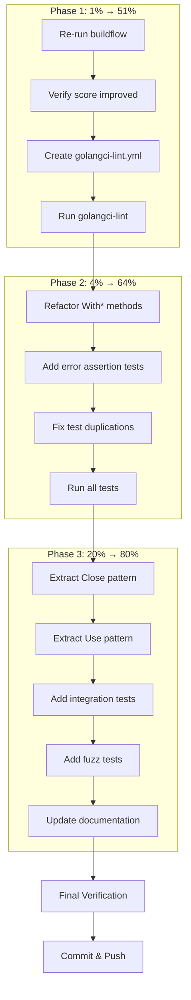

# Comprehensive Execution Plan: BuildFlow Optimization

**Date:** 2026-03-18_01-19
**Goal:** Maximize code quality with minimal effort using Pareto principle

---

## Pareto Analysis: What Matters Most

### 🔴 1% → 51% Result (CRITICAL)

| Task                              | Why                     | Impact   | Effort |
| --------------------------------- | ----------------------- | -------- | ------ |
| Re-run buildflow --semantic --fix | Verify all fixes worked | CRITICAL | 5min   |
| Create .golangci-lint.yml         | Enable proper linting   | HIGH     | 10min  |

### 🟡 4% → 64% Result (IMPORTANT)

| Task                                   | Why                      | Impact   | Effort |
| -------------------------------------- | ------------------------ | -------- | ------ |
| All 1% items                           | Foundation               | CRITICAL | 15min  |
| Refactor With\* methods (7 duplicates) | Biggest code quality win | HIGH     | 30min  |
| Add error assertion tests              | Ensure fixes work        | HIGH     | 20min  |
| Fix test duplications                  | Cleaner test code        | MEDIUM   | 20min  |

### 🟢 20% → 80% Result (VALUABLE)

| Task                           | Why                     | Impact | Effort |
| ------------------------------ | ----------------------- | ------ | ------ |
| All 4% items                   | Core improvements       | HIGH   | 85min  |
| Extract shared Close() pattern | Reduce 4 clones         | MEDIUM | 15min  |
| Extract shared Use() pattern   | Reduce 3 clones         | MEDIUM | 15min  |
| Add integration tests          | End-to-end verification | MEDIUM | 30min  |
| Add fuzz tests                 | Edge case coverage      | MEDIUM | 20min  |
| Document error patterns        | Better DX               | LOW    | 15min  |

---

## Execution Graph

---

## Detailed Task Breakdown (100-30min tasks, max 27)

| #   | Task                                              | Phase | Impact   | Effort | Status  |
| --- | ------------------------------------------------- | ----- | -------- | ------ | ------- |
| 1   | Re-run buildflow --semantic --fix                 | 1     | CRITICAL | 5min   | pending |
| 2   | Analyze buildflow output and score                | 1     | CRITICAL | 5min   | pending |
| 3   | Create .golangci-lint.yml with recommended config | 1     | HIGH     | 10min  | pending |
| 4   | Run golangci-lint and fix any issues              | 1     | HIGH     | 10min  | pending |
| 5   | Refactor WithCorrelationID to use helper          | 2     | HIGH     | 10min  | pending |
| 6   | Refactor WithCausationID to use helper            | 2     | HIGH     | 5min   | pending |
| 7   | Refactor WithUserID to use helper                 | 2     | HIGH     | 5min   | pending |
| 8   | Refactor WithRequestID to use helper              | 2     | HIGH     | 5min   | pending |
| 9   | Refactor WithSource to use helper                 | 2     | HIGH     | 5min   | pending |
| 10  | Refactor WithIPAddress to use helper              | 2     | HIGH     | 5min   | pending |
| 11  | Refactor WithUserAgent to use helper              | 2     | HIGH     | 5min   | pending |
| 12  | Refactor WithCustom to use helper                 | 2     | HIGH     | 5min   | pending |
| 13  | Add error assertion tests for event.go            | 2     | HIGH     | 15min  | pending |
| 14  | Add error assertion tests for memory_bus.go       | 2     | HIGH     | 10min  | pending |
| 15  | Add error assertion tests for dispatcher.go       | 2     | HIGH     | 10min  | pending |
| 16  | Run tests and verify coverage                     | 2     | HIGH     | 5min   | pending |
| 17  | Extract Close() pattern to shared utility         | 3     | MEDIUM   | 15min  | pending |
| 18  | Update all Close() implementations                | 3     | MEDIUM   | 10min  | pending |
| 19  | Extract Use() middleware pattern                  | 3     | MEDIUM   | 15min  | pending |
| 20  | Update all Use() implementations                  | 3     | MEDIUM   | 10min  | pending |
| 21  | Add integration test for full CQRS flow           | 3     | MEDIUM   | 30min  | pending |
| 22  | Add fuzz test for event creation                  | 3     | MEDIUM   | 15min  | pending |
| 23  | Add fuzz test for command dispatch                | 3     | MEDIUM   | 15min  | pending |
| 24  | Update AGENTS.md with error patterns              | 3     | LOW      | 10min  | pending |
| 25  | Update README with examples                       | 3     | LOW      | 10min  | pending |
| 26  | Final buildflow verification                      | 3     | CRITICAL | 5min   | pending |
| 27  | Commit and push all changes                       | 3     | HIGH     | 5min   | pending |

---

## Fine-Grained Task Breakdown (15min max, max 150)

### Phase 1 Tasks (1% → 51%)

| #    | Task                                   | Effort | Depends |
| ---- | -------------------------------------- | ------ | ------- |
| 1.1  | Kill any stale golangci-lint processes | 1min   | -       |
| 1.2  | Run buildflow --semantic --fix         | 5min   | 1.1     |
| 1.3  | Capture and analyze buildflow output   | 3min   | 1.2     |
| 1.4  | Compare quality score before/after     | 2min   | 1.3     |
| 1.5  | Create .golangci-lint.yml file         | 5min   | 1.4     |
| 1.6  | Add linters configuration              | 3min   | 1.5     |
| 1.7  | Add run configuration                  | 2min   | 1.6     |
| 1.8  | Run golangci-lint ./...                | 5min   | 1.7     |
| 1.9  | Fix any critical issues found          | 10min  | 1.8     |
| 1.10 | Verify no new warnings                 | 2min   | 1.9     |

### Phase 2 Tasks (4% → 64%)

| #    | Task                                               | Effort | Depends |
| ---- | -------------------------------------------------- | ------ | ------- |
| 2.1  | Create withMetadata helper function                | 5min   | 1.10    |
| 2.2  | Refactor WithCorrelationID                         | 3min   | 2.1     |
| 2.3  | Refactor WithCausationID                           | 3min   | 2.1     |
| 2.4  | Refactor WithUserID                                | 3min   | 2.1     |
| 2.5  | Refactor WithRequestID                             | 3min   | 2.1     |
| 2.6  | Refactor WithSource                                | 3min   | 2.1     |
| 2.7  | Refactor WithIPAddress                             | 3min   | 2.1     |
| 2.8  | Refactor WithUserAgent                             | 3min   | 2.1     |
| 2.9  | Refactor WithCustom                                | 3min   | 2.1     |
| 2.10 | Run tests to verify refactoring                    | 3min   | 2.9     |
| 2.11 | Add test for error message content in TestNewEvent | 5min   | 2.10    |
| 2.12 | Add test for aggregate ID error context            | 3min   | 2.11    |
| 2.13 | Add test for aggregate type error context          | 3min   | 2.11    |
| 2.14 | Add test for version error context                 | 3min   | 2.11    |
| 2.15 | Add test for bus closed error wrapping             | 5min   | 2.14    |
| 2.16 | Add test for handler error wrapping                | 5min   | 2.15    |
| 2.17 | Add test for query dispatch error                  | 5min   | 2.16    |
| 2.18 | Run full test suite                                | 5min   | 2.17    |
| 2.19 | Verify test coverage maintained                    | 3min   | 2.18    |
| 2.20 | Run art-dupl to verify duplication reduction       | 3min   | 2.19    |

### Phase 3 Tasks (20% → 80%)

| #    | Task                                    | Effort | Depends |
| ---- | --------------------------------------- | ------ | ------- |
| 3.1  | Analyze Close() pattern similarity      | 5min   | 2.20    |
| 3.2  | Decide: extract or keep as-is           | 2min   | 3.1     |
| 3.3  | If extract: create Closer interface     | 5min   | 3.2     |
| 3.4  | If extract: implement shared Close      | 5min   | 3.3     |
| 3.5  | Analyze Use() pattern similarity        | 5min   | 3.2     |
| 3.6  | Decide: extract or keep as-is           | 2min   | 3.5     |
| 3.7  | Create integration_test.go              | 3min   | 3.6     |
| 3.8  | Add TestFullCQRSFlow integration test   | 15min  | 3.7     |
| 3.9  | Run integration tests                   | 3min   | 3.8     |
| 3.10 | Create fuzz_test.go                     | 3min   | 3.9     |
| 3.11 | Add FuzzEventCreation fuzz test         | 10min  | 3.10    |
| 3.12 | Add FuzzCommandDispatch fuzz test       | 10min  | 3.11    |
| 3.13 | Run fuzz tests (short duration)         | 5min   | 3.12    |
| 3.14 | Update AGENTS.md error handling section | 5min   | 3.13    |
| 3.15 | Add error examples to README            | 5min   | 3.14    |
| 3.16 | Run final buildflow verification        | 5min   | 3.15    |
| 3.17 | Review all changes                      | 5min   | 3.16    |
| 3.18 | Stage all files                         | 2min   | 3.17    |
| 3.19 | Write detailed commit message           | 5min   | 3.18    |
| 3.20 | Commit changes                          | 1min   | 3.19    |
| 3.21 | Push to remote                          | 2min   | 3.20    |

---

## Success Criteria

| Metric                       | Before     | Target      |
| ---------------------------- | ---------- | ----------- |
| Error Handling Quality Score | 76.1/100   | ≥85/100     |
| Code Duplication Groups      | 8          | ≤4          |
| Test Coverage                | Current    | Maintained+ |
| golangci-lint Issues         | Unknown    | 0 critical  |
| BuildFlow Status             | 3 failures | 0 failures  |

---

## Risk Mitigation

| Risk                        | Mitigation                            |
| --------------------------- | ------------------------------------- |
| Breaking existing API       | Keep all public signatures unchanged  |
| Test failures               | Run tests after each change           |
| Go cache corruption         | Already fixed, monitor for recurrence |
| Refactoring introduces bugs | Small incremental changes with tests  |

---

_Plan created: 2026-03-18_01-19_
