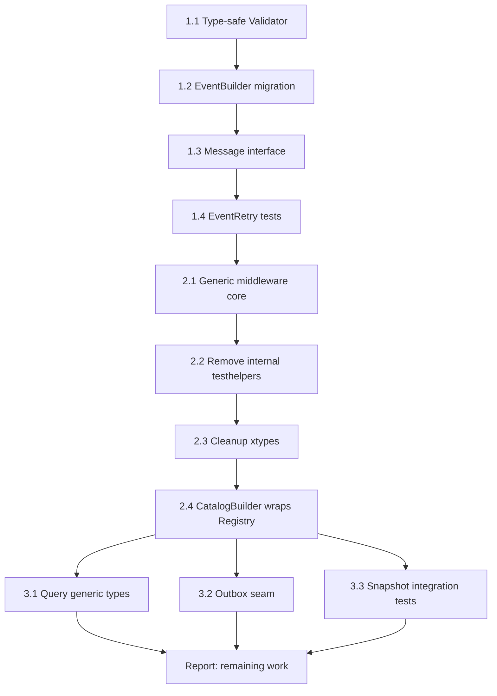

# Improve Codebase Architecture — Execution Plan

**Date:** 2026-04-29  
**Scope:** go-cqrs-lite monorepo  
**Goal:** Deepen modules, eliminate shallow pass-throughs, improve type safety, and fix orphaned infrastructure.

---

## 0. The Pareto Principle

| Phase | Effort | Impact | What |
|-------|--------|--------|------|
| 1% | ~1h | Disproportionate | Type-safe validator; EventBuilder migration; Root.LoadEvents ✅ |
| 4% | ~2h | Very High | Generic middleware core; Remove internal testhelpers shim; xtypes cleanup |
| 20% | ~1d | Transformative | Query generic result types; Outbox seam; Catalog consolidation |
| 100% | ~1w | Architectural | Full module boundary cleanup; projection module; storage module |

**Start with 1%, then 4%, then 20%. Stop when marginal utility drops.**

---

## 1. COMPLETED: Root.LoadEvents + SnapshotStore Integration ✅

**Status:** DONE (commit `f150708`)

**What changed:**
- `HistoryLoader` runtime side-interface eliminated
- `LoadEvents` and `SetVersion` added to `Root` interface (compile-time enforced)
- `EventSourcedRepository` accepts optional `SnapshotStore` via `NewRepositoryWithSnapshot()`
- `Load()` loads snapshot first, then replays events from `snapshot.Version` onward

**Impact:** HIGH. Orphaned interface becomes real. Runtime error class eliminated.

---

## 2. REMAINING TASKS

### Phase 1: The 1% — Quick Wins (~1-2 hours)

#### Task 1.1: Type-safe Validator with generics
**Files:** `middleware/middleware.go`, `middleware/validation.go`, all `middleware/*_test.go`

**Problem:** `Validator func(any) error` breaks type safety. Validators must type-assert inside the function body. Bugs manifest at runtime.

**Solution:** Introduce `TypedValidator[T any] func(T) error`. Update `CommandValidation`, `EventValidation`, `QueryValidation` to accept typed validators. Keep backward-compatible `Validator` as an alias for `TypedValidator[any]`.

**Benefits:** Compile-time validation of validator signatures. Tests catch mismatches before runtime.

**Effort:** LOW (~15 min)  
**Impact:** MEDIUM (type safety improvement)

---

#### Task 1.2: Move EventBuilder from xtypes to core/event
**Files:** `xtypes/event.go` → `core/event/builder.go`, `xtypes/xtypes_test.go`

**Problem:** `EventBuilder` is a genuinely useful fluent API but lives in a shallow `xtypes` module. No other module depends on `xtypes`. The module adds dependency overhead for minimal value.

**Solution:**
1. Move `EventBuilder` to `core/event/builder.go` as `Builder`
2. Update `Build()` to return `*Core` instead of `*TypedEvent`
3. Keep `xtypes` wrappers as thin aliases for backward compatibility
4. Evaluate deleting `xtypes` entirely in Task 2.3

**Benefits:** Useful builder lives where events are defined. One less module to maintain.

**Effort:** LOW (~20 min)  
**Impact:** MEDIUM (better organization)

---

#### Task 1.3: Add common Message interface
**Files:** `core/command/command.go`, `core/event/event.go`, `core/query/query.go`

**Problem:** Command, Event, and Query all have `Type()` but no common interface unifies them. Catalog adapters and middleware must handle each separately.

**Solution:** Add `Message` interface to each package:
```go
// In each package
 type Message interface {
     Type() Type
 }
```
Since `Type` is different in each package, there is no cross-package unification. Instead, define `Typed` interface:
```go
// core/pkg/dispatcher
 type Typed interface {
     Type() string
 }
```
Command, Event, Query all satisfy this implicitly via `Type() string` (since `Type` is a `string` alias in each package).

**Benefits:** Enables generic middleware that operates on any typed message.

**Effort:** LOW (~10 min)  
**Impact:** MEDIUM (enables generic code)

---

#### Task 1.4: Add EventRetry middleware tests
**Files:** `middleware/retry_test.go` (new)

**Problem:** `EventRetry` shares the same retry logic as `CommandRetry` but has zero test coverage. The retry logic is complex (backoff, jitter, context cancellation).

**Solution:** Extract shared `retry` tests into a table-driven test that exercises `CommandRetry`, `EventRetry`, and `QueryRetry` through a common harness.

**Benefits:** Confidence in retry behavior for all three message kinds. One test suite covers all.

**Effort:** LOW (~20 min)  
**Impact:** MEDIUM (coverage gap closed)

---

### Phase 2: The 4% — Structural Improvements (~2-3 hours)

#### Task 2.1: Extract generic middleware core for Command/Event
**Files:** `middleware/logging.go`, `middleware/recovery.go`, `middleware/validation.go`, `middleware/middleware.go`

**Problem:** Command and Event handlers have identical signatures: `func(context.Context, T) error`. Yet recovery, validation, and logging are copy-pasted. The interface is 3× larger than the behavior.

**Solution:** Create a generic middleware core in `middleware`:
```go
func Recovery[T any, M interface{ Type() string }]() func(Handler[T, M]) Handler[T, M]
func Validation[T any, M interface{ Type() string }](validate func(M) error) func(Handler[T, M]) Handler[T, M]
```
Where `Handler[T, M] = func(context.Context, M) (T, error)` — but Command/Event return `error`, Query returns `(any, error)`.

Actually, Command/Event share `func(context.Context, M) error`. Extract a generic core for this shape:
```go
type ErrorHandler[M any] func(context.Context, M) error
type ErrorMiddleware[M any] func(ErrorHandler[M]) ErrorHandler[M]
```

Provide:
- `ErrorRecovery[M any]()` — generic panic recovery
- `ErrorValidation[M any](validate func(M) error)` — generic validation

Then `CommandRecovery` = `ErrorRecovery[command.Command]`, etc.

**Benefits:** Fix once, fixed everywhere. One test suite for recovery/validation covers both command and event.

**Effort:** MEDIUM (~45 min)  
**Impact:** MEDIUM (DRY, locality)

---

#### Task 2.2: Remove core/internal/testhelpers pass-through shim
**Files:** `core/internal/testhelpers/helpers.go`, all `core/*/*_test.go`

**Problem:** `core/internal/testhelpers` is 37 lines of pure re-exports from the shared `testhelpers` module. Exists only because Go module visibility prevented direct imports. Adding a new helper requires editing two files.

**Solution:**
1. Update all `core/*/*_test.go` imports from `core/internal/testhelpers` to `github.com/larsartmann/go-cqrs-lite/testhelpers`
2. Delete `core/internal/testhelpers/` directory
3. Remove `testhelpers` replace directive from `core/go.mod`

**Note:** This keeps the circular dependency (`core` → `testhelpers` → `core`) but makes it explicit. The long-term fix is extracting `core` tests that need `memory`/`testhelpers` into a separate integration test module.

**Benefits:** One place for test utilities. No indirection seam that adds nothing.

**Effort:** MEDIUM (~30 min, many files)  
**Impact:** MEDIUM (cleaner architecture)

---

#### Task 2.3: Evaluate and cleanup xtypes module
**Files:** `xtypes/*.go`

**Problem:** `xtypes` provides `TypedCommand`, `TypedEvent`, `TypedAggregate`, and `EventBuilder`. After Task 1.2, `EventBuilder` moves to `core/event`. `TypedCommand` is a thin wrapper around `command.Core`. `TypedAggregate` wraps `aggregate.Core` and now conflicts with `Root.LoadEvents` (it has its own `LoadFromHistory`).

**Solution:**
1. After Task 1.2, check if `xtypes` has any non-trivial value
2. If `TypedCommand` and `TypedAggregate` are just forwarding, delete `xtypes` module entirely
3. Update `go.work`, README, docs

**Benefits:** Removes ~250 lines and one module from the dependency graph.

**Effort:** LOW (~15 min)  
**Impact:** MEDIUM (simpler monorepo)

---

#### Task 2.4: CatalogBuilder should wrap Registry
**Files:** `catalog/adapters/builder.go`, `catalog/registry.go`

**Problem:** Two mutable builders with identical internal structure. `Registry` has mutexes and copy-on-build; `CatalogBuilder` has none. They diverge in subtle ways.

**Solution:** Make `CatalogBuilder` wrap `Registry`. Delegate `AddService`, `AddDomain`, `AddCommand`, etc. to `Registry` methods. `CatalogBuilder` keeps its export convenience methods (`ExportEventCatalog`, `ExportAsyncAPI`).

**Benefits:** Catalog mutation lives in one place. Thread-safety benefits all callers.

**Effort:** MEDIUM (~40 min)  
**Impact:** MEDIUM (locality, consistency)

---

### Phase 3: The 20% — Transformative Changes (~1 day)

#### Task 3.1: Query generic result types
**Files:** `core/query/query.go`, `core/query/dispatcher.go`, all query tests

**Problem:** `query.Handler` returns `(any, error)`. `DispatchTyped[T]` does a runtime type assertion. No compile-time guarantee that a query returns the expected type.

**Solution:** Make `Query` generic:
```go
type Query[T any] interface {
    Type() Type
}
type Handler[T any] func(context.Context, Query[T]) (T, error)
```

This is a **breaking change** that touches the dispatcher, all query handlers, and tests. But it eliminates an entire class of runtime type errors.

**Alternative (less breaking):** Keep `Query` non-generic but make `Dispatcher` track result types at registration:
```go
func Register[T any](queryType Type, handler Handler[T])
func Dispatch[T any](ctx context.Context, query Query[T]) (T, error)
```

**Benefits:** Compile-time type safety for the entire query path.

**Effort:** HIGH (~3-4 hours, touches many files)  
**Impact:** HIGH (type safety)

---

#### Task 3.2: Outbox seam for atomic save+publish
**Files:** `core/aggregate/repository.go`, `core/event/outbox.go` (new)

**Problem:** `EventSourcedRepository.Save` calls `store.Save` then `bus.Publish` as separate operations. If `bus.Publish` fails, events are persisted but never published. No compensation mechanism.

**Solution:** Introduce an `OutboxStore` interface:
```go
type OutboxStore interface {
    SaveOutbox(ctx context.Context, aggregateType AggregateType, aggregateID id.AggregateID, events []Event) error
    PublishPending(ctx context.Context, publisher func([]Event) error) error
}
```

`EventSourcedRepository` accepts an optional `OutboxStore`. When configured, `Save` writes to the outbox in a single transaction, and a background process publishes. When not configured, behavior remains unchanged.

**Benefits:** Atomicity guarantee for the write-then-publish pattern. All aggregates get the same reliability semantics.

**Effort:** HIGH (~3-4 hours, new interface + tests + memory adapter)  
**Impact:** HIGH (production readiness)

---

#### Task 3.3: Aggregate rehydration from snapshot in tests
**Files:** `core/aggregate/repository_test.go`, `memory/snapshot_test.go`

**Problem:** SnapshotStore is now wired into `EventSourcedRepository` but there are no integration tests verifying the snapshot+event replay path.

**Solution:** Add tests that:
1. Save events to store
2. Save a snapshot at version N
3. Add more events after the snapshot
4. Load via `NewRepositoryWithSnapshot`
5. Assert aggregate state reflects snapshot + replayed events
6. Assert version is correct

**Benefits:** Verifies the new snapshot integration works end-to-end.

**Effort:** MEDIUM (~30 min)  
**Impact:** MEDIUM (coverage for new feature)

---

## 3. Execution Graph



## 4. Rules FOR THE AGENT (read before each task)

1. **Run tests after EVERY change.** If tests fail, fix immediately. Do not proceed.
2. **Commit after each smallest self-contained change.** Use detailed commit messages.
3. **Don't break the build.** If a change is too risky, stop and report.
4. **Only fix one bug per commit.** If you find unrelated issues, note them but don't fix.
5. **Use well-established libraries** when they reduce code and don't add bloat. Prefer stdlib.
6. **Check for existing code** before writing from scratch. Reuse patterns from `pkg/dispatcher`.
7. **Keep functions under 30 lines and files under 250 lines.**
8. **Prefer composition over inheritance.** No deep class hierarchies.
9. **Update AGENTS.md** when you learn something new about the codebase.
10. **Push when the plan is complete or when explicitly asked.**

## 5. Quality Gates

Before declaring the session complete:
- [ ] All tests pass (`go test ./...`)
- [ ] No lint issues (`nix run .#lint`)
- [ ] No compiler errors
- [ ] Commit history is clean and descriptive
- [ ] AGENTS.md is updated with new patterns
