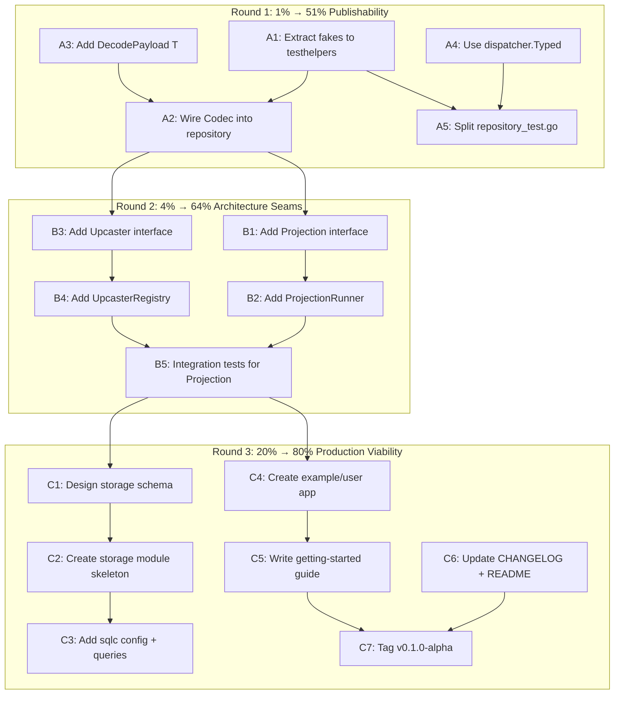

# Execution Plan — Session 14: Publishability + Architecture Seams

**Date:** 2026-04-30 20:56 CEST
**Status:** Planning
**Estimated total:** ~6.5 hours across 27 macro-tasks → 89 micro-tasks

---

## Pareto Analysis

### 1% that delivers 51% of value
**Make the existing library publishable and wire unused infrastructure.**

The codebase has `event.Codec` (unused in prod), `dispatcher.Typed` (no consumers), and 250 lines of fake test doubles trapped in a single test file. These are "ghost infrastructure" — built but disconnected. Wiring them unlocks the architectural seams that the storage module depends on.

### 4% that delivers 64% of value
**Add Projection + Upcaster interfaces.**

These define how users build read models and handle schema evolution. Without them, the storage module will bake in wrong abstractions. These are cheap (interface + registry) but transformative.

### 20% that delivers 80% of value
**Storage module design + example app + getting started.**

Not the full SQL implementation (that's multi-day), but the skeleton, schema design, and a working example that demonstrates the full CQRS flow with the in-memory implementations.

---

## Mermaid Execution Graph

---

## Macro Tasks (27 tasks, 30–100 min each)

Sorted by importance/impact/effort/customer-value.

### Round 1: 1% → 51% (Publishability + Infrastructure Wiring)

| # | Task | Effort | Impact | Module |
|---|------|--------|--------|--------|
| 1 | Extract fake Store/Bus/SnapshotStore/Outbox to testhelpers | 45min | HIGH | testhelpers |
| 2 | Wire `event.Codec` into `EventSourcedRepository` for snapshot serialization | 30min | HIGH | core/aggregate |
| 3 | Add `DecodePayload[T]` helper to `core/event` | 15min | MEDIUM | core/event |
| 4 | Use `dispatcher.Typed` to enable cross-kind generic functions | 20min | MEDIUM | core/pkg/dispatcher |
| 5 | Refactor `repository_test.go` to use extracted testhelpers fakes | 30min | MEDIUM | core/aggregate |
| 6 | Split `repository_test.go` into focused files (save + load) | 20min | LOW | core/aggregate |
| 7 | Add `SnapshotStrategy` interface to `core/aggregate` | 20min | MEDIUM | core/aggregate |
| 8 | Wire `SnapshotStrategy` into `EventSourcedRepository.Save` | 30min | MEDIUM | core/aggregate |
| 9 | Add `EventMetadataEnricher` middleware | 15min | LOW | middleware |
| 10 | Verify all tests pass + lint clean after Round 1 | 15min | HIGH | all |

### Round 2: 4% → 64% (Architecture Seams)

| # | Task | Effort | Impact | Module |
|---|------|--------|--------|--------|
| 11 | Define `Projection` interface in `core/event` | 15min | HIGH | core/event |
| 12 | Define `CheckpointStore` interface in `core/event` | 15min | HIGH | core/event |
| 13 | Implement `MemoryCheckpointStore` in `memory` | 20min | MEDIUM | memory |
| 14 | Define `ProjectionRunner` in `core/event` | 30min | HIGH | core/event |
| 15 | Implement `InMemoryProjectionRunner` | 45min | HIGH | core/event |
| 16 | Define `Upcaster` interface in `core/event` | 15min | HIGH | core/event |
| 17 | Define `UpcasterRegistry` in `core/event` | 20min | MEDIUM | core/event |
| 18 | Implement `UpcasterRegistry` with chain application | 30min | MEDIUM | core/event |
| 19 | Add projection integration tests | 30min | HIGH | integration |
| 20 | Add upcaster integration tests | 20min | MEDIUM | integration |
| 21 | Verify all tests pass + lint clean after Round 2 | 15min | HIGH | all |

### Round 3: 20% → 80% (Production Viability)

| # | Task | Effort | Impact | Module |
|---|------|--------|--------|--------|
| 22 | Design PostgreSQL storage schema (events + outbox + checkpoints) | 45min | CRITICAL | storage/ |
| 23 | Create `storage/` module skeleton (go.mod, go.work, directory) | 15min | CRITICAL | storage/ |
| 24 | Create `example/user/` — minimal CQRS demo | 60min | HIGH | example/ |
| 25 | Write getting-started guide in README | 45min | HIGH | docs/ |
| 26 | Update CHANGELOG.md with sessions 10–14 | 15min | LOW | docs/ |
| 27 | Tag `v0.1.0-alpha` for all modules | 15min | MEDIUM | Git |

---

## Micro Tasks (89 tasks, max 15 min each)

### Round 1: 1% → 51%

| # | Micro Task | Parent | Est |
|---|-----------|--------|-----|
| 1 | Create `testhelpers/store.go` with `FakeStore` struct + `NewFakeStore()` | A1 | 10min |
| 2 | Implement `FakeStore.Save` with optional `saveFn` override | A1 | 5min |
| 3 | Implement `FakeStore.AppendBatch` + `Load` + `LoadFromVersion` + `Delete` | A1 | 10min |
| 4 | Create `testhelpers/bus.go` with `FakeBus` struct + `NewFakeBus()` | A1 | 5min |
| 5 | Implement `FakeBus.Publish` + `Subscribe` + `SubscribeAll` | A1 | 5min |
| 6 | Create `testhelpers/snapshot.go` with `FakeSnapshotStore` | A1 | 5min |
| 7 | Implement `FakeSnapshotStore` Save/Load/LoadAtVersion/Delete | A1 | 5min |
| 8 | Create `testhelpers/outbox.go` with `FakeOutbox` | A1 | 5min |
| 9 | Implement `FakeOutbox` Append/PollPending/Ack | A1 | 5min |
| 10 | Update `testhelpers/go.mod` exports | A1 | 2min |
| 11 | Add `codec` field + `WithCodec` option to `EventSourcedRepository` | A2 | 5min |
| 12 | Update `Save` to encode snapshot via codec when SnapshotStore + Strategy present | A2 | 10min |
| 13 | Update `Load` to decode snapshot via codec before `ApplySnapshot` | A2 | 10min |
| 14 | Add `DecodePayload[T any](e Event, codec Codec) (T, error)` to `core/event` | A3 | 5min |
| 15 | Add test for `DecodePayload` success + error paths | A3 | 10min |
| 16 | Add `Type() string` constraint documentation to `dispatcher.Typed` | A4 | 5min |
| 17 | Add `TypedHandler` example using `dispatcher.Typed` for generic logging | A4 | 10min |
| 18 | Update `repository_test.go` imports to use `testhelpers.Fake*` | A5 | 10min |
| 19 | Remove inline `fakeStore`/`fakeBus`/`fakeSnapshotStore`/`fakeOutbox` | A5 | 5min |
| 20 | Add `NewFailingFakeStore` with configurable error injection | A5 | 5min |
| 21 | Create `core/aggregate/repository_save_test.go` | A6 | 5min |
| 22 | Move Save-related tests to `repository_save_test.go` | A6 | 10min |
| 23 | Create `core/aggregate/repository_load_test.go` | A6 | 5min |
| 24 | Move Load-related tests to `repository_load_test.go` | A6 | 10min |
| 25 | Define `SnapshotStrategy` interface in `core/aggregate` | A7 | 10min |
| 26 | Add `EveryNEvents(n int) SnapshotStrategy` implementation | A7 | 5min |
| 27 | Wire `SnapshotStrategy` into `Repository` via `WithSnapshotStrategy` option | A8 | 10min |
| 28 | Update `Save` to call `SnapshotStore.Save` when strategy triggers | A8 | 15min |
| 29 | Add `EventMetadataEnricher` middleware that injects context values | A9 | 10min |
| 30 | Add test for `EventMetadataEnricher` | A9 | 5min |
| 31 | Run full test suite + lint + race detector | A10 | 15min |

### Round 2: 4% → 64%

| # | Micro Task | Parent | Est |
|---|-----------|--------|-----|
| 32 | Define `Projection` interface (`Handle(ctx, Event) error` + `Types() []Type`) | B1 | 5min |
| 33 | Define `ProjectionName` type + projection metadata | B1 | 5min |
| 34 | Add `Projection` compile-time interface check | B1 | 2min |
| 35 | Define `CheckpointStore` interface (`Load`/`Save` checkpoint per projection) | B2 | 5min |
| 36 | Define `Checkpoint` struct (ProjectionName + last processed EventID) | B2 | 5min |
| 37 | Implement `MemoryCheckpointStore` with `sync.RWMutex` | B3 | 10min |
| 38 | Add tests for `MemoryCheckpointStore` Save/Load | B3 | 10min |
| 39 | Define `ProjectionRunner` struct + `NewProjectionRunner` constructor | B4 | 10min |
| 40 | Implement `ProjectionRunner.Register(projection)` | B4 | 5min |
| 41 | Implement `ProjectionRunner.Start(ctx)` — subscribe to bus + dispatch | B4 | 15min |
| 42 | Implement `ProjectionRunner.Stop()` — graceful shutdown | B4 | 10min |
| 43 | Add checkpoint tracking to `ProjectionRunner` | B5 | 10min |
| 44 | Add error handling + retry in `ProjectionRunner` | B5 | 10min |
| 45 | Define `Upcaster` interface (`FromVersion`/`Upcast`) | B6 | 5min |
| 46 | Define `EventUpcaster` as `Upcaster` with typed metadata | B6 | 5min |
| 47 | Define `UpcasterRegistry` struct + `NewUpcasterRegistry` | B7 | 5min |
| 48 | Implement `Register(upcaster Upcaster)` on registry | B8 | 5min |
| 49 | Implement `Apply(event Event) (Event, error)` chain on registry | B8 | 10min |
| 50 | Add test for upcaster chain V1→V2→V3 | B8 | 10min |
| 51 | Create `integration/projection/` directory | B9 | 2min |
| 52 | Add BDD test: projection receives events and builds read model | B9 | 15min |
| 53 | Add test: projection checkpoint persists across restart | B9 | 10min |
| 54 | Add test: projection skips already-processed events | B9 | 5min |
| 55 | Create `integration/upcaster/` directory | B10 | 2min |
| 56 | Add test: upcaster transforms V1 event to V2 | B10 | 10min |
| 57 | Add test: upcaster chain V1→V2→V3 preserves data | B10 | 10min |
| 58 | Run full test suite + lint + race detector | B11 | 15min |

### Round 3: 20% → 80%

| # | Micro Task | Parent | Est |
|---|-----------|--------|-----|
| 59 | Design `events` table schema (PK, aggregate_type, aggregate_id, version, event_type, payload, metadata, occurred_at) | C1 | 10min |
| 60 | Design `outbox` table schema (PK, status, events_json, created_at, published_at) | C1 | 5min |
| 61 | Design `checkpoints` table schema (projection_name, aggregate_type, aggregate_id, version, updated_at) | C1 | 5min |
| 62 | Design `snapshots` table schema (aggregate_type, aggregate_id, version, state, created_at) | C1 | 5min |
| 63 | Write schema as `storage/migrations/001_initial.sql` | C1 | 10min |
| 64 | Write design doc `storage/DESIGN.md` | C1 | 10min |
| 65 | Create `storage/` directory + `go.mod` | C2 | 5min |
| 66 | Add `storage` to `go.work` | C2 | 2min |
| 67 | Create `storage/sqlc.yaml` config | C3 | 10min |
| 68 | Write `storage/queries/events.sql` (Save, Load, LoadFromVersion, Delete) | C3 | 10min |
| 69 | Write `storage/queries/outbox.sql` (Append, PollPending, Ack) | C3 | 5min |
| 70 | Run `sqlc generate` and verify output | C3 | 5min |
| 71 | Update `flake.nix` to include storage module | C2 | 5min |
| 72 | Create `example/user/` directory + `go.mod` | C4 | 5min |
| 73 | Define `User` aggregate with `Create`/`Rename`/`Deactivate` events | C4 | 10min |
| 74 | Implement `CreateUser`/`RenameUser` command handlers | C4 | 10min |
| 75 | Implement `GetUser` query handler | C4 | 5min |
| 76 | Wire dispatcher + middleware + in-memory store in `main.go` | C4 | 15min |
| 77 | Add `example/user` to `go.work` | C4 | 2min |
| 78 | Write getting-started section for README | C5 | 15min |
| 79 | Write "Architecture Overview" section for README | C5 | 10min |
| 80 | Write "Module Guide" section for README | C5 | 10min |
| 81 | Add badges + module links to README | C5 | 5min |
| 82 | Add installation instructions per module | C5 | 5min |
| 83 | Record sessions 10–14 in CHANGELOG.md | C6 | 15min |
| 84 | Tag `core/v0.1.0-alpha` | C7 | 2min |
| 85 | Tag `memory/v0.1.0-alpha` | C7 | 2min |
| 86 | Tag `catalog/v0.1.0-alpha` | C7 | 2min |
| 87 | Tag `middleware/v0.1.0-alpha` | C7 | 2min |
| 88 | Tag `testhelpers/v0.1.0-alpha` | C7 | 2min |
| 89 | Tag `integration/v0.1.0-alpha` | C7 | 2min |

---

## Execution Order

1. **Round 1** (tasks 1–31): ~3.5 hours
2. **Round 2** (tasks 32–58): ~2 hours
3. **Round 3** (tasks 59–89): ~2 hours

Total: **~7.5 hours** of focused work.

---

_Generated at 2026-04-30 20:56 CEST_
