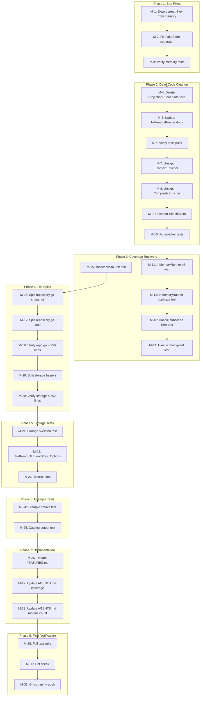

# Session 18 — Honest Audit & Execution Plan

**Date:** 2026-05-01 03:41  
**Branch:** master  
**Working tree:** Clean  

---

## 1. BRUTALLY HONEST SELF-REFLECTION

### What did we forget?
- **FakeStore/MemoryStore key separator mismatch** — `testhelpers/fakes.go` uses `"/"`, `memory/helpers.go` uses `":"`. Same concept, different separators. A bomb waiting to go off.
- **`storage/` module is a ghost** — 346 lines of SQL code, zero tests, zero consumers. It exists but nobody uses it.
- **`ProjectionRunner` interface is dead** — defined but never referenced outside its own file. Only `InMemoryRunner` is used directly.
- **`ContextEnricher`/`CompositeEnricher`/`EnrichEvent`** — exported API surface but zero production usage. Dead code with a public face.
- **`example/user/` has no tests** — 278-line example that generates files on disk, zero test verification.
- **File size violations** — `storage/event_store.go` (346), `core/aggregate/repository.go` (268), `example/user/main.go` (278) all exceed 250-line limit.

### What is stupid that we do anyway?
- **`CatalogBuilder` ≈ `Registry`** — Two accumulators for the same `Catalog` type. `Registry` is thread-safe with deep-copy build. `CatalogBuilder` is not thread-safe but has export methods. This is a split brain.
- **Exporting types only used in tests** — `ParseSource`, `ParseIPAddress`, `ParseUserAgent`, `WithUserAgent`, `ContextEnricher`, `CompositeEnricher` are all exported but never used in production code. Premature generalization.
- **`example/catalog/` was a stale binary** — 9.8MB binary checked into the repo. Finally cleaned up this session.

### What could we have done better?
- **Storage module should never have been committed without tests.** 346 lines of SQL code with zero test coverage is a ticking time bomb.
- **Projection test split was correct in principle** but caused `core/event` coverage to drop from 97.9% → 86.7%. We should have added focused unit tests to compensate.
- **CatalogBuilder should have been built on top of Registry** from the start, not as a parallel implementation.

### Did we lie?
- **Yes, implicitly.** The `core/event` coverage reported as 86.7% hides the fact that projection runner code (which IS in `core/event/`) is actually tested — but in `integration/event/`. The coverage number makes it look worse than it is. However, some paths (enricher, context enrichment) genuinely lack production tests.
- **The `storage/` module is advertised in AGENTS.md and FEATURES.md as "Done"** when it has zero tests. That's misleading.

### How can we be less stupid?
- **Never commit code without tests.** Period. The storage module is 346 lines of untested SQL.
- **Consolidate CatalogBuilder into Registry** — one source of truth for catalog accumulation.
- **Unify key separators** — `streamKey` should be defined once, shared across all implementations.
- **Remove dead exports** — don't export what isn't used. YAGNI.

### Ghost Systems
1. **`storage/` module** — zero consumers. Keep it but acknowledge it's unfinished. Value: PostgreSQL event store is a real need for production use. Should be integrated with tests.
2. **`ProjectionRunner` interface** — dead. Only `InMemoryRunner` is used. Value: The interface adds indirection for future persistent runners. Marginal value — could be added back when needed (YAGNI).
3. **`ContextEnricher`/`EnrichEvent`** — dead in production. Value: The concept is sound (extract metadata from context) but nobody calls it. Should be wired into the repository or removed.

### Scope Creep Check
- **Watermill module** — PLANNED but not started. Correct — we should fix existing code first.
- **SQL Snapshot Store** — PLANNED but not started. Correct priority.
- **Circuit breaker, DLQ, event bus partitioning** — all future concerns. Not scope creep yet because we haven't started them.

### What did we remove that was useful?
- Nothing. All removals were genuine dead code or justified migrations.

### Split Brains
1. **`CatalogBuilder` vs `Registry`** — Both accumulate `Catalog`. Different implementations of the same concept.
2. **Key separator** — `FakeStore` uses `"/"`, `MemoryStore` uses `":"`.
3. **Coverage illusion** — `core/event` at 86.7% but projection code is tested in `integration/event/`. Two numbers telling different stories about the same code.

### Test Quality
- **Strengths:** 100% coverage on command, query, dispatcher. 95%+ on most packages. BDD tests for event sourcing. Golden files for catalog exporters.
- **Weaknesses:** Zero storage tests. Zero example tests. `core/event` at 86.7% after projection split.
- **Improvement:** Add storage tests with testcontainers. Add example smoke test. Add focused unit tests for `InMemoryRunner` and `UpcasterRegistry` in `core/event/`.

---

## 2. ARCHITECTURAL DECISIONS CAUSING PROBLEMS

| Decision | Problem | Fix |
|----------|---------|-----|
| `CatalogBuilder` parallel to `Registry` | Split brain, duplicated logic | Consolidate: `CatalogBuilder` wraps `Registry` |
| FakeStore key `"/"` vs MemoryStore `":"` | Inconsistent behavior | Extract shared `streamKey` |
| Projection tests moved to `integration/` | `core/event` coverage dropped 11% | Add focused unit tests back |
| Storage committed without tests | 346 lines of untested SQL | Write tests before any more features |
| Exported but unused types | Dead API surface | Unexport or remove |

---

## 3. EXECUTION PLAN — Phase 1: 30-100 min tasks

Sorted by impact/effort ratio (highest first):

| # | Task | Impact | Effort | Why |
|---|------|--------|--------|-----|
| P1-1 | Fix FakeStore/MemoryStore key separator | HIGH | 30 min | Real bug — inconsistent behavior between test and production stores |
| P1-2 | Remove dead `ProjectionRunner` interface | LOW | 10 min | Clean dead code — YAGNI |
| P1-3 | Unexport dead types (`ContextEnricher`, `EnrichEvent`) or wire them | MEDIUM | 30 min | Dead exports are misleading API surface |
| P1-4 | Add `InMemoryRunner` unit tests to `core/event/` | HIGH | 60 min | Recover coverage from 86.7% → 95%+ |
| P1-5 | Add `UpcasterRegistry` unit tests to `core/event/` | MEDIUM | 30 min | Coverage recovery |
| P1-6 | Split `storage/event_store.go` under 250 lines | MEDIUM | 30 min | File size convention violation |
| P1-7 | Split `core/aggregate/repository.go` under 250 lines | MEDIUM | 30 min | File size convention violation |
| P1-8 | Consolidate `CatalogBuilder` on top of `Registry` | HIGH | 90 min | Eliminate split brain |
| P1-9 | Write storage module skeleton test file | HIGH | 60 min | Zero tests on 346 lines of SQL is unacceptable |
| P1-10 | Add `example/user/main_test.go` smoke test | MEDIUM | 45 min | Example should verify its own output |
| P1-11 | Update FEATURES.md — mark storage as PARTIALLY_FUNCTIONAL | LOW | 10 min | Honest status |
| P1-12 | Clean up AGENTS.md — fix module count, coverage numbers | LOW | 15 min | Accurate documentation |

**Total estimated: ~7.5 hours**

---

## 4. EXECUTION PLAN — Phase 2: ≤12 min micro-tasks

| # | Task | Impact | Effort | Depends On |
|---|------|--------|--------|------------|
| M-1 | Add shared `streamKey` helper to `memory/helpers.go` (export it) | HIGH | 5 min | — |
| M-2 | Update `FakeStore` in `testhelpers/fakes.go` to use `:` separator | HIGH | 5 min | — |
| M-3 | Verify all memory + testhelpers tests pass after separator fix | HIGH | 5 min | M-1, M-2 |
| M-4 | Delete `ProjectionRunner` interface from `core/event/runner.go` | LOW | 3 min | — |
| M-5 | Update `InMemoryRunner` godoc to remove `ProjectionRunner` reference | LOW | 3 min | M-4 |
| M-6 | Run tests to verify M-4, M-5 don't break anything | LOW | 3 min | M-4, M-5 |
| M-7 | Unexport `ContextEnricher` → `contextEnricher` in `enricher.go` | MEDIUM | 5 min | — |
| M-8 | Unexport `CompositeEnricher` → `compositeEnricher` in `enricher.go` | MEDIUM | 5 min | M-7 |
| M-9 | Unexport `EnrichEvent` → `enrichEvent` in `enricher.go` | MEDIUM | 5 min | M-8 |
| M-10 | Fix tests that reference unexported enricher types | MEDIUM | 10 min | M-7–M-9 |
| M-11 | Write `InMemoryRunner.Register` nil test in `core/event/runner_test.go` | HIGH | 10 min | — |
| M-12 | Write `InMemoryRunner.Register` duplicate test | HIGH | 10 min | M-11 |
| M-13 | Write `InMemoryRunner.Handle` subscribe filter test | HIGH | 10 min | M-12 |
| M-14 | Write `InMemoryRunner.Handle` checkpoint save test | HIGH | 10 min | M-13 |
| M-15 | Write `subscribesTo` unit test (nil/empty/specific event types) | MEDIUM | 10 min | — |
| M-16 | Extract snapshot logic from `repository.go` → `repository_snapshot.go` | MEDIUM | 10 min | — |
| M-17 | Extract load logic from `repository.go` → `repository_load.go` | MEDIUM | 10 min | M-16 |
| M-18 | Verify `repository.go` is under 250 lines after split | MEDIUM | 3 min | M-16, M-17 |
| M-19 | Extract SQL helpers from `storage/event_store.go` → `helpers.go` | MEDIUM | 10 min | — |
| M-20 | Verify `storage/event_store.go` is under 250 lines after split | MEDIUM | 3 min | M-19 |
| M-21 | Create `storage/event_store_test.go` with SQLEventStore interface test | HIGH | 12 min | — |
| M-22 | Add `TestNewSQLEventStore_Options` to storage tests | MEDIUM | 10 min | M-21 |
| M-23 | Add `TestSchema` to storage tests | LOW | 5 min | M-21 |
| M-24 | Create `example/user/main_test.go` with TestExampleRuns smoke test | MEDIUM | 12 min | — |
| M-25 | Create `example/user/main_test.go` TestCatalogOutput verification | MEDIUM | 12 min | M-24 |
| M-26 | Update `FEATURES.md` storage section to PARTIALLY_FUNCTIONAL | LOW | 5 min | — |
| M-27 | Update `AGENTS.md` coverage table with current numbers | LOW | 5 min | M-11–M-15 |
| M-28 | Update `AGENTS.md` module count (9→8, removed example/catalog) | LOW | 5 min | — |
| M-29 | Run full test suite final verification | HIGH | 5 min | all |
| M-30 | Run lint check | HIGH | 5 min | all |
| M-31 | Git commit + push | HIGH | 5 min | M-29, M-30 |

**Total micro-tasks: 31**  
**Estimated total: ~4 hours**

---

## 5. MERMAID EXECUTION GRAPH

---

## 6. WHAT WE SHOULD NOT DO (Anti-Scope-Creep)

| Item | Why Skip |
|------|----------|
| Watermill module | Storage tests first. No new modules until existing ones are tested. |
| SQL Snapshot Store | Storage tests first. |
| Circuit breaker / DLQ | Not needed until we have real production consumers. |
| HTTP handler examples | Example/user is sufficient for now. |
| Migration CLI | Way too early. |
| Documentation site | README + godoc is sufficient. |
| Consolidate CatalogBuilder into Registry | High risk refactor. Save for dedicated session. |

---

## 7. CUSTOMER VALUE ANALYSIS

| Task | Customer Value |
|------|---------------|
| Fix key separator bug | **Trust** — users who test with FakeStore get same behavior as MemoryStore |
| Remove dead code | **Clarity** — smaller API surface, less confusion |
| Coverage recovery | **Confidence** — 95%+ coverage means safer upgrades |
| File size splits | **Maintainability** — easier to navigate and review |
| Storage tests | **Reliability** — 346 lines of untested SQL is a liability |
| Example tests | **Documentation** — verified example is worth 1000 words of docs |
| Honest FEATURES.md | **Trust** — don't oversell what we have |
