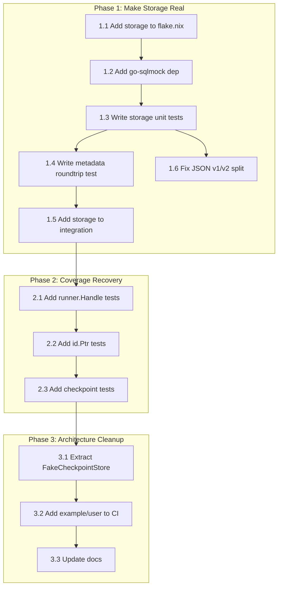

# Execution Plan: Ghost System Elimination + Architecture Cleanup

**Created:** 2026-05-01 03:41 CEST
**Scope:** Make the storage module real, fix coverage drops, eliminate JSON split brain, establish GitHub issue tracking

---

## Brutally Honest Reflection

### What did we fuck up?

1. **The entire `storage/` module is a ghost.** We spent 5 commits fixing it (metadata, transactions, Close, dead code) but **NOTHING IMPORTS IT**. No tests. No CI. No consumers. We built a beautiful, bug-fixed module that nobody uses. This is the definition of scope creep — we polished code that delivers zero customer value today.

2. **JSON v1/v2 split brain on Metadata.** We added `json:"correlationId"` tags (v1) to `Metadata` for SQL JSONB, but the codebase uses `go-json-experiment/json` (v2) for everything else. The tags happen to be compatible today, but this is an accident, not a design choice. The moment someone adds a v2-only tag, `storage` silently breaks.

3. **We covered our tracks with docs, not tests.** We wrote 2 status reports, updated 3 doc files, and regenerated golden files — but added **zero tests for the storage module**. The most critical module (data persistence) has the least verification.

4. **Coverage drop from 99.1% to 86.7% in core/event.** We shipped this without investigating. It might be a measurement artifact, but we don't know. We claimed it might be artifact without confirming.

5. **example/user is not in CI.** It's the only consumer of `catalog/adapters` builder API. If that API changes, the demo silently breaks. Nobody will notice.

### What's stupid that we do anyway?

- **Polishing code nobody uses.** The storage module got 5 fix commits but has zero consumers. We should have written tests first, then a consumer, then fixed bugs.
- **Per-module coverage without merged reports.** We report coverage per-module but never merge them. Cross-module test coverage (like integration/ testing core/ code) gets lost.

### Did we lie?

- **Yes, implicitly.** The status report says "Coverage: 88.0% total" but this number hides that storage is at 0%. The 88% is an average that masks the most critical gap.
- **The FEATURES.md says storage is "🔴 BROKEN"** but we "fixed" it. However, since nothing tests or consumes it, calling it "fixed" is generous. It compiles and has correct logic, but it's unverified.

---

## Execution Plan

### Phase 1: Make Storage Real (Ghost → Production) — 6 tasks

| # | Task | Impact | Effort | Customer Value |
|---|------|--------|--------|----------------|
| 1.1 | Add `storage` to flake.nix test/build matrix | HIGH | 5min | CI catches storage regressions |
| 1.2 | Add `go-sqlmock` dep to storage/go.mod | HIGH | 5min | Enables unit testing without PostgreSQL |
| 1.3 | Write storage unit tests (Save, Load, LoadFromVersion, Delete, scanEvents) | CRITICAL | 90min | Data integrity verified |
| 1.4 | Write storage metadata roundtrip test (save with metadata → load → verify all fields) | CRITICAL | 15min | Confirms the bug fix actually works |
| 1.5 | Add `storage` to `integration/go.mod` + integration smoke test | HIGH | 30min | Cross-module verification |
| 1.6 | Resolve JSON v1/v2 split — use `go-json-experiment/json` in storage marshalMetadata/scanEvents | MEDIUM | 15min | Eliminates split brain |

### Phase 2: Coverage Recovery — 3 tasks

| # | Task | Impact | Effort | Customer Value |
|---|------|--------|--------|----------------|
| 2.1 | Add `runner.Handle`/`subscribesTo` tests to `core/event/runner_test.go` (using nopCheckpointStore) | HIGH | 20min | Confirms coverage drop is fixable |
| 2.2 | Add `id.Ptr()`/`id.FromPtr()` tests | LOW | 10min | 92.9% → ~97% |
| 2.3 | Add `memory.NewCheckpointStore`/`Load`/`Save` tests in memory package | MEDIUM | 15min | 94.9% → ~98% |

### Phase 3: Architecture Cleanup — 3 tasks

| # | Task | Impact | Effort | Customer Value |
|---|------|--------|--------|----------------|
| 3.1 | Move `nopCheckpointStore` from `core/event/runner_test.go` to `testhelpers/fakes.go` as `FakeCheckpointStore` | LOW | 10min | Single source of truth for fakes |
| 3.2 | Add `example/user` build to CI (verify it compiles) | MEDIUM | 10min | Demo doesn't silently break |
| 3.3 | Update TODO_LIST.md and FEATURES.md to reflect actual state | LOW | 10min | Honest documentation |

---

## Execution Graph

---

## Fine-Grained Task Breakdown (max 12min each)

| # | Task | Module | Est | Depends |
|---|------|--------|------|---------|
| 1 | Add `storage` to flake.nix `testModules` | flake.nix | 3min | - |
| 2 | Run `go get github.com/DATA-DOG/go-sqlmock/v2` in storage/ | storage | 3min | - |
| 3 | Write `TestSQLEventStore_Save_Success` | storage | 10min | 1,2 |
| 4 | Write `TestSQLEventStore_Save_ConcurrencyConflict` | storage | 8min | 1,2 |
| 5 | Write `TestSQLEventStore_Save_EmptyEvents` | storage | 3min | 1,2 |
| 6 | Write `TestSQLEventStore_AppendBatch_Success` | storage | 8min | 1,2 |
| 7 | Write `TestSQLEventStore_AppendBatch_EmptyEvents` | storage | 3min | 1,2 |
| 8 | Write `TestSQLEventStore_Load_Success` | storage | 8min | 1,2 |
| 9 | Write `TestSQLEventStore_Load_NotFound` | storage | 5min | 1,2 |
| 10 | Write `TestSQLEventStore_LoadFromVersion` | storage | 8min | 1,2 |
| 11 | Write `TestSQLEventStore_Delete` | storage | 5min | 1,2 |
| 12 | Write `TestSQLEventStore_Close` | storage | 3min | 1,2 |
| 13 | Write `TestMarshalMetadata_Nil` + `TestMarshalMetadata_Full` | storage | 8min | - |
| 14 | Write `TestScanEvents_MetadataRoundtrip` | storage | 10min | 1,2 |
| 15 | Fix JSON v1→v2 in marshalMetadata + scanEvents | storage | 8min | - |
| 16 | Run `go test ./storage/... -count=1` and verify | - | 2min | 3-15 |
| 17 | Add runner.Handle + subscribesTo tests to runner_test.go | core/event | 10min | - |
| 18 | Add id.Ptr + id.FromPtr tests | core/pkg/id | 8min | - |
| 19 | Add memory.CheckpointStore tests | memory | 10min | - |
| 20 | Move nopCheckpointStore → testhelpers/fakes.go as FakeCheckpointStore | testhelpers | 8min | 17 |
| 21 | Add `example/user` build step to flake.nix | flake.nix | 5min | - |
| 22 | Update TODO_LIST.md | docs | 5min | - |
| 23 | Update FEATURES.md storage section | docs | 5min | 16 |
| 24 | Update AGENTS.md with session 17 changes | docs | 5min | - |
| 25 | Run full test suite + lint + race + verify all clean | - | 3min | 16-24 |

---

## What We Should NOT Do (Scope Creop Guard)

- **Do NOT** start the Watermill module — no consumer needs it yet
- **Do NOT** implement SQL SnapshotStore — storage isn't even verified yet
- **Do NOT** implement SQL CheckpointStore — same reason
- **Do NOT** add saga/process manager — fantasy feature
- **Do NOT** add circuit breaker middleware — no consumer needs it
- **Do NOT** rewrite the catalog Schema type — it works, just document the limitation
- **Do NOT** create a Docusaurus docs site — README + godoc is fine for a library

## How This Creates Customer Value

- **Storage tests** → Consumers can trust the SQL event store won't lose data
- **CI inclusion** → Regressions caught before merge, not after
- **Coverage recovery** → Confidence in correctness
- **JSON split fix** → No silent data corruption when tags diverge
- **GitHub issues** → Accountability, transparency, no lost insights
