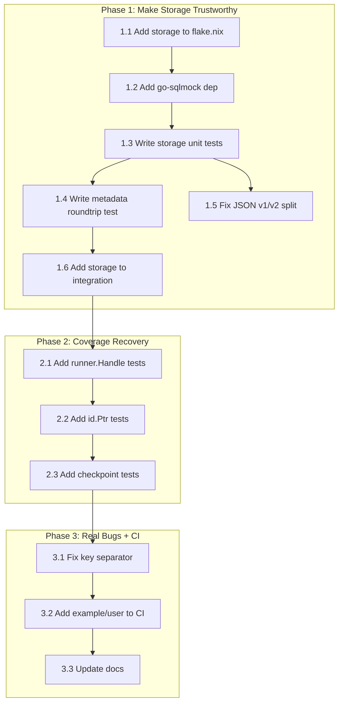

# Execution Plan: Make Storage Trustworthy + Fix Real Bugs

**Created:** 2026-05-01 03:41 CEST
**Updated:** 2026-05-01
**Scope:** Test the storage module, fix key separator bug, fix JSON split brain, recover coverage

---

## Critical Context: This Is a Library/SDK

go-cqrs-lite is a **composable Go library**. Consumers import modules into their own projects.

- **"Zero internal consumers" is NOT a problem.** `storage/` exists for consumers to import. No module in this monorepo NEEDS to use it.
- **"Untested" IS a problem.** A consumer importing `storage/` gets 346 lines of unverified SQL. That's a trust failure.
- **"Exported but unused internally" is NOT a problem.** Public API surface IS the product.
- **The real metric is: "Would a consumer trust this module enough to import it?"**

---

## What We Actually Fucked Up

1. **`storage/` has zero tests.** 346 lines of SQL, no verification. A consumer importing this has NO evidence it works. This is the #1 trust failure.

2. **JSON v1/v2 split brain on Metadata.** `json:"correlationId"` tags (v1) in storage for SQL JSONB, but the codebase uses `go-json-experiment/json` (v2) everywhere else. Tags happen to be compatible today by accident. The moment someone adds a v2-only tag, storage silently breaks.

3. **FakeStore/MemoryStore key separator mismatch.** FakeStore uses `"/"`, MemoryStore uses `":"`. A consumer testing with FakeStore gets different behavior than a real store.

4. **Coverage drop from 99.1% to 86.7% in core/event.** We shipped this without investigating. Projection code tested in `integration/` explains part of it, but some paths genuinely lack coverage.

5. **example/user is not in CI.** It's the only demo of `catalog/adapters` builder API. If that API changes, the demo silently breaks.

### What We Did NOT Fuck Up (despite what the previous plan said)

- **"Zero consumers for storage/"** — Correct library design. Consumers import it into THEIR projects.
- **"Exported but unused types"** — Public API surface. `ContextEnricher`, `ProjectionRunner`, `EnrichEvent` are consumer-facing. Removing them is a breaking change for no gain.
- **"Polishing code nobody uses"** — Library code is polished FOR consumers, not for internal use.

---

## Execution Plan

### Phase 1: Make Storage Trustworthy — 6 tasks

| #   | Task                                                                                  | Consumer Trust Impact | Effort | Why                                                    |
| --- | ------------------------------------------------------------------------------------- | --------------------- | ------ | ------------------------------------------------------ |
| 1.1 | Add `storage` to flake.nix test/build matrix                                          | HIGH                  | 5min   | CI catches regressions before consumers hit them       |
| 1.2 | Add `go-sqlmock` dep to storage/go.mod                                                | HIGH                  | 5min   | Enables unit testing without PostgreSQL                |
| 1.3 | Write storage unit tests (Save, Load, LoadFromVersion, Delete, scanEvents)            | CRITICAL              | 90min  | Consumers importing storage/ get verified SQL behavior |
| 1.4 | Write storage metadata roundtrip test (save with metadata → load → verify all fields) | CRITICAL              | 15min  | Confirms metadata serialization works end-to-end       |
| 1.5 | Fix JSON v1→v2 in storage marshalMetadata/scanEvents                                  | HIGH                  | 15min  | Eliminates silent data corruption risk                 |
| 1.6 | Add `storage` to `integration/go.mod` + integration smoke test                        | HIGH                  | 30min  | Cross-module verification                              |

### Phase 2: Coverage Recovery — 3 tasks

| #   | Task                                                                    | Consumer Trust Impact | Effort | Why                                                     |
| --- | ----------------------------------------------------------------------- | --------------------- | ------ | ------------------------------------------------------- |
| 2.1 | Add `runner.Handle`/`subscribesTo` tests to `core/event/runner_test.go` | HIGH                  | 20min  | Consumers importing projections need verified behavior  |
| 2.2 | Add `id.Ptr()`/`id.FromPtr()` tests                                     | LOW                   | 10min  | API surface coverage                                    |
| 2.3 | Add `memory.NewCheckpointStore`/`Load`/`Save` tests                     | MEDIUM                | 15min  | Consumers using in-memory checkpoints need verification |

### Phase 3: Real Bugs + CI — 3 tasks

| #   | Task                                                     | Consumer Trust Impact | Effort | Why                                                                    |
| --- | -------------------------------------------------------- | --------------------- | ------ | ---------------------------------------------------------------------- |
| 3.1 | Fix FakeStore/MemoryStore key separator (`/` → `:`)      | HIGH                  | 10min  | Consumers testing with FakeStore must get same behavior as MemoryStore |
| 3.2 | Add `example/user` build to CI (verify it compiles)      | MEDIUM                | 10min  | Demo doesn't silently break on consumers                               |
| 3.3 | Update FEATURES.md and AGENTS.md to reflect actual state | LOW                   | 10min  | Honest documentation                                                   |

---

## Execution Graph

---

## Fine-Grained Task Breakdown (max 12min each)

| #   | Task                                                         | Module      | Est   | Depends |
| --- | ------------------------------------------------------------ | ----------- | ----- | ------- |
| 1   | Add `storage` to flake.nix `testModules`                     | flake.nix   | 3min  | -       |
| 2   | Run `go get github.com/DATA-DOG/go-sqlmock` in storage/      | storage     | 3min  | -       |
| 3   | Write `TestSQLEventStore_Save_Success`                       | storage     | 10min | 1,2     |
| 4   | Write `TestSQLEventStore_Save_ConcurrencyConflict`           | storage     | 8min  | 1,2     |
| 5   | Write `TestSQLEventStore_Save_EmptyEvents`                   | storage     | 3min  | 1,2     |
| 6   | Write `TestSQLEventStore_AppendBatch_Success`                | storage     | 8min  | 1,2     |
| 7   | Write `TestSQLEventStore_AppendBatch_EmptyEvents`            | storage     | 3min  | 1,2     |
| 8   | Write `TestSQLEventStore_Load_Success`                       | storage     | 8min  | 1,2     |
| 9   | Write `TestSQLEventStore_Load_NotFound`                      | storage     | 5min  | 1,2     |
| 10  | Write `TestSQLEventStore_LoadFromVersion`                    | storage     | 8min  | 1,2     |
| 11  | Write `TestSQLEventStore_Delete`                             | storage     | 5min  | 1,2     |
| 12  | Write `TestSQLEventStore_Close`                              | storage     | 3min  | 1,2     |
| 13  | Write `TestMarshalMetadata_Nil` + `TestMarshalMetadata_Full` | storage     | 8min  | -       |
| 14  | Write `TestScanEvents_MetadataRoundtrip`                     | storage     | 10min | 1,2     |
| 15  | Fix JSON v1→v2 in marshalMetadata + scanEvents               | storage     | 8min  | -       |
| 16  | Run `go test ./storage/... -count=1` and verify              | -           | 2min  | 3-15    |
| 17  | Add runner.Handle + subscribesTo tests to runner_test.go     | core/event  | 10min | -       |
| 18  | Add id.Ptr + id.FromPtr tests                                | core/pkg/id | 8min  | -       |
| 19  | Add memory.CheckpointStore tests                             | memory      | 10min | -       |
| 20  | Fix FakeStore key separator `/` → `:`                        | testhelpers | 5min  | -       |
| 21  | Verify memory + testhelpers tests pass after separator fix   | -           | 5min  | 20      |
| 22  | Add `example/user` build step to flake.nix                   | flake.nix   | 5min  | -       |
| 23  | Update FEATURES.md storage section                           | docs        | 5min  | 16      |
| 24  | Update AGENTS.md with current state                          | docs        | 5min  | -       |
| 25  | Run full test suite + lint + race + verify all clean         | -           | 3min  | 16-24   |

---

## What We Should NOT Do (Anti-Scope-Creep)

| Item                                     | Why Skip                                                                |
| ---------------------------------------- | ----------------------------------------------------------------------- |
| Watermill module                         | No consumer has asked for it. Storage tests first.                      |
| SQL SnapshotStore                        | Storage isn't even tested yet.                                          |
| SQL CheckpointStore                      | Same reason.                                                            |
| Saga/process manager                     | Fantasy feature.                                                        |
| Circuit breaker middleware               | No consumer needs it.                                                   |
| Rewrite catalog Schema type              | It works.                                                               |
| Docusaurus docs site                     | README + godoc is correct for a Go library.                             |
| Remove `ProjectionRunner` interface      | Public API — breaking change for no gain.                               |
| Unexport `ContextEnricher`/`EnrichEvent` | Consumer-facing APIs. YAGNI doesn't apply to public library interfaces. |
| Consolidate CatalogBuilder into Registry | High-risk refactor. Save for dedicated session.                         |

---

## Consumer Value Analysis

| Task              | Consumer Value                                                               |
| ----------------- | ---------------------------------------------------------------------------- |
| Storage tests     | **Trust** — consumers can import `storage/` knowing SQL behavior is verified |
| Key separator fix | **Consistency** — FakeStore and MemoryStore behave identically               |
| JSON v1/v2 fix    | **Safety** — no silent data corruption when consumers use v2 JSON            |
| CI inclusion      | **Reliability** — regressions caught before consumers hit them               |
| Coverage recovery | **Confidence** — high coverage = safer to depend on                          |
| Example tests     | **Documentation** — verified example consumers can copy                      |
| Honest docs       | **Trust** — don't oversell, be honest about what's tested vs. not            |
