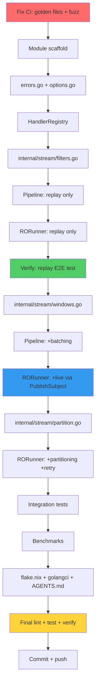

# samber/ro Projection Module — Execution Plan

**Date:** 2026-05-01
**Status:** Executing
**Prerequisite:** Clean git (done), CI green (3 test suites to fix first)

---

## Pareto Analysis

### 1% → 51% of Result (THE CORE)

`HandlerRegistry` + `RORunner` processing events via `ro.Pipe(ro.FromSlice, ro.Filter, ro.Tap)`. Replay from store, dispatch to handlers, checkpoint. No batching, no partitioning, no live subscription. But it WORKS end-to-end.

### 4% → 64% of Result (+ LIVE SUBSCRIPTION)

Add `PublishSubject` for live events from bus. Replay-first, then subscribe. Two-phase lifecycle. Still no batching or partitioning.

### 20% → 80% of Result (+ BATCHING + PARTITIONING)

Add `BufferWithTime`/`BufferWithCount` for batched writes. Add `GroupBy(aggregateID)` for per-aggregate ordering. Add `Retry`/`Catch` for resilient processing. This is production-grade.

### 80% → 100% (POLISH)

Benchmarks, godoc polish, flake.nix integration, AGENTS.md update, CHANGELOG.

---

## Mermaid Execution Graph



---

## Phase 1: Fix CI First (Prerequisite)

| # | Task | Impact | Effort | Deps |
|---|------|--------|--------|------|
| 1 | Regenerate asyncapi golden files | Blocks CI | 5min | — |
| 2 | Regenerate eventcatalog golden files | Blocks CI | 5min | — |
| 3 | Fix FuzzParse case-sensitivity | Blocks CI | 5min | — |
| 4 | Verify all tests green | Confidence | 5min | 1,2,3 |

## Phase 2: 1% → 51% — Core Replay Pipeline

| # | Task | Impact | Effort | Deps |
|---|------|--------|--------|------|
| 5 | Create projection/go.mod with samber/ro dep | Foundation | 10min | 4 |
| 6 | Add projection/ to go.work | Foundation | 2min | 5 |
| 7 | Create errors.go with sentinels | DX | 10min | 5 |
| 8 | Create options.go with RunnerOption | DX | 15min | 7 |
| 9 | Create handler.go — HandlerRegistry | Core | 25min | 7 |
| 10 | Create handler_test.go | Quality | 20min | 9 |
| 11 | Create internal/stream/filters.go — FilterByType | Core | 20min | 5 |
| 12 | Create filters_test.go | Quality | 15min | 11 |
| 13 | Create pipeline.go — replay-only with ro.Pipe | Core | 30min | 9,11 |
| 14 | Create pipeline_test.go | Quality | 20min | 13 |
| 15 | Create runner.go — replay phase only | Core | 30min | 13 |
| 16 | Create runner_test.go | Quality | 25min | 15 |
| 17 | Verify replay E2E with memory store + bus | Confidence | 15min | 16 |

## Phase 3: 4% → 64% — Live Subscription

| # | Task | Impact | Effort | Deps |
|---|------|--------|--------|------|
| 18 | Add PublishSubject to runner for live events | Key | 25min | 17 |
| 19 | Implement replay-then-live lifecycle | Key | 25min | 18 |
| 20 | Add context cancellation + disposal | Safety | 15min | 19 |
| 21 | Runner live subscription tests | Quality | 20min | 20 |

## Phase 4: 20% → 80% — Production Features

| # | Task | Impact | Effort | Deps |
|---|------|--------|--------|------|
| 22 | Create internal/stream/windows.go — batch | Perf | 20min | 11 |
| 23 | Create windows_test.go | Quality | 15min | 22 |
| 24 | Create internal/stream/partition.go — GroupBy | Perf | 25min | 11 |
| 25 | Create partition_test.go | Quality | 15min | 24 |
| 26 | Add retry via ro.Retry to pipeline | Resilience | 15min | 13 |
| 27 | Integration test — full E2E | Quality | 20min | 21,22,24,26 |

## Phase 5: Polish

| # | Task | Impact | Effort | Deps |
|---|------|--------|--------|------|
| 28 | Benchmarks | Perf | 15min | 27 |
| 29 | Update flake.nix, .golangci.yml | Infra | 10min | 27 |
| 30 | Update AGENTS.md, CHANGELOG | Docs | 10min | 27 |
| 31 | Final lint + test + race detect | Quality | 10min | 28,29,30 |

---

## Fine-Grained Task Breakdown (≤15min each)

| # | Task | Phase | Est | Deps |
|---|------|-------|-----|------|
| 1 | Run asyncapi tests with -update flag | 1 | 5min | — |
| 2 | Run eventcatalog tests with -update flag | 1 | 5min | — |
| 3 | Fix FuzzParse: normalize seed corpus to uppercase | 1 | 5min | — |
| 4 | go test ./... — verify all green | 1 | 5min | 1,2,3 |
| 5 | mkdir projection/ && go mod init | 2 | 3min | 4 |
| 6 | Add samber/ro + core deps to go.mod | 2 | 5min | 5 |
| 7 | Add projection/ to go.work | 2 | 2min | 5 |
| 8 | go mod tidy projection module | 2 | 3min | 6 |
| 9 | Create projection/errors.go | 2 | 5min | 5 |
| 10 | Create projection/options.go — struct definition | 2 | 5min | 9 |
| 11 | Create projection/options.go — WithBatchSize | 2 | 5min | 10 |
| 12 | Create projection/options.go — WithBatchWindow | 2 | 3min | 10 |
| 13 | Create projection/options.go — WithRetry | 2 | 5min | 10 |
| 14 | Create projection/options.go — WithConcurrency | 2 | 3min | 10 |
| 15 | Create projection/handler.go — HandlerRegistry struct | 2 | 8min | 9 |
| 16 | Create projection/handler.go — On() method | 2 | 8min | 15 |
| 17 | Create projection/handler.go — OnAll() + Lookup() + EventTypes() | 2 | 8min | 16 |
| 18 | Create projection/handler_test.go — register + duplicate | 2 | 10min | 17 |
| 19 | Create projection/handler_test.go — wildcard + concurrent | 2 | 10min | 17 |
| 20 | Create projection/internal/stream/filters.go — FilterByType | 2 | 10min | 7 |
| 21 | Create projection/internal/stream/filters.go — FilterByAggregate | 2 | 8min | 20 |
| 22 | Create projection/internal/stream/filters.go — FilterFromCheckpoint | 2 | 8min | 20 |
| 23 | Create projection/internal/stream/filters_test.go | 2 | 12min | 22 |
| 24 | Create projection/pipeline.go — Pipeline struct | 2 | 8min | 17,20 |
| 25 | Create projection/pipeline.go — ProcessAll with ro.Pipe | 2 | 15min | 24 |
| 26 | Create projection/pipeline.go — ProcessOne helper | 2 | 8min | 25 |
| 27 | Create projection/pipeline_test.go — ProcessAll tests | 2 | 12min | 25 |
| 28 | Create projection/pipeline_test.go — ProcessOne tests | 2 | 8min | 26 |
| 29 | Create projection/runner.go — RORunner struct + NewRunner | 2 | 8min | 25 |
| 30 | Create projection/runner.go — On() delegate to registry | 2 | 5min | 29 |
| 31 | Create projection/runner.go — Run(): replay phase | 2 | 15min | 30 |
| 32 | Create projection/runner.go — Close() | 2 | 5min | 31 |
| 33 | Create projection/runner_test.go — creation + options | 2 | 8min | 32 |
| 34 | Create projection/runner_test.go — replay from MemoryStore | 2 | 12min | 32 |
| 35 | Verify: full replay E2E with memory store | 2 | 10min | 34 |
| 36 | Runner: add PublishSubject for live events | 3 | 12min | 35 |
| 37 | Runner: implement replay-then-live lifecycle | 3 | 12min | 36 |
| 38 | Runner: context cancellation + subject.Complete() | 3 | 8min | 37 |
| 39 | Runner: bus.SubscribeAll → subject.Next adapter | 3 | 8min | 37 |
| 40 | runner_test.go: live subscription test | 3 | 12min | 39 |
| 41 | runner_test.go: replay+live handoff test | 3 | 12min | 40 |
| 42 | internal/stream/windows.go — BatchEvents | 4 | 12min | 7 |
| 43 | internal/stream/windows.go — BufferTime | 4 | 10min | 42 |
| 44 | internal/stream/windows_test.go | 4 | 12min | 43 |
| 45 | internal/stream/partition.go — PartitionByAggregate | 4 | 15min | 7 |
| 46 | internal/stream/partition_test.go | 4 | 10min | 45 |
| 47 | Pipeline: add retry via ro.Retry | 4 | 10min | 25 |
| 48 | Pipeline: add batching option | 4 | 8min | 42,25 |
| 49 | Pipeline: add partitioning option | 4 | 10min | 45,25 |
| 50 | integration_test.go: full E2E | 4 | 15min | 41,48,49 |
| 51 | integration_test.go: multi-projection scenario | 4 | 10min | 50 |
| 52 | integration_test.go: recovery from checkpoint | 4 | 10min | 50 |
| 53 | benchmark_test.go: ProcessOne | 5 | 8min | 50 |
| 54 | benchmark_test.go: ProcessBatch | 5 | 8min | 50 |
| 55 | Update flake.nix — add projection to linted modules | 5 | 5min | 50 |
| 56 | Update .golangci.yml — add samber/ro to depguard | 5 | 5min | 50 |
| 57 | Update AGENTS.md — module table, deps, coverage | 5 | 8min | 50 |
| 58 | Update CHANGELOG.md — projection module entry | 5 | 5min | 57 |
| 59 | nix run .#lint — verify zero issues | 5 | 5min | 56 |
| 60 | go test ./... — verify all green | 5 | 5min | 59 |
| 61 | go test -race ./projection/... | 5 | 5min | 60 |
| 62 | Commit + push | 5 | 5min | 61 |

---

## Execution Order

```
Phase 1 (Fix CI):    Tasks 1-4    [20 min]
Phase 2 (1%→51%):    Tasks 5-35   [~3.5 hours]
Phase 3 (4%→64%):    Tasks 36-41  [~1 hour]
Phase 4 (20%→80%):   Tasks 42-52  [~2 hours]
Phase 5 (Polish):    Tasks 53-62  [~1 hour]

Total: ~7.5 hours
```
