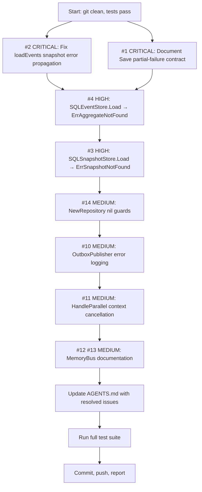

# Session 28 — Branching-Flow Context Review & Fix Plan

**Date:** 2026-05-01
**Status:** In Progress
**Scope:** `core/event`, `core/aggregate`, `memory`, `storage`

## Context

Full review of all branching-flow and context propagation patterns across the entire codebase. 16 issues found across 4 severity levels. This plan executes fixes from highest to lowest impact.

## Pareto Analysis

### 1% → 51% impact: Fix 2 CRITICAL data-consistency bugs

- `aggregate/repository.go` Save: events persisted but unpublished
- `aggregate/repository.go` loadEvents: snapshot errors silently discarded

### 4% → 64% impact: + Fix 2 HIGH interface contract violations

- `SQLEventStore.Load` returns empty slice instead of `ErrAggregateNotFound`
- `SQLSnapshotStore.Load` wraps `sql.ErrNoRows` instead of returning `ErrSnapshotNotFound`

### 20% → 80% impact: + Fix all MEDIUM issues

- NewRepository nil guards
- OutboxPublisher error logging
- HandleParallel context cancellation
- MemoryBus documentation

## Execution Graph

## Detailed Task Breakdown (max 15 min each)

### Phase 1: CRITICAL (1% → 51%)

| #   | Task                                                                                   | File                                  | Time | Status  |
| --- | -------------------------------------------------------------------------------------- | ------------------------------------- | ---- | ------- |
| 1   | Fix `loadEvents` to propagate snapshot load errors instead of silently discarding them | `core/aggregate/repository.go:159`    | 10m  | pending |
| 2   | Add test: snapshot load error is returned (not swallowed)                              | `core/aggregate/repository_test.go`   | 12m  | pending |
| 3   | Document Save partial-failure contract on `EventSourcedRepository.Save` godoc          | `core/aggregate/repository.go:65-106` | 8m   | pending |

### Phase 2: HIGH (4% → 64%)

| #   | Task                                                                             | File                             | Time | Status  |
| --- | -------------------------------------------------------------------------------- | -------------------------------- | ---- | ------- |
| 4   | Fix `SQLEventStore.Load` to return `ErrAggregateNotFound` for empty result sets  | `storage/event_store.go:172-193` | 10m  | pending |
| 5   | Add test: SQLEventStore.Load returns ErrAggregateNotFound for missing aggregate  | `storage/event_store_test.go`    | 10m  | pending |
| 6   | Fix `SQLSnapshotStore.Load` to translate `sql.ErrNoRows` → `ErrSnapshotNotFound` | `storage/snapshot.go:64-91`      | 8m   | pending |
| 7   | Add test: SQLSnapshotStore.Load returns ErrSnapshotNotFound for missing snapshot | `storage/snapshot_test.go`       | 10m  | pending |

### Phase 3: MEDIUM (20% → 80%)

| #   | Task                                                               | File                                     | Time | Status  |
| --- | ------------------------------------------------------------------ | ---------------------------------------- | ---- | ------- |
| 8   | Add nil guards to `NewRepository` for store and bus parameters     | `core/aggregate/repository.go:38-53`     | 8m   | pending |
| 9   | Add test: NewRepository returns error for nil store/bus            | `core/aggregate/repository_test.go`      | 10m  | pending |
| 10  | Add sentinels `ErrNilStore`, `ErrNilBus` for repository nil guards | `core/aggregate/errors.go`               | 5m   | pending |
| 11  | Add error logging in `OutboxPublisher.publishPending`              | `core/event/outbox_publisher.go:138-157` | 12m  | pending |
| 12  | Add test: publishPending logs PollPending and Publish errors       | `core/event/outbox_publisher_test.go`    | 12m  | pending |
| 13  | Add context cancellation to `HandleParallel` via errgroup pattern  | `core/event/runner.go:101-156`           | 12m  | pending |
| 14  | Add test: HandleParallel respects context cancellation             | `core/event/runner_test.go`              | 12m  | pending |
| 15  | Document MemoryBus partial-publish and handler ordering            | `memory/bus.go` godoc                    | 8m   | pending |

### Phase 4: Verification & Cleanup

| #   | Task                                                         | File        | Time | Status  |
| --- | ------------------------------------------------------------ | ----------- | ---- | ------- |
| 16  | Update AGENTS.md: mark resolved issues, add session 28 notes | `AGENTS.md` | 10m  | pending |
| 17  | Run full test suite across all 19 packages                   | —           | 5m   | pending |
| 18  | Run lint check                                               | —           | 5m   | pending |
| 19  | Final commit and push                                        | —           | 5m   | pending |

## Risk Assessment

- **#1 Save atomicity**: NOT fixed in code — only documented. A true fix requires transactional outbox pattern which is a larger architectural change. Documentation ensures consumers understand the contract.
- **#6 HandleParallel context cancellation**: Must not break existing behavior when context is not canceled. Use `context.WithCancel` + goroutine cleanup.
- **#4 SQLEventStore.Load**: Behavior change — existing consumers may depend on empty slice. Low risk since storage module is marked PARTIALLY_FUNCTIONAL.

## Decisions

1. **Save atomicity**: Document-only fix. True transactional fix requires outbox-in-same-tx architecture change (separate session).
2. **Context in memory module**: Not changing `_ context.Context` patterns — these are test utilities, and respecting context adds complexity for no real benefit in testing scenarios.
3. **HandleParallel**: Use manual cancel context rather than adding `errgroup` dependency.
