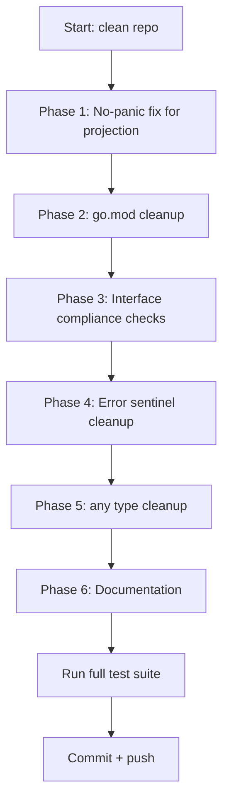

# Session 29 — Honest Self-Assessment & Deep Quality Improvements

**Date:** 2026-05-01
**Status:** In Progress
**Trigger:** "What did you forget? What could you have done better?"

## Honest Self-Assessment

### What I forgot in Session 28

1. **projection/runner.go panics** — `NewRunner` panics on nil args (lines 32, 36, 40), violating the no-panic convention from session 27. I reviewed the core event runner but missed the projection runner.
2. **Stale go.mod replace directives** — `testhelpers/go.mod` and `middleware/go.mod` have `memory` replace but never import it. `projection/` has no `go.sum`. These cause gopls noise.
3. **Missing interface compliance checks** — `FakeCheckpointStore`, `TestMetrics`, `JSONCodec`, `slogLogger` all lack `var _ Interface = (*Impl)(nil)` checks.
4. **Non-sentinel inline errors** — `memory/bus.go` uses `errors.New("handler must not be nil")` inline instead of a sentinel. Same in `outbox_publisher.go`.
5. **projection/internal/stream uses `[]any`** — `ops := []any{}` in pipeline.go violates "no any" rule.
6. **CatalogMeta duplication** — 3 near-identical copies. I flagged it but didn't address it.

### What I could do better

- Type model: `query.Handler` returns `any`, forcing all consumers to type-assert. This is the biggest type safety gap.
- The `any` in `Codec.Encode/Decode` is unavoidable (JSON marshal/unmarshal pattern), but the catalog exporter `map[string]any` usage could use typed structs.
- Error handling: some `fmt.Errorf("%w", sentinel)` wraps are redundant — just return the sentinel directly.

## Execution Plan

### Phase 1: No-Panic Convention Fix (highest principle alignment)

| #   | Task                                                            | File                                    | Impact | Effort |
| --- | --------------------------------------------------------------- | --------------------------------------- | ------ | ------ |
| 1   | Convert `NewRunner` to return `(*Runner, error)` with sentinels | `projection/runner.go`                  | HIGH   | S      |
| 2   | Add `ErrNilStore`, `ErrNilBus`, `ErrNilCheckpoint` sentinels    | `projection/errors.go` (new)            | HIGH   | S      |
| 3   | Update all callers: tests + example                             | `projection/runner_test.go`, `example/` | HIGH   | S      |
| 4   | Add test: NewRunner returns errors for nil deps                 | `projection/runner_test.go`             | HIGH   | S      |

### Phase 2: go.mod Cleanup (eliminates 32 gopls errors)

| #   | Task                                                    | File                 | Impact | Effort |
| --- | ------------------------------------------------------- | -------------------- | ------ | ------ |
| 5   | Remove stale `memory` replace from `testhelpers/go.mod` | `testhelpers/go.mod` | MEDIUM | S      |
| 6   | Remove stale `memory` replace from `middleware/go.mod`  | `middleware/go.mod`  | MEDIUM | S      |
| 7   | Run `go mod tidy` in projection to generate go.sum      | `projection/go.sum`  | MEDIUM | S      |
| 8   | Run `go mod tidy` in all modules to clean go.sum files  | `*/go.sum`           | LOW    | S      |

### Phase 3: Interface Compliance Checks

| #   | Task                                                            | File                             | Impact | Effort |
| --- | --------------------------------------------------------------- | -------------------------------- | ------ | ------ |
| 9   | Add `var _ event.Codec = (*JSONCodec)(nil)`                     | `core/event/codec.go`            | LOW    | S      |
| 10  | Add `var _ Logger = (*slogLogger)(nil)`                         | `middleware/slog.go`             | LOW    | S      |
| 11  | Add `var _ event.CheckpointStore = (*FakeCheckpointStore)(nil)` | `testhelpers/fake_checkpoint.go` | LOW    | S      |
| 12  | Add `var _ MetricsRecorder = (*TestMetrics)(nil)`               | `testhelpers/helpers.go`         | LOW    | S      |

### Phase 4: Error Sentinel Cleanup

| #   | Task                                                              | File                   | Impact | Effort |
| --- | ----------------------------------------------------------------- | ---------------------- | ------ | ------ |
| 13  | Extract `ErrHandlerNil` sentinel for MemoryBus nil handler checks | `memory/bus.go`        | LOW    | S      |
| 14  | Extract `ErrAlreadyStarted` sentinel for OutboxPublisher          | `core/event/errors.go` | LOW    | S      |

### Phase 5: `any` Type Cleanup (pipeline)

| #   | Task                                                 | File                                     | Impact | Effort |
| --- | ---------------------------------------------------- | ---------------------------------------- | ------ | ------ |
| 15  | Replace `[]any` with typed `[]ro.Pipe` in ProcessAll | `projection/internal/stream/pipeline.go` | MEDIUM | S      |

### Phase 6: Documentation Gaps

| #   | Task                                        | File                        | Impact | Effort |
| --- | ------------------------------------------- | --------------------------- | ------ | ------ |
| 16  | Add godoc to catalog package exported types | `catalog/types.go`          | MEDIUM | M      |
| 17  | Add godoc to asyncapi exported types        | `catalog/asyncapi/types.go` | LOW    | M      |

## Deferred (requires larger architectural work)

- **query.Handler returns any** — Requires generic query dispatch (`DispatchTyped[T]` already works, but `Handler` itself can't be generic without breaking the middleware pattern)
- **CatalogMeta consolidation** — 3 packages with identical structs. Needs careful API design to avoid import cycles.
- **map[string]any in catalog exporters** — AsyncAPI types could use typed structs, but YAML/JSON marshaling flexibility makes `any` pragmatic here
