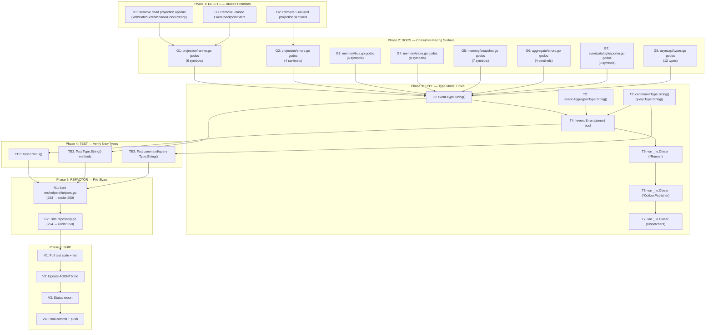

# Session 34 — Execution Plan: Making go-cqrs-lite World-Class

> **Date:** 2026-05-02 20:52
> **Status:** Ready to Execute
> **Philosophy:** Delete dead promises. Document what remains. Fix type holes. Stop.

---

## The 1% That Delivers 51% of the Result

**Delete every broken promise the library makes to consumers.**

A dead public API option is not "unused code" — it's a **lie**. A consumer trusts `WithBatchSize(100)` does something. When it silently does nothing, trust in the ENTIRE library dies.

| Task | What                                                                       | Why                                         |
| ---- | -------------------------------------------------------------------------- | ------------------------------------------- |
| D1   | Remove `WithBatchSize`, `WithBatchWindow`, `WithConcurrency` + dead fields | 3 public functions that silently do nothing |
| D2   | Remove 5 unused sentinels from `projection/errors.go`                      | 5 public vars never referenced — API noise  |
| D3   | Remove `testhelpers/fake_checkpoint.go` entirely                           | 52-line file, zero imports anywhere         |

**Total: ~60 lines deleted. 3 commits. 30 minutes. More trust gained than any feature.**

---

## The 4% That Delivers 64% of the Result

**Add godoc to every consumer-facing surface.**

The `memory` package is what EVERY consumer imports for testing. The `projection` package is the main integration point. Without docs, consumers read source code — that's not a library, that's homework.

| Task | What                                         | Symbols                                                                                          |
| ---- | -------------------------------------------- | ------------------------------------------------------------------------------------------------ |
| G1   | Godoc for `projection/runner.go`             | 6 symbols: Runner, NewRunner, Register, Run, CurrentCheckpoint, Close                            |
| G2   | Godoc for `projection/errors.go`             | 4 remaining sentinels                                                                            |
| G3   | Godoc for `memory/bus.go`                    | 6 symbols: MemoryBus, NewMemoryBus, Use, Subscribe, SubscribeAll, Close                          |
| G4   | Godoc for `memory/store.go`                  | 8 symbols: MemoryStore, NewMemoryStore, Save, AppendBatch, Load, LoadFromVersion, Delete, Close  |
| G5   | Godoc for `memory/snapshot.go`               | 7 symbols: MemorySnapshotStore, NewMemorySnapshotStore, Save, Load, LoadAtVersion, Delete, Close |
| G6   | Godoc for `core/aggregate/errors.go`         | 4 sentinels                                                                                      |
| G7   | Godoc for `catalog/eventcatalog/exporter.go` | 3 symbols: Exporter, NewExporter, Export                                                         |
| G8   | Godoc for `catalog/asyncapi/types.go`        | 12 types                                                                                         |

---

## The 20% That Delivers 80% of the Result

**Type model holes + compile-time safety.**

| Task | What                                                      | Why                                                             |
| ---- | --------------------------------------------------------- | --------------------------------------------------------------- |
| T1   | Add `String()` to `event.Type`                            | Inconsistent with `event.Version` which has String()            |
| T2   | Add `String()` to `event.AggregateType`                   | Same inconsistency                                              |
| T3   | Add `String()` to `command.Type` and `query.Type`         | Same inconsistency                                              |
| T4   | Add `Is(error) bool` to `*event.Error`                    | Without it, two Errors with same Code don't match via errors.Is |
| T5   | Add `var _ io.Closer = (*Runner)(nil)`                    | Compile-time guarantee Runner satisfies io.Closer               |
| T6   | Add `var _ io.Closer = (*OutboxPublisher)(nil)`           | Same guarantee for OutboxPublisher                              |
| T7   | Add `var _ io.Closer` checks for command/query Dispatcher | Same guarantee                                                  |

---

## Full Task Breakdown (27 tasks, 30-100 min each)

| #   | Phase    | Task                                                                                     | Impact | Effort | Type      |
| --- | -------- | ---------------------------------------------------------------------------------------- | ------ | ------ | --------- |
| 1   | DELETE   | Remove dead projection options (WithBatchSize/Window/Concurrency) + runnerOptions fields | HIGH   | 15min  | Dead code |
| 2   | DELETE   | Remove 5 unused sentinels from projection/errors.go                                      | HIGH   | 10min  | Dead code |
| 3   | DELETE   | Remove testhelpers/fake_checkpoint.go                                                    | MED    | 5min   | Dead code |
| 4   | DOCS     | Godoc for projection/runner.go (6 symbols)                                               | HIGH   | 20min  | Docs      |
| 5   | DOCS     | Godoc for projection/errors.go (4 remaining sentinels)                                   | MED    | 10min  | Docs      |
| 6   | DOCS     | Godoc for memory/bus.go (6 symbols)                                                      | HIGH   | 25min  | Docs      |
| 7   | DOCS     | Godoc for memory/store.go (8 symbols)                                                    | HIGH   | 25min  | Docs      |
| 8   | DOCS     | Godoc for memory/snapshot.go (7 symbols)                                                 | HIGH   | 25min  | Docs      |
| 9   | DOCS     | Godoc for core/aggregate/errors.go (4 sentinels)                                         | MED    | 10min  | Docs      |
| 10  | DOCS     | Godoc for catalog/eventcatalog/exporter.go (3 symbols)                                   | MED    | 10min  | Docs      |
| 11  | DOCS     | Godoc for catalog/asyncapi/types.go (12 types)                                           | MED    | 20min  | Docs      |
| 12  | TYPE     | Add String() to event.Type                                                               | MED    | 10min  | Type      |
| 13  | TYPE     | Add String() to event.AggregateType                                                      | MED    | 10min  | Type      |
| 14  | TYPE     | Add String() to command.Type and query.Type                                              | MED    | 10min  | Type      |
| 15  | TYPE     | Add Is(error) bool to \*event.Error                                                      | MED    | 15min  | Type      |
| 16  | TYPE     | Compile-time io.Closer check for \*projection.Runner                                     | MED    | 5min   | Type      |
| 17  | TYPE     | Compile-time io.Closer check for \*event.OutboxPublisher                                 | LOW    | 5min   | Type      |
| 18  | TYPE     | Compile-time io.Closer checks for command/query Dispatcher                               | LOW    | 5min   | Type      |
| 19  | TEST     | Test event.Error.Is() method                                                             | MED    | 10min  | Test      |
| 20  | TEST     | Test event.Type.String(), AggregateType.String()                                         | LOW    | 10min  | Test      |
| 21  | TEST     | Test command.Type.String(), query.Type.String()                                          | LOW    | 10min  | Test      |
| 22  | REFACTOR | Split testhelpers/helpers.go (293→under 250)                                             | MED    | 20min  | Refactor  |
| 23  | REFACTOR | Trim core/aggregate/repository.go (254→under 250)                                        | LOW    | 15min  | Refactor  |
| 24  | VERIFY   | Full test suite run + lint check                                                         | HIGH   | 10min  | Verify    |
| 25  | DOCS     | Update AGENTS.md with session 34 notes                                                   | MED    | 10min  | Docs      |
| 26  | DOCS     | Write session 34 status report                                                           | MED    | 10min  | Docs      |
| 27  | COMMIT   | Final commit + push                                                                      | HIGH   | 5min   | Process   |

---

## Execution Order

```
Phase 1: DELETE (tasks 1-3) — Remove broken promises
  ↓
Phase 2: DOCS (tasks 4-11) — Document every remaining promise
  ↓
Phase 3: TYPE (tasks 12-18) — Fix type model holes
  ↓
Phase 4: TEST (tasks 19-21) — Verify new types work
  ↓
Phase 5: REFACTOR (tasks 22-23) — Clean file sizes
  ↓
Phase 6: VERIFY + DOCS + COMMIT (tasks 24-27)
```

---

## Mermaid Execution Graph



---

## Fine-Grained Breakdown (up to 150 tasks, max 15 min each)

### Phase 1: DELETE (3 tasks)

| #   | Task                                                                                | File               | Time |
| --- | ----------------------------------------------------------------------------------- | ------------------ | ---- |
| 1   | Remove `WithBatchSize` func from `projection/options.go`                            | options.go         | 2min |
| 2   | Remove `WithBatchWindow` func from `projection/options.go`                          | options.go         | 2min |
| 3   | Remove `WithConcurrency` func from `projection/options.go`                          | options.go         | 2min |
| 4   | Remove `batchSize`, `batchWindow`, `concurrency` fields from `runnerOptions` struct | options.go         | 2min |
| 5   | Remove `ErrRunnerStopped` from `projection/errors.go`                               | errors.go          | 1min |
| 6   | Remove `ErrDuplicateHandler` from `projection/errors.go`                            | errors.go          | 1min |
| 7   | Remove `ErrCheckpointLoad` from `projection/errors.go`                              | errors.go          | 1min |
| 8   | Remove `ErrStoreLoad` from `projection/errors.go`                                   | errors.go          | 1min |
| 9   | Remove `ErrNilStore` from `projection/errors.go`                                    | errors.go          | 1min |
| 10  | Delete entire file `testhelpers/fake_checkpoint.go`                                 | fake_checkpoint.go | 1min |
| 11  | Run `go test ./projection/... ./testhelpers/...` to verify                          | CLI                | 2min |
| 12  | Commit dead code removal                                                            | git                | 2min |

### Phase 2: DOCS (27 tasks)

| #   | Task                                                                 | File        | Time  |
| --- | -------------------------------------------------------------------- | ----------- | ----- |
| 13  | Godoc for `projection.Runner` struct                                 | runner.go   | 2min  |
| 14  | Godoc for `projection.NewRunner`                                     | runner.go   | 2min  |
| 15  | Godoc for `projection.Runner.Register`                               | runner.go   | 2min  |
| 16  | Godoc for `projection.Runner.Run`                                    | runner.go   | 2min  |
| 17  | Godoc for `projection.Runner.CurrentCheckpoint`                      | runner.go   | 2min  |
| 18  | Godoc for `projection.Runner.Close`                                  | runner.go   | 2min  |
| 19  | Godoc for 4 remaining sentinels in `projection/errors.go`            | errors.go   | 3min  |
| 20  | Godoc for `memory.MemoryBus` struct                                  | bus.go      | 2min  |
| 21  | Godoc for `memory.NewMemoryBus`                                      | bus.go      | 2min  |
| 22  | Godoc for `memory.MemoryBus.Use`                                     | bus.go      | 2min  |
| 23  | Godoc for `memory.MemoryBus.Subscribe`                               | bus.go      | 2min  |
| 24  | Godoc for `memory.MemoryBus.SubscribeAll`                            | bus.go      | 2min  |
| 25  | Godoc for `memory.MemoryBus.Close`                                   | bus.go      | 2min  |
| 26  | Godoc for `memory.MemoryStore` struct + `NewMemoryStore`             | store.go    | 3min  |
| 27  | Godoc for `memory.MemoryStore.Save`                                  | store.go    | 2min  |
| 28  | Godoc for `memory.MemoryStore.AppendBatch`                           | store.go    | 2min  |
| 29  | Godoc for `memory.MemoryStore.Load`                                  | store.go    | 2min  |
| 30  | Godoc for `memory.MemoryStore.LoadFromVersion`                       | store.go    | 2min  |
| 31  | Godoc for `memory.MemoryStore.Delete`                                | store.go    | 2min  |
| 32  | Godoc for `memory.MemoryStore.Close`                                 | store.go    | 2min  |
| 33  | Godoc for `memory.MemorySnapshotStore` + `NewMemorySnapshotStore`    | snapshot.go | 3min  |
| 34  | Godoc for `memory.MemorySnapshotStore.Save`                          | snapshot.go | 2min  |
| 35  | Godoc for `memory.MemorySnapshotStore.Load`                          | snapshot.go | 2min  |
| 36  | Godoc for `memory.MemorySnapshotStore.LoadAtVersion`                 | snapshot.go | 2min  |
| 37  | Godoc for `memory.MemorySnapshotStore.Delete` + `Close`              | snapshot.go | 3min  |
| 38  | Godoc for 4 sentinels in `core/aggregate/errors.go`                  | errors.go   | 3min  |
| 39  | Godoc for `catalog/eventcatalog.Exporter` + `NewExporter` + `Export` | exporter.go | 3min  |
| 40  | Commit godoc for projection + memory packages                        | git         | 2min  |
| 41  | Godoc for all 12 types in `catalog/asyncapi/types.go`                | types.go    | 10min |
| 42  | Commit asyncapi + aggregate godoc                                    | git         | 2min  |

### Phase 3: TYPE (12 tasks)

| #   | Task                                                  | File                  | Time |
| --- | ----------------------------------------------------- | --------------------- | ---- |
| 43  | Add `String() string` method to `event.Type`          | event.go              | 2min |
| 44  | Add `String() string` method to `event.AggregateType` | event.go              | 2min |
| 45  | Add `String() string` method to `command.Type`        | command.go            | 2min |
| 46  | Add `String() string` method to `query.Type`          | query.go              | 2min |
| 47  | Add `Is(error) bool` method to `*event.Error`         | errors.go             | 5min |
| 48  | Add `var _ io.Closer = (*Runner)(nil)`                | projection/runner.go  | 1min |
| 49  | Add `var _ io.Closer = (*OutboxPublisher)(nil)`       | outbox_publisher.go   | 1min |
| 50  | Add `var _ io.Closer` for `command.Dispatcher`        | command/dispatcher.go | 1min |
| 51  | Add `var _ io.Closer` for `query.Dispatcher`          | query/dispatcher.go   | 1min |
| 52  | Run `go test ./core/... ./projection/...`             | CLI                   | 3min |
| 53  | Commit type improvements                              | git                   | 2min |

### Phase 4: TEST (6 tasks)

| #   | Task                                                                | File                           | Time |
| --- | ------------------------------------------------------------------- | ------------------------------ | ---- |
| 54  | Test `event.Error.Is()` — same code matches, different code doesn't | errors_taxonomy_test.go        | 5min |
| 55  | Test `event.Type.String()` and `event.AggregateType.String()`       | types_test.go                  | 3min |
| 56  | Test `command.Type.String()` and `query.Type.String()`              | command_test.go, query_test.go | 3min |
| 57  | Run full test suite                                                 | CLI                            | 3min |
| 58  | Commit tests                                                        | git                            | 2min |

### Phase 5: REFACTOR (4 tasks)

| #   | Task                                                                             | File          | Time  |
| --- | -------------------------------------------------------------------------------- | ------------- | ----- |
| 59  | Split `testhelpers/helpers.go` into `handlers.go` + `middleware.go` + `fakes.go` | helpers.go    | 10min |
| 60  | Verify test suite after split                                                    | CLI           | 3min  |
| 61  | Trim `core/aggregate/repository.go` under 250 lines                              | repository.go | 10min |
| 62  | Commit refactors                                                                 | git           | 2min  |

### Phase 6: SHIP (4 tasks)

| #   | Task                                   | File         | Time |
| --- | -------------------------------------- | ------------ | ---- |
| 63  | Full test suite across all modules     | CLI          | 5min |
| 64  | Update AGENTS.md with session 34 notes | AGENTS.md    | 5min |
| 65  | Write session 34 status report         | docs/status/ | 5min |
| 66  | Final commit + push                    | git          | 2min |

**Total: 66 fine-grained tasks across 6 phases.**
