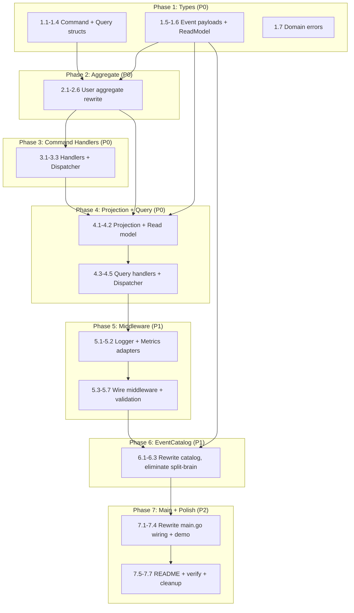

# Plan: World-Class Example Rewrite

**Created:** 2026-05-02
**Status:** PLANNING
**Goal:** Rewrite `example/user/` into a reference-quality demo that shows the FULL library capability stack.

---

## Pareto Breakdown

### 1% → 51% impact: Full CQRS Roundtrip

The single most impactful change: **wire commands → handlers → aggregates → events → projections → queries** end-to-end. Currently shows ~20% of the library. This alone makes it a real example.

### 4% → 64% impact: Middleware + Error Handling

Add logging, recovery, validation, retry middleware. Show error classification with `event.Classify`/`event.IsRetryable`. Demonstrate the "why would I use this library?" value proposition.

### 20% → 80% impact: EventCatalog + Polish

Clean EventCatalog generation (no split-brain types), proper comments, README in the example dir, proper error propagation (no `log.Fatalf` in helpers).

---

## What the Example MUST Demonstrate

| #   | Capability                                              | Currently Shows?           |
| --- | ------------------------------------------------------- | -------------------------- |
| 1   | Command creation + dispatch                             | ❌                         |
| 2   | Command handler → aggregate → repo.Save                 | ❌ (manual event creation) |
| 3   | Aggregate with proper Apply/RecordEvent                 | ⚠️ partial                 |
| 4   | Event Bus subscription                                  | ❌                         |
| 5   | Projection building a read model                        | ❌                         |
| 6   | Query dispatch + typed result                           | ❌                         |
| 7   | Middleware chain (logging, recovery, validation, retry) | ❌                         |
| 8   | Error classification (Classify, IsRetryable)            | ❌                         |
| 9   | Branded IDs (all types)                                 | ⚠️ only AggregateID        |
| 10  | EventCatalog generation                                 | ✅ but split-brain         |
| 11  | Event metadata (correlation ID, source, etc.)           | ❌                         |
| 12  | Aggregate load-modify-save cycle                        | ✅                         |
| 13  | Proper error handling (no log.Fatalf in helpers)        | ❌                         |

---

## Comprehensive Plan (Medium Granularity)

| #   | Task                                                                                       | Impact | Effort | Priority |
| --- | ------------------------------------------------------------------------------------------ | ------ | ------ | -------- |
| 1   | Define typed command structs (CreateUser, ChangeUserName) implementing `command.Command`   | HIGH   | 15min  | P0       |
| 2   | Define typed query structs (GetUser, ListUsers) implementing `query.Query`                 | HIGH   | 15min  | P0       |
| 3   | Rewrite User aggregate with proper Create/ChangeName methods that record events internally | HIGH   | 20min  | P0       |
| 4   | Create shared event payload types (eliminate split-brain with catalog.go)                  | HIGH   | 15min  | P0       |
| 5   | Wire command dispatcher with handlers that use repo.Save/Load                              | HIGH   | 20min  | P0       |
| 6   | Add event bus subscription — print events as they're published                             | MED    | 10min  | P0       |
| 7   | Create UserReadModel projection that builds a queryable map                                | HIGH   | 20min  | P0       |
| 8   | Wire query dispatcher reading from the read model                                          | HIGH   | 15min  | P0       |
| 9   | Add middleware chain: Recovery → Logging → Validation → Retry                              | HIGH   | 20min  | P1       |
| 10  | Implement simple Logger adapter using slog for middleware                                  | MED    | 10min  | P1       |
| 11  | Implement simple MetricsRecorder for middleware                                            | MED    | 10min  | P1       |
| 12  | Add command validation (email required, name non-empty)                                    | MED    | 10min  | P1       |
| 13  | Demonstrate error classification with a transient error scenario                           | MED    | 15min  | P1       |
| 14  | Rewrite catalog.go to use shared payload types (no duplication)                            | MED    | 15min  | P1       |
| 15  | Add event metadata: correlation ID, source, user ID                                        | LOW    | 10min  | P2       |
| 16  | Add README.md in example/user/ explaining the example                                      | MED    | 15min  | P2       |
| 17  | Run the full example end-to-end and verify output                                          | MED    | 10min  | P2       |
| 18  | Clean up: no log.Fatalf in helpers, proper error returns everywhere                        | LOW    | 10min  | P2       |

---

## Detailed Breakdown (Fine Granularity)

### Phase 1: Types & Domain (P0)

| #   | Task                                                                                                                      | Est  |
| --- | ------------------------------------------------------------------------------------------------------------------------- | ---- |
| 1.1 | Create `commands.go` — `CreateUser` struct with CommandType, AggregateID, IdempotencyKey, Email, Name fields              | 5min |
| 1.2 | Create `commands.go` — `ChangeUserName` struct with CommandType, AggregateID, IdempotencyKey, Name field                  | 5min |
| 1.3 | Create `queries.go` — `GetUserQuery` struct with QueryType, AggregateID fields                                            | 5min |
| 1.4 | Create `queries.go` — `ListUsersQuery` struct with QueryType, Pagination fields                                           | 5min |
| 1.5 | Create `events.go` — `UserCreatedPayload`, `UserNameChangedPayload` with struct tags (shared between aggregate + catalog) | 5min |
| 1.6 | Create `readmodel.go` — `UserReadModel` struct (ID, Email, Name, Version fields)                                          | 5min |
| 1.7 | Create `errors.go` — domain validation errors using `event.NewRejection`/`event.NewConflict`                              | 5min |

### Phase 2: Aggregate Rewrite (P0)

| #   | Task                                                                                             | Est  |
| --- | ------------------------------------------------------------------------------------------------ | ---- |
| 2.1 | Rewrite `aggregate.go` — User struct with embed `*aggregate.Core`, email, name, createdAt fields | 5min |
| 2.2 | Implement `Create(ctx, email, name)` — validates, marshals payload, records `UserCreated` event  | 5min |
| 2.3 | Implement `ChangeName(ctx, name)` — validates, records `UserNameChanged` event                   | 5min |
| 2.4 | Implement `Apply(evt)` — handles UserCreated + UserNameChanged via shared payload types          | 5min |
| 2.5 | Implement `ApplySnapshot` + `LoadEvents` (still minimal but properly stubbed)                    | 3min |
| 2.6 | Add `newUser(id)` constructor that doesn't create events (for loading)                           | 2min |

### Phase 3: Command Handlers (P0)

| #   | Task                                                                                        | Est  |
| --- | ------------------------------------------------------------------------------------------- | ---- |
| 3.1 | Create `handlers.go` — `handleCreateUser` that creates aggregate, calls Create, repo.Save   | 5min |
| 3.2 | Create `handlers.go` — `handleChangeName` that loads aggregate, calls ChangeName, repo.Save | 5min |
| 3.3 | Wire command.Dispatcher: Register both handlers                                             | 3min |

### Phase 4: Projection + Query (P0)

| #   | Task                                                                            | Est  |
| --- | ------------------------------------------------------------------------------- | ---- |
| 4.1 | Create `projection.go` — `UserProjection` that updates read model map on events | 5min |
| 4.2 | Wire projection with memory.InMemoryRunner or direct bus subscription           | 5min |
| 4.3 | Create `handlers.go` — `handleGetUser` query handler reading from read model    | 5min |
| 4.4 | Create `handlers.go` — `handleListUsers` query handler reading from read model  | 5min |
| 4.5 | Wire query.Dispatcher: Register both handlers                                   | 3min |

### Phase 5: Middleware (P1)

| #   | Task                                                                   | Est  |
| --- | ---------------------------------------------------------------------- | ---- |
| 5.1 | Create `logger.go` — simple `slog`-based Logger adapter for middleware | 5min |
| 5.2 | Create `metrics.go` — simple MetricsRecorder that prints timing        | 5min |
| 5.3 | Wire command middleware: Recovery → Logging → Validation → Retry       | 5min |
| 5.4 | Wire query middleware: Recovery → Logging → Validation                 | 3min |
| 5.5 | Implement command validation: email required, name non-empty           | 5min |
| 5.6 | Implement query validation: aggregate ID required for GetUser          | 3min |
| 5.7 | Demonstrate retry with a transient error (commented scenario)          | 5min |

### Phase 6: EventCatalog (P1)

| #   | Task                                                                  | Est   |
| --- | --------------------------------------------------------------------- | ----- |
| 6.1 | Rewrite `catalog.go` to use shared event payload types from events.go | 10min |
| 6.2 | Add command + query catalog entries (not just events)                 | 5min  |
| 6.3 | Remove split-brain types (userCreatedEvent, userNameChangedEvent)     | 3min  |

### Phase 7: Main + Polish (P2)

| #   | Task                                                                                                  | Est   |
| --- | ----------------------------------------------------------------------------------------------------- | ----- |
| 7.1 | Rewrite `main.go` — wire everything in order: infra → projections → handlers → middleware → demo flow | 10min |
| 7.2 | Demo flow: CreateUser → Load → ChangeName → Query → print results                                     | 5min  |
| 7.3 | Add event metadata: correlation ID, source on event creation                                          | 3min  |
| 7.4 | Add event bus subscription that prints published events                                               | 3min  |
| 7.5 | Write `example/user/README.md` with architecture diagram + explanation                                | 10min |
| 7.6 | Verify: `cd example/user && go run .` works end-to-end                                                | 5min  |
| 7.7 | Cleanup: remove `user` binary, check all errors handled properly                                      | 3min  |

---

## Proposed File Structure

```
example/user/
├── README.md              # What this example demonstrates
├── go.mod
├── go.sum
├── main.go                # Wiring + demo flow (~80 lines)
├── aggregate.go           # User aggregate root (~60 lines)
├── commands.go            # CreateUser, ChangeUserName (~40 lines)
├── queries.go             # GetUser, ListUsers (~30 lines)
├── events.go              # Shared payload types (~20 lines)
├── handlers.go            # Command + query handlers (~60 lines)
├── projection.go          # UserProjection + read model (~40 lines)
├── catalog.go             # EventCatalog generation (~60 lines)
├── logger.go              # slog adapter for middleware (~30 lines)
└── metrics.go             # Simple metrics recorder (~20 lines)
```

**Total: ~440 lines across 11 files** (current: ~180 lines across 3 files)

---

## Execution Graph



---

## Demo Flow (What `go run .` Should Output)

```
=== go-cqrs-lite: Full CQRS + Event Sourcing Demo ===

[infra] Starting User Service infrastructure...
[infra] Store: MemoryStore | Bus: MemoryBus | Repository: ready
[infra] Projections: UserProjection registered
[infra] Middleware: Recovery → Logging → Validation → Retry

--- Step 1: Create User ---
[cmd-dispatch] CreateUser (alice@example.com)
[middleware]   logging: command dispatched in 0.2ms
[event-bus]    UserCreated → UserProjection updated read model
→ Created user 01HK... (alice@example.com)

--- Step 2: Load & Modify ---
[cmd-dispatch] ChangeUserName → Alice Smith
[middleware]   logging: command dispatched in 0.1ms
[event-bus]    UserNameChanged → UserProjection updated read model
→ Name changed, version 2

--- Step 3: Query User ---
[query-dispatch] GetUser → read model lookup
→ User{Email: "alice@example.com", Name: "Alice Smith", Version: 2}

--- Step 4: List Users ---
[query-dispatch] ListUsers → 1 user(s)
→ [0] alice@example.com (Alice Smith)

--- Step 5: EventCatalog ---
[catalog] 2 events, 2 commands, 2 queries registered
[catalog] EventCatalog written to ./eventcatalog-output/

=== Demo Complete ===
```
