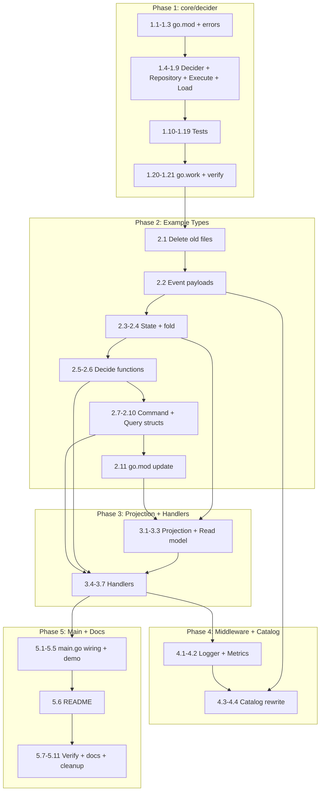

# Plan: Decider Package + World-Class Example

**Created:** 2026-05-03
**Status:** EXECUTING
**Goal:** Add `core/decider` package as the recommended aggregate pattern, then rewrite the example to demonstrate a perfect full-stack CQRS integration.

---

## Locked Design Decisions

| Decision           | Choice                                                            | Rationale                                                                      |
| ------------------ | ----------------------------------------------------------------- | ------------------------------------------------------------------------------ |
| Package location   | `core/decider`                                                    | First-class concept, same level as command/query/event/aggregate               |
| `decide` signature | `func(state State, version event.Version) ([]event.Event, error)` | Error return for rejections; version passed explicitly for event creation      |
| `fold` signature   | `func(state State, evt event.Event) (State, error)`               | Error return for corruption visibility                                         |
| Event creation     | Inside `decide` function                                          | Consumer controls types, versions, metadata                                    |
| Version tracking   | Repository derives from `len(events)`, passes to `decide`         | No hidden mutation                                                             |
| Example pattern    | Decider only                                                      | Recommended path; aggregate package stays for existing consumers               |
| Example quality    | Reference integration                                             | Not a tutorial — the gold standard a consumer copies as their project scaffold |
| File structure     | Multi-file (11 files)                                             | File structure IS part of the deliverable                                      |

---

## Pareto Breakdown

### 1% → 51%: `core/decider` Package

Without this, nothing else works. A thin, generic wrapper over `event.Store` + `event.Bus` that does load → fold → decide → save → publish with pure functions.

### 4% → 64%: Example Full CQRS Roundtrip

Commands → Decider → Events → Projection → Queries. End-to-end using the Decider pattern. The core value proposition of the library in one runnable demo.

### 20% → 80%: Middleware + Catalog + Polish

Logging, recovery, validation, retry middleware. EventCatalog generation without split-brain. README. Proper error handling.

---

## Comprehensive Plan (30-100 min tasks, sorted by impact)

| #   | Task                                                                                  | Impact   | Effort | Phase |
| --- | ------------------------------------------------------------------------------------- | -------- | ------ | ----- |
| 1   | Create `core/decider` package — Decider[State] type, Repository[State], Execute, Load | CRITICAL | 45min  | P1    |
| 2   | Create `core/decider/errors.go` — sentinel errors (ErrNilStore, ErrNilBus, etc.)      | HIGH     | 15min  | P1    |
| 3   | Create `core/decider/decider_test.go` — full test coverage                            | HIGH     | 60min  | P1    |
| 4   | Add `core/decider` to go.work + verify module builds                                  | HIGH     | 15min  | P1    |
| 5   | Create `example/user/events.go` — shared event payload types                          | HIGH     | 15min  | P2    |
| 6   | Create `example/user/state.go` — UserState + foldUser function                        | HIGH     | 20min  | P2    |
| 7   | Create `example/user/decide.go` — decideCreateUser, decideChangeName                  | HIGH     | 20min  | P2    |
| 8   | Create `example/user/commands.go` — CreateUserCmd, ChangeUserNameCmd                  | HIGH     | 20min  | P2    |
| 9   | Create `example/user/queries.go` — GetUserQuery, ListUsersQuery                       | MED      | 15min  | P2    |
| 10  | Create `example/user/projection.go` — UserProjection + read model                     | HIGH     | 30min  | P2    |
| 11  | Create `example/user/handlers.go` — command + query handler wiring                    | HIGH     | 25min  | P2    |
| 12  | Create `example/user/logger.go` — slog adapter for middleware                         | MED      | 20min  | P3    |
| 13  | Create `example/user/metrics.go` — simple MetricsRecorder                             | MED      | 15min  | P3    |
| 14  | Rewrite `example/user/catalog.go` — no split-brain, shared types                      | MED      | 25min  | P3    |
| 15  | Rewrite `example/user/main.go` — full wiring + demo flow                              | HIGH     | 45min  | P4    |
| 16  | Update `example/user/go.mod` — add core/decider dependency                            | MED      | 10min  | P2    |
| 17  | Create `example/user/README.md` — architecture + explanation                          | MED      | 20min  | P4    |
| 18  | Verify: `go run .` works end-to-end                                                   | HIGH     | 15min  | P4    |
| 19  | Update `AGENTS.md` with decider package info                                          | MED      | 15min  | P4    |
| 20  | Run all tests across all modules                                                      | HIGH     | 15min  | P4    |
| 21  | Lint check                                                                            | MED      | 10min  | P4    |
| 22  | Git commit with detailed messages                                                     | MED      | 10min  | P4    |

---

## Detailed Breakdown (≤15 min tasks)

### Phase 1: `core/decider` Package

| #    | Task                                                                                   | Est   |
| ---- | -------------------------------------------------------------------------------------- | ----- |
| 1.1  | Create `core/decider/` directory                                                       | 1min  |
| 1.2  | Create `core/decider/go.mod` — deps: core/event, core/pkg/id                           | 5min  |
| 1.3  | Create `core/decider/errors.go` — ErrNilStore, ErrNilBus, ErrDecideRejected            | 5min  |
| 1.4  | Create `core/decider/decider.go` — Decider[State] struct with Initial + Fold           | 10min |
| 1.5  | Create `core/decider/decider.go` — Repository[State] struct with store + bus + decider | 10min |
| 1.6  | Create `core/decider/decider.go` — NewRepository constructor with nil checks           | 10min |
| 1.7  | Create `core/decider/decider.go` — Execute: load → fold → decide → save → publish      | 15min |
| 1.8  | Create `core/decider/decider.go` — Load: load → fold → return (state, version)         | 10min |
| 1.9  | Create `core/decider/decider.go` — compile-time interface checks                       | 3min  |
| 1.10 | Create `core/decider/decider_test.go` — TestExecute_Create (no prior events)           | 10min |
| 1.11 | Create `core/decider/decider_test.go` — TestExecute_Update (with prior events)         | 10min |
| 1.12 | Create `core/decider/decider_test.go` — TestExecute_DecideError (rejection)            | 10min |
| 1.13 | Create `core/decider/decider_test.go` — TestExecute_FoldError (corruption)             | 10min |
| 1.14 | Create `core/decider/decider_test.go` — TestExecute_VersionTracking                    | 10min |
| 1.15 | Create `core/decider/decider_test.go` — TestExecute_SaveError                          | 10min |
| 1.16 | Create `core/decider/decider_test.go` — TestExecute_PublishError                       | 10min |
| 1.17 | Create `core/decider/decider_test.go` — TestLoad_NoEvents (initial state)              | 10min |
| 1.18 | Create `core/decider/decider_test.go` — TestLoad_WithEvents                            | 10min |
| 1.19 | Create `core/decider/decider_test.go` — TestNewRepository_NilChecks                    | 5min  |
| 1.20 | Update `go.work` — add core/decider                                                    | 5min  |
| 1.21 | Run `go test ./core/decider/... -count=1` and fix any issues                           | 10min |

### Phase 2: Example Types + Domain

| #    | Task                                                                                          | Est   |
| ---- | --------------------------------------------------------------------------------------------- | ----- |
| 2.1  | Delete old `example/user/main.go` and `example/user/catalog.go`                               | 2min  |
| 2.2  | Create `example/user/events.go` — UserCreatedPayload, UserNameChangedPayload with struct tags | 10min |
| 2.3  | Create `example/user/state.go` — UserState struct (Email, Name)                               | 5min  |
| 2.4  | Create `example/user/state.go` — foldUser function (pure, handles both event types)           | 10min |
| 2.5  | Create `example/user/decide.go` — decideCreateUser (validates, creates UserCreated event)     | 10min |
| 2.6  | Create `example/user/decide.go` — decideChangeName (validates, creates UserNameChanged event) | 10min |
| 2.7  | Create `example/user/commands.go` — CreateUserCmd implementing command.Command                | 10min |
| 2.8  | Create `example/user/commands.go` — ChangeUserNameCmd implementing command.Command            | 10min |
| 2.9  | Create `example/user/queries.go` — GetUserQuery implementing query.Query                      | 5min  |
| 2.10 | Create `example/user/queries.go` — ListUsersQuery implementing query.Query with Pagination    | 10min |
| 2.11 | Update `example/user/go.mod` — add core/decider replace directive                             | 5min  |

### Phase 3: Example Projection + Handlers

| #   | Task                                                                           | Est   |
| --- | ------------------------------------------------------------------------------ | ----- |
| 3.1 | Create `example/user/projection.go` — UserReadModel struct                     | 5min  |
| 3.2 | Create `example/user/projection.go` — UserProjection using event.Projection    | 10min |
| 3.3 | Create `example/user/projection.go` — ReadModelStore (thread-safe map)         | 10min |
| 3.4 | Create `example/user/handlers.go` — handleCreateUser using deciderRepo.Execute | 10min |
| 3.5 | Create `example/user/handlers.go` — handleChangeName using deciderRepo.Execute | 10min |
| 3.6 | Create `example/user/handlers.go` — handleGetUser from read model              | 10min |
| 3.7 | Create `example/user/handlers.go` — handleListUsers from read model            | 10min |

### Phase 4: Example Middleware + Catalog

| #   | Task                                                                                            | Est   |
| --- | ----------------------------------------------------------------------------------------------- | ----- |
| 4.1 | Create `example/user/logger.go` — slogAdapter implementing middleware.Logger                    | 10min |
| 4.2 | Create `example/user/metrics.go` — printMetricsRecorder implementing middleware.MetricsRecorder | 10min |
| 4.3 | Rewrite `example/user/catalog.go` — use shared event types, add commands + queries              | 15min |
| 4.4 | Rewrite `example/user/catalog.go` — generateEventCatalog function                               | 10min |

### Phase 5: Example Main + Docs

| #    | Task                                                                                     | Est   |
| ---- | ---------------------------------------------------------------------------------------- | ----- |
| 5.1  | Write `example/user/main.go` — infrastructure setup (store, bus, repo, dispatchers)      | 10min |
| 5.2  | Write `example/user/main.go` — wire projections with bus subscription                    | 10min |
| 5.3  | Write `example/user/main.go` — wire command handlers with middleware chain               | 10min |
| 5.4  | Write `example/user/main.go` — wire query handlers with middleware chain                 | 10min |
| 5.5  | Write `example/user/main.go` — demo flow: create → change name → query → list → catalog  | 15min |
| 5.6  | Create `example/user/README.md` — architecture diagram, what it demonstrates, how to run | 15min |
| 5.7  | Verify: `cd example/user && go run .` — check output matches expected flow               | 10min |
| 5.8  | Run all module tests: `go test ./... -count=1`                                           | 10min |
| 5.9  | Run lint: `nix run .#lint` or `golangci-lint run`                                        | 10min |
| 5.10 | Update `AGENTS.md` — add decider package to module list, dependency graph, patterns      | 10min |
| 5.11 | Delete stale `example/user/user` binary if exists                                        | 2min  |

---

## Execution Graph



---

## Decider API Design

```go
// Decider defines how to fold events into state.
type Decider[State any] struct {
    Initial State
    Fold    func(state State, evt event.Event) (State, error)
}

// Repository loads and saves aggregates using pure functions.
type Repository[State any] struct { ... }

// NewRepository creates a decider repository.
// Returns error if store, bus, or decider.Fold is nil.
func NewRepository[State any](
    store event.Store,
    bus event.Bus,
    decider Decider[State],
) (*Repository[State], error)

// Execute loads state, calls decide, saves and publishes resulting events.
// The decide function receives the current state and version.
// Returns error if decide returns error, or if save/publish fails.
func (r *Repository[State]) Execute(
    ctx context.Context,
    aggID id.AggregateID,
    aggType event.AggregateType,
    decide func(state State, currentVersion event.Version) ([]event.Event, error),
) error

// Load reconstructs state from events (read-only, no side effects).
func (r *Repository[State]) Load(
    ctx context.Context,
    aggID id.AggregateID,
    aggType event.AggregateType,
) (State, event.Version, error)
```

## Example File Structure

```
example/user/
├── README.md           # Architecture + what it demonstrates
├── go.mod
├── go.sum
├── main.go             # Wiring + demo flow (~100 lines)
├── events.go           # Shared payload types (~20 lines)
├── state.go            # UserState + foldUser (~30 lines)
├── decide.go           # decideCreateUser, decideChangeName (~40 lines)
├── commands.go         # CreateUserCmd, ChangeUserNameCmd (~35 lines)
├── queries.go          # GetUserQuery, ListUsersQuery (~25 lines)
├── projection.go       # UserProjection + ReadModelStore (~50 lines)
├── handlers.go         # Command + query handler wiring (~60 lines)
├── catalog.go          # EventCatalog generation (~50 lines)
├── logger.go           # slog adapter (~30 lines)
└── metrics.go          # Simple metrics recorder (~20 lines)
```

**Total: ~480 lines across 13 files**

## Expected Output

```
=== go-cqrs-lite: Full CQRS + Event Sourcing Demo ===

--- Step 1: Create User ---
[command] CreateUser (alice@example.com, Alice Smith)
[event]   UserCreated → projection updated
→ Created user 01HJZ... version 1

--- Step 2: Change Name ---
[command] ChangeUserName → Alice Johnson
[event]   UserNameChanged → projection updated
→ Name changed, version 2

--- Step 3: Query User ---
[query]  GetUser → {Email: "alice@example.com", Name: "Alice Johnson", Version: 2}

--- Step 4: List Users ---
[query]  ListUsers → 1 user(s)
  [0] alice@example.com (Alice Johnson)

--- Step 5: Validation Error ---
[command] CreateUser (empty email)
→ rejected: email is required

--- Step 6: EventCatalog ---
[catalog] 2 events, 2 commands, 2 queries
[catalog] Written to ./eventcatalog-output/

=== Demo Complete ===
```
