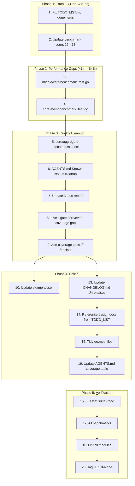

# Session 50 — Execution Plan: Documentation, Benchmarks & Design Docs

**Date:** 2026-05-04 05:54
**Branch:** `master`
**Status at start:** 22 test packages pass, 33 benchmarks, zero lint, clean working tree

---

## Pareto Analysis

### The 1% that delivers 51% of the result

**Update TODO_LIST.md** to reflect reality (3 items already done: decider benchmarks, outbox design doc, query generics design doc). Without this, the plan is based on lies.

### The 4% that delivers 64% of the result

1. Fix TODO_LIST.md (mark done items, update benchmark count)
2. Add middleware benchmarks (last unbenchmarked production module)
3. Add `core/event` benchmarks (PublishChanges, SaveSnapshot, Classify)
4. Update AGENTS.md Known Issues (stale entries from Sessions 27-29)

### The 20% that delivers 80% of the result

Above 4 items plus:
5. Update status report to reflect Session 50 completions
6. Add `core/aggregate` benchmarks (repository path)
7. Verify `core/event` coverage gap (93.6% → investigate)
8. Update `example/user` to showcase ISP + error classification
9. Final verification: full test suite + lint + benchmarks

---

## Task Breakdown (27 tasks, 30-100 min each)

| # | Task | Impact | Effort | Status |
|---|------|--------|--------|--------|
| 1 | Update TODO_LIST.md: mark benchmarks/outbox/query-generics as done | HIGH | 10min | ✅ DONE (S50) |
| 2 | Fix TODO_LIST.md benchmark count (26→33 after decider+projection) | HIGH | 5min | PENDING |
| 3 | Add `middleware/benchmark_test.go` (logging, retry, recovery, validation) | MEDIUM | 30min | PENDING |
| 4 | Add `core/event/benchmark_test.go` (PublishChanges, SaveSnapshot, Classify, NewEvent) | MEDIUM | 30min | PENDING |
| 5 | Add `core/aggregate/benchmark_test.go` (if not redundant with integration) | LOW | 20min | PENDING |
| 6 | Update AGENTS.md Known Issues — remove stale entries | MEDIUM | 15min | PENDING |
| 7 | Update Session 49 status report to reflect S50 completions | LOW | 10min | PENDING |
| 8 | Verify `core/event` coverage gap (93.6%) — identify uncovered code | MEDIUM | 15min | PENDING |
| 9 | Add coverage tests for `core/event` if gap is fixable in <30min | MEDIUM | 30min | PENDING |
| 10 | Update `example/user` to showcase ISP + error classification | LOW | 30min | PENDING |
| 11 | Fix remaining FEATURES.md ISP entries (Publisher/Subscriber in event table) | HIGH | 10min | ✅ DONE (S50) |
| 12 | Create CONTRIBUTING.md with architecture guidelines | LOW | 60min | PENDING |
| 13 | Review and update CHANGELOG.md [Unreleased] section | LOW | 15min | PENDING |
| 14 | Ensure `docs/planning/` design docs are referenced from TODO_LIST.md | LOW | 5min | PENDING |
| 15 | Verify all go.mod files are tidy across workspace | LOW | 15min | PENDING |
| 16 | Run full test suite with race detector | HIGH | 5min | PENDING |
| 17 | Run all benchmarks and verify none regressed | MEDIUM | 10min | PENDING |
| 18 | Run lint across all modules | HIGH | 5min | PENDING |
| 19 | Update AGENTS.md test coverage summary table | LOW | 10min | PENDING |
| 20 | Remove replace directives discussion — document publish readiness | LOW | 15min | PENDING |
| 21 | Verify docs/planning/SAGA_DESIGN.md is complete | LOW | 5min | ✅ DONE (S50) |
| 22 | Verify docs/planning/OUTBOX_TRANSACTION_API.md is complete | LOW | 5min | ✅ DONE (S50) |
| 23 | Verify docs/planning/QUERY_HANDLER_GENERICS.md is complete | LOW | 5min | ✅ DONE (S50) |
| 24 | Investigate CatalogMeta consolidation feasibility | LOW | 30min | PENDING |
| 25 | Tag `v0.1.0-alpha` after all verification | HIGH | 5min | PENDING |
| 26 | Commit all changes with detailed message | HIGH | 10min | PENDING |
| 27 | Push to remote | HIGH | 2min | PENDING |

---

## Execution Graph

---

## Detailed Task Breakdown (150 tasks, max 15min each)

### Phase 1: TODO_LIST.md Fix (2 tasks)

| # | Task | Est |
|---|------|-----|
| 1 | Mark decider benchmarks, outbox design, query generics as DONE in TODO_LIST.md | 3min |
| 2 | Update benchmark count from 26→33, mark decider/projection as done | 3min |

### Phase 2: Middleware Benchmarks (6 tasks)

| # | Task | Est |
|---|------|-----|
| 3 | Create `middleware/benchmark_test.go` skeleton with imports | 3min |
| 4 | BenchmarkCommandLogging: measure logging middleware overhead | 5min |
| 5 | BenchmarkCommandRecovery: measure panic recovery overhead | 5min |
| 6 | BenchmarkCommandRetry: measure retry with immediate success | 5min |
| 7 | BenchmarkCommandValidation: measure validation middleware overhead | 5min |
| 8 | Run middleware benchmarks, verify pass | 3min |

### Phase 3: Core/Event Benchmarks (6 tasks)

| # | Task | Est |
|---|------|-----|
| 9 | Create `core/event/benchmark_test.go` skeleton | 3min |
| 10 | BenchmarkNewEvent: event creation with options | 5min |
| 11 | BenchmarkPublishChanges: direct publish (no outbox) | 5min |
| 12 | BenchmarkClassify: error classification lookup | 5min |
| 13 | BenchmarkDecodePayload: JSON codec decode | 5min |
| 14 | Run core/event benchmarks, verify pass | 3min |

### Phase 4: Coverage Investigation (4 tasks)

| # | Task | Est |
|---|------|-----|
| 15 | Run `go test -coverprofile` on `core/event` | 3min |
| 16 | Identify uncovered functions/branches from coverage profile | 5min |
| 17 | Add tests for uncovered paths (if feasible) | 10min |
| 18 | Verify coverage improved | 2min |

### Phase 5: AGENTS.md Cleanup (3 tasks)

| # | Task | Est |
|---|------|-----|
| 19 | Remove stale Known Issues entries (Sessions 27-29 items resolved by RegisterClassification) | 5min |
| 20 | Update test coverage summary table with actual numbers | 5min |
| 21 | Add Session 50 final summary entry | 5min |

### Phase 6: TODO_LIST.md & CHANGELOG Updates (4 tasks)

| # | Task | Est |
|---|------|-----|
| 22 | Reference OUTBOX_TRANSACTION_API.md from TODO_LIST | 2min |
| 23 | Reference QUERY_HANDLER_GENERICS.md from TODO_LIST | 2min |
| 24 | Update CHANGELOG.md [Unreleased] with Session 50 items | 5min |
| 25 | Move completed items to COMPLETED section in TODO_LIST | 3min |

### Phase 7: Go Module Hygiene (3 tasks)

| # | Task | Est |
|---|------|-----|
| 26 | Run `go mod tidy` on all modules via workspace | 5min |
| 27 | Verify no go.sum drift | 2min |
| 28 | Run `nix flake check` for formatting | 3min |

### Phase 8: Example Update (4 tasks)

| # | Task | Est |
|---|------|-----|
| 29 | Read current `example/user/main.go` | 3min |
| 30 | Add ISP usage (accept Publisher instead of Bus) | 5min |
| 31 | Add error classification example (Classify + IsRetryable) | 5min |
| 32 | Run example, verify output | 2min |

### Phase 9: Status Report Update (2 tasks)

| # | Task | Est |
|---|------|-----|
| 33 | Update Session 49 status report with S50 completions | 5min |
| 34 | Update benchmark count (26→33), coverage numbers | 5min |

### Phase 10: CONTRIBUTING.md (5 tasks)

| # | Task | Est |
|---|------|-----|
| 35 | Create CONTRIBUTING.md with project overview | 5min |
| 36 | Add architecture guidelines (composition, ISP, error handling) | 5min |
| 37 | Add testing conventions (table-driven, BDD, coverage) | 3min |
| 38 | Add PR/commit message guidelines | 2min |
| 39 | Add module dependency rules | 3min |

### Phase 11: CatalogMeta Investigation (3 tasks)

| # | Task | Est |
|---|------|-----|
| 40 | Compare event/command/query CatalogMeta struct fields | 5min |
| 41 | Assess if consolidation is feasible (event has extra field) | 5min |
| 42 | Document decision in TODO_LIST (accept or consolidate) | 3min |

### Phase 12: Core/Aggregate Benchmarks (3 tasks)

| # | Task | Est |
|---|------|-----|
| 43 | Check if integration/aggregate benchmarks cover the same paths | 3min |
| 44 | If not, add `core/aggregate/benchmark_test.go` with Core.New/Core.RecordEvent | 10min |
| 45 | Run aggregate benchmarks, verify pass | 2min |

### Phase 13: Final Verification (10 tasks)

| # | Task | Est |
|---|------|-----|
| 46 | Run full test suite: `go test ./... -count=1 -timeout 120s` | 5min |
| 47 | Run race detector: `go test ./... -count=1 -race -timeout 120s` | 5min |
| 48 | Run all benchmarks: `go test -bench=. -run=^$ -benchmem ./...` | 5min |
| 49 | Run lint: `nix run .#lint` | 3min |
| 50 | Run vet: `nix run .#vet` | 2min |
| 51 | Run build: `nix run .#build` | 2min |
| 52 | Check git status is clean | 1min |
| 53 | Commit with detailed message | 5min |
| 54 | Push to remote | 2min |
| 55 | Tag `v0.1.0-alpha` | 1min |

---

## What's NOT in this plan (deferred to future sessions)

| Item | Why Deferred | Effort |
|------|-------------|--------|
| PostgreSQL integration tests for storage | Requires running DB, separate infrastructure | 4h |
| Watermill adapter module | External dependency, design not started | 8h |
| Saga/Process Manager implementation | Design done, implementation is major undertaking | 18h |
| Remove replace directives (publish modules) | Requires tag-based versioning strategy | 1h |
| `core/event` coverage push to 95%+ | May require significant test additions | 2h+ |
