# Architectural Type Safety & Quality Sweep

**Date:** 2026-05-16 23:42
**Status:** PLANNED
**Scope:** Full codebase — type safety, DDD, split-brain elimination, error taxonomy completion, naming

---

## Executive Summary

Deep architectural audit identified **6 critical type-safety gaps**, **8 should-fix improvements**, and **5 cleanup targets** across 10 modules. The 1% that delivers 51% of value: **`NewEvent` signature fix + `SchemaVersion` type + outbox status enum + middleware error classification** — these four changes eliminate the most prevalent type-safety violations and cascade improvements across 15+ files.

---

## Pareto Analysis

### The 1% → 51% of Value

| #   | Task                                               | Impact                                                | Effort | Why 51%                                              |
| --- | -------------------------------------------------- | ----------------------------------------------------- | ------ | ---------------------------------------------------- |
| P1  | `NewEvent` accepts `event.Version` not `int`       | Fixes root cause of bare-int leakage across 10+ files | 30min  | Type safety propagates through entire event pipeline |
| P2  | `SchemaVersion` strong type (not bare `int`)       | Makes schema version distinct from event version      | 20min  | Eliminates class of bugs mixing version types        |
| P3  | `OutboxStatus` enum (not magic `'pending'` string) | Eliminates 7 magic strings in storage                 | 15min  | DDD value object, prevents typos                     |
| P4  | Middleware error classification (4 sentinels)      | Error taxonomy completeness                           | 15min  | `IsRetryable` works correctly for middleware errors  |

### The 4% → 64% of Value

| #   | Task                                                       | Impact                                | Effort |
| --- | ---------------------------------------------------------- | ------------------------------------- | ------ |
| P5  | `Pagination` fields → `uint`                               | Impossible to represent negative page | 25min  |
| P6  | `SyncMessage.Type` → typed enum + `NodeID` branded type    | Sync module type safety               | 30min  |
| P7  | Storage table name constants (30+ magic strings)           | Eliminates all table name typos       | 20min  |
| P8  | `OutboxPublisher` split-brain fix (`started` state)        | Prevents use-after-close deadlock     | 25min  |
| P9  | Register 6 remaining unclassified sentinels                | Complete error taxonomy               | 15min  |
| P10 | `RetryConfig` validation (MaxAttempts, delays, multiplier) | Prevents silent misconfiguration      | 20min  |

### The 20% → 80% of Value

| #   | Task                                                 | Impact                            | Effort |
| --- | ---------------------------------------------------- | --------------------------------- | ------ |
| P11 | Split `pebble_event_store.go` (448→<250 lines)       | File size limit compliance        | 30min  |
| P12 | Split `aggregate/repository.go` (279→<250 lines)     | File size limit compliance        | 20min  |
| P13 | Split `decider/decider.go` (265→<250 lines)          | File size limit compliance        | 15min  |
| P14 | Extract SQL dialect abstraction (12→7 files)         | ~250 lines saved                  | 90min  |
| P15 | Unify `CatalogMeta` (3 identical structs → 1 shared) | ~30 lines saved                   | 30min  |
| P16 | Delete `cattest` dead helpers (457 lines)            | Zero-coverage dead weight removal | 20min  |
| P17 | `PaginatedResult` fields → `uint`                    | Consistent with Pagination fix    | 15min  |
| P18 | BDD tests for pagination type safety                 | Verify new constraints            | 25min  |
| P19 | BDD tests for outbox status enum                     | Verify status transitions         | 20min  |
| P20 | BDD tests for version type safety                    | Verify version flow               | 20min  |

---

## Medium Tasks (30–100min each)

| ID      | Task                                                   | Effort | Priority | Phase | Small Tasks |
| ------- | ------------------------------------------------------ | ------ | -------- | ----- | ----------- |
| **M1**  | Version Type Safety: `NewEvent` + `SchemaVersion`      | 50min  | CRITICAL | 1     | S1–S4       |
| **M2**  | Outbox Status Enum + Table Name Constants              | 35min  | CRITICAL | 1     | S5–S8       |
| **M3**  | Middleware Error Classification                        | 30min  | CRITICAL | 1     | S9–S11      |
| **M4**  | Pagination Type Safety (`uint`)                        | 40min  | HIGH     | 2     | S12–S16     |
| **M5**  | Sync Module Type Safety (`NodeID`, `SyncMessage.Type`) | 45min  | HIGH     | 2     | S17–S21     |
| **M6**  | OutboxPublisher Split-Brain Fix                        | 25min  | HIGH     | 2     | S22–S24     |
| **M7**  | Remaining Error Classification (6 sentinels)           | 25min  | HIGH     | 2     | S25–S27     |
| **M8**  | RetryConfig Validation                                 | 20min  | HIGH     | 2     | S28–S30     |
| **M9**  | File Size Splits (Pebble, Aggregate, Decider)          | 65min  | MEDIUM   | 3     | S31–S38     |
| **M10** | CatalogMeta Unification                                | 30min  | MEDIUM   | 3     | S39–S42     |
| **M11** | BDD Tests for Type Safety                              | 65min  | MEDIUM   | 3     | S43–S50     |
| **M12** | Cleanup: cattest removal + AGENTS.md update            | 30min  | LOW      | 4     | S51–S54     |

**Total:** 12 medium tasks, ~460min (~7.7h)

---

## Small Tasks (≤15min each)

### Phase 1: Critical Type Safety (1% → 51%)

| ID  | Task                                                                                                                | Est   | Depends |
| --- | ------------------------------------------------------------------------------------------------------------------- | ----- | ------- |
| S1  | Add `SchemaVersion` type to `core/event/types.go` with `ParseSchemaVersion`, `Int()`, `String()`                    | 10min | —       |
| S2  | Change `NewEvent` signature: `version int` → `version Version`, `schemaVersion int` → `SchemaVersion`               | 10min | S1      |
| S3  | Update all `NewEvent` callers in `storage/`, `aggregate/`, `decider/`, `example/` to pass `Version`                 | 15min | S2      |
| S4  | Update `Event.SchemaVersion()` interface return to `SchemaVersion`; update `Core` struct                            | 10min | S1      |
| S5  | Add `OutboxStatus` enum type in `storage/` with `OutboxStatusPending` constant                                      | 5min  | —       |
| S6  | Replace all 7 `'pending'` magic strings in `storage/outbox.go` and `sqlite_outbox.go` with constant                 | 10min | S5      |
| S7  | Extract table name constants in `storage/` (`tableNameEvents`, `tableNameOutbox`, etc.)                             | 10min | —       |
| S8  | Replace all 30+ inline table name strings with constants across 12 storage files                                    | 10min | S7      |
| S9  | Add `init()` to `middleware/errors.go` registering 4 sentinels via `RegisterClassification`                         | 10min | —       |
| S10 | Add classification tests in `integration/event/classify_test.go` for middleware sentinels                           | 10min | S9      |
| S11 | Add test: `ErrValidationFailed → Rejection`, `ErrPanicRecovered → Corruption`, `ErrRetryExhausted → Infrastructure` | 5min  | S10     |

### Phase 2: High-Priority Improvements (4% → 64%)

| ID  | Task                                                                                                                     | Est   | Depends  |
| --- | ------------------------------------------------------------------------------------------------------------------------ | ----- | -------- |
| S12 | Change `Pagination.Page` and `PageSize` from `int` to `uint`                                                             | 10min | —        |
| S13 | Change `NewPagination` params to `uint`; update validation logic                                                         | 5min  | S12      |
| S14 | Change `PaginatedResult` fields (`TotalCount`, `Page`, `PageSize`, `TotalPages`) to `uint`                               | 10min | S12      |
| S15 | Update `NewPaginatedResult` and all callers for `uint` fields                                                            | 10min | S14      |
| S16 | Update `Offset()` return type and all callers                                                                            | 5min  | S12      |
| S17 | Add `NodeID` branded type in `sync/` package                                                                             | 10min | —        |
| S18 | Add `SyncMessageType` enum with constants (`SyncRequest`, `SyncResponse`, etc.)                                          | 10min | —        |
| S19 | Replace `SyncMessage.Type string` with `SyncMessageType`                                                                 | 5min  | S18      |
| S20 | Replace `SyncContextMixin.NodeID string` and `Operation.NodeID string` with branded `NodeID`                             | 10min | S17      |
| S21 | Update `NewSyncContextMixin` and `NewOperation` for branded types                                                        | 5min  | S20      |
| S22 | Add `state` enum to `OutboxPublisher` (`stopped`, `running`) replacing `cancel != nil` check                             | 10min | —        |
| S23 | Fix `Close()`: set `cancel = nil` and recreate `done` channel after close                                                | 10min | S22      |
| S24 | Add tests: `Start→Close→Start` works (no deadlock), `Close→Close` returns nil                                            | 10min | S23      |
| S25 | Register `dispatcher` sentinels: `ErrHandlerNotFound → Rejection`, `ErrDispatcherClosed → Infrastructure`                | 5min  | —        |
| S26 | Register `memory.ErrHandlerNil → Rejection`, `catalog.ErrDomainNotFound → Rejection`, `catalog.ErrNilSchema → Rejection` | 5min  | —        |
| S27 | Add classification tests for all newly registered sentinels                                                              | 10min | S25, S26 |

### Phase 2b: Config Validation

| ID  | Task                                                                                              | Est   | Depends |
| --- | ------------------------------------------------------------------------------------------------- | ----- | ------- |
| S28 | Add `RetryConfig.Validate()` that checks `MaxAttempts >= 1`, `InitialDelay > 0`, `Multiplier > 1` | 10min | —       |
| S29 | Call `Validate()` in `CommandRetry` and `EventRetry` constructors                                 | 5min  | S28     |
| S30 | Add tests for invalid `RetryConfig` (0 attempts, negative delay, 0 multiplier)                    | 10min | S28     |

### Phase 3: Medium-Priority Cleanup (20% → 80%)

| ID  | Task                                                                                                | Est   | Depends       |
| --- | --------------------------------------------------------------------------------------------------- | ----- | ------------- |
| S31 | Split `pebble_event_store.go` (448 lines): extract `pebble_queries.go` (~100 lines of key building) | 20min | —             |
| S32 | Split `pebble_event_store.go`: extract `pebble_serialization.go` (~100 lines of marshal/unmarshal)  | 15min | S31           |
| S33 | Verify pebble splits: all files <250 lines, tests pass                                              | 10min | S32           |
| S34 | Split `aggregate/repository.go` (279 lines): extract `aggregate/snapshot_helpers.go`                | 15min | —             |
| S35 | Verify aggregate split: all files <250 lines, tests pass                                            | 5min  | S34           |
| S36 | Split `decider/decider.go` (265 lines): extract `decider/load.go`                                   | 15min | —             |
| S37 | Verify decider split: all files <250 lines, tests pass                                              | 5min  | S36           |
| S38 | Run full test suite after all splits                                                                | 5min  | S33, S35, S37 |
| S39 | Create shared `core/catalogmeta.Meta` struct with Name, Version, Summary                            | 10min | —             |
| S40 | Alias `command.CatalogMeta` and `query.CatalogMeta` to `catalogmeta.Meta`                           | 10min | S39           |
| S41 | Add `AggregateType` to `event.CatalogMeta` embedding shared base                                    | 10min | S39           |
| S42 | Update all references; verify tests pass                                                            | 10min | S40, S41      |
| S43 | BDD tests: `NewEvent` rejects bare int, accepts `Version`                                           | 10min | S3            |
| S44 | BDD tests: `SchemaVersion` type distinguishes from `Version`                                        | 10min | S4            |
| S45 | BDD tests: `OutboxStatus` enum prevents invalid values                                              | 10min | S6            |
| S46 | BDD tests: `Pagination` with `uint` — negative values impossible                                    | 10min | S16           |
| S47 | BDD tests: `NodeID` branded type — type-safe across sync                                            | 10min | S21           |
| S48 | BDD tests: `OutboxPublisher` state machine (stopped→running→stopped→running)                        | 10min | S24           |
| S49 | BDD tests: `RetryConfig.Validate()` rejects invalid configs                                         | 10min | S30           |
| S50 | Run full test suite + lint after all BDD tests                                                      | 10min | S43–S49       |

### Phase 4: Cleanup & Documentation

| ID  | Task                                                                                            | Est   | Depends |
| --- | ----------------------------------------------------------------------------------------------- | ----- | ------- |
| S51 | Evaluate `cattest` usage — confirm it's only used by internal tests                             | 5min  | —       |
| S52 | If `cattest` only used internally: simplify or consolidate into test files                      | 10min | S51     |
| S53 | Update `AGENTS.md` with all type changes (SchemaVersion, OutboxStatus, NodeID, uint pagination) | 10min | —       |
| S54 | Update `FEATURES.md` if any feature status changed                                              | 5min  | —       |

**Total:** 54 small tasks

---

## Mermaid Execution Graph

```mermaid
graph TD
    subgraph "Phase 1: 1% → 51%"
        S1[S1: SchemaVersion type]
        S2[S2: NewEvent signature]
        S3[S3: Update NewEvent callers]
        S4[S4: Event interface]
        S5[S5: OutboxStatus enum]
        S6[S6: Replace pending magic strings]
        S7[S7: Table name constants]
        S8[S8: Replace table name strings]
        S9[S9: Middleware classification init]
        S10[S10: Classification tests]
        S11[S11: Assert middleware families]
    end

    subgraph "Phase 2: 4% → 64%"
        S12[S12: Pagination uint]
        S13[S13: NewPagination uint]
        S14[S14: PaginatedResult uint]
        S15[S15: Update callers]
        S16[S16: Offset return]
        S17[S17: NodeID branded]
        S18[S18: SyncMessageType enum]
        S19[S19: SyncMessage.Type]
        S20[S20: Replace NodeID strings]
        S21[S21: Update constructors]
        S22[S22: OutboxPublisher state]
        S23[S23: Fix Close reset]
        S24[S24: State machine tests]
        S25[S25: Dispatcher classification]
        S26[S26: Memory/Catalog classification]
        S27[S27: Classification tests]
        S28[S28: RetryConfig.Validate]
        S29[S29: Call Validate]
        S30[S30: Invalid config tests]
    end

    subgraph "Phase 3: 20% → 80%"
        S31[S31: Split pebble queries]
        S32[S32: Split pebble serialization]
        S33[S33: Verify pebble]
        S34[S34: Split aggregate repo]
        S35[S35: Verify aggregate]
        S36[S36: Split decider]
        S37[S37: Verify decider]
        S38[S38: Full test suite]
        S39[S39: Shared CatalogMeta]
        S40[S40: Alias command/query]
        S41[S41: Event CatalogMeta]
        S42[S42: Update references]
        S43[S43: BDD NewEvent]
        S44[S44: BDD SchemaVersion]
        S45[S45: BDD OutboxStatus]
        S46[S46: BDD Pagination]
        S47[S47: BDD NodeID]
        S48[S48: BDD OutboxPublisher]
        S49[S49: BDD RetryConfig]
        S50[S50: Final test + lint]
    end

    subgraph "Phase 4: Cleanup"
        S51[S51: Evaluate cattest]
        S52[S52: Simplify cattest]
        S53[S53: Update AGENTS.md]
        S54[S54: Update FEATURES.md]
    end

    S1 --> S2 --> S3
    S1 --> S4
    S5 --> S6
    S7 --> S8
    S9 --> S10 --> S11

    S12 --> S13
    S12 --> S14 --> S15
    S12 --> S16
    S17 --> S20 --> S21
    S18 --> S19
    S22 --> S23 --> S24
    S25 --> S27
    S26 --> S27
    S28 --> S29 --> S30

    S31 --> S32 --> S33
    S34 --> S35
    S36 --> S37
    S33 --> S38
    S35 --> S38
    S37 --> S38
    S39 --> S40
    S39 --> S41
    S40 --> S42
    S41 --> S42
    S3 --> S43
    S4 --> S44
    S6 --> S45
    S16 --> S46
    S21 --> S47
    S24 --> S48
    S30 --> S49
    S43 --> S50
    S50 --> S51 --> S52 --> S53 --> S54
```

---

## Risk Assessment

| Risk                                                          | Mitigation                                             |
| ------------------------------------------------------------- | ------------------------------------------------------ |
| `NewEvent` signature change breaks all callers                | Systematic search + update, tests catch missed callers |
| `uint` pagination breaks JSON unmarshaling from external APIs | JSON `uint` marshals fine; test round-trip             |
| `CatalogMeta` unification may break existing imports          | Type aliases preserve backward compatibility           |
| `OutboxPublisher` state fix changes lifecycle semantics       | Tests cover Start→Close→Start sequence                 |
| Pebble split may break internal references                    | Compile + test after each split                        |

---

## Success Criteria

- [ ] Zero bare `int` where `Version` or `SchemaVersion` is semantically correct
- [ ] Zero magic strings in storage (table names, outbox status)
- [ ] All 10+ middleware/dispatcher/catalog sentinels classified
- [ ] All production files < 250 lines (new limit per AGENTS.md)
- [ ] 22/22 test packages pass
- [ ] 0 lint issues
- [ ] Pagination fields are `uint`
- [ ] Sync module uses branded `NodeID`
- [ ] `OutboxPublisher` has explicit state, no split-brain
