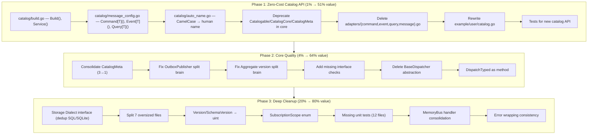

# Comprehensive Execution Plan: Zero-Cost Catalog API & Core Quality Sweep

**Date:** 2026-05-19  
**Scope:** go-cqrs-lite library/SDK — catalog module redesign + core quality improvements  
**Goal:** Make catalog documentation generation "free" for consumers; eliminate split brains, duplication, and type safety gaps.

---

## Pareto Analysis

| Tier | Effort | Cumulative Value | What |
|------|--------|------------------|------|
| **1%** | ~3h | **51%** | Zero-cost catalog API — consumers describe types once, catalog emerges |
| **4%** | ~3h | **64%** | CatalogMeta consolidation + split brain fixes + interface checks |
| **20%** | ~12h | **80%** | Storage deduplication + file splits + test coverage + type safety |

---

## The 1%: Zero-Cost Catalog API

**Problem:** Consumers write a full CQRS system, then write a *second fake CQRS system* (with dummy aggregate IDs, fake events, `CatalogCore` wrappers) just to feed the catalog builder. The catalog feels like a parallel shadow system.

**Solution:** The consumer's Go struct definition IS the catalog entry. One generic declaration per type. Schemas auto-derived from `json`/`doc`/`format` tags. Names auto-derived from CamelCase type names. Directions auto-derived from message kind.

### New Consumer API

```go
// BEFORE: 30+ lines of fake-instance construction
cat := catalogadapters.NewBuilder("User Service", "1.0.0")
cat.AddService("user-svc", ...)
cat.AddEvent("user-svc", mustNewCatalogEvent(string(eventUserCreated), "User Created", ...))
cat.AddEvent("user-svc", mustNewCatalogEvent(string(eventUserNameChanged), "User Name Changed", ...))

// AFTER: 4 lines, zero fake instances, zero CatalogMeta
cat := catalog.Build("User Service", "1.0.0",
    catalog.Service("user-svc", "User Service", "Manages users",
        catalog.Command[CreateUserCmd](string(cmdCreateUser)),
        catalog.Command[ChangeUserNameCmd](string(cmdChangeUserName)),
        catalog.Event[UserCreatedEvent](string(eventUserCreated), catalog.Sends),
        catalog.Event[UserNameChangedEvent](string(eventUserNameChanged), catalog.Sends),
        catalog.Query[GetUserQuery](string(qryGetUser)),
    ),
)
```

### Auto-Derived Values

| Field | Source | Override |
|-------|--------|----------|
| Schema | `reflect.TypeOf(T{})` + struct tags | — |
| Name | `"CreateUserCmd"` → `"Create User"` | `catalog.Name("...")` |
| Summary | `""` (empty) | `catalog.Summary("...")` |
| Version | `"1.0.0"` | `catalog.Version("...")` |
| Direction | Commands/Queries → `Receives`, Events → explicit | — |

### What Gets Removed

- `core/{command,event,query}.Catalogable` interface → deprecated
- `core/{command,event,query}.CatalogCore` struct → deprecated
- `core/{command,event,query}.CatalogMeta` struct → deprecated (consolidated into shared base)
- `catalog/adapters/command.go`, `event.go`, `query.go`, `message.go` → deleted
- `catalog/adapters/builder.go` → simplified to wrap new API + export methods

### What Stays

- `catalog/types.go` — `Message`, `Service`, `Domain`, `Schema`, `Catalog` (model is correct)
- `catalog/registry.go` — `Registry` (used internally by `Build()`)
- `catalog/schema.go` + `schema_reflect.go` — reflection-based schema generation
- `catalog/{asyncapi,d2,eventcatalog}/` — format exporters (unchanged)

---

## The 4%: Core Quality Fixes

### 2.1 CatalogMeta Consolidation
**File:** `core/{command,event,query}/catalog.go`  
**Issue:** 3× identical structs (`Name, Version, Summary`). Event adds `AggregateType`.  
**Fix:** Extract `catalog.CatalogMetaBase{Name, Version, Summary}`. Embed in event's `CatalogMeta` with `AggregateType` field. Use type aliases for backward compat.

### 2.2 OutboxPublisher Lifecycle Split Brain
**File:** `core/event/outbox_publisher.go`  
**Issue:** `closed bool` + `cancel context.CancelFunc` represent same state. Can drift.  
**Fix:** Remove `closed`. Use `cancel != nil` as single source of truth.

### 2.3 Aggregate Version Split Brain
**File:** `core/aggregate/aggregate.go`  
**Issue:** `version` field + `changes` slice can drift if `SetVersion` called without clearing `changes`.  
**Fix:** Make `SetVersion` private or validate consistency.

### 2.4 Missing Compile-Time Interface Checks
**Files:** `projection/runner.go`, `projection/handler.go`, `catalog/registry.go`  
**Fix:** Add `var _ io.Closer = (*Runner)(nil)`, etc.

### 2.5 BaseDispatcher Useless Abstraction
**File:** `core/pkg/dispatcher/base.go`  
**Issue:** Every method is a 1-line delegate. Adds no value, forces double embedding.  
**Fix:** Inline into `command.Dispatcher` / `query.Dispatcher` or delete.

### 2.6 DispatchTyped as Method
**File:** `core/query/dispatcher.go`  
**Issue:** `DispatchTyped` is a free function, not discoverable.  
**Fix:** `func (d *Dispatcher) DispatchTyped[T any](...)`.

---

## The 20%: Deep Cleanup

### 3.1 Storage SQL/SQLite Deduplication
**Files:** 10 files with ~90% duplicated logic  
**Fix:** Introduce `storage.Dialect` interface (`Placeholder(n int) string`, `FormatTime(t time.Time) any`). Single implementations parameterized by dialect.

### 3.2 File Size Compliance
**Files:** 7 files over 250 lines  
**Fix:** Split by concern:
- `example/todo/cmd/api/main.go` (331) → extract handlers, middleware setup
- `middleware/retry_test.go` (331) → split by middleware type
- `core/event/runner_test.go` (440) → split by test concern
- `catalog/schema_test.go` (605) → split by schema type
- `core/aggregate/repository_test.go` (876) → split by operation
- `projection/runner_test.go` (1058) → split into sub_test files
- `core/decider/decider_test.go` (1147) → split by pattern

### 3.3 Version/SchemaVersion as uint
**Files:** `core/event/types.go`, `core/event/snapshot_strategy.go`, `storage/*`  
**Fix:** Change backing type from `int` to `uint`. Update all call sites. Breaking but correct.

### 3.4 Event Subscription Wildcard Enum
**Files:** `core/event/runner.go`, `projection/runner.go`  
**Fix:** Replace `nil EventTypes = all` with explicit `SubscriptionScope` enum.

### 3.5 Missing Unit Tests
**Files:** 12+ public APIs without dedicated tests  
**Fix:** Add `*_test.go` for: `builder.go`, `options.go`, `enricher.go`, `snapshot_helper.go`, `publish_helper.go`, `registry_helpers.go`, `projection/options.go`.

### 3.6 MemoryBus Handler Storage Consolidation
**File:** `memory/bus.go`  
**Issue:** `handlers` + `allHandlers` must be kept in sync.  
**Fix:** Single `map[subscriptionKey][]Handler` where `subscriptionKey` is either a type or wildcard.

### 3.7 Error Wrapping Consistency
**Files:** `storage/*.go`  
**Fix:** Standardize error wrapping patterns. Remove remaining dynamic errors where sentinels exist.

---

## Mermaid Execution Graph



---

## Task Breakdown: 100–30 Minute Tasks (27 tasks)

| # | Task | Effort | Module | Value | Depends On |
|---|------|--------|--------|-------|------------|
| 1 | Create `catalog.CatalogMetaBase` + embed in 3 packages | 30min | core | High | — |
| 2 | Implement `catalog.Build()`, `catalog.Service()` | 30min | catalog | Critical | — |
| 3 | Implement `catalog.Command[T]()`, `catalog.Event[T]()`, `catalog.Query[T]()` | 30min | catalog | Critical | #2 |
| 4 | Implement auto-naming (CamelCase → human) | 30min | catalog | High | #2 |
| 5 | Add `MessageOption` funcs (Name, Summary, Version) | 15min | catalog | Medium | #3 |
| 6 | Deprecate `Catalogable`/`CatalogCore`/`CatalogMeta` in core | 30min | core | High | #1 |
| 7 | Delete `adapters/{command,event,query,message}.go` | 15min | catalog | Medium | #3 |
| 8 | Simplify `adapters/builder.go` to wrap new API | 30min | catalog | Medium | #2, #7 |
| 9 | Rewrite `example/user/catalog.go` with new API | 30min | example | Critical | #2, #3 |
| 10 | Add golden + unit tests for new catalog API | 60min | catalog | High | #2–#5 |
| 11 | Fix OutboxPublisher split brain (closed + cancel) | 30min | core/event | High | — |
| 12 | Fix Aggregate version consistency | 30min | core/aggregate | High | — |
| 13 | Add missing compile-time interface checks | 15min | multiple | Medium | — |
| 14 | Delete `BaseDispatcher`, inline into command/query | 30min | core/pkg/dispatcher | Medium | — |
| 15 | `DispatchTyped` as method on `*Dispatcher` | 30min | core/query | Medium | — |
| 16 | Design `storage.Dialect` interface | 30min | storage | High | — |
| 17 | Merge SQL/SQLite event stores via Dialect | 60min | storage | Critical | #16 |
| 18 | Merge SQL/SQLite snapshot stores via Dialect | 45min | storage | High | #16 |
| 19 | Merge SQL/SQLite checkpoint stores via Dialect | 30min | storage | Medium | #16 |
| 20 | Merge SQL/SQLite outbox stores via Dialect | 45min | storage | High | #16 |
| 21 | Merge SQL/SQLite transactional stores via Dialect | 30min | storage | Medium | #16 |
| 22 | Split 7 oversized files (test + production) | 90min | multiple | Medium | — |
| 23 | Version/SchemaVersion → uint | 60min | core + storage | Medium | — |
| 24 | `SubscriptionScope` enum for wildcard | 30min | core + projection | Low | — |
| 25 | Add missing unit tests (builder, options, enricher, helpers) | 90min | multiple | Medium | — |
| 26 | MemoryBus handler storage consolidation | 30min | memory | Low | — |
| 27 | Error wrapping consistency sweep | 30min | storage | Low | — |

---

## Task Breakdown: 15-Minute Micro-Tasks (85 tasks)

### Phase 1: Zero-Cost Catalog API (28 tasks)

| # | Task | Module |
|---|------|--------|
| 1.1 | Define `catalog.CatalogMetaBase` struct | catalog |
| 1.2 | Embed `CatalogMetaBase` in `core/command.CatalogMeta` | core |
| 1.3 | Embed `CatalogMetaBase` in `core/query.CatalogMeta` | core |
| 1.4 | Embed `CatalogMetaBase` + `AggregateType` in `core/event.CatalogMeta` | core |
| 1.5 | Update `CatalogCore` constructors for new structure | core |
| 1.6 | Update adapter tests for new `CatalogMeta` structure | catalog |
| 1.7 | Define `catalog.MessageConfig` internal interface | catalog |
| 1.8 | Define `catalog.ServiceConfig` internal interface | catalog |
| 1.9 | Implement `catalog.Build()` function | catalog |
| 1.10 | Implement `catalog.Service()` constructor | catalog |
| 1.11 | Implement `catalog.Command[T]()` generic constructor | catalog |
| 1.12 | Implement `catalog.Event[T]()` generic constructor | catalog |
| 1.13 | Implement `catalog.Query[T]()` generic constructor | catalog |
| 1.14 | Implement `catalog.Name()` option | catalog |
| 1.15 | Implement `catalog.Summary()` option | catalog |
| 1.16 | Implement `catalog.Version()` option | catalog |
| 1.17 | Implement `catalog.Direction()` option for events | catalog |
| 1.18 | Implement auto-name from CamelCase type name | catalog |
| 1.19 | Wire `catalog.Build()` → `catalog.Registry` internally | catalog |
| 1.20 | Add `// Deprecated:` to `core/command.Catalogable` | core |
| 1.21 | Add `// Deprecated:` to `core/event.Catalogable` | core |
| 1.22 | Add `// Deprecated:` to `core/query.Catalogable` | core |
| 1.23 | Delete `catalog/adapters/command.go` | catalog |
| 1.24 | Delete `catalog/adapters/event.go` | catalog |
| 1.25 | Delete `catalog/adapters/query.go` | catalog |
| 1.26 | Delete `catalog/adapters/message.go` | catalog |
| 1.27 | Simplify `catalog/adapters/builder.go` | catalog |
| 1.28 | Rewrite `example/user/catalog.go` | example |

### Phase 2: Core Quality (14 tasks)

| # | Task | Module |
|---|------|--------|
| 2.1 | Fix OutboxPublisher: remove `closed` bool | core/event |
| 2.2 | Update OutboxPublisher tests for lifecycle | core/event |
| 2.3 | Fix Aggregate: validate version + changes consistency | core/aggregate |
| 2.4 | Add `var _ io.Closer = (*projection.Runner)(nil)` | projection |
| 2.5 | Add `var _ = (*catalog.Registry)(nil)` checks | catalog |
| 2.6 | Delete `BaseDispatcher` file | core/pkg/dispatcher |
| 2.7 | Inline `BaseDispatcher` methods into `command.Dispatcher` | core/command |
| 2.8 | Inline `BaseDispatcher` methods into `query.Dispatcher` | core/query |
| 2.9 | Update command tests for inlined dispatcher | core/command |
| 2.10 | Update query tests for inlined dispatcher | core/query |
| 2.11 | Convert `DispatchTyped` to method | core/query |
| 2.12 | Update all `DispatchTyped` call sites | multiple |
| 2.13 | Update query tests for method dispatch | core/query |
| 2.14 | Integration test fixes for dispatcher changes | integration |

### Phase 3: Deep Cleanup (43 tasks)

| # | Task | Module |
|---|------|--------|
| 3.1 | Design `storage.Dialect` interface | storage |
| 3.2 | Extract PostgreSQL dialect | storage |
| 3.3 | Extract SQLite dialect | storage |
| 3.4 | Merge `SQLEventStore` + `SQLiteEventStore` into `EventStore` | storage |
| 3.5 | Merge `SQLSnapshotStore` + `SQLiteSnapshotStore` | storage |
| 3.6 | Merge `SQLCheckpointStore` + `SQLiteCheckpointStore` | storage |
| 3.7 | Merge `SQLOutbox` + `SQLiteOutbox` | storage |
| 3.8 | Merge `SQLTransactionalStore` + `SQLiteTransactionalStore` | storage |
| 3.9 | Update storage tests for merged stores | storage |
| 3.10 | Split `example/todo/cmd/api/main.go` | example |
| 3.11 | Split `middleware/retry_test.go` | middleware |
| 3.12 | Split `core/event/runner_test.go` | core/event |
| 3.13 | Split `catalog/schema_test.go` | catalog |
| 3.14 | Split `core/aggregate/repository_test.go` | core/aggregate |
| 3.15 | Split `projection/runner_test.go` | projection |
| 3.16 | Split `core/decider/decider_test.go` | core/decider |
| 3.17 | Change `event.Version` backing type to `uint` | core/event |
| 3.18 | Change `event.SchemaVersion` backing type to `uint` | core/event |
| 3.19 | Update `Version.Int()` to return `uint` | core/event |
| 3.20 | Update `SchemaVersion.Int()` to return `uint` | core/event |
| 3.21 | Update `EveryNEvents` to accept `uint` | core/event |
| 3.22 | Update storage event version fields to `uint` | storage |
| 3.23 | Update memory version fields to `uint` | memory |
| 3.24 | Update example version fields to `uint` | example |
| 3.25 | Update all tests for uint versions | multiple |
| 3.26 | Define `SubscriptionScope` enum | core/event |
| 3.27 | Update `SubscribesTo` to use enum | core/event |
| 3.28 | Update `projection.Runner` for enum | projection |
| 3.29 | Add `builder_test.go` | core/event |
| 3.30 | Add `options_test.go` | core/event |
| 3.31 | Add `enricher_test.go` | core/event |
| 3.32 | Add `snapshot_helper_test.go` | core/event |
| 3.33 | Add `publish_helper_test.go` | core/event |
| 3.34 | Add `registry_helpers_test.go` | catalog |
| 3.35 | Add `projection/options_test.go` | projection |
| 3.36 | Consolidate MemoryBus handlers map | memory |
| 3.37 | Update MemoryBus tests for consolidation | memory |
| 3.38 | Standardize storage error wrapping | storage |
| 3.39 | Fix remaining dynamic errors with sentinels | multiple |
| 3.40 | Add `catalog.Build()` golden tests | catalog |
| 3.41 | Add `catalog.Command[T]()` unit tests | catalog |
| 3.42 | Add `catalog.Event[T]()` unit tests | catalog |
| 3.43 | Add `catalog.Query[T]()` unit tests | catalog |

---

## Risks & Mitigations

| Risk | Mitigation |
|------|------------|
| Breaking changes to `Catalogable`/`CatalogCore` | Mark deprecated first, keep for 1+ release cycle |
| `uint` migration breaks consumers | Do in separate PR; document migration guide |
| Storage dialect merge introduces regressions | Comprehensive test coverage before/after; golden tests |
| File splits break git history | Use `git mv` where possible; accept history loss for test files |
| Auto-name algorithm surprises consumers | Document algorithm; provide `Name()` override |

---

## Success Criteria

- [ ] `example/user/catalog.go` reduced from 40 lines to <10 lines
- [ ] Zero `CatalogCore`/`Catalogable` usage in example app
- [ ] All golden tests pass
- [ ] All 20+ test packages pass
- [ ] Zero lint issues
- [ ] No files > 250 lines (production)
- [ ] CatalogMeta consolidated to single source of truth
- [ ] OutboxPublisher has single lifecycle representation
- [ ] Storage deduplicated: 10 files → 5 files
- [ ] New catalog API has 100% test coverage
