# Session 77 — Execution Plan: Zero Lint, Zero Broken Builds, Zero Tech Debt

**Date:** 2026-05-19 | **Session:** 77 | **Mode:** GET SHIT DONE

---

## Pareto Analysis

### 1% → 51% Impact (Fix Now, Fix Forever)

These 5 items are the absolute highest-impact. Fixing them eliminates build failures, lint violations, and the biggest architectural wart.

| # | Task | Impact | Effort |
|---|------|--------|--------|
| 1 | Fix catalog lint (depguard testify, golines id_parse.go) | Zero lint → green CI | 10min |
| 2 | Fix middleware staticcheck SA1019 (deprecated CatalogMeta) | Zero lint → green CI | 10min |
| 3 | Move test deps out of core/go.mod production requires | Breaks circular dep, enables isolated builds | 15min |
| 4 | Bump testhelpers to use `event.Version` + tag v1.2.0 | Fixes GOWORK=off builds | 15min |
| 5 | Split `example/todo/cmd/api/main.go` (330 lines → ≤250) | File size compliance | 10min |

### 4% → 64% Impact (Architecture Hygiene)

These 8 items clean up module boundaries, remove dead code, and improve API consistency.

| # | Task | Impact | Effort |
|---|------|--------|--------|
| 6 | Remove deprecated `CatalogMeta`/`CatalogCore` from core/event | Dead code removal, less confusion | 15min |
| 7 | Replace `fmt.Errorf("...")` with sentinel errors in catalog/id_parse.go | Error consistency | 10min |
| 8 | Remove `testify` from catalog, use stdlib `testing` | Dependency reduction | 15min |
| 9 | Clean `example/todo` build — add missing replace directives | Isolated build works | 10min |
| 10 | Remove `example/todo/cmd/api/main.go` — move logic to proper packages | File size + architecture | 20min |
| 11 | Add `nolint:err113` comments to catalog/id_parse.go if needed | Lint compliance | 5min |
| 12 | Remove `ginkgo`/`gomega` from `core/go.mod` direct requires | Clean dependency graph | 5min |
| 13 | Verify all modules build in isolation (GOWORK=off) | CI correctness | 10min |

### 20% → 80% Impact (Quality Improvements)

These 14 items improve test coverage, add missing tests, and tighten type safety.

| # | Task | Impact | Effort |
|---|------|--------|--------|
| 14 | Add test for `NewLWWResolver` nil panic | Safety | 10min |
| 15 | Add test for decider snapshot fold error early return | Safety | 10min |
| 16 | Add test for Pebble optimistic concurrency check | Safety | 10min |
| 17 | Add test for `OutboxPublisher.publishPending` warning log | Observability | 10min |
| 18 | Add `MemoryStore.LoadAll()` for `event.GlobalLoader` | Projection replay support | 20min |
| 19 | Unify `CatalogMeta` → remove from command/query/event | API cleanup | 15min |
| 20 | Add `sync` module test for `SyncMessage` JSON round-trip | Coverage | 10min |
| 21 | Add `sync` module test for `NewSyncContextMixin` | Coverage | 5min |
| 22 | Fix `sync/conflict_test.go` unnecessary type args (gopls) | Code quality | 5min |
| 23 | Remove stale `coverage.out` from root | Clean repo | 2min |
| 24 | Add `.gitignore` entry for `coverage.out` | Prevent recurrence | 2min |
| 25 | Verify all 23 packages pass with `-race` flag | Concurrency safety | 10min |
| 26 | Update AGENTS.md with Session 77 findings | Documentation | 10min |
| 27 | Write final status report | Documentation | 10min |

---

## Execution Graph

```mermaid
graph TD
    subgraph "Phase 1: 1% → 51% (Critical)"
        A1["#1 Fix catalog lint"] --> A5["#5 Split example/todo main.go"]
        A2["#2 Fix middleware staticcheck"]
        A3["#3 Move test deps out of core/go.mod"]
        A4["#4 Bump testhelpers + tag v1.2.0"]
    end

    subgraph "Phase 2: 4% → 64% (Architecture)"
        B1["#6 Remove deprecated CatalogMeta"] --> B6["#12 Remove ginkgo/gomega from core/go.mod direct requires"]
        B2["#7 Replace fmt.Errorf with sentinels in catalog"]
        B3["#8 Remove testify from catalog"]
        B4["#9 Clean example/todo build"]
        A5 --> B5["#10 Move example/todo logic to packages"]
        B7["#11 nolint err113 if needed"]
        B6 --> B8["#13 Verify all modules build in isolation"]
        B3 --> B8
        A3 --> B8
        A4 --> B8
    end

    subgraph "Phase 3: 20% → 80% (Quality)"
        C1["#14 Test NewLWWResolver nil panic"]
        C2["#15 Test decider snapshot fold error"]
        C3["#16 Test Pebble concurrency check"]
        C4["#17 Test OutboxPublisher warning"]
        C5["#18 Add MemoryStore.LoadAll"]
        B1 --> C6["#19 Unify CatalogMeta removal"]
        C7["#20 Test SyncMessage JSON round-trip"]
        C8["#21 Test NewSyncContextMixin"]
        C9["#22 Fix conflict_test.go type args"]
        C10["#23 Remove coverage.out"]
        C10 --> C11["#24 Add .gitignore entry"]
        B8 --> C12["#25 Verify -race flag"]
    end

    subgraph "Phase 4: Documentation"
        D1["#26 Update AGENTS.md"]
        D2["#27 Write status report"]
    end

    B8 --> D1
    C12 --> D2
```

---

## Task Breakdown (Max 15min Each — 75 Tasks)

| # | Micro-Task | Phase | Est |
|---|-----------|-------|-----|
| 1 | Rewrite `catalog/id_parse_test.go` to use `testing` instead of `testify` | 1 | 10min |
| 2 | Remove `testify` from `catalog/go.mod` | 1 | 2min |
| 3 | Fix golines in `catalog/id_parse.go` line 19 | 1 | 2min |
| 4 | Replace `fmt.Errorf` with sentinel errors in `catalog/id_parse.go` | 1 | 5min |
| 5 | Add `nolint:err113` to remaining `fmt.Errorf` in `catalog/id_parse.go` | 1 | 2min |
| 6 | Fix `middleware/slog_test.go` SA1019 — stop using deprecated `CatalogMeta` | 1 | 5min |
| 7 | Run lint — verify 0 issues across all modules | 1 | 3min |
| 8 | Move `memory` and `testhelpers` to test-only in `core/go.mod` | 1 | 5min |
| 9 | Run `go mod tidy` in core | 1 | 2min |
| 10 | Move `testhelpers` to test-only in `memory/go.mod` | 1 | 2min |
| 11 | Move `testhelpers` to test-only in `middleware/go.mod` | 1 | 2min |
| 12 | Move `memory`+`testhelpers` to test-only in `projection/go.mod` | 1 | 3min |
| 13 | Update `testhelpers/event_helpers.go` — cast `int` to `event.Version` | 1 | 5min |
| 14 | Run `go mod tidy` in testhelpers | 1 | 1min |
| 15 | Run all tests — verify 23/23 pass | 1 | 3min |
| 16 | Split `example/todo/cmd/api/main.go` into `handlers.go` + `routes.go` + `main.go` | 1 | 10min |
| 17 | Verify `example/todo` builds cleanly | 1 | 3min |
| 18 | Commit Phase 1 fixes | 1 | 5min |
| 19 | Remove deprecated `CatalogMeta` from `core/event/catalog.go` | 2 | 5min |
| 20 | Remove deprecated `CatalogMeta` from `core/command/catalog.go` | 2 | 3min |
| 21 | Remove deprecated `CatalogMeta` from `core/query/catalog.go` | 2 | 3min |
| 22 | Update all `CatalogMeta` references in test files | 2 | 10min |
| 23 | Remove `CatalogCore` and `MustNewCatalogCore` from `core/event/` | 2 | 5min |
| 24 | Remove `CatalogCore` and `MustNewCatalogCore` from `core/command/` | 2 | 3min |
| 25 | Remove `CatalogCore` and `MustNewCatalogCore` from `core/query/` | 2 | 3min |
| 26 | Update `middleware/slog.go` to not use `CatalogMeta` | 2 | 10min |
| 27 | Update `middleware/slog_test.go` | 2 | 5min |
| 28 | Run tests — verify pass | 2 | 3min |
| 29 | Add missing `replace` directives in `example/todo/go.mod` | 2 | 5min |
| 30 | Remove `ginkgo`/`gomega` from `core/go.mod` direct requires | 2 | 2min |
| 31 | Run `go mod tidy` in core | 2 | 1min |
| 32 | Run lint — verify 0 issues | 2 | 3min |
| 33 | Test `GOWORK=off go build` for each module | 2 | 5min |
| 34 | Test `GOWORK=off go test` for core, memory, catalog | 2 | 5min |
| 35 | Commit Phase 2 fixes | 2 | 5min |
| 36 | Write `TestNewLWWResolver_NilPanic` | 3 | 5min |
| 37 | Write `TestSaveSnapshot_FoldError` for decider | 3 | 10min |
| 38 | Write `TestPebbleSave_ConcurrencyCheck` | 3 | 10min |
| 39 | Write `TestPublishPending_LogsWarning` for outbox | 3 | 10min |
| 40 | Implement `MemoryStore.LoadAll()` method | 3 | 10min |
| 41 | Write tests for `MemoryStore.LoadAll()` | 3 | 10min |
| 42 | Remove `CatalogMeta` references from `example/user/` | 3 | 5min |
| 43 | Write `TestSyncMessage_RoundTrip` in sync | 3 | 5min |
| 44 | Write `TestNewSyncContextMixin` in sync | 3 | 3min |
| 45 | Fix `sync/conflict_test.go` unnecessary type args | 3 | 3min |
| 46 | Remove `coverage.out` from root if exists | 3 | 1min |
| 47 | Add `coverage.out` to `.gitignore` | 3 | 1min |
| 48 | Run full test suite with `-race` | 3 | 5min |
| 49 | Run full lint | 3 | 3min |
| 50 | Commit Phase 3 fixes | 3 | 5min |
| 51 | Update AGENTS.md with testhelpers v1.2.0 info | 4 | 5min |
| 52 | Update AGENTS.md with CatalogMeta removal | 4 | 3min |
| 53 | Update AGENTS.md with MemoryStore.LoadAll | 4 | 3min |
| 54 | Write `docs/status/2026-05-19_SESSION_77_COMPREHENSIVE_STATUS.md` | 4 | 10min |
| 55 | Final commit + push | 4 | 5min |
| 56-75 | Buffer for unexpected issues and iteration | - | ~30min |

**Total estimated: ~6 hours**
