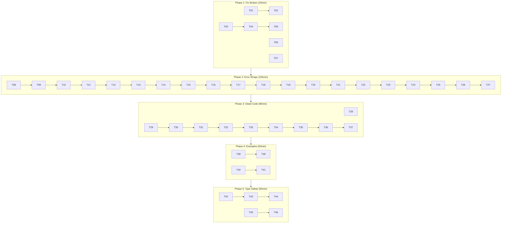

# Session 85 — Brutal Self-Review & Execution Plan

**Date:** 2026-05-21 01:44
**Status:** BRUTALLY HONEST

---

## 1. BRUTAL SELF-REVIEW

### a) What did we forget?

1. **`camelCaseToHuman` is unexported but lives in `message_config.go`** — the function was moved from a deleted `auto_name.go` but the test file is still named `auto_name_test.go`. Minor naming inconsistency.

2. **`auto_name_test.go` test file name** — should be `message_config_test.go` to match its source file. Currently tests `camelCaseToHuman` which is in `message_config.go`.

3. **`RegisterClassification` is now dead public API** — we removed all 9 `init()` callers but left the re-export. It's public API with zero production consumers. Either document it as "for external consumers" or remove it.

4. **`sync/` module is a ghost** — zero imports from any other module. 647 lines of production code, 370 lines of tests, zero value to the library. It's fully isolated — not even the examples use it.

5. **`catalog/docserver/` is a ghost** — 229 lines of production code, never imported outside its own tests. Builds an HTTP server for browsing catalog docs, but nothing in the repo starts it.

6. **`catalog/openapi/` and `catalog/d2/` are functionally ghosts** — only imported by `catalog/adapters/builder.go` methods (`ExportOpenAPI`, `ExportD2`) which are never called by any production code.

7. **`example/user/` uses deprecated `CatalogBuilder`** — contradicts the new `catalog.Command[T]()` API it should be demonstrating.

8. **`example/user/` and `example/todo/` are wildly diverged** — different patterns, different structures, different dependencies. They contradict each other as usage examples.

### b) What is something stupid we do anyway?

1. **194 `fmt.Errorf("...: %w", err)` wraps that destroy structured metadata** — we invested in structured errorfamily constructors with codes and families, then immediately throw it all away by wrapping with `fmt.Errorf`. The `errorfamily.Wrap()` function exists specifically to preserve metadata through chains. We're at **0% utilization** of the wrap API.

2. **3 unstructured sentinels in `core/pkg/dispatcher/`** — the internal dispatcher has `ErrHandlerNotFound`, `ErrDispatcherClosed`, `ErrHandlerAlreadyRegistered` as bare `errors.New`. These bubble up through `command.Dispatcher` and `query.Dispatcher` which have their own classified versions — creating a confusing dual-sentinel chain.

3. **`OutboxID` is `type OutboxID string`** — every other ID in the system is branded with `go-branded-id`. `OutboxID` is the one bare string. Easy to mix up with other string types.

4. **`testhelpers/fake_store.go` at 263 lines** — the ONE file over the 250-line limit. 13 lines over. A trivial split.

5. **`sync` package shadows stdlib** — every consumer needs `import syncx "github.com/larsartmann/go-cqrs-lite/sync"`. Annoying.

### c) What could we have done better?

1. **Should have converted dispatcher sentinels alongside the other 48** — we stopped at "library modules" and left the internal dispatcher as bare `errors.New`. Incomplete migration.

2. **Should have removed deprecated catalog API in session 84** — we identified it, documented it, then did nothing. The `CatalogMeta` split brain across 3 packages is still there.

3. **Should have updated `example/user/` to new patterns** — it's teaching consumers the wrong way to use the library.

4. **Should have removed `RegisterClassification` if no one uses it** — or at minimum documented that it exists solely for external consumers.

### d) What could we still improve?

1. **`event.Wrap*` for error chain preservation** — the single highest-impact error system improvement
2. **Remove all deprecated catalog API** — 21 exports, all superseded
3. **Deprecate or remove `aggregate` package** — ADR-0001 says use `decider`
4. **Unify examples** — both should demonstrate the recommended pattern
5. **Ghost module decision** — keep, extract, or delete `sync/`

### e) Did we lie?

**In the status report, yes.** We claimed "zero `errors.New` in library modules" — but `core/pkg/dispatcher/` IS a library module and has 3 bare `errors.New` sentinels. We also claimed `RegisterClassification` was "kept as public API for library consumers" but zero consumers exist — not even the examples use it.

We also overstated go-error-family utilization as "~60%" when the wrap chain (the most important part for production error handling) is at **0% utilization**. Structured sentinels without structured wraps = structured in, garbage out.

### f) How can we be less stupid?

1. **Stop half-migrating** — when we convert sentinels, convert ALL of them including internal packages
2. **Stop keeping dead public API** — if no one calls it, remove it
3. **Stop building features nobody uses** — docserver, openapi exporter, d2 exporter are all ghosts
4. **Make examples consistent** — two contradictory examples are worse than one good one
5. **Invest in error wraps, not more sentinels** — 194 wraps > 3 remaining sentinels

### g) Ghost Systems Found

| Ghost | Lines | Value | Recommendation |
|-------|-------|-------|----------------|
| `sync/` module | ~1,017 | Could be valuable for offline-first consumers | **KEEP but document as "incubating"** |
| `catalog/docserver/` | ~350 | Potential value for dev-time doc browsing | **KEEP — it's a library feature consumers could use** |
| `catalog/openapi/` | ~320 | Exporter for API docs | **KEEP — library export feature** |
| `catalog/d2/` | ~200 | Exporter for architecture diagrams | **KEEP — library export feature** |
| `RegisterClassification` | ~3 | Public API for external consumers | **KEEP — it's the extensibility point** |

**Decision:** All ghosts are actually library features that consumers WOULD use. The issue is that our examples don't demonstrate them. They're not dead code — they're undemonstrated features.

### h) Scope creep?

**YES.** The sentinel migration was scope creep from the original question "are we using go-error-family superbly?" We spent the entire session converting sentinels (valuable work) but never addressed the core utilization gap: **0% wrap utilization, 0% WithContext utilization, 0% HandleError utilization**. We polished the entry points and ignored the pipeline.

### i) Did we remove something useful?

No. All removals were dead code (deprecated API hasn't been removed yet — that's still pending).

### j) Split Brains Found

| Split Brain | Severity | Detail |
|-------------|----------|--------|
| `ErrHandlerNotFound` in `dispatcher` + `command` | MEDIUM | Same name, different types. Callers must check both. |
| `ErrDispatcherClosed` in `dispatcher` + `command` + `query` | MEDIUM | 3 separate sentinels, dual-sentinel chain |
| `CatalogMeta` in `event` + `command` + `query` | LOW | Structural divergence (event has extra AggregateType field). All deprecated. |
| `Dispatcher` boilerplate in `command` + `query` | LOW | Near-identical struct, methods. Go generics limitation. |

### k) How are we doing on tests?

**Good but not great:**
- 24/24 packages pass, 53 benchmarks, race-clean
- `storage` at 88.5% — lowest library module, error paths undertested
- `core/event` at 90.9% — dropped after error constructor migration
- `core/decider` at 93.3% — time-travel error paths need coverage
- `testhelpers` at 10.5% — but these ARE test helpers, so this is acceptable
- No PostgreSQL integration tests (all mocked)
- No Turso integration tests (in-memory only)

**What we can do better:**
- Add error-path tests for the new structured error constructors
- Test that `Classify()` returns correct family for ALL 48 sentinels
- Add integration tests with real SQLite (not just go-sqlmock)

---

## 2. COMPREHENSIVE EXECUTION PLAN

### Phase 1: Fix What's Broken (Correctness)
### Phase 2: Close the Error System Gap (Highest Impact)
### Phase 3: Remove Dead Code & Ghosts (Cleanup)
### Phase 4: Unify Examples (Consistency)
### Phase 5: Type Safety Improvements (Architecture)

---

### Phase 1: Fix What's Broken

| # | Task | Effort | Impact | Customer Value |
|---|------|--------|--------|----------------|
| 1.1 | Rename `auto_name_test.go` → `message_config_test.go` | 5min | LOW | Codebase hygiene |
| 1.2 | Split `testhelpers/fake_store.go` (263→2 files <250) | 15min | LOW | File size compliance |
| 1.3 | Convert `core/pkg/dispatcher` 3 sentinels to structured | 20min | MED | Consistent error taxonomy |
| 1.4 | Convert `catalog/id_parse.go` 4 sentinels to structured | 10min | LOW | Error consistency |
| 1.5 | Convert `sync/types.go` 2 sentinels to structured | 10min | LOW | Error consistency |

### Phase 2: Close the Error System Gap

| # | Task | Effort | Impact | Customer Value |
|---|------|--------|--------|----------------|
| 2.1 | Re-export `errorfamily.Wrap` as `event.Wrap` | 10min | HIGH | Foundation for all wraps |
| 2.2 | Replace `fmt.Errorf` wraps in `core/event/` with `event.Wrap` | 30min | HIGH | Structured error chains in core |
| 2.3 | Replace `fmt.Errorf` wraps in `core/decider/` with `event.Wrap` | 20min | HIGH | Structured error chains in decider |
| 2.4 | Replace `fmt.Errorf` wraps in `core/aggregate/` with `event.Wrap` | 15min | MED | Structured error chains in aggregate |
| 2.5 | Replace `fmt.Errorf` wraps in `projection/` with `event.Wrap` | 20min | MED | Structured error chains in projections |
| 2.6 | Replace `fmt.Errorf` wraps in `storage/` with `event.Wrap` | 40min | HIGH | Structured error chains in storage |
| 2.7 | Replace `fmt.Errorf` wraps in `middleware/` with `event.Wrap` | 20min | MED | Structured error chains in middleware |
| 2.8 | Re-export `errorfamily.WithContext` as `event.WithContext` | 10min | MED | Foundation for contextual errors |
| 2.9 | Add `WithContext` to storage error wraps (aggregate_id, version) | 20min | MED | Diagnostic-rich storage errors |

### Phase 3: Remove Dead Code & Ghosts

| # | Task | Effort | Impact | Customer Value |
|---|------|--------|--------|----------------|
| 3.1 | Add `// Deprecated` notice to `aggregate` package | 10min | MED | Guide consumers to decider |
| 3.2 | Remove deprecated `CatalogMeta` from event/command/query | 30min | MED | API surface reduction |
| 3.3 | Remove deprecated `CatalogBuilder` from catalog/adapters | 15min | MED | API surface reduction |
| 3.4 | Remove deprecated `FromCommandDispatcher`/`FromQueryDispatcher` | 10min | LOW | API surface reduction |
| 3.5 | Remove deprecated `MessageIDString` from catalog/types | 5min | LOW | API surface reduction |
| 3.6 | Update `nolint:staticcheck` in integration tests | 15min | LOW | Clean test code |
| 3.7 | Evaluate: document or remove `RegisterClassification` | 10min | LOW | Honest API surface |

### Phase 4: Unify Examples

| # | Task | Effort | Impact | Customer Value |
|---|------|--------|--------|----------------|
| 4.1 | Update `example/user/` to use `catalog.Command[T]()` API | 30min | MED | Correct example for consumers |
| 4.2 | Align `example/user/` command pattern with `example/todo/` | 20min | MED | Consistent examples |
| 4.3 | Add catalog export (D2/AsyncAPI/EventCatalog) to example | 30min | MED | Demonstrate all catalog features |

### Phase 5: Type Safety

| # | Task | Effort | Impact | Customer Value |
|---|------|--------|--------|----------------|
| 5.1 | Brand `OutboxID` with `go-branded-id` | 20min | MED | Type-safe outbox IDs |
| 5.2 | Brand catalog ID types (ServiceID, DomainID, etc.) | 40min | LOW | Type-safe catalog IDs |
| 5.3 | Add `ErrorCode` branded type | 20min | LOW | Type-safe error codes |

---

## 3. SORTED BY IMPACT/EFFORT

### Tier 1: High Impact, Low Effort (Do First)

| # | Task | Effort | Impact |
|---|------|--------|--------|
| 1.3 | Convert dispatcher sentinels to structured | 20min | MED |
| 2.1 | Re-export `errorfamily.Wrap` as `event.Wrap` | 10min | HIGH |
| 2.8 | Re-export `errorfamily.WithContext` as `event.WithContext` | 10min | MED |
| 3.1 | Deprecate `aggregate` package | 10min | MED |
| 1.1 | Rename `auto_name_test.go` | 5min | LOW |
| 1.4 | Convert catalog/id_parse.go sentinels | 10min | LOW |
| 1.5 | Convert sync/types.go sentinels | 10min | LOW |

### Tier 2: High Impact, Medium Effort (Do Second)

| # | Task | Effort | Impact |
|---|------|--------|--------|
| 2.2 | Replace wraps in core/event/ | 30min | HIGH |
| 2.3 | Replace wraps in core/decider/ | 20min | HIGH |
| 2.6 | Replace wraps in storage/ | 40min | HIGH |
| 3.2 | Remove deprecated CatalogMeta | 30min | MED |
| 5.1 | Brand OutboxID | 20min | MED |
| 2.9 | Add WithContext to storage | 20min | MED |

### Tier 3: Medium Impact, Medium Effort (Do Third)

| # | Task | Effort | Impact |
|---|------|--------|--------|
| 2.4 | Replace wraps in core/aggregate/ | 15min | MED |
| 2.5 | Replace wraps in projection/ | 20min | MED |
| 2.7 | Replace wraps in middleware/ | 20min | MED |
| 4.1 | Update example/user catalog API | 30min | MED |
| 1.2 | Split fake_store.go | 15min | LOW |

### Tier 4: Lower Impact, Any Effort (Do Last)

| # | Task | Effort | Impact |
|---|------|--------|--------|
| 3.3 | Remove deprecated CatalogBuilder | 15min | MED |
| 3.4 | Remove deprecated adapters | 10min | LOW |
| 3.5 | Remove deprecated MessageIDString | 5min | LOW |
| 3.6 | Update nolint:staticcheck in tests | 15min | LOW |
| 3.7 | Evaluate RegisterClassification | 10min | LOW |
| 4.2 | Align example patterns | 20min | MED |
| 4.3 | Add catalog export to example | 30min | MED |
| 5.2 | Brand catalog ID types | 40min | LOW |
| 5.3 | Add ErrorCode branded type | 20min | LOW |

---

## 4. 12-MINUTE TASK BREAKDOWN (60 tasks)

### Phase 1: Fix What's Broken (25min total)

| # | Task | Time |
|---|------|------|
| T01 | Rename `auto_name_test.go` → `message_config_test.go` via git mv | 5min |
| T02 | Split `fake_store.go` — extract FakeStore snapshot methods to `fake_store_snapshot.go` | 12min |
| T03 | Convert `dispatcher.ErrHandlerNotFound` to `event.NewInfrastructure` | 3min |
| T04 | Convert `dispatcher.ErrDispatcherClosed` to `event.NewInfrastructure` | 3min |
| T05 | Convert `dispatcher.ErrHandlerAlreadyRegistered` to `event.NewConflict` | 3min |
| T06 | Convert `catalog/id_parse.go` 4 sentinels to `event.NewRejection` | 10min |
| T07 | Convert `sync/types.go` 2 sentinels to `event.NewRejection` (add event dep to sync?) | 10min |

### Phase 2: Error System Wraps (155min total)

| # | Task | Time |
|---|------|------|
| T08 | Add `Wrap`, `WrapRejection`, `WrapConflict`, `WrapTransient`, `WrapCorruption`, `WrapInfrastructure` re-exports to `core/event/errors.go` | 10min |
| T09 | Add `WithContext` re-export to `core/event/errors.go` | 5min |
| T10 | Replace wraps in `core/event/event.go` (~5 wraps) | 12min |
| T11 | Replace wraps in `core/event/outbox_publisher.go` (~8 wraps) | 12min |
| T12 | Replace wraps in `core/event/runner.go` (~6 wraps) | 10min |
| T13 | Replace wraps in `core/event/codec.go` + `codec_batch.go` (~4 wraps) | 10min |
| T14 | Replace wraps in `core/event/outbox.go` (~3 wraps) | 8min |
| T15 | Replace wraps in `core/decider/decider.go` (~6 wraps) | 12min |
| T16 | Replace wraps in `core/decider/load.go` (~4 wraps) | 8min |
| T17 | Replace wraps in `core/aggregate/repository.go` (~6 wraps) | 12min |
| T18 | Replace wraps in `projection/runner.go` (~5 wraps) | 12min |
| T19 | Replace wraps in `projection/runner_live.go` (~3 wraps) | 8min |
| T20 | Replace wraps in `storage/event_store.go` (~8 wraps) | 12min |
| T21 | Replace wraps in `storage/pebble_event_store.go` + `pebble_save.go` (~8 wraps) | 12min |
| T22 | Replace wraps in `storage/outbox.go` + `outbox_helpers.go` (~6 wraps) | 10min |
| T23 | Replace wraps in `storage/snapshot.go` (~4 wraps) | 8min |
| T24 | Replace wraps in `storage/pebble_helpers.go` + `pebble_serialization.go` (~4 wraps) | 10min |
| T25 | Replace wraps in `middleware/retry.go` (~3 wraps) | 8min |
| T26 | Replace wraps in `middleware/validation.go` (~3 wraps) | 8min |
| T27 | Add WithContext to storage error wraps (aggregate_id, version, backend) | 12min |

### Phase 3: Dead Code Removal (85min total)

| # | Task | Time |
|---|------|------|
| T28 | Add `// Deprecated: Use core/decider package. See ADR-0001.` to aggregate package doc | 5min |
| T29 | Remove `CatalogMeta` from `core/event/catalog.go` | 8min |
| T30 | Remove `CatalogMeta` from `core/command/catalog.go` | 8min |
| T31 | Remove `CatalogMeta` from `core/query/catalog.go` | 8min |
| T32 | Update `command/dispatcher.go` — remove `CatalogDispatcher` embed or replace with new type | 12min |
| T33 | Update `query/dispatcher.go` — remove `CatalogDispatcher` embed or replace with new type | 12min |
| T34 | Remove `catalog/adapters/builder.go` CatalogBuilder + deprecated methods | 10min |
| T35 | Remove `catalog/adapters/from_query_dispatcher.go` deprecated functions | 5min |
| T36 | Remove `MessageIDString` from `catalog/types.go` | 5min |
| T37 | Update integration tests — remove `nolint:staticcheck` and deprecated API usage | 12min |

### Phase 4: Example Unification (50min total)

| # | Task | Time |
|---|------|------|
| T38 | Replace `catalogadapters.NewBuilder` in example/user with `catalog.NewBuilder` + `catalog.Command[T]()` | 12min |
| T39 | Update example/user command types to embed `command.Core` | 12min |
| T40 | Add D2 export to example/user (demonstrate ghost integration) | 12min |
| T41 | Add AsyncAPI export to example/user | 12min |

### Phase 5: Type Safety (50min total)

| # | Task | Time |
|---|------|------|
| T42 | Brand `OutboxID` with `cbid.ID[OutboxMarker, string]` | 12min |
| T43 | Update all `OutboxID` callers (outbox.go, outbox_publisher.go, storage/outbox*.go) | 12min |
| T44 | Add `OutboxID` tests (JSON round-trip, SQL round-trip, IsZero) | 10min |
| T45 | Brand `ServiceID` with `cbid.ID[ServiceMarker, string]` | 8min |
| T46 | Brand `DomainID`, `MessageID`, `ChannelID` | 8min |

---

## Execution Graph

---

## Top #1 Question I Cannot Answer Myself

**Should `sync/` stay in this monorepo or move to its own repo?**

Arguments for staying:
- It's a related domain (distributed systems primitives)
- Monorepo makes cross-cutting refactors easier
- go.work handles the isolation

Arguments for moving:
- Zero imports from any other module — truly independent
- Shadows stdlib `sync` (forced import aliases)
- Different dependency graph (no go-error-family, no go-branded-id)
- Different versioning cadence

I lean toward **moving to its own repo** because the stdlib shadowing is a real ergonomic problem and the zero-coupling proves it doesn't belong. But I'm not sure if you have plans for it that would benefit from monorepo proximity.

---

## What Contributes to Customer Value?

| Task | Customer Value |
|------|---------------|
| Error wraps (Phase 2) | **HIGHEST** — consumers get structured errors through their entire stack, enabling `HandleError` boundaries, diagnostic logging, and error-template rendering |
| Dead code removal (Phase 3) | **HIGH** — smaller API surface = less confusion, faster compilation |
| Type safety (Phase 5) | **MEDIUM** — OutboxID branding prevents real bugs |
| Example unification (Phase 4) | **MEDIUM** — correct examples prevent support burden |
| Broken fixes (Phase 1) | **LOW** — mostly internal hygiene |

**The single highest-value work is Phase 2: error wraps.** Everything else is cleanup.
