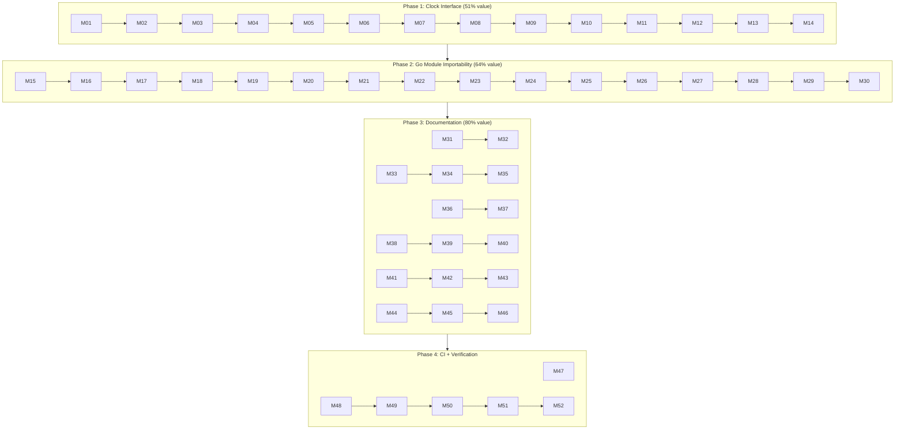

# Session 88 — Ship-Ready: Clock + Importability + SQLite/Turso Docs

**Date:** 2026-05-21 20:07
**Trigger:** "What should we focus on next to create the most user value? Most common deployment target = Turso and/or SQLite"
**Branch:** master
**Previous Session:** 87 (Deduplication + TODO reconciliation)

---

## Pareto Analysis

### What creates user value for a CQRS library consumer?

1. **Can I install it?** — go.mod `v0.0.0` + replace directives = `go get` fails
2. **Can I test deterministically?** — `time.Now()` hardcoded in `NewEvent()` = flaky tests
3. **Can I see it work with my database?** — README only shows in-memory, not SQLite/Turso
4. **Is the README honest?** — Says "Storage: Partial" when SQLite/Turso is superb

### 1% → 51%: Clock Interface

Every consumer needs deterministic testing. `NewEvent()` calls `time.Now()` — non-injectable, non-testable. A 10-line `Clock` type + `WithClock` option fixes this for every consumer forever.

### 4% → 64%: Clock + Fix go.mod + Fix README

- Clock interface (above)
- Update go.mod require versions from `v0.0.0` → latest tags → makes `go get` work
- Fix README "Storage: Partial" → honest assessment
- Tag new releases with corrected go.mod files

### 20% → 80%: All Above + SQLite/Turso Getting Started + CI

- SQLite deployment getting started guide (WAL, pool config, schema init)
- Turso deployment getting started guide (open, sync, schema init)
- Update Quick Start to mention SQLite option
- GOWORK=off CI check to prevent version drift
- Verify all README code examples compile

---

## Task Plan (30–100 min each, 12 tasks)

| #   | Task                                               | Impact | Effort | Value |
| --- | -------------------------------------------------- | ------ | ------ | ----- |
| T01 | Clock interface: type + WithClock + NewEvent update | HIGH   | 45min  | 51%   |
| T02 | Clock interface: comprehensive tests               | HIGH   | 30min  | 51%   |
| T03 | Update go.mod require versions → latest tags        | HIGH   | 45min  | 64%   |
| T04 | Verify GOWORK=off builds for all modules            | HIGH   | 30min  | 64%   |
| T05 | Tag new releases + push                             | HIGH   | 15min  | 64%   |
| T06 | Fix README: Storage status + Project Status section | MED    | 15min  | 64%   |
| T07 | Add SQLite getting started guide to README          | HIGH   | 30min  | 80%   |
| T08 | Add Turso getting started guide to README           | MED    | 30min  | 80%   |
| T09 | Update Quick Start to reference SQLite option        | MED    | 30min  | 80%   |
| T10 | Add GOWORK=off CI verification job                  | MED    | 30min  | 80%   |
| T11 | Verify all README code examples compile             | MED    | 30min  | 80%   |
| T12 | Final verification: tests + lint + coverage          | MED    | 30min  | 80%   |

**Total: ~7.5h estimated**

---

## Micro Task Plan (≤15 min each, 52 tasks)

### Phase 1: Clock Interface (Tasks M01–M14)

| #   | Task                                                        | Time |
| --- | ----------------------------------------------------------- | ---- |
| M01 | Read `core/event/event.go`, `options.go`, `builder.go`     | 10m  |
| M02 | Add `type Clock func() time.Time` to `core/event/types.go` | 5m   |
| M03 | Add `DefaultClock` package variable                         | 5m   |
| M04 | Add `clock` field to `Core` struct in `event.go`           | 5m   |
| M05 | Add `WithClock(clock Clock) Option` to `options.go`        | 10m  |
| M06 | Update `NewEvent` to use `c.clock()` instead of `time.Now()` | 10m  |
| M07 | Update `NewEvents` batch constructor to use clock          | 10m  |
| M08 | Update `publish_helper.go` `SaveSnapshot` to use clock     | 10m  |
| M09 | Update `builder.go` to propagate clock through Build()     | 10m  |
| M10 | Test: `NewEvent` with custom clock returns fixed time      | 10m  |
| M11 | Test: `NewEvents` batch with custom clock                  | 10m  |
| M12 | Test: Default clock uses `time.Now()`                      | 5m   |
| M13 | Test: `WithClock` option in builder pattern                | 5m   |
| M14 | Run tests: `go test ./core/...` passes                     | 5m   |

### Phase 2: Go Module Importability (Tasks M15–M30)

| #   | Task                                                        | Time |
| --- | ----------------------------------------------------------- | ---- |
| M15 | Map latest tag for each module (core→v1.4.0, etc.)         | 5m   |
| M16 | Update `core/go.mod`: memory→v1.2.0, testhelpers→v1.2.0   | 10m  |
| M17 | Update `memory/go.mod`: core→v1.4.0, testhelpers→v1.2.0   | 5m   |
| M18 | Update `storage/go.mod`: core→v1.4.0                       | 5m   |
| M19 | Update `catalog/go.mod`: core→v1.4.0                       | 5m   |
| M20 | Update `middleware/go.mod`: core→v1.4.0, testhelpers→v1.2.0 | 5m   |
| M21 | Update `projection/go.mod`: core→v1.4.0, memory→v1.2.0, testhelpers→v1.2.0 | 5m |
| M22 | Update `testhelpers/go.mod`: core→v1.4.0                   | 5m   |
| M23 | Update `integration/go.mod`: all 6 deps                     | 10m  |
| M24 | Update `example/todo/go.mod`: core, memory, storage        | 5m   |
| M25 | Update `example/user/go.mod`: core, memory, catalog, middleware | 5m |
| M26 | Run `go mod tidy` in all 12 modules                         | 15m  |
| M27 | Verify `GOWORK=off go build ./core/...` passes              | 5m   |
| M28 | Verify `GOWORK=off go build ./storage/...` passes           | 5m   |
| M29 | Verify `GOWORK=off go build ./catalog/...` passes           | 5m   |
| M30 | Tag new releases: core/v1.5.0, storage/v0.3.0, etc.        | 10m  |

### Phase 3: README + Documentation (Tasks M31–M46)

| #   | Task                                                        | Time |
| --- | ----------------------------------------------------------- | ---- |
| M31 | Fix README Storage row: "Partial" → "Complete (SQLite/Turso)" | 5m  |
| M32 | Fix README Project Status: Storage phase status              | 5m   |
| M33 | Write SQLite getting started guide section                  | 15m  |
| M34 | Write Turso getting started guide section                   | 10m  |
| M35 | Write Turso Sync (offline-first) guide section              | 10m  |
| M36 | Update Quick Start to mention `storage` module option        | 10m  |
| M37 | Update Module Structure table with storage backends          | 5m   |
| M38 | Verify Quick Start code example compiles                    | 10m  |
| M39 | Verify SQLite getting started code compiles                 | 10m  |
| M40 | Verify Turso getting started code compiles                  | 10m  |
| M41 | Update AGENTS.md with Clock interface info                  | 5m   |
| M42 | Update FEATURES.md with Clock feature                       | 5m   |
| M43 | Update TODO_LIST.md with completed items                    | 10m  |
| M44 | Update README module table to show storage backends         | 5m   |
| M45 | Fix any broken links in README                              | 5m   |
| M46 | Remove duplicate/overlapping README sections                | 10m  |

### Phase 4: CI + Final Verification (Tasks M47–M52)

| #   | Task                                                        | Time |
| --- | ----------------------------------------------------------- | ---- |
| M47 | Add GOWORK=off verification to `.github/workflows/ci.yml`  | 15m  |
| M48 | Run full test suite: `go test ./...`                        | 10m  |
| M49 | Run lint: `nix run .#lint` or `golangci-lint`               | 5m   |
| M50 | Run race detector: `go test -race ./...`                    | 10m  |
| M51 | Push tags to remote                                         | 5m   |
| M52 | Final git status + commit + push                            | 10m  |

---

## Execution Graph

---

## Key Decisions

1. **Keep replace directives** — needed for `GOWORK=off` development. Ignored by consumers.
2. **Update require versions to latest tags** — this is what makes `go get` work.
3. **SQLite first, Turso second** — SQLite is simpler for getting started, Turso for production/offline.
4. **Clock as `func() time.Time`** — zero-dependency, matches stdlib `time.Now` signature.
5. **No PostgreSQL work** — user confirmed SQLite/Turso is the target.

---

## Risks

| Risk | Mitigation |
| ---- | ---------- |
| Go.mod version update breaks GOWORK=off builds | Verify each module individually before tagging |
| Clock interface breaks existing tests | Default clock is `time.Now()` — zero behavioral change |
| README code examples don't compile | Verify with `go run` in example directory |
| Tag names conflict with existing tags | Use next minor version (v1.5.0 for core, v0.3.0 for storage) |
