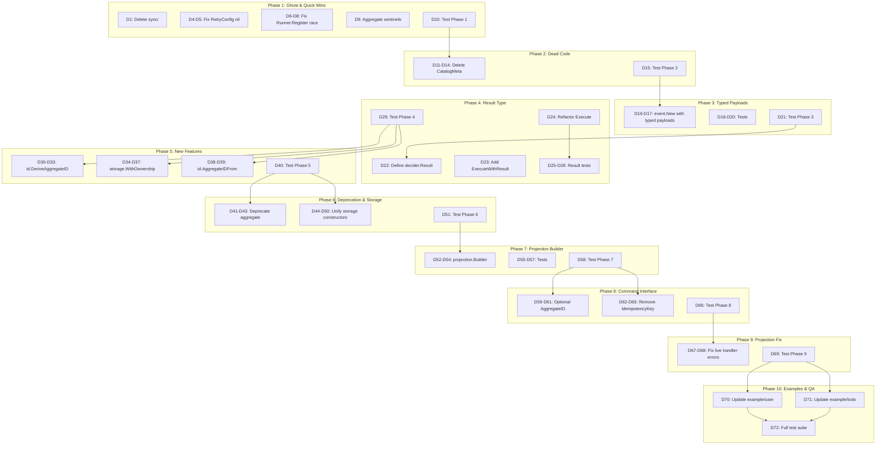

# Library Quality & Consumer Friction Elimination Plan

**Date:** 2026-05-21 22:57
**Session:** 89
**Trigger:** Design audit → ideal API vision → real consumer analysis (SEC, go-localsync)
**Source:** `docs/planning/2026-05-21_LIBRARY_DESIGN_AUDIT_AND_CONSUMER_PAIN.md`

---

## TL;DR

Three problems cause **80% of consumer pain**: `Execute` returns only `error`, `Command.AggregateID()` is required upfront, and `NewEvent` takes raw `[]byte`. Fixing these eliminates ~700 lines of boilerplate across both consumer projects. Plus: delete a ghost module, clean up dead code, fix bugs.

**Strategy:** All changes are **non-breaking or additive**. Where the ideal API differs from current, we add new functions/methods and deprecate old ones. No consumer breaks.

---

## Pareto Analysis

### 1% → 51% of Result (3 tasks, ~95min)

The three highest-leverage changes. Each unlocks downstream improvements.

| #   | What                                  | Why                                                                                                                        | Consumer Impact                                          |
| --- | ------------------------------------- | -------------------------------------------------------------------------------------------------------------------------- | -------------------------------------------------------- |
| P1  | **Delete `sync/` ghost module**       | 1,640 lines of dead code with zero consumers. Confuses newcomers, inflates module count.                                   | Removes dead weight from go.work                         |
| P2  | **`NewEvent` accepts typed payloads** | Both consumers build marshal helpers because `NewEvent` takes raw `[]byte` while `NewEvents` takes `[]any`. Inconsistent.  | Eliminates ~55 lines of marshal helpers across consumers |
| P3  | **`Execute` returns `Result` type**   | Both consumers hack around this: `countingDecide` in go-localsync, reverse-engineering in SEC. The single biggest API gap. | Eliminates ~60 lines of workarounds per consumer         |

### 4% → 64% of Result (5 more tasks, ~130min)

| #   | What                                                   | Why                                                                                                        | Consumer Impact                   |
| --- | ------------------------------------------------------ | ---------------------------------------------------------------------------------------------------------- | --------------------------------- |
| P4  | **Delete deprecated `CatalogMeta`**                    | Identical structs in 3 packages, all deprecated but still exported. Dead code in public API.               | Clean public API surface          |
| P5  | **Bug fixes: RetryConfig nil + Runner.Register mutex** | `RetryConfig.IsRetryable` nil causes runtime panic. `Runner.Register` has data race.                       | Safety                            |
| P6  | **`id.DeriveAggregateID` helper**                      | go-localsync hand-rolled SHA256 + sync.Map cache. Deterministic IDs from natural keys is a common pattern. | Eliminates ~25 lines per consumer |
| P7  | **Storage `WithOwnership` option**                     | SEC wrote 150-line wrapper because `SQLEventStore` doesn't close its `*sql.DB`.                            | Eliminates ~150 lines wrapper     |
| P8  | **Deprecate `aggregate` package**                      | 9-method `Root` interface anti-pattern. `decider` is the recommended path. Signal intent.                  | Clear direction for consumers     |

### 20% → 80% of Result (7 more tasks, ~285min)

| #   | What                                             | Why                                                                                                          | Consumer Impact                      |
| --- | ------------------------------------------------ | ------------------------------------------------------------------------------------------------------------ | ------------------------------------ |
| P9  | **Unify storage constructors → `WithDialect`**   | 12 constructors (4 types × 3 dialects) returning same types. Should be 4 constructors with dialect option.   | Simpler API surface                  |
| P10 | **Multi-type projection builder**                | Both consumers write manual `switch evt.Type()` because `NewTypedProjection[T]` assumes single payload type. | Eliminates ~30 lines per projection  |
| P11 | **Make `Command.AggregateID()` optional**        | go-localsync computes aggregate IDs inside decide function (SHA256). Can't use `command.Dispatcher` at all.  | Unblocks command middleware pipeline |
| P12 | **Remove `IdempotencyKey()` from Command**       | Always returns `""`. Dead method on every command definition.                                                | Removes noise from every command     |
| P13 | **Fix projection live handler error swallowing** | `projection/runner_live.go` logs errors but returns nil to bus. Replay is strict, live is lenient.           | Consistency + correctness            |
| P14 | **`id.AggregateID` from `fmt.Stringer`**         | SEC converts `GameID` → `id.AggregateID` at every boundary. Accept `String()` to eliminate.                  | Eliminates ~30 lines conversion code |
| P15 | **Aggregate package: direct sentinel returns**   | Uses `fmt.Errorf("%w", ErrNilStore)` instead of returning sentinel directly.                                 | Code quality                         |

### Remaining 80% → 20% of Result (deferred)

These are valuable but high-effort or breaking. Track for v2.

| #   | What                                                | Why Deferred                                                                  |
| --- | --------------------------------------------------- | ----------------------------------------------------------------------------- |
| D1  | Middleware generics (write once, not 3×)            | ~1200 lines refactored. High risk of regression. Needs careful design.        |
| D2  | Decompose `event.Store` (8 → composable interfaces) | Breaking interface change. All store implementations + consumers must update. |
| D3  | Read model base (`memory.ReadModel[T]`)             | New feature. Needs design + storage implementations.                          |
| D4  | Fix `query.Handler` returns `any`                   | Breaking signature change.                                                    |
| D5  | `Metadata` immutability (deep copy `Custom` map)    | Behavior change. May break consumers relying on mutation.                     |

---

## Comprehensive Plan (30–100min tasks)

**20 tasks, sorted by importance/impact/effort**

| #   | Task                                                              | Category | Pareto | Effort | Impact | Risk |
| --- | ----------------------------------------------------------------- | -------- | ------ | ------ | ------ | ---- |
| T1  | Delete `sync/` module (remove dir + go.work entry)                | Cleanup  | P1     | 10min  | HIGH   | NONE |
| T2  | Add `event.New()` — typed payload event constructor               | API      | P2     | 60min  | HIGH   | LOW  |
| T3  | Add `decider.Result` type + `ExecuteWithResult()` method          | API      | P3     | 90min  | HIGH   | LOW  |
| T4  | Delete deprecated `CatalogMeta` from 3 packages                   | Cleanup  | P4     | 20min  | MED    | NONE |
| T5  | Fix `RetryConfig.Validate()` nil `IsRetryable` check              | Bugfix   | P5     | 5min   | MED    | NONE |
| T6  | Add mutex to `projection.Runner.Register`                         | Bugfix   | P5     | 15min  | MED    | NONE |
| T7  | Add `id.DeriveAggregateID(namespace, keys...)` helper             | Feature  | P6     | 45min  | MED    | NONE |
| T8  | Add `storage.WithOwnership()` option                              | Feature  | P7     | 45min  | MED    | NONE |
| T9  | Deprecate `aggregate` package (deprecation docs + godoc)          | Docs     | P8     | 30min  | MED    | NONE |
| T10 | Unify storage constructors with `WithDialect` option              | API      | P9     | 60min  | MED    | LOW  |
| T11 | Add multi-type projection builder (`projection.On[T]`)            | Feature  | P10    | 90min  | MED    | NONE |
| T12 | Make `Command.AggregateID()` optional via `AggregateCommand`      | API      | P11    | 60min  | HIGH   | MED  |
| T13 | Remove `IdempotencyKey()` from `Command` interface                | API      | P12    | 30min  | MED    | MED  |
| T14 | Fix projection live handler error propagation                     | Bugfix   | P13    | 30min  | MED    | LOW  |
| T15 | Add `id.AggregateID` constructors accepting `fmt.Stringer`        | Feature  | P14    | 30min  | MED    | NONE |
| T16 | Aggregate: return sentinels directly, not `fmt.Errorf("%w", ...)` | Refactor | P15    | 15min  | LOW    | NONE |
| T17 | Fix projection live handler: propagate errors to bus              | Bugfix   | P13    | 20min  | MED    | LOW  |
| T18 | Update `example/user` to use new `event.New()` API                | Example  | P2     | 30min  | MED    | NONE |
| T19 | Update `example/todo` to use new `event.New()` + `Result`         | Example  | P2-P3  | 45min  | MED    | NONE |
| T20 | Run full test suite + lint + coverage verification                | QA       | —      | 30min  | HIGH   | NONE |

**Total estimated effort: ~770min (~13h)**

---

## Detailed Breakdown (max 15min each)

**72 tasks, sorted by execution order (dependency-aware)**

### Phase 1: Ghost Elimination & Quick Wins (T1, T5, T6, T16)

| #   | Task                                                        | From | Est   | Status |
| --- | ----------------------------------------------------------- | ---- | ----- | ------ |
| D1  | Remove `sync/` directory and all files                      | T1   | 5min  |        |
| D2  | Remove `sync` from `go.work`                                | T1   | 2min  |        |
| D3  | Run tests to verify nothing depends on sync                 | T1   | 5min  |        |
| D4  | Add nil check for `IsRetryable` in `RetryConfig.Validate()` | T5   | 3min  |        |
| D5  | Add test for nil `IsRetryable` panic                        | T5   | 10min |        |
| D6  | Add `sync.Mutex` to `projection.Runner` struct              | T6   | 3min  |        |
| D7  | Lock mutex in `Runner.Register` method                      | T6   | 5min  |        |
| D8  | Lock mutex in `Runner.Run` (read lock for `r.projections`)  | T6   | 5min  |        |
| D9  | Fix `aggregate` package: return sentinels directly          | T16  | 5min  |        |
| D10 | Run tests for Phase 1                                       | —    | 10min |        |

### Phase 2: Dead Code Removal (T4)

| #   | Task                                                  | From | Est   | Status |
| --- | ----------------------------------------------------- | ---- | ----- | ------ |
| D11 | Delete `CatalogMeta` from `core/event/catalog.go`     | T4   | 3min  |        |
| D12 | Delete `CatalogMeta` from `core/command/catalog.go`   | T4   | 3min  |        |
| D13 | Delete `CatalogMeta` from `core/query/catalog.go`     | T4   | 3min  |        |
| D14 | Fix any remaining references to deleted `CatalogMeta` | T4   | 10min |        |
| D15 | Run tests for Phase 2                                 | —    | 10min |        |

### Phase 3: Typed Payload Event Constructor (T2)

| #   | Task                                                                  | From | Est   | Status |
| --- | --------------------------------------------------------------------- | ---- | ----- | ------ |
| D16 | Define `event.New(type, aggID, aggType, version, payload, ...Option)` | T2   | 10min |        |
| D17 | Implement: auto-detect `[]byte` (raw) vs `any` (marshal)              | T2   | 10min |        |
| D18 | Write tests for `New` with typed payloads                             | T2   | 10min |        |
| D19 | Write tests for `New` with raw `[]byte` (backward compat)             | T2   | 5min  |        |
| D20 | Write tests for `New` with nil payload                                | T2   | 5min  |        |
| D21 | Run tests for Phase 3                                                 | —    | 5min  |        |

### Phase 4: ExecuteWithResult (T3)

| #   | Task                                                                     | From | Est   | Status |
| --- | ------------------------------------------------------------------------ | ---- | ----- | ------ |
| D22 | Define `decider.Result` struct (Events, Version, Created, Updated, NoOp) | T3   | 10min |        |
| D23 | Add `ExecuteWithResult` method to `decider.Repository`                   | T3   | 15min |        |
| D24 | Refactor existing `Execute` to call `ExecuteWithResult` internally       | T3   | 10min |        |
| D25 | Write tests for `ExecuteWithResult` — created scenario                   | T3   | 10min |        |
| D26 | Write tests for `ExecuteWithResult` — updated scenario                   | T3   | 10min |        |
| D27 | Write tests for `ExecuteWithResult` — no-op scenario                     | T3   | 10min |        |
| D28 | Write tests for `ExecuteWithResult` — error scenario                     | T3   | 10min |        |
| D29 | Run tests for Phase 4                                                    | —    | 5min  |        |

### Phase 5: New Features (T7, T8, T15)

| #   | Task                                                                        | From | Est   | Status |
| --- | --------------------------------------------------------------------------- | ---- | ----- | ------ |
| D30 | Implement `id.DeriveAggregateID(namespace, keys...)`                        | T7   | 10min |        |
| D31 | Implement `id.DeriveEventID` (if applicable)                                | T7   | 5min  |        |
| D32 | Write tests for `DeriveAggregateID` — deterministic                         | T7   | 10min |        |
| D33 | Write tests for `DeriveAggregateID` — different inputs → different IDs      | T7   | 5min  |        |
| D34 | Add `storage.WithOwnership()` option struct + func                          | T8   | 10min |        |
| D35 | Add `io.Closer` field to store structs for optional DB ownership            | T8   | 10min |        |
| D36 | Implement `Close()` to close owned DB                                       | T8   | 5min  |        |
| D37 | Write tests for `WithOwnership` — Close closes DB                           | T8   | 10min |        |
| D38 | Add `id.MustParseAggregateIDFrom(Stringer)` or `id.AggregateIDFrom(string)` | T15  | 10min |        |
| D39 | Write tests for `AggregateIDFrom`                                           | T15  | 5min  |        |
| D40 | Run tests for Phase 5                                                       | —    | 10min |        |

### Phase 6: Deprecation & Cleanup (T9, T10)

| #   | Task                                                                 | From | Est   | Status |
| --- | -------------------------------------------------------------------- | ---- | ----- | ------ |
| D41 | Add `// Deprecated:` godoc to all `aggregate` package exported types | T9   | 10min |        |
| D42 | Add `// Deprecated:` godoc to `aggregate.Root` with migration guide  | T9   | 10min |        |
| D43 | Add deprecation notice to `AGENTS.md`                                | T9   | 5min  |        |
| D44 | Define `storage.Dialect` interface/type + `WithDialect` option       | T10  | 10min |        |
| D45 | Create `NewEventStore(db, ...Option)` unified constructor            | T10  | 10min |        |
| D46 | Create `NewOutbox(db, ...Option)` unified constructor                | T10  | 5min  |        |
| D47 | Create `NewSnapshotStore(db, ...Option)` unified constructor         | T10  | 5min  |        |
| D48 | Create `NewCheckpointStore(db, ...Option)` unified constructor       | T10  | 5min  |        |
| D49 | Add `// Deprecated:` to old 12 constructors                          | T10  | 10min |        |
| D50 | Write tests for unified constructors                                 | T10  | 15min |        |
| D51 | Run tests for Phase 6                                                | —    | 10min |        |

### Phase 7: Multi-Type Projection Builder (T11)

| #   | Task                                                     | From | Est   | Status |
| --- | -------------------------------------------------------- | ---- | ----- | ------ |
| D52 | Define `projection.Builder` struct with `On[T]()` method | T11  | 10min |        |
| D53 | Implement `Build()` → `event.Projection`                 | T11  | 15min |        |
| D54 | Wire codec + event type → handler dispatch in `Handle()` | T11  | 10min |        |
| D55 | Write tests — single handler                             | T11  | 5min  |        |
| D56 | Write tests — multiple handlers, different types         | T11  | 10min |        |
| D57 | Write tests — unknown event type (pass-through)          | T11  | 5min  |        |
| D58 | Run tests for Phase 7                                    | —    | 5min  |        |

### Phase 8: Command Interface Improvements (T12, T13)

| #   | Task                                                                      | From    | Est   | Status |
| --- | ------------------------------------------------------------------------- | ------- | ----- | ------ |
| D59 | Define `AggregateCommand` interface (Command + AggregateID)               | T12     | 5min  |        |
| D60 | Update `command.Dispatcher` to accept `Command` (not require AggregateID) | T12     | 15min |        |
| D61 | Update dispatcher internals to check `AggregateCommand` when needed       | T12     | 10min |        |
| D62 | Remove `IdempotencyKey()` from `Command` interface                        | T13     | 5min  |        |
| D63 | Update `Core` to remove `IdempotencyKey()` method                         | T13     | 5min  |        |
| D64 | Fix all compilation errors from interface change                          | T13     | 10min |        |
| D65 | Update command tests                                                      | T12/T13 | 10min |        |
| D66 | Run tests for Phase 8                                                     | —       | 10min |        |

### Phase 9: Bug Fix — Projection Live Handler (T14)

| #   | Task                                                                         | From | Est   | Status |
| --- | ---------------------------------------------------------------------------- | ---- | ----- | ------ |
| D67 | Update `runner_live.go` handler to return error from `dispatchToProjections` | T14  | 5min  |        |
| D68 | Update tests for live handler error propagation                              | T14  | 10min |        |
| D69 | Run tests for Phase 9                                                        | —    | 5min  |        |

### Phase 10: Example Updates & Final Verification (T18, T19, T20)

| #   | Task                                                             | From | Est   | Status |
| --- | ---------------------------------------------------------------- | ---- | ----- | ------ |
| D70 | Update `example/user` to use `event.New()` with typed payloads   | T18  | 15min |        |
| D71 | Update `example/todo` to use `event.New()` + `ExecuteWithResult` | T19  | 15min |        |
| D72 | Full test suite: `go test ./... -count=1` all modules            | T20  | 15min |        |

---

## Execution Graph

---

## Deferred Items (v2 / Future)

| #   | What                                                   | Why                                           | Effort | Risk |
| --- | ------------------------------------------------------ | --------------------------------------------- | ------ | ---- |
| D1  | Middleware generics over `Dispatcher[H, M]`            | ~1200 lines refactored, high regression risk  | 4h     | HIGH |
| D2  | Decompose `event.Store` into composable interfaces     | Breaking change for all store implementations | 3h     | HIGH |
| D3  | Read model base (`memory.ReadModel[T]`)                | New feature, needs design                     | 4h     | MED  |
| D4  | Fix `query.Handler` returns `any`                      | Breaking signature change                     | 2h     | HIGH |
| D5  | `Metadata` deep copy on `Custom` map                   | Behavior change                               | 1h     | MED  |
| D6  | `reconstructEvent` 9 params → struct                   | Internal refactor                             | 30min  | LOW  |
| D7  | Catalog IDs (`ServiceID` etc.) — add `Parse` functions | API improvement                               | 2h     | LOW  |

---

## Success Criteria

- [ ] `sync/` module deleted, go.work clean
- [ ] `event.New()` works with typed payloads + raw bytes
- [ ] `decider.Repository.ExecuteWithResult()` returns `Result` type
- [ ] `id.DeriveAggregateID` produces deterministic IDs
- [ ] `storage.WithOwnership()` closes DB on store Close
- [ ] Deprecated `CatalogMeta` removed from public API
- [ ] `aggregate` package marked deprecated
- [ ] Storage constructors unified with `WithDialect`
- [ ] Multi-type projection builder works
- [ ] `Command.AggregateID()` is optional
- [ ] `IdempotencyKey()` removed from Command
- [ ] Projection live handler propagates errors
- [ ] All examples updated to use new APIs
- [ ] Full test suite passes across all modules
- [ ] No lint errors
