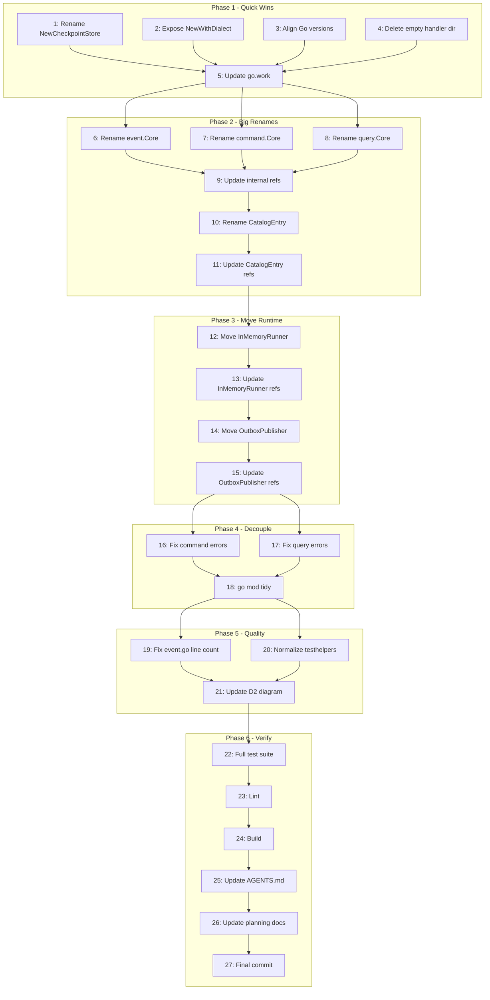

# Module Layout & Naming Overhaul

> **Date:** 2026-05-25
> **Status:** Planning
> **Scope:** Structural improvements from deep architecture review
> **Constraint:** Repo is PRIVATE — breaking changes are safe. No external consumers exist.

---

## Pareto Analysis

### The 1% that delivers 51% of the result

| # | Action | Impact | Effort |
|---|--------|--------|--------|
| 1 | Fix `NewCheckpointStore()` → `NewMemoryCheckpointStore()` naming inconsistency | Consumers see consistent API. Only 1 function, instant fix. | 5min |

### The 4% that delivers 64% of the result

| # | Action | Impact | Effort |
|---|--------|--------|--------|
| 1 | Fix `NewCheckpointStore()` → `NewMemoryCheckpointStore()` | Naming consistency | 5min |
| 2 | Expose `NewSQLEventStoreWithDialect(db, dialect)` so consumers can add MySQL/custom backends | Unlocks ANY SQL backend without modifying the library. Massive consumer value. | 15min |
| 3 | Align Go versions (1.26.2 → 1.26.3 across all go.mod files) | Eliminates version mismatch confusion | 10min |
| 4 | Rename `event.Core` → `event.ImmutableEvent` (and command/query equivalents) | Biggest lying name in the library. 3 packages affected. | 45min |
| 5 | Delete empty `example/todo/handler/` directory | Dead directory | 1min |

### The 20% that delivers 80% of the result

| # | Action | Impact | Effort |
|---|--------|--------|--------|
| 1-5 | (The 4% items above) | | |
| 6 | Move `InMemoryRunner` from `event/` to `projection/` | Eliminates runtime code from contracts package | 30min |
| 7 | Move `OutboxPublisher` from `event/` to `memory/` | Eliminates goroutine code from contracts package | 30min |
| 8 | Extract error taxonomy from `event/` → direct `go-error-family` imports in command/query | Decouples command/query from event | 45min |
| 9 | Fix `event.go` exceeding 250-line limit (274 lines) | Code standard compliance | 15min |
| 10 | Rename `CatalogEntry` → `HandlerMeta` in `pkg/dispatcher/` | Honest naming | 20min |
| 11 | Normalize testhelpers event constructors (`MakeEvent`→`NewEvent`, delete duplicates) | Consistency | 20min |

### Remaining 80% (deferred — higher risk, lower immediate ROI)

| # | Action | Why Deferred |
|---|--------|-------------|
| D1 | Split `core/` into 6 independent go.mod files | High effort, high risk. Needs full consumer migration. Separate major effort. |
| D2 | Split `storage/` into `sql/`, `pebble/`, `turso/` sub-packages | Breaking restructure. Requires all consumers to update imports. |
| D3 | Delete `core/aggregate/` (deprecated) | Still used by integration tests. Needs migration first. |
| D4 | Restructure `example/user/` flat package | Example code, not library surface. Low priority. |
| D5 | Restructure `testhelpers/` into sub-packages | Breaking change for test-only consumers. Low urgency. |
| D6 | Rename `Handler` func type in event/bus.go | Pervasive — every handler in the system references it. |
| D7 | Add `NewWithDialect` constructors for all storage types (Outbox, Snapshot, Checkpoint) | Extends #2 to full surface. Can do incrementally. |

---

## Comprehensive Plan (27 tasks)

### Phase 1: Quick Wins (1% + 4%)

| # | Task | Effort | Impact | Status |
|---|------|--------|--------|--------|
| 1 | Rename `NewCheckpointStore()` → `NewMemoryCheckpointStore()` in memory/ | 5min | High | ⬜ |
| 2 | Expose `NewSQLEventStoreWithDialect(db, dialect)` public constructor | 15min | Very High | ⬜ |
| 3 | Align Go versions to 1.26.3 in all go.mod files | 10min | Medium | ⬜ |
| 4 | Delete empty `example/todo/handler/` directory | 1min | Low | ⬜ |
| 5 | Update go.work if needed after go.mod changes | 5min | Medium | ⬜ |

### Phase 2: Naming — The Big Renames

| # | Task | Effort | Impact | Status |
|---|------|--------|--------|--------|
| 6 | Rename `event.Core` → `event.ImmutableEvent` | 30min | Very High | ⬜ |
| 7 | Rename `command.Core` → `command.BasicCommand` | 20min | High | ⬜ |
| 8 | Rename `query.Core` → `query.BasicQuery` | 20min | High | ⬜ |
| 9 | Update all internal references to renamed types | 15min | High | ⬜ |
| 10 | Rename `CatalogEntry` → `HandlerMeta` in pkg/dispatcher/ | 15min | Medium | ⬜ |
| 11 | Update all references to `CatalogEntry` | 10min | Medium | ⬜ |

### Phase 3: Structural — Move Runtime Out of Contracts

| # | Task | Effort | Impact | Status |
|---|------|--------|--------|--------|
| 12 | Move `InMemoryRunner` from `event/` to `projection/` | 25min | High | ⬜ |
| 13 | Update all references to `event.InMemoryRunner` | 15min | High | ⬜ |
| 14 | Move `OutboxPublisher` from `event/` to `memory/` | 25min | High | ⬜ |
| 15 | Update all references to `event.OutboxPublisher` | 15min | High | ⬜ |

### Phase 4: Decouple Command/Query from Event

| # | Task | Effort | Impact | Status |
|---|------|--------|--------|--------|
| 16 | Change `command/errors.go` to import `go-error-family` directly instead of `event` | 10min | High | ⬜ |
| 17 | Change `query/errors.go` to import `go-error-family` directly instead of `event` | 10min | High | ⬜ |
| 18 | Run `go mod tidy` on command/ and query/ to verify clean deps | 5min | Medium | ⬜ |

### Phase 5: Code Quality

| # | Task | Effort | Impact | Status |
|---|------|--------|--------|--------|
| 19 | Fix `event.go` exceeding 250-line limit (extract helpers) | 15min | Medium | ⬜ |
| 20 | Normalize testhelpers constructors | 15min | Medium | ⬜ |
| 21 | Update D2 diagram to reflect actual changes made | 15min | Medium | ⬜ |

### Phase 6: Verification & Documentation

| # | Task | Effort | Impact | Status |
|---|------|--------|--------|--------|
| 22 | Run full test suite across all modules | 10min | High | ⬜ |
| 23 | Run lint (`nix run .#lint`) | 10min | High | ⬜ |
| 24 | Run build (`nix run .#build`) | 5min | High | ⬜ |
| 25 | Update AGENTS.md with changes made | 15min | Medium | ⬜ |
| 26 | Update docs/planning/ with deferred items | 10min | Low | ⬜ |
| 27 | Final git commit with detailed message | 10min | Medium | ⬜ |

---

## Execution Graph

---

## Sub-Task Breakdown (75 tasks, max 15min each)

### Phase 1: Quick Wins

| # | Sub-Task | Est | Deps | Status |
|---|---------|-----|------|--------|
| 1.1 | Read memory/checkpoint.go, find `NewCheckpointStore` | 2min | - | ⬜ |
| 1.2 | Rename function to `NewMemoryCheckpointStore` | 2min | 1.1 | ⬜ |
| 1.3 | Update all callers (grep `NewCheckpointStore`) | 3min | 1.2 | ⬜ |
| 1.4 | Run `go test ./memory/...` to verify | 3min | 1.3 | ⬜ |
| 2.1 | Read storage/event_store.go, find unexported `newSQLEventStoreWithDialect` | 3min | - | ⬜ |
| 2.2 | Create exported `NewSQLEventStoreWithDialect(db *sql.DB, d Dialect)` | 5min | 2.1 | ⬜ |
| 2.3 | Add test for custom dialect constructor | 5min | 2.2 | ⬜ |
| 2.4 | Run `go test ./storage/...` to verify | 3min | 2.3 | ⬜ |
| 3.1 | List all go.mod files with `go 1.26.2` | 2min | - | ⬜ |
| 3.2 | Run `go mod edit -go=1.26.3` on each | 3min | 3.1 | ⬜ |
| 3.3 | Run `go mod tidy` on each module | 5min | 3.2 | ⬜ |
| 3.4 | Verify go.work still works with `go work sync` | 2min | 3.3 | ⬜ |
| 4.1 | Remove empty `example/todo/handler/` directory | 1min | - | ⬜ |
| 5.1 | Verify go.work matches modules after changes | 2min | 3.4 | ⬜ |
| 5.2 | Run `go work sync` if needed | 2min | 5.1 | ⬜ |

### Phase 2: Big Renames

| # | Sub-Task | Est | Deps | Status |
|---|---------|-----|------|--------|
| 6.1 | Read event/event.go, find `type Core struct` | 2min | - | ⬜ |
| 6.2 | Rename `Core` → `ImmutableEvent` in event/ | 3min | 6.1 | ⬜ |
| 6.3 | Update constructor return types (`NewEvent`, `New`) | 3min | 6.2 | ⬜ |
| 6.4 | Update test files referencing `event.Core` | 5min | 6.3 | ⬜ |
| 7.1 | Read command/command.go, find `type Core struct` | 2min | - | ⬜ |
| 7.2 | Rename `Core` → `BasicCommand` in command/ | 3min | 7.1 | ⬜ |
| 7.3 | Update `New()` return type | 2min | 7.2 | ⬜ |
| 7.4 | Update test files referencing `command.Core` | 3min | 7.3 | ⬜ |
| 8.1 | Read query/query.go, find `type Core struct` | 2min | - | ⬜ |
| 8.2 | Rename `Core` → `BasicQuery` in query/ | 3min | 8.1 | ⬜ |
| 8.3 | Update `New()` return type | 2min | 8.2 | ⬜ |
| 8.4 | Update test files referencing `query.Core` | 3min | 8.3 | ⬜ |
| 9.1 | Grep all files for `event.Core`, `command.Core`, `query.Core` references | 3min | 6.4,7.4,8.4 | ⬜ |
| 9.2 | Update integration/ tests | 5min | 9.1 | ⬜ |
| 9.3 | Update example/ code | 5min | 9.1 | ⬜ |
| 9.4 | Update middleware/ references | 3min | 9.1 | ⬜ |
| 9.5 | Update testhelpers/ references | 3min | 9.1 | ⬜ |
| 9.6 | Update storage/ references | 3min | 9.1 | ⬜ |
| 10.1 | Read pkg/dispatcher/dispatcher.go, find `CatalogEntry` | 2min | - | ⬜ |
| 10.2 | Rename `CatalogEntry` → `HandlerMeta` | 3min | 10.1 | ⬜ |
| 10.3 | Update field names inside struct if needed | 2min | 10.2 | ⬜ |
| 11.1 | Grep all files for `CatalogEntry` references | 3min | 10.3 | ⬜ |
| 11.2 | Update command/dispatcher.go references | 2min | 11.1 | ⬜ |
| 11.3 | Update query/dispatcher.go references | 2min | 11.1 | ⬜ |
| 11.4 | Update memory/bus.go references | 2min | 11.1 | ⬜ |
| 11.5 | Update catalog/adapters/ references | 2min | 11.1 | ⬜ |

### Phase 3: Move Runtime

| # | Sub-Task | Est | Deps | Status |
|---|---------|-----|------|--------|
| 12.1 | Read event/runner.go (InMemoryRunner) fully | 3min | - | ⬜ |
| 12.2 | Read projection/runner.go to check for conflicts | 3min | - | ⬜ |
| 12.3 | Move runner.go content to projection/inmemory_runner.go | 5min | 12.1,12.2 | ⬜ |
| 12.4 | Update package declaration and imports | 3min | 12.3 | ⬜ |
| 12.5 | Delete event/runner.go | 1min | 12.4 | ⬜ |
| 13.1 | Grep all files for `event.InMemoryRunner`, `event.NewInMemoryRunner`, `event.SubscribesTo` | 3min | 12.5 | ⬜ |
| 13.2 | Update core/event/example_test.go | 3min | 13.1 | ⬜ |
| 13.3 | Update integration/event/ tests | 3min | 13.1 | ⬜ |
| 13.4 | Update projection/ tests if they reference it | 3min | 13.1 | ⬜ |
| 14.1 | Read event/outbox_publisher.go fully | 3min | - | ⬜ |
| 14.2 | Move to memory/outbox_publisher.go | 5min | 14.1 | ⬜ |
| 14.3 | Update package declaration and imports | 3min | 14.2 | ⬜ |
| 14.4 | Delete event/outbox_publisher.go | 1min | 14.3 | ⬜ |
| 15.1 | Grep all files for `event.OutboxPublisher`, `event.NewOutboxPublisher`, `event.OutboxPublisherOption` | 3min | 14.4 | ⬜ |
| 15.2 | Update integration/ tests | 3min | 15.1 | ⬜ |
| 15.3 | Update example/ code | 3min | 15.1 | ⬜ |

### Phase 4: Decouple

| # | Sub-Task | Est | Deps | Status |
|---|---------|-----|------|--------|
| 16.1 | Read command/errors.go | 2min | - | ⬜ |
| 16.2 | Replace `event.NewRejection` etc with direct `errorfamily.NewRejection` imports | 5min | 16.1 | ⬜ |
| 16.3 | Update core/go.mod if go-error-family not present | 3min | 16.2 | ⬜ |
| 16.4 | Remove `event` import from command/errors.go | 2min | 16.2 | ⬜ |
| 17.1 | Read query/errors.go | 2min | - | ⬜ |
| 17.2 | Replace `event.NewRejection` etc with direct `errorfamily` imports | 5min | 17.1 | ⬜ |
| 17.3 | Remove `event` import from query/errors.go | 2min | 17.2 | ⬜ |
| 18.1 | `cd core && go mod tidy` | 2min | 16.4,17.3 | ⬜ |
| 18.2 | Verify command/ still compiles without event import in errors.go | 3min | 18.1 | ⬜ |
| 18.3 | Verify query/ still compiles | 3min | 18.1 | ⬜ |

### Phase 5: Quality

| # | Sub-Task | Est | Deps | Status |
|---|---------|-----|------|--------|
| 19.1 | Count lines in event/event.go | 1min | - | ⬜ |
| 19.2 | Identify extractable block (constructor helpers, parse functions) | 3min | 19.1 | ⬜ |
| 19.3 | Extract to event/event_parse.go or event/constructors.go | 5min | 19.2 | ⬜ |
| 19.4 | Verify event.go is now ≤250 lines | 2min | 19.3 | ⬜ |
| 20.1 | Read testhelpers/event_helpers.go | 2min | - | ⬜ |
| 20.2 | Rename `MakeEvent` → consistent name | 3min | 20.1 | ⬜ |
| 20.3 | Remove duplicate `NewEvent` if it shadows `event.New` confusingly | 5min | 20.1 | ⬜ |
| 20.4 | Run testhelpers tests | 3min | 20.3 | ⬜ |
| 21.1 | Update docs/perfect-world-modules.d2 to reflect actual changes | 10min | all above | ⬜ |
| 21.2 | Re-render SVG and HTML | 2min | 21.1 | ⬜ |

### Phase 6: Verify

| # | Sub-Task | Est | Deps | Status |
|---|---------|-----|------|--------|
| 22.1 | Run `go test ./core/... ./memory/... ./catalog/... ./middleware/... ./testhelpers/... ./integration/... ./projection/... ./storage/... -count=1` | 5min | all above | ⬜ |
| 22.2 | Fix any test failures | 10min | 22.1 | ⬜ |
| 23.1 | Run `nix run .#lint` | 5min | 22.2 | ⬜ |
| 23.2 | Fix any lint errors | 5min | 23.1 | ⬜ |
| 24.1 | Run `nix run .#build` | 3min | 23.2 | ⬜ |
| 24.2 | Fix any build errors | 5min | 24.1 | ⬜ |
| 25.1 | Update AGENTS.md: new naming, new constructors, moved types | 10min | all above | ⬜ |
| 25.2 | Update AGENTS.md: decoupled command/query from event | 5min | 25.1 | ⬜ |
| 26.1 | Move deferred items to TODO_LIST.md or separate planning doc | 5min | - | ⬜ |
| 27.1 | `git add` all changed files | 3min | all above | ⬜ |
| 27.2 | `git commit` with detailed message | 5min | 27.1 | ⬜ |
| 27.3 | `git push` | 2min | 27.2 | ⬜ |

---

## Deferred Items (not in this sprint)

1. **Split `core/` into 6 independent go.mod files** — Major restructuring. Requires full consumer migration. Estimated 4-6 hours.
2. **Split `storage/` into `sql/`, `pebble/`, `turso/` sub-packages** — Breaking import path changes. Estimated 2-3 hours.
3. **Delete `core/aggregate/`** — Still used by `integration/aggregate/`. Migrate tests to decider first.
4. **Restructure `example/user/`** — Low priority, example code only.
5. **Restructure `testhelpers/`** — Breaking change for test consumers.
6. **Rename `Handler` func type in event/bus.go** — Extremely pervasive, touches every handler in the system.
7. **Add `NewWithDialect` for Outbox, Snapshot, Checkpoint, TransactionalStore** — Extends #2 incrementally.

---

## Risk Assessment

| Risk | Mitigation |
|------|-----------|
| Rename breaks consumer code | Repo is private — no external consumers |
| Moving types changes import paths | Grep all references before each move |
| go.mod changes break workspace | Run `go work sync` after each change |
| Test failures cascade | Run tests after each phase, not just at end |
| Lint errors from renamed types | Run lint after Phase 2 |

---

## Constraints

- **DO NOT BREAK BUILD** — run tests after every phase
- **Max 250 lines per file** — enforce project standard
- **No `any` types** — project convention
- **Use `trash` not `rm`** — safety first
