# EventCatalog Auto-Generation: Execution Plan

> **Date:** 2026-05-25_21-06
> **Status:** READY FOR EXECUTION
> **Estimated Total:** ~12h across 95 granular tasks

---

## Pareto Analysis

### The 1% that delivers 51% of the result

**Auto-derive `producers`/`consumers` + enrich existing service/message output**

Right now our EventCatalog export generates bare-bones MDX. The single highest-impact change is **making messages auto-link to services** via `producers`/`consumers` fields. This unlocks EventCatalog's NodeGraph visualizer — the "wow factor" that makes the catalog useful. Without it, services and messages are isolated islands.

- Add `producers`/`consumers` fields to `Message`
- Auto-derive them from `Service.sends`/`Service.receives` during export
- Write these fields in the message MDX frontmatter

**Why 51%?** This single change turns a flat file dump into a navigable graph. EventCatalog's core value proposition IS the relationship graph.

### The 4% that delivers 64% of the result

**Above + channels + data stores + badges + operation metadata**

Channels show HOW messages flow (Kafka, HTTP, etc.). Data stores show WHERE data lives. Badges give visual categorization. Operation maps messages to HTTP endpoints. Together with producers/consumers, these create a complete architectural picture.

- Add `Channel` type with protocols, address, deliveryGuarantee
- Add `DataStore` type with container_type, technology
- Add `Badge`, `Operation` shared types
- Generate channel MDX files
- Generate data store MDX files
- Wire channels into service `sends.to`/`receives.from`

### The 20% that delivers 80% of the result

**Above + flows + teams/users + changelog pages + enhanced config + full test coverage**

Flows show end-to-end command→service→event pipelines. Teams/users show ownership. Changelog pages track evolution. Enhanced config enables EventCatalog features. This rounds out the "professional catalog" experience.

- Add `Flow`, `Team`, `User` types
- Generate flow MDX with step definitions
- Generate team/user MDX
- Generate changelog.mdx per resource
- Enhanced eventcatalog.config.js
- Comprehensive golden tests for all resource types

### The remaining 80% (not in this scope)

- Data products (analytics/data-mesh — not core CQRS)
- Agents (AI documentation — bleeding edge EventCatalog feature)
- Custom diagrams (manual content, not auto-generatable)
- Avro/Protobuf schema formats
- Specifications embedding (AsyncAPI/OpenAPI file generation — already have separate exporters)
- Versioning support (versioned/ directory structure)
- Field-level tracing (EventCatalog Scale feature)
- MCP server integration

---

## Phase Overview

| Phase     | What                                                          | Tasks  | Time     | Impact       |
| --------- | ------------------------------------------------------------- | ------ | -------- | ------------ |
| **P0**    | Fix pre-existing golden test failures                         | 4      | 20min    | Prerequisite |
| **P1**    | Add shared types (Badge, Repository, Operation, etc.)         | 8      | 60min    | Foundation   |
| **P2**    | Add resource types (Channel, DataStore, Flow, Team, User)     | 10     | 90min    | Foundation   |
| **P3**    | Extend existing types (Service, Message, Domain, Channel)     | 6      | 45min    | 51% impact   |
| **P4**    | Update Registry + copy helpers                                | 6      | 45min    | Foundation   |
| **P5**    | Builder API: ServiceOption + MessageOption extensions         | 8      | 60min    | Consumer UX  |
| **P6**    | EventCatalog exporter: enrich existing output                 | 10     | 75min    | 51% impact   |
| **P7**    | EventCatalog exporter: new resource generators                | 12     | 90min    | 64% impact   |
| **P8**    | Auto-derivation (producers/consumers, sends.to/receives.from) | 6      | 45min    | 51% impact   |
| **P9**    | Tests + golden files                                          | 12     | 90min    | Quality      |
| **P10**   | Enhanced config + example update                              | 5      | 30min    | Polish       |
| **P11**   | Final verification + commit                                   | 8      | 45min    | Ship         |
| **TOTAL** |                                                               | **95** | **~12h** |              |

---

## Execution Graph

```mermaid
graph TD
    subgraph "Phase 0: Fix"
        P0A[P0.1 Fix golden tests]
        P0B[P0.2 Verify baseline]
    end

    subgraph "Phase 1: Shared Types"
        P1A[P1.1 Badge type]
        P1B[P1.2 Repository type]
        P1C[P1.3 Operation type]
        P1D[P1.4 Specification type]
        P1E[P1.5 Attachment type]
        P1F[P1.6 MessagePointer type]
        P1G[P1.7 ChannelParameter type]
        P1H[P1.8 Verify compile]
    end

    subgraph "Phase 2: Resource Types"
        P2A[P2.1 DataStore type]
        P2B[P2.2 Flow types]
        P2C[P2.3 Team type]
        P2D[P2.4 User type]
        P2E[P2.5 Verify compile]
    end

    subgraph "Phase 3: Extend Existing"
        P3A[P3.1 Extend Service]
        P3B[P3.2 Extend Message]
        P3C[P3.3 Extend Domain]
        P3D[P3.4 Extend Channel]
        P3E[P3.5 Extend Catalog]
        P3F[P3.6 Verify compile]
    end

    subgraph "Phase 4: Registry"
        P4A[P4.1 AddDataStore]
        P4B[P4.2 AddFlow]
        P4C[P4.3 AddTeam/AddUser]
        P4D[P4.4 Update Build]
        P4E[P4.5 Copy helpers]
        P4F[P4.6 Verify tests]
    end

    subgraph "Phase 5: Builder API"
        P5A[P5.1 ServiceOption type]
        P5B[P5.2 ServiceBuilder impl]
        P5C[P5.3 SetServiceOptions]
        P5D[P5.4 MessageOption ext]
        P5E[P5.5 DomainOption]
        P5F[P5.6 Builder.AddFlow]
        P5G[P5.7 Builder.AddDataStore]
        P5H[P5.8 Verify tests]
    end

    subgraph "Phase 6: Enrich Exporter"
        P6A[P6.1 Service new fields]
        P6B[P6.2 Message producers/consumers]
        P6C[P6.3 Message badges/operation]
        P6D[P6.4 Domain new fields]
        P6E[P6.5 frontmatterWriter ext]
        P6F[P6.6 Verify service MDX]
        P6G[P6.7 Verify message MDX]
        P6H[P6.8 Verify domain MDX]
        P6I[P6.9 NodeGraph in MDX body]
        P6J[P6.10 Verify all existing tests]
    end

    subgraph "Phase 7: New Generators"
        P7A[P7.1 writeChannel]
        P7B[P7.2 writeDataStore]
        P7C[P7.3 writeFlow]
        P7D[P7.4 writeTeam]
        P7E[P7.5 writeUser]
        P7F[P7.6 writeChangelog]
        P7G[P7.7 Export dispatch]
        P7H[P7.8 Verify channel MDX]
        P7I[P7.9 Verify datastore MDX]
        P7J[P7.10 Verify flow MDX]
        P7K[P7.11 Verify team/user MDX]
        P7L[P7.12 Verify full export]
    end

    subgraph "Phase 8: Auto-Derivation"
        P8A[P8.1 Build producer map]
        P8B[P8.2 Build consumer map]
        P8C[P8.3 Inject into messages]
        P8D[P8.4 sends.to/receives.from]
        P8E[P8.5 Verify graph integrity]
        P8F[P8.6 Verify all tests]
    end

    subgraph "Phase 9: Tests"
        P9A[P9.1 Service golden]
        P9B[P9.2 Message golden]
        P9C[P9.3 Channel golden]
        P9D[P9.4 DataStore golden]
        P9E[P9.5 Flow golden]
        P9F[P9.6 Team/User golden]
        P9G[P9.7 Changelog golden]
        P9H[P9.8 Builder integration]
        P9I[P9.9 Registry tests]
        P9J[P9.10 Auto-derive tests]
        P9K[P9.11 Coverage check]
        P9L[P9.12 Final suite run]
    end

    subgraph "Phase 10: Polish"
        P10A[P10.1 Enhanced config]
        P10B[P10.2 Update example]
        P10C[P10.3 Update AGENTS.md]
        P10D[P10.4 Update docs]
        P10E[P10.5 Verify example]
    end

    subgraph "Phase 11: Ship"
        P11A[P11.1 Full test suite]
        P11B[P11.2 Lint check]
        P11C[P11.3 Build check]
        P11D[P11.4 Coverage report]
        P11E[P11.5 Commit]
        P11F[P11.6 Push]
        P11G[P11.7 Final verification]
        P11H[P11.8 Status report]
    end

    P0A --> P0B
    P0B --> P1A
    P1A --> P1B --> P1C --> P1D --> P1E --> P1F --> P1G --> P1H
    P1H --> P2A
    P2A --> P2B --> P2C --> P2D --> P2E
    P2E --> P3A
    P3A --> P3B --> P3C --> P3D --> P3E --> P3F
    P3F --> P4A
    P4A --> P4B --> P4C --> P4D --> P4E --> P4F
    P4F --> P5A
    P5A --> P5B --> P5C --> P5D --> P5E --> P5F --> P5G --> P5H
    P5H --> P6A
    P6A --> P6B --> P6C --> P6D --> P6E
    P6E --> P6F --> P6G --> P6H --> P6I --> P6J
    P6J --> P7A
    P7A --> P7B --> P7C --> P7D --> P7E --> P7F --> P7G
    P7G --> P7H --> P7I --> P7J --> P7K --> P7L
    P7L --> P8A
    P8A --> P8B --> P8C --> P8D --> P8E --> P8F
    P8F --> P9A
    P9A --> P9B --> P9C --> P9D --> P9E --> P9F --> P9G --> P9H --> P9I --> P9J --> P9K --> P9L
    P9L --> P10A
    P10A --> P10B --> P10C --> P10D --> P10E
    P10E --> P11A
    P11A --> P11B --> P11C --> P11D --> P11E --> P11F --> P11G --> P11H
```

---

## Detailed Task Breakdown

### Phase 0: Fix Pre-Existing Issues (4 tasks, ~20min)

| #    | Task                                     | File(s)                                          | Time |
| ---- | ---------------------------------------- | ------------------------------------------------ | ---- |
| P0.1 | Refresh asyncapi golden file             | `catalog/testdata/golden/asyncapi.yaml`          | 5min |
| P0.2 | Refresh eventcatalog config golden       | `catalog/testdata/golden/eventcatalog-config.js` | 5min |
| P0.3 | Refresh eventcatalog package.json golden | `catalog/testdata/golden/package.json`           | 5min |
| P0.4 | Verify all tests pass                    | `catalog/...`                                    | 5min |

### Phase 1: Shared Types (8 tasks, ~60min)

| #    | Task                                            | File(s)            | Time  |
| ---- | ----------------------------------------------- | ------------------ | ----- |
| P1.1 | Add `Badge` struct                              | `catalog/types.go` | 5min  |
| P1.2 | Add `Repository` struct                         | `catalog/types.go` | 5min  |
| P1.3 | Add `Operation` struct                          | `catalog/types.go` | 5min  |
| P1.4 | Add `Specification` struct                      | `catalog/types.go` | 5min  |
| P1.5 | Add `Attachment` struct                         | `catalog/types.go` | 5min  |
| P1.6 | Add `MessagePointer` struct                     | `catalog/types.go` | 5min  |
| P1.7 | Add `ChannelParameter` + `ChannelRoute` structs | `catalog/types.go` | 10min |
| P1.8 | Verify compilation                              | —                  | 5min  |

### Phase 2: Resource Types (10 tasks, ~90min)

| #     | Task                                                                   | File(s)                                           | Time  |
| ----- | ---------------------------------------------------------------------- | ------------------------------------------------- | ----- |
| P2.1  | Add `DataStore` struct with all fields                                 | `catalog/types.go`                                | 10min |
| P2.2  | Add `Flow` struct                                                      | `catalog/types.go`                                | 10min |
| P2.3  | Add `FlowStep` struct                                                  | `catalog/types.go`                                | 10min |
| P2.4  | Add `FlowStepRef`, `FlowActor`, `FlowCustom`, `FlowConnection` structs | `catalog/types.go`                                | 10min |
| P2.5  | Add `Team` struct                                                      | `catalog/types.go`                                | 5min  |
| P2.6  | Add `User` struct                                                      | `catalog/types.go`                                | 5min  |
| P2.7  | Add `DataStoreID` type + String() method                               | `catalog/types.go`                                | 5min  |
| P2.8  | Extract types_resources.go (split types.go if >250 lines)              | `catalog/types.go` → `catalog/types_resources.go` | 15min |
| P2.9  | Add tests for new types (JSON round-trip)                              | `catalog/types_test.go` (new)                     | 15min |
| P2.10 | Verify compilation + tests pass                                        | —                                                 | 5min  |

### Phase 3: Extend Existing Types (6 tasks, ~45min)

| #    | Task                                                                                                        | File(s)            | Time  |
| ---- | ----------------------------------------------------------------------------------------------------------- | ------------------ | ----- |
| P3.1 | Extend `Service` with WritesTo, ReadsFrom, Entities, Flows, Repository, Badges, Specifications, Attachments | `catalog/types.go` | 10min |
| P3.2 | Extend `Message` with Producers, Consumers, Operation, Badges, Repository                                   | `catalog/types.go` | 10min |
| P3.3 | Extend `Domain` with Sends, Receives, Entities, Flows, Badges, Attachments                                  | `catalog/types.go` | 10min |
| P3.4 | Extend `Channel` with DeliveryGuarantee, Parameters, Routes, Owners, Badges                                 | `catalog/types.go` | 5min  |
| P3.5 | Extend `Catalog` with DataStores, Flows, Teams, Users                                                       | `catalog/types.go` | 5min  |
| P3.6 | Verify compilation + existing tests still pass                                                              | —                  | 5min  |

### Phase 4: Registry Updates (6 tasks, ~45min)

| #    | Task                                         | File(s)                       | Time  |
| ---- | -------------------------------------------- | ----------------------------- | ----- |
| P4.1 | Add `AddDataStore` method + dataStores map   | `catalog/registry.go`         | 10min |
| P4.2 | Add `AddFlow` method + flows map             | `catalog/registry.go`         | 10min |
| P4.3 | Add `AddTeam` + `AddUser` methods + maps     | `catalog/registry.go`         | 10min |
| P4.4 | Update `Build()` to include new resources    | `catalog/registry.go`         | 5min  |
| P4.5 | Update copy helpers for all new fields       | `catalog/registry_helpers.go` | 10min |
| P4.6 | Verify compilation + all existing tests pass | —                             | 5min  |

### Phase 5: Builder API Extensions (8 tasks, ~60min)

| #    | Task                                                                                                                                      | File(s)                           | Time  |
| ---- | ----------------------------------------------------------------------------------------------------------------------------------------- | --------------------------------- | ----- |
| P5.1 | Create `ServiceOption` type + `serviceBuilder` struct                                                                                     | `catalog/service_config.go` (new) | 10min |
| P5.2 | Implement ServiceWritesTo, ServiceReadsFrom, ServiceEntities, ServiceBadges, ServiceRepository, ServiceSpecifications, ServiceAttachments | `catalog/service_config.go`       | 10min |
| P5.3 | Add `SetServiceOptions` to Registry                                                                                                       | `catalog/registry.go`             | 5min  |
| P5.4 | Add Producers, Consumers, Operation, MessageBadges, MessageRepository MessageOption funcs                                                 | `catalog/message_config.go`       | 10min |
| P5.5 | Create `DomainOption` type + DomainSends, DomainReceives, DomainEntities, DomainBadges funcs                                              | `catalog/domain_config.go` (new)  | 10min |
| P5.6 | Add `Builder.AddFlow` method                                                                                                              | `catalog/build.go`                | 5min  |
| P5.7 | Add `Builder.AddDataStore`, `Builder.AddTeam`, `Builder.AddUser` methods                                                                  | `catalog/build.go`                | 5min  |
| P5.8 | Verify compilation + existing tests pass                                                                                                  | —                                 | 5min  |

### Phase 6: Enrich EventCatalog Exporter — Existing Output (10 tasks, ~75min)

| #     | Task                                                                                                                      | File(s)                            | Time  |
| ----- | ------------------------------------------------------------------------------------------------------------------------- | ---------------------------------- | ----- |
| P6.1  | Update `writeService` to emit new fields (writesTo, readsFrom, entities, badges, repository, specifications, attachments) | `catalog/eventcatalog/exporter.go` | 15min |
| P6.2  | Update `buildMessageFrontmatter` to emit producers, consumers, badges, operation                                          | `catalog/eventcatalog/exporter.go` | 10min |
| P6.3  | Update `writeDomain` to emit sends, receives, entities, badges, attachments                                               | `catalog/eventcatalog/exporter.go` | 10min |
| P6.4  | Add frontmatter helper methods (writeBadges, writeRepository, writeOperation, writeSpecifications, writeAttachments)      | `catalog/eventcatalog/writer.go`   | 15min |
| P6.5  | Add `writeObjectListField` for writesTo/readsFrom with id+version objects                                                 | `catalog/eventcatalog/writer.go`   | 10min |
| P6.6  | Add `<NodeGraph />` to service MDX body                                                                                   | `catalog/eventcatalog/exporter.go` | 5min  |
| P6.7  | Verify service MDX output manually                                                                                        | —                                  | 5min  |
| P6.8  | Verify message MDX output manually                                                                                        | —                                  | 5min  |
| P6.9  | Verify domain MDX output manually                                                                                         | —                                  | 5min  |
| P6.10 | Verify ALL existing tests still pass                                                                                      | —                                  | 5min  |

### Phase 7: EventCatalog Exporter — New Resource Generators (12 tasks, ~90min)

| #     | Task                                                                                             | File(s)                                            | Time  |
| ----- | ------------------------------------------------------------------------------------------------ | -------------------------------------------------- | ----- |
| P7.1  | Implement `writeChannel` with address, protocols, deliveryGuarantee, parameters, routes          | `catalog/eventcatalog/exporter_resources.go` (new) | 15min |
| P7.2  | Implement `writeDataStore` with container_type, technology, classification, retention, residency | `catalog/eventcatalog/exporter_resources.go`       | 10min |
| P7.3  | Implement `writeFlow` with steps, service/message/actor/custom nodes                             | `catalog/eventcatalog/exporter_resources.go`       | 15min |
| P7.4  | Implement `writeTeam` with members, email, slackDirectMessageUrl                                 | `catalog/eventcatalog/exporter_resources.go`       | 10min |
| P7.5  | Implement `writeUser` with avatarUrl, role, email, slackDirectMessageUrl                         | `catalog/eventcatalog/exporter_resources.go`       | 5min  |
| P7.6  | Implement `writeChangelog` (changelog.mdx per resource)                                          | `catalog/eventcatalog/exporter_resources.go`       | 10min |
| P7.7  | Update `Export()` dispatch to call new generators                                                | `catalog/eventcatalog/exporter.go`                 | 10min |
| P7.8  | Verify channel MDX output                                                                        | —                                                  | 5min  |
| P7.9  | Verify datastore MDX output                                                                      | —                                                  | 5min  |
| P7.10 | Verify flow MDX output                                                                           | —                                                  | 5min  |
| P7.11 | Verify team/user MDX output                                                                      | —                                                  | 5min  |
| P7.12 | Verify full export with all resource types                                                       | —                                                  | 5min  |

### Phase 8: Auto-Derivation Intelligence (6 tasks, ~45min)

| #    | Task                                                      | File(s)                                     | Time  |
| ---- | --------------------------------------------------------- | ------------------------------------------- | ----- |
| P8.1 | Build producer map: service sends → message producers     | `catalog/eventcatalog/auto_derive.go` (new) | 10min |
| P8.2 | Build consumer map: service receives → message consumers  | `catalog/eventcatalog/auto_derive.go`       | 5min  |
| P8.3 | Inject producers/consumers into messages before writing   | `catalog/eventcatalog/exporter.go`          | 10min |
| P8.4 | Wire `sends.to` / `receives.from` with channel references | `catalog/eventcatalog/exporter.go`          | 10min |
| P8.5 | Verify graph integrity: all producer/consumer IDs resolve | —                                           | 5min  |
| P8.6 | Verify all tests pass                                     | —                                           | 5min  |

### Phase 9: Tests + Golden Files (12 tasks, ~90min)

| #     | Task                                                              | File(s)                                                 | Time  |
| ----- | ----------------------------------------------------------------- | ------------------------------------------------------- | ----- |
| P9.1  | Add golden test for enriched service MDX                          | `catalog/testdata/golden/eventcatalog-service-full.mdx` | 10min |
| P9.2  | Add golden test for enriched message MDX with producers/consumers | `catalog/testdata/golden/eventcatalog-message-full.mdx` | 10min |
| P9.3  | Add golden test for channel MDX                                   | `catalog/testdata/golden/eventcatalog-channel.mdx`      | 10min |
| P9.4  | Add golden test for data store MDX                                | `catalog/testdata/golden/eventcatalog-datastore.mdx`    | 10min |
| P9.5  | Add golden test for flow MDX                                      | `catalog/testdata/golden/eventcatalog-flow.mdx`         | 10min |
| P9.6  | Add golden test for team MDX                                      | `catalog/testdata/golden/eventcatalog-team.mdx`         | 5min  |
| P9.7  | Add golden test for user MDX                                      | `catalog/testdata/golden/eventcatalog-user.mdx`         | 5min  |
| P9.8  | Add integration test: Builder → Build → Export → verify all files | `catalog/eventcatalog/integration_test.go`              | 15min |
| P9.9  | Add Registry tests for new Add methods                            | `catalog/registry_test.go`                              | 10min |
| P9.10 | Add auto-derivation unit tests                                    | `catalog/eventcatalog/auto_derive_test.go`              | 10min |
| P9.11 | Check coverage target (>90%)                                      | —                                                       | 5min  |
| P9.12 | Run full test suite                                               | —                                                       | 5min  |

### Phase 10: Polish + Example Update (5 tasks, ~30min)

| #     | Task                                                              | File(s)                          | Time  |
| ----- | ----------------------------------------------------------------- | -------------------------------- | ----- |
| P10.1 | Enhanced `eventcatalog.config.js` (changelog, llms, docs sidebar) | `catalog/eventcatalog/writer.go` | 10min |
| P10.2 | Update `example/user/catalog.go` to use new Builder features      | `example/user/catalog.go`        | 10min |
| P10.3 | Update `AGENTS.md` with new capabilities                          | `AGENTS.md`                      | 5min  |
| P10.4 | Update design doc with actual implementation notes                | `docs/planning/`                 | 5min  |
| P10.5 | Verify example builds + exports correctly                         | —                                | 5min  |

### Phase 11: Ship (8 tasks, ~45min)

| #     | Task                                   | File(s) | Time  |
| ----- | -------------------------------------- | ------- | ----- |
| P11.1 | Run full test suite across ALL modules | —       | 5min  |
| P11.2 | Run lint check                         | —       | 5min  |
| P11.3 | Run build check                        | —       | 5min  |
| P11.4 | Run coverage report                    | —       | 5min  |
| P11.5 | Commit with detailed message           | —       | 10min |
| P11.6 | Push to remote                         | —       | 5min  |
| P11.7 | Final verification: clean git status   | —       | 5min  |
| P11.8 | Report back with summary               | —       | 5min  |

---

## Impact Summary Table

| Phase     | Tasks  | Time      | Delivers              | Cumulative Impact |
| --------- | ------ | --------- | --------------------- | ----------------- |
| P0        | 4      | 20min     | Clean baseline        | Prerequisite      |
| P1        | 8      | 60min     | Shared types          | Foundation        |
| P2        | 10     | 90min     | Resource types        | Foundation        |
| P3        | 6      | 45min     | Extended types        | Foundation        |
| P4        | 6      | 45min     | Registry support      | Foundation        |
| P5        | 8      | 60min     | Builder API           | Consumer UX       |
| **P6**    | **10** | **75min** | **Enriched exporter** | **~51%**          |
| **P8**    | **6**  | **45min** | **Auto-derivation**   | **~51%→64%**      |
| **P7**    | **12** | **90min** | **New generators**    | **~64%**          |
| P9        | 12     | 90min     | Test coverage         | Quality gate      |
| P10       | 5      | 30min     | Polish                | ~80%              |
| P11       | 8      | 45min     | Ship                  | Done              |
| **TOTAL** | **95** | **~12h**  |                       | **~80% coverage** |
