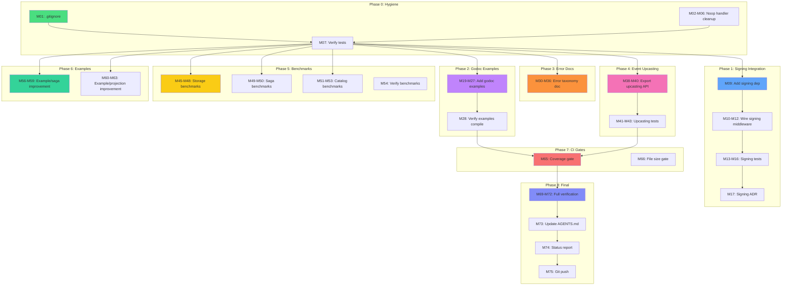

# Session 115 — Execution Plan: Quality & Integration Sprint

**Date:** 2026-05-28 07:31 CEST
**Branch:** master
**Status:** Clean tree, all 27 test suites pass, 0 lint issues

---

## Pareto Analysis

### 1% → 51% of Result

**Signing module integration into example/user.** The signing module is fully implemented but has zero consumers. Integrating it validates the API, demonstrates tamper-proof event streams to consumers, and eliminates the "ghost module" perception.

| Task | What | Why |
|------|------|-----|
| S1 | Add signing middleware to example/user event bus | Proves signing works end-to-end |
| S2 | Add verification on event read | Shows tamper detection |
| S3 | Test the integration | Trust but verify |

### 4% → 64% of Result

Add the "table stakes" that every serious Go library needs but this one is missing:

| Task | What | Why |
|------|------|-----|
| S4 | Add `.gitignore` for coverage.out, binary artifacts | Prevents accidental commits |
| S5 | Replace remaining 7 inline noop handlers with testhelpers | Consistency, reduces duplication |
| S6 | Verify signing module docs and ADR | Documents decisions |
| S7 | Add godoc examples for core public APIs | pkg.go.dev readiness |

### 20% → 80% of Result

Quality improvements that build consumer trust:

| Task | What | Why |
|------|------|-----|
| S8-S10 | Fill benchmark gaps (storage, saga, catalog) | Performance transparency |
| S11-S12 | Error taxonomy documentation + godoc | Consumer error handling guide |
| S13 | Event upcasting public API | Production event evolution |
| S14-S15 | Example app improvements (saga, projection) | Onboarding quality |
| S16 | CI coverage gate | Quality enforcement |
| S17 | Update AGENTS.md with all new features | Memory for AI sessions |

---

## Comprehensive Plan — 27 Tasks (30-100 min each)

| # | Task | Impact | Effort | Module | Depends |
|---|------|--------|--------|--------|---------|
| T1 | Add `.gitignore` for coverage.out and binaries | Medium | 15min | root | — |
| T2 | Replace 7 inline noop handlers with testhelpers | Medium | 30min | tests | — |
| T3 | Integrate signing into example/user: wire event bus middleware | High | 45min | example/user | — |
| T4 | Integrate signing into example/user: add verification on read | High | 30min | example/user | T3 |
| T5 | Test example/user signing integration | High | 30min | example/user | T3,T4 |
| T6 | Add signing ADR document | Medium | 30min | docs | T3 |
| T7 | Add godoc examples for event.NewEvent | Medium | 20min | core/event | — |
| T8 | Add godoc examples for decider.Decider | Medium | 20min | core/decider | — |
| T9 | Add godoc examples for command.Dispatcher | Medium | 15min | core/command | — |
| T10 | Add godoc examples for query.Dispatcher | Medium | 15min | core/query | — |
| T11 | Add godoc examples for catalog.Registry | Medium | 20min | catalog | — |
| T12 | Write error taxonomy documentation | Medium | 45min | docs | — |
| T13 | Expose event upcasting public API | High | 60min | core/event | — |
| T14 | Add upcasting tests | High | 30min | core/event | T13 |
| T15 | Fill benchmark gaps: storage | Medium | 30min | storage | — |
| T16 | Fill benchmark gaps: saga | Medium | 20min | saga | — |
| T17 | Fill benchmark gaps: catalog exporters | Medium | 20min | catalog | — |
| T18 | Improve example/saga: add real saga flow | Medium | 60min | example/saga | — |
| T19 | Improve example/projection: add real projection | Medium | 45min | example/projection | — |
| T20 | Add CI coverage gate (80% minimum) | Medium | 30min | CI | — |
| T21 | Add file size enforcement to CI (block on >350 lines) | Low | 15min | CI | — |
| T22 | Verify all godoc examples compile (`go test ./...`) | Medium | 15min | all | T7-T11 |
| T23 | Final integration test run (all modules, -race) | High | 15min | all | all |
| T24 | Update AGENTS.md with all new features | Medium | 20min | root | all |
| T25 | Write Session 115 status report | Medium | 15min | docs | all |
| T26 | Verify CI workflow passes with all changes | Medium | 15min | CI | all |
| T27 | Final git push | Low | 5min | — | all |

---

## Micro-Tasks — 75 Tasks (max 15 min each)

### Phase 0: Hygiene (T1-T2)

| # | Micro-Task | Est |
|---|-----------|-----|
| M01 | Create `.gitignore` with coverage.out, *.out, binary patterns | 5min |
| M02 | Replace noop handler in middleware/benchmark_test.go with testhelpers | 5min |
| M03 | Replace noop handler in projection/runner_test.go with testhelpers | 5min |
| M04 | Replace noop handler in projection/benchmark_test.go with testhelpers | 5min |
| M05 | Replace noop handler in integration/event/event_sourcing_bdd_test.go | 5min |
| M06 | Replace noop handlers in testhelpers/fake_bus_test.go (3 instances) | 10min |
| M07 | Verify all tests pass after noop handler replacements | 5min |
| M08 | Commit: hygiene improvements | 5min |

### Phase 1: Signing Integration (T3-T6)

| # | Micro-Task | Est |
|---|-----------|-----|
| M09 | Add signing dependency to example/user go.mod | 5min |
| M10 | Create example/user/signing.go with HMAC signer setup | 10min |
| M11 | Wire signing.PublishMiddleware into event bus in main.go | 10min |
| M12 | Add signing.VerifyMiddleware to event handler chain | 10min |
| M13 | Add signing_test.go for example/user signing flow | 10min |
| M14 | Test: verify events are signed on publish | 5min |
| M15 | Test: verify tamper detection works | 5min |
| M16 | Run all example/user tests | 5min |
| M17 | Write signing ADR at docs/adr/0008-signing-module.md | 10min |
| M18 | Commit: signing integration | 5min |

### Phase 2: Godoc Examples (T7-T11)

| # | Micro-Task | Est |
|---|-----------|-----|
| M19 | Add ExampleNewEvent godoc to core/event/event.go | 10min |
| M20 | Add ExampleNewEvent_withOptions godoc | 10min |
| M21 | Add ExampleDecider_Execute godoc to core/decider/decider.go | 10min |
| M22 | Add ExampleDecider_Load godoc | 10min |
| M23 | Add ExampleDispatcher_Register godoc to core/command/dispatcher.go | 10min |
| M24 | Add ExampleDispatcher_Use godoc (middleware chain) | 10min |
| M25 | Add ExampleDispatchTyped godoc to core/query/dispatcher.go | 10min |
| M26 | Add ExampleRegisterTyped godoc | 10min |
| M27 | Add ExampleRegistry_Register godoc to catalog/registry.go | 10min |
| M28 | Verify all godoc examples compile with `go test` | 5min |
| M29 | Commit: godoc examples | 5min |

### Phase 3: Error Taxonomy Docs (T12)

| # | Micro-Task | Est |
|---|-----------|-----|
| M30 | Create docs/error-taxonomy.md with 5-family overview | 10min |
| M31 | Add Rejection family details + code examples | 5min |
| M32 | Add Conflict family details + code examples | 5min |
| M33 | Add Transient family details + code examples | 5min |
| M34 | Add Infrastructure family details + code examples | 5min |
| M35 | Add Corruption family details + code examples | 5min |
| M36 | Add "How consumers should handle each family" section | 10min |
| M37 | Commit: error taxonomy documentation | 5min |

### Phase 4: Event Upcasting (T13-T14)

| # | Micro-Task | Est |
|---|-----------|-----|
| M38 | Export Upcaster interface and NewUpcaster constructor | 10min |
| M39 | Add UpcasterChain type for composing upcasters | 10min |
| M40 | Integrate upcasting into Store.Load path | 10min |
| M41 | Add UpcasterChain tests | 10min |
| M42 | Add integration test: event v1 → v2 migration | 10min |
| M43 | Add godoc example for upcasting | 5min |
| M44 | Commit: event upcasting public API | 5min |

### Phase 5: Benchmarks Gaps (T15-T17)

| # | Micro-Task | Est |
|---|-----------|-----|
| M45 | Add benchmarks for storage/SQLEventStore.Save | 10min |
| M46 | Add benchmarks for storage/SQLEventStore.Load | 10min |
| M47 | Add benchmarks for storage/PebbleEventStore.Save | 10min |
| M48 | Add benchmarks for storage/PebbleEventStore.Load | 10min |
| M49 | Add benchmarks for saga/Runner.Execute | 10min |
| M50 | Add benchmarks for saga/Definition.Compile | 5min |
| M51 | Add benchmarks for catalog Registry.Register | 5min |
| M52 | Add benchmarks for catalog AsyncAPI export | 5min |
| M53 | Add benchmarks for catalog EventCatalog export | 5min |
| M54 | Verify all benchmarks run | 5min |
| M55 | Commit: benchmark gaps filled | 5min |

### Phase 6: Example App Improvements (T18-T19)

| # | Micro-Task | Est |
|---|-----------|-----|
| M56 | Improve example/saga: add OrderSaga with compensation | 10min |
| M57 | Add saga state definitions for OrderSaga | 10min |
| M58 | Wire saga into example/saga main.go | 10min |
| M59 | Add example/saga/main_test.go | 10min |
| M60 | Improve example/projection: add real OrderProjection | 10min |
| M61 | Add projection builder with On[T] pattern | 10min |
| M62 | Wire projection into example/projection main.go | 10min |
| M63 | Add example/projection/main_test.go | 10min |
| M64 | Commit: example app improvements | 5min |

### Phase 7: CI Quality Gates (T20-T21)

| # | Micro-Task | Est |
|---|-----------|-----|
| M65 | Add coverage threshold check to CI workflow | 10min |
| M66 | Add file size check to CI (fail on >350 lines) | 10min |
| M67 | Verify CI workflow YAML is valid | 5min |
| M68 | Commit: CI quality gates | 5min |

### Phase 8: Final Verification & Docs (T22-T27)

| # | Micro-Task | Est |
|---|-----------|-----|
| M69 | Run full test suite with -race flag | 10min |
| M70 | Run full benchmark suite to verify no panics | 5min |
| M71 | Run lint across all modules | 5min |
| M72 | Run build across all modules | 5min |
| M73 | Update AGENTS.md with signing, upcasting, benchmarks | 10min |
| M74 | Write Session 115 status report | 10min |
| M75 | Final git push | 5min |

---

## Execution Graph

---

## What's NOT in this plan (deferred or blocked)

| Item | Why deferred |
|------|-------------|
| Push v1.0.0 tags | Needs user decision on versioning strategy |
| PostgreSQL/Turso integration tests | Needs running database infrastructure |
| Generic middleware factory | Risk of over-engineering; current dedup is sufficient |
| Event encryption | Needs design decision (key management) |
| OpenTelemetry actual spans | Needs design decision (span names, attributes) |
| Watermill DLQ handler | Needs design decision |
| Saga SQL state store | Needs design decision (schema) |
| Pre-commit hook fixes (D items) | Handled in separate project per user |
| Golden file flakiness (D items) | Handled in separate project per user |
