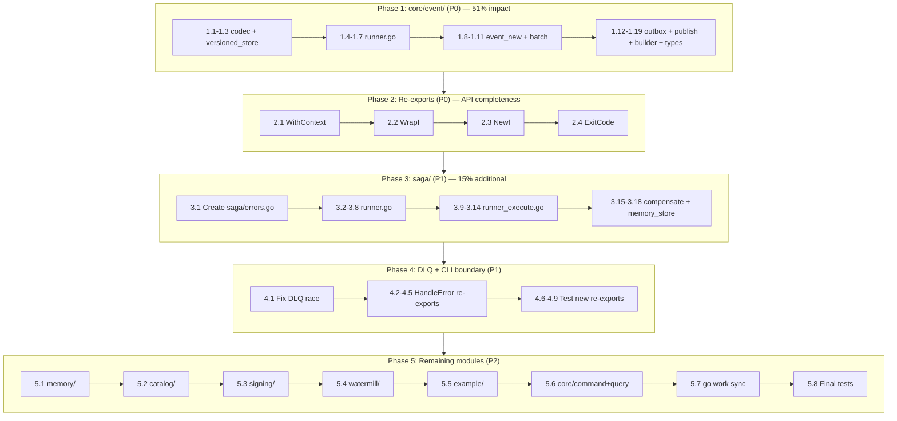

# go-error-family v0.2.0 Maximization Plan

**Date:** 2026-05-28 13:08
**Context:** We upgraded to `github.com/larsartmann/go-error-family v0.2.0` but only leverage ~30% of its API surface. 181 `fmt.Errorf` wraps remain in production code, and 7 key API functions are not re-exported for consumers.

---

## Pareto Analysis

### The 1% that delivers 51% of the result

**core/event/ — 21 `fmt.Errorf` wraps → structured `Wrap*`**

This is the most consumer-facing module. Every library consumer imports `core/event`. When core/event produces plain `fmt.Errorf` errors, consumers lose:

- Automatic family classification (`Classify(err)` → `Transient` instead of meaningful families)
- Retry behavior (`IsRetryable` can't inspect plain errors)
- Error codes for programmatic handling
- Contextual metadata (`.WithContext()` unavailable on plain errors)

**Add `WithContext` standalone re-export**

One function, one line, completes the fluent API. Currently consumers must import `errorfamily` directly to use `WithContext` on wrapped errors.

### The 4% that delivers 64% of the result (additional)

**saga/ — 17 `fmt.Errorf` wraps → structured `Wrap*`**

saga is the second-most consumer-facing module with structured error gaps. Converting these wraps ensures saga errors are classifiable and retryable.

**Add `Wrapf`, `Newf`, `ExitCode` re-exports**

- `Wrapf`/`Newf` eliminate `fmt.Sprintf` boilerplate before wrapping
- `ExitCode` enables CLI boundary handling without importing errorfamily directly

### The 20% that delivers 80% of the result (additional)

**Fix DLQ test race** (`projection/runner_dlq_test.go:154`)

`callCount int` accessed from multiple goroutines. Race detector will eventually catch this.

**Add `HandleError`, `HandleErrorDetailed`, `RegisterTemplate` re-exports**

Enables the full CLI boundary handler pattern from errorfamily v0.2.0 for consumers.

**Convert memory/ (19), catalog/ (29) wraps**

Test and catalog modules still produce plain errors. While lower consumer impact, they create inconsistency in the developer experience.

### The remaining 80% of work (lower priority)

- signing/ (24 wraps)
- example/ (51 wraps)
- watermill/ (8 wraps)
- core/command/ + core/query/ (10 wraps)
- go work sync + go mod tidy

---

## Comprehensive Plan (30-100min tasks)

| #   | Task                                                                                               | Est.  | Priority | Impact               |
| --- | -------------------------------------------------------------------------------------------------- | ----- | -------- | -------------------- |
| 1   | Convert core/event/codec.go + versioned_store.go wraps (4 wraps)                                   | 45min | P0       | Consumer-facing      |
| 2   | Convert core/event/runner.go wraps (4 wraps)                                                       | 30min | P0       | Consumer-facing      |
| 3   | Convert core/event/event_new.go + batch.go wraps (4 wraps)                                         | 30min | P0       | Consumer-facing      |
| 4   | Convert core/event/outbox_publisher.go + publish_helper.go + builder.go + types.go wraps (8 wraps) | 45min | P0       | Consumer-facing      |
| 5   | Add missing re-exports: `WithContext`, `Wrapf`, `Newf`, `ExitCode`                                 | 30min | P0       | API completeness     |
| 6   | Convert saga/runner.go + runner_execute.go wraps (13 wraps)                                        | 45min | P1       | Consumer-facing      |
| 7   | Convert saga/compensate.go + memory_store.go wraps (4 wraps)                                       | 30min | P1       | Consumer-facing      |
| 8   | Fix DLQ test race (`callCount` → `atomic.Int32`)                                                   | 30min | P1       | Test quality         |
| 9   | Add `HandleError`, `HandleErrorDetailed`, `RegisterTemplate` re-exports                            | 30min | P1       | CLI boundary         |
| 10  | Write tests for new re-exports (`WithContext`, `Wrapf`, `Newf`, `ExitCode`, `HandleError`)         | 60min | P1       | Test coverage        |
| 11  | Convert memory/ all 19 fmt.Errorf wraps                                                            | 60min | P2       | Internal consistency |
| 12  | Convert catalog/ all 29 fmt.Errorf wraps                                                           | 60min | P2       | Internal consistency |
| 13  | Convert signing/ all 24 fmt.Errorf wraps                                                           | 45min | P2       | Internal consistency |
| 14  | Convert watermill/ all 8 fmt.Errorf wraps                                                          | 30min | P2       | Internal consistency |
| 15  | Convert example/ all 51 fmt.Errorf wraps                                                           | 60min | P2       | Example quality      |
| 16  | Convert core/command/ + core/query/ 10 fmt.Errorf wraps                                            | 30min | P2       | Core consistency     |
| 17  | Run go work sync + go mod tidy + final test verification                                           | 30min | P2       | Build hygiene        |

**Total estimated time:** 12 hours 30 minutes

---

## Detailed Plan (≤15min tasks)

### Phase 1: core/event/ — 21 wraps (P0)

| #    | Task                                                                       | Est.  | File                |
| ---- | -------------------------------------------------------------------------- | ----- | ------------------- |
| 1.1  | Convert codec.go:48 decode payload wrap → `WrapCorruption`                 | 10min | codec.go            |
| 1.2  | Convert codec.go:62 decode payloads wrap → `WrapCorruption`                | 10min | codec.go            |
| 1.3  | Convert versioned_store.go:72 upcast wrap → `WrapCorruption`               | 10min | versioned_store.go  |
| 1.4  | Convert runner.go:90 projection handle wrap → `WrapInfrastructure`         | 10min | runner.go           |
| 1.5  | Convert runner.go:95 checkpoint save wrap → `WrapInfrastructure`           | 10min | runner.go           |
| 1.6  | Convert runner.go:181 parallel canceled wrap → `WrapTransient`             | 10min | runner.go           |
| 1.7  | Convert runner.go:203 checkpoint save parallel wrap → `WrapInfrastructure` | 10min | runner.go           |
| 1.8  | Convert event_new.go:31 nil payload wrap → `WrapRejection`                 | 10min | event_new.go        |
| 1.9  | Convert event_new.go:42 marshal payload wrap → `WrapCorruption`            | 10min | event_new.go        |
| 1.10 | Convert batch.go:39 marshal payload wrap → `WrapCorruption`                | 10min | batch.go            |
| 1.11 | Convert batch.go:51 create event wrap → `WrapCorruption`                   | 10min | batch.go            |
| 1.12 | Convert outbox_publisher.go:174 poll pending wrap → `WrapInfrastructure`   | 10min | outbox_publisher.go |
| 1.13 | Convert outbox_publisher.go:197 ack entries wrap → `WrapInfrastructure`    | 10min | outbox_publisher.go |
| 1.14 | Convert outbox_publisher.go:202 publish events wrap → `WrapInfrastructure` | 10min | outbox_publisher.go |
| 1.15 | Convert publish_helper.go:21 stage outbox wrap → `WrapInfrastructure`      | 10min | publish_helper.go   |
| 1.16 | Convert publish_helper.go:26 publish events wrap → `WrapInfrastructure`    | 10min | publish_helper.go   |
| 1.17 | Convert publish_helper.go:51 save snapshot wrap → `WrapInfrastructure`     | 10min | publish_helper.go   |
| 1.18 | Convert builder.go:74 build event wrap → `WrapCorruption`                  | 10min | builder.go          |
| 1.19 | Convert types.go:56 invalid IP wrap → `WrapRejection`                      | 10min | types.go            |

### Phase 2: Re-exports (P0)

| #   | Task                                        | Est. | File      |
| --- | ------------------------------------------- | ---- | --------- |
| 2.1 | Add `WithContext` standalone func re-export | 5min | errors.go |
| 2.2 | Add `Wrapf` re-export                       | 5min | errors.go |
| 2.3 | Add `Newf` re-export                        | 5min | errors.go |
| 2.4 | Add `ExitCode` re-export                    | 5min | errors.go |

### Phase 3: saga/ — 17 wraps (P1)

| #    | Task                                                                          | Est.  | File              |
| ---- | ----------------------------------------------------------------------------- | ----- | ----------------- |
| 3.1  | Convert saga sentinels to errorfamily (create errors.go)                      | 15min | errors.go         |
| 3.2  | Convert runner.go:43 nil definition wrap → `WrapRejection`                    | 10min | runner.go         |
| 3.3  | Convert runner.go:48 empty saga type wrap → `WrapRejection`                   | 10min | runner.go         |
| 3.4  | Convert runner.go:52 saga exists wrap → `WrapConflict`                        | 10min | runner.go         |
| 3.5  | Convert runner.go:70 saga not registered wrap → `WrapRejection`               | 10min | runner.go         |
| 3.6  | Convert runner.go:83 save saga state wrap → `WrapInfrastructure`              | 10min | runner.go         |
| 3.7  | Convert runner.go:88 update saga status wrap → `WrapInfrastructure`           | 10min | runner.go         |
| 3.8  | Convert runner.go:106 dispatch initial command wrap → `WrapInfrastructure`    | 10min | runner.go         |
| 3.9  | Convert runner_execute.go:18 load saga wrap → `WrapInfrastructure`            | 10min | runner_execute.go |
| 3.10 | Convert runner_execute.go:70 save compensating wrap → `WrapInfrastructure`    | 10min | runner_execute.go |
| 3.11 | Convert runner_execute.go:77 save failed wrap → `WrapInfrastructure`          | 10min | runner_execute.go |
| 3.12 | Convert runner_execute.go:80 step failed wrap → `WrapInfrastructure`          | 10min | runner_execute.go |
| 3.13 | Convert runner_execute.go:92 save step completion wrap → `WrapInfrastructure` | 10min | runner_execute.go |
| 3.14 | Convert runner_execute.go:114 saga not registered wrap → `WrapRejection`      | 10min | runner_execute.go |
| 3.15 | Convert compensate.go:24 compensate step wrap → `WrapInfrastructure`          | 10min | compensate.go     |
| 3.16 | Convert compensate.go:42 save compensated wrap → `WrapInfrastructure`         | 10min | compensate.go     |
| 3.17 | Convert memory_store.go:30 nil state wrap → `WrapRejection`                   | 10min | memory_store.go   |
| 3.18 | Convert memory_store.go:45 saga not found wrap → `WrapRejection`              | 10min | memory_store.go   |

### Phase 4: DLQ + CLI boundary (P1)

| #   | Task                                                                                        | Est.  | File                    |
| --- | ------------------------------------------------------------------------------------------- | ----- | ----------------------- |
| 4.1 | Fix DLQ test race (`callCount` → `atomic.Int32`)                                            | 15min | runner_dlq_test.go      |
| 4.2 | Add `HandleError` re-export                                                                 | 5min  | errors.go               |
| 4.3 | Add `HandleErrorDetailed` re-export                                                         | 5min  | errors.go               |
| 4.4 | Add `RegisterTemplate` re-export                                                            | 5min  | errors.go               |
| 4.5 | Add type aliases for `HandleResult`, `HandleConfig`, `MessageTemplate`, `DiagnosticFinding` | 10min | errors.go               |
| 4.6 | Test `WithContext` re-export                                                                | 10min | errors_taxonomy_test.go |
| 4.7 | Test `Wrapf`/`Newf` re-exports                                                              | 10min | errors_taxonomy_test.go |
| 4.8 | Test `ExitCode` re-export                                                                   | 10min | errors_taxonomy_test.go |
| 4.9 | Test `HandleError`/`HandleErrorDetailed` re-exports                                         | 15min | errors_taxonomy_test.go |

### Phase 5: Remaining modules (P2)

| #   | Task                                         | Est.  | Module    |
| --- | -------------------------------------------- | ----- | --------- |
| 5.1 | Convert memory/ 19 wraps                     | 60min | memory    |
| 5.2 | Convert catalog/ 29 wraps                    | 60min | catalog   |
| 5.3 | Convert signing/ 24 wraps                    | 45min | signing   |
| 5.4 | Convert watermill/ 8 wraps                   | 30min | watermill |
| 5.5 | Convert example/ 51 wraps                    | 60min | example   |
| 5.6 | Convert core/command/ + core/query/ 10 wraps | 30min | core      |
| 5.7 | Run go work sync + go mod tidy               | 15min | all       |
| 5.8 | Final test verification (all modules)        | 15min | all       |

---

## Mermaid Execution Graph

---

## Wrap Family Selection Strategy

| Context                     | Family           | Rationale                       |
| --------------------------- | ---------------- | ------------------------------- |
| nil/empty input validation  | `Rejection`      | Bad input, don't retry          |
| JSON marshal/unmarshal      | `Corruption`     | Data damaged, not self-healable |
| Database/transaction errors | `Infrastructure` | External system failure         |
| Version conflicts           | `Conflict`       | Concurrent modification         |
| Context cancellation        | `Transient`      | Temporary, caller may retry     |
| Not found lookups           | `Rejection`      | Resource doesn't exist          |
| Already exists              | `Conflict`       | Duplicate detected              |

---

## Verification Checklist

- [ ] All `fmt.Errorf("...: %w", err)` in core/event/ converted to `Wrap*`
- [ ] All `fmt.Errorf("...: %w", err)` in saga/ converted to `Wrap*`
- [ ] `core/event/errors.go` includes: `WithContext`, `Wrapf`, `Newf`, `ExitCode`, `HandleError`, `HandleErrorDetailed`, `RegisterTemplate`
- [ ] DLQ test race fixed (`callCount` → `atomic.Int32`)
- [ ] Tests for all new re-exports
- [ ] `go test ./...` passes for all modules
- [ ] `nix run .#test` passes
- [ ] `nix run .#lint` passes
