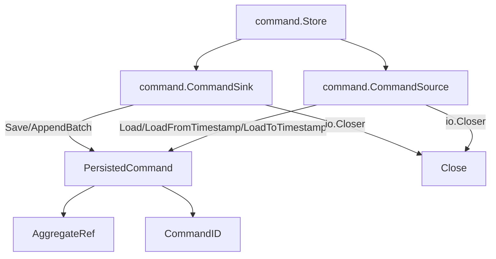
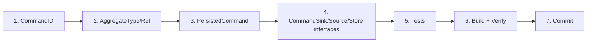

# Command Store — ISP Split (Sink + Source)

**Date:** 2026-05-29_13-23
**Status:** Implemented

## Problem

The `event` package has a clean ISP split: `EventSink` (write), `EventSource` (read), `Store` (composite). The `command` package had no equivalent — only an in-memory `Dispatcher`. No command persistence, no audit trail, no replay.

## Solution

Mirror the `event.Store` pattern for commands:

## New Types

| Type | File | Purpose |
|------|------|---------|
| `CommandID` | `core/pkg/id/command_id.go` | Branded ULID for command identity |
| `AggregateType` | `core/command/aggregate_ref.go` | Type-safe aggregate type (mirrors event.AggregateType) |
| `AggregateRef` | `core/command/aggregate_ref.go` | AggregateType + AggregateID composite key |
| `PersistedCommand` | `core/command/store.go` | Immutable persisted command with ID, timestamp, payload |
| `CommandSink` | `core/command/store.go` | Write interface: Save (idempotent), AppendBatch |
| `CommandSource` | `core/command/store.go` | Read interface: Load, LoadFromTimestamp, LoadToTimestamp |
| `Store` | `core/command/store.go` | Composite of Sink + Source |

## Key Design Decisions

1. **No `Version` on commands** — Commands are a time-ordered log, not a versioned stream. `LoadFromTimestamp`/`LoadToTimestamp` instead of `LoadFromVersion`.
2. **No `expectedVersion` on Save** — Commands don't participate in aggregate concurrency.
3. **`PersistedCommand` is separate from `Command`** — The lightweight `Command` interface stays unchanged for dispatch. `PersistedCommand` adds persistence metadata (ID, receivedAt, payload). Same pattern as `ImmutableEvent`.
4. **`Save` is idempotent by CommandID** — Commands are often retried. Duplicate IDs return `ErrDuplicateCommand`.
5. **Payload isolation** — `PersistedCommand.Payload()` returns a defensive copy, same as `ImmutableEvent.Payload()`.

## Execution Graph

## Files Changed

- `core/pkg/id/command_id.go` — NEW
- `core/command/aggregate_ref.go` — NEW
- `core/command/store.go` — NEW
- `core/command/store_test.go` — NEW
- `core/command/errors.go` — MODIFIED (added 4 new sentinels)

## Test Coverage

17 new tests covering:
- PersistedCommand construction + validation (7 tests)
- Payload isolation (1 test)
- Option functions: WithReceivedAt, WithCommandID (2 tests)
- AggregateType parsing + validation (3 tests)
- CommandID roundtrip + error cases (3 tests)
- Store interface compile-time check (1 test)
