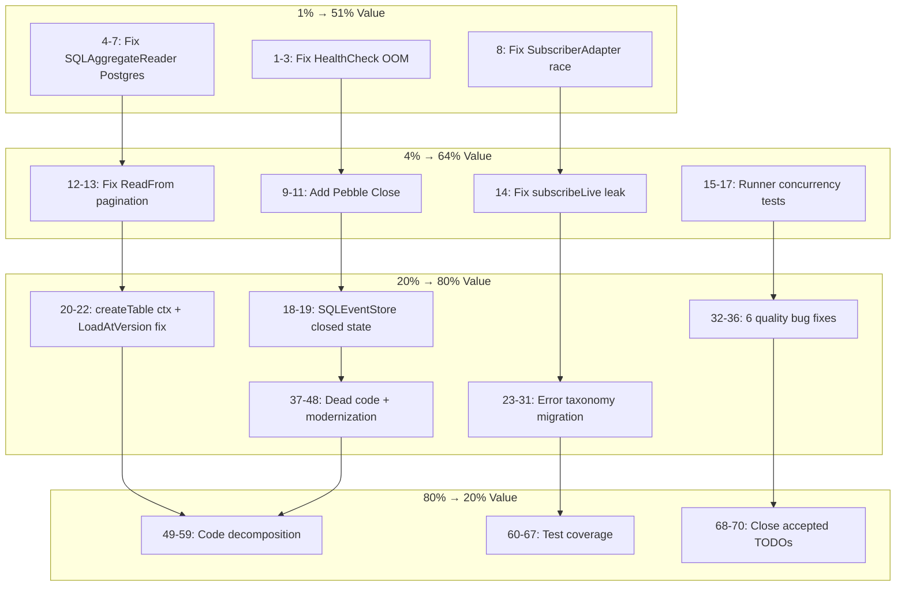

# V2.0.0 Post-Release Execution Plan — Pareto Prioritized

**Created:** 2026-06-02 14:16 CEST
**Philosophy:** 1% effort → 51% value, then 4% → 64%, then 20% → 80%

---

## Pareto Analysis

### The 1% that delivers 51% of the result (3 tasks, ~30 min)

Fix the bugs that will **break production for real consumers**:

| #   | Task                                                  | Why it's 51%                                                 |
| --- | ----------------------------------------------------- | ------------------------------------------------------------ |
| 1   | Fix HealthCheck OOM (ReadAll → checkpoint ping)       | Every K8s user with >100K events gets OOM on liveness probes |
| 2   | Fix SQLAggregateReader `?` → Dialect.Placeholder      | Every PostgreSQL user gets immediate runtime failure         |
| 3   | Fix HealthCheck fmt.Errorf → event.WrapInfrastructure | Part of #1, completes the fix properly                       |

### The 4% that delivers 64% of the result (4 tasks, ~40 min)

Fix the bugs that bite **specific but common consumer patterns**:

| #   | Task                                            | Why it's next 13%                             |
| --- | ----------------------------------------------- | --------------------------------------------- |
| 4   | Fix SubscriberAdapter map race: add mutex       | Multi-topic Watermill routers panic           |
| 5   | Add Pebble Close() method                       | Long-running processes leak DB handles        |
| 6   | Fix ReadFrom pagination: proper cursor ordering | High-throughput projection replay correctness |
| 7   | Fix subscribeLive handler leak                  | Stale handlers fire on stopped runners        |

### The 20% that delivers 80% of the result (10 tasks, ~120 min)

Fix **quality issues that erode trust** when consumers read the code:

| #   | Task                                                                                 | Why it's the next 16%                      |
| --- | ------------------------------------------------------------------------------------ | ------------------------------------------ |
| 8   | Fix SQLEventStore closed state tracking                                              | Confusing errors after Close()             |
| 9   | Fix decider opError → event.Wrap\* taxonomy                                          | Inconsistent error handling in core path   |
| 10  | Fix schema/versioned_source → event.Wrap\* taxonomy                                  | Same inconsistency in schema evolution     |
| 11  | Fix codec/raw.go: add json.RawMessage case                                           | Comment promises what code doesn't deliver |
| 12  | Fix Version.Sub negative guard                                                       | Silent corruption potential                |
| 13  | Remove dead code (4 items: ErrUnknownBackend, return nil, TombstoneInclude, aliases) | Trust erosion — "is this maintained?"      |
| 14  | Fix catalog GetID dishonest Name fallback                                            | Surprising behavior                        |
| 15  | Fix ToAny error swallowing in catalog/schema                                         | Silent data loss                           |
| 16  | Fix HasSignature error swallowing in signing                                         | Silent corruption detection miss           |
| 17  | Replace dispatchParallel manual semaphore → errgroup.SetLimit                        | Modern Go idiom, simpler code              |

### The remaining 80% that delivers 20% of the result

Everything else in the full plan (phases 4-10) — error taxonomy migration for remaining packages, code decomposition, test coverage, architecture changes, CI improvements, benchmarks, docs.

---

## Comprehensive Plan — 27 Tasks (30-100 min each)

Sorted by Impact → Effort → Customer Value

| #   | Phase | Task                                                                                                                                         | I   | E   | Time |
| --- | ----- | -------------------------------------------------------------------------------------------------------------------------------------------- | --- | --- | ---- |
| 1   | P1    | **CRITICAL: Fix HealthCheck OOM + WrapInfrastructure** — replace ReadAll with checkpoint-only ping                                           | 1   | S   | 30m  |
| 2   | P1    | **CRITICAL: Fix SQLAggregateReader Postgres compat** — inject Dialect, use Placeholder(n)                                                    | 1   | S   | 30m  |
| 3   | P1    | **CRITICAL: Fix SubscriberAdapter map race** — add sync.Mutex to handlers                                                                    | 1   | S   | 30m  |
| 4   | P1    | **Add Pebble Close() method** — close DB, document lock cleanup                                                                              | 1   | S   | 30m  |
| 5   | P1    | **Fix ReadFrom pagination** — WHERE occurred_at >= subquery OR id > cursor, ORDER BY occurred_at, id                                         | 1   | M   | 45m  |
| 6   | P1    | **Fix subscribeLive handler leak** — unsubscribe on context cancel                                                                           | 1   | M   | 45m  |
| 7   | P1    | **Add Runner concurrency tests** — Register+Run, Run+Close, Close before Run                                                                 | 1   | S   | 30m  |
| 8   | P2    | **Fix SQLEventStore closed state** — add closed flag + CheckClosed to all methods                                                            | 2   | S   | 30m  |
| 9   | P2    | **Fix createTable context.Background** — accept ctx param                                                                                    | 2   | S   | 30m  |
| 10  | P2    | **Fix LoadAtVersion snapshot SQL** — add version filter to query                                                                             | 2   | S   | 30m  |
| 11  | P2    | **Error taxonomy: decider + schema + codec + listing + projection** — replace fmt.Errorf with Wrap\*                                         | 3   | M   | 60m  |
| 12  | P2    | **Error taxonomy: storage + watermill + id + command + query** — replace fmt.Errorf with Wrap\*                                              | 3   | M   | 60m  |
| 13  | P2    | **Fix 6 quality bugs** — Version.Sub guard, codec raw, GetID fallback, ToAny, HasSignature, createTable ctx                                  | 2   | S   | 30m  |
| 14  | P2    | **Remove 4 dead code items** — ErrUnknownBackend, return nil after switch, TombstoneInclude case, deprecation comments                       | 3   | S   | 30m  |
| 15  | P3    | **Replace dispatchParallel → errgroup.SetLimit**                                                                                             | 3   | S   | 30m  |
| 16  | P3    | **Decompose watermill messageToEvent** (81L → 3 funcs)                                                                                       | 3   | M   | 45m  |
| 17  | P3    | **Decompose projection replay** (64L → 2 funcs)                                                                                              | 3   | S   | 30m  |
| 18  | P3    | **Decompose storage ListWithStatus** (112L → 3 funcs) + fix Dialect usage                                                                    | 3   | M   | 60m  |
| 19  | P3    | **Deduplicate: NewEvents→New, writeIDListField, FilterEventTypes, schema loads, memory locks**                                               | 3   | M   | 60m  |
| 20  | P3    | **Move test helpers out of production code** — NewTestCreateOrderFlow to test file                                                           | 3   | S   | 30m  |
| 21  | P3    | **Library modernization** — filepath.WalkDir (2), fmt.Appendf (1), range int (1), unnecessary type args (6), parser.ParseDir→go/packages (1) | 3   | S   | 30m  |
| 22  | P3    | **Signing VerifyFunc pattern** — unify signing/middleware.go + multisig/middleware.go                                                        | 3   | M   | 45m  |
| 23  | P4    | **Close 3 accepted TODOs** — command re-exports, event cycles, pebble vs sql sentinels                                                       | 3   | S   | 30m  |
| 24  | P4    | **Turso test coverage** — CRUD + error paths (28.6% → 70%+)                                                                                  | 2   | M   | 60m  |
| 25  | P4    | **Storage test coverage** — error paths (72.7% → 85%+)                                                                                       | 2   | M   | 60m  |
| 26  | P4    | **Listing SQL reader tests**                                                                                                                 | 2   | S   | 30m  |
| 27  | P4    | **Projection coverage 95%+** + BDD for Version/SchemaVersion/Pagination                                                                      | 3   | M   | 60m  |

**Total: 27 tasks, ~18 hours**

---

## Fine-Grained Breakdown — 83 Tasks (max 15 min each)

### Phase 1: Critical Production Bugs (7 tasks × 15 min = ~2h)

| #   | Task                                                                | Est | Files                             |
| --- | ------------------------------------------------------------------- | --- | --------------------------------- |
| 1   | Fix HealthCheck: remove ReadAll, use checkpoint ping only           | 10m | `projection/health.go`            |
| 2   | Fix HealthCheck: change fmt.Errorf to event.WrapInfrastructure      | 5m  | `projection/health.go`            |
| 3   | Add test for HealthCheck no-longer-calls-ReadAll                    | 10m | `projection/health_test.go`       |
| 4   | Fix SQLAggregateReader: add Dialect field to struct                 | 5m  | `storage/sql_aggregate_reader.go` |
| 5   | Fix SQLAggregateReader: replace all `?` with Dialect.Placeholder(n) | 10m | `storage/sql_aggregate_reader.go` |
| 6   | Fix SQLAggregateReader: update constructor to accept Dialect        | 5m  | `storage/sql_aggregate_reader.go` |
| 7   | Fix SQLAggregateReader: update callers + test                       | 10m | `storage/`, `turso/`              |
| 8   | Fix SubscriberAdapter: add sync.Mutex, protect handlers map         | 10m | `watermill/subscriber.go`         |
| 9   | Add Pebble Close(): close underlying DB                             | 10m | `pebble/store.go`                 |
| 10  | Add Pebble Close(): update go.mod if needed                         | 5m  | `pebble/go.mod`                   |
| 11  | Test Pebble Close()                                                 | 10m | `pebble/store_test.go`            |
| 12  | Fix ReadFrom: rewrite SQL query with cursor-based pagination        | 15m | `storage/event_store_global.go`   |
| 13  | Test ReadFrom pagination correctness                                | 10m | `storage/`                        |
| 14  | Fix subscribeLive: call Unsubscribe on context cancel               | 10m | `projection/runner_live.go`       |
| 15  | Add Runner concurrency test: Register+Run race                      | 10m | `projection/runner_test.go`       |
| 16  | Add Runner concurrency test: Run+Close race                         | 10m | `projection/runner_test.go`       |
| 17  | Add Runner concurrency test: Close before Run                       | 5m  | `projection/runner_test.go`       |

### Phase 2: Quality & Error Taxonomy (12 tasks × 15 min = ~3h)

| #   | Task                                                        | Est | Files                             |
| --- | ----------------------------------------------------------- | --- | --------------------------------- |
| 18  | Fix SQLEventStore: add closed atomic bool + CheckClosed     | 10m | `storage/event_store.go`          |
| 19  | Fix SQLEventStore: add CheckClosed to Save/Load/AppendBatch | 10m | `storage/event_store.go`          |
| 20  | Fix createTable: accept ctx param                           | 5m  | `storage/aggregate_projection.go` |
| 21  | Fix LoadAtVersion: add version filter to SQL query          | 10m | `storage/snapshot.go`             |
| 22  | Test LoadAtVersion SQL filter                               | 10m | `storage/`                        |
| 23  | Error taxonomy: decider/load.go opError → event.Wrap\*      | 10m | `decider/load.go`                 |
| 24  | Error taxonomy: schema/versioned_source.go (5 fmt.Errorf)   | 10m | `schema/versioned_source.go`      |
| 25  | Error taxonomy: codec/ (2 files)                            | 10m | `codec/json.go, raw.go`           |
| 26  | Error taxonomy: listing/ (3 files)                          | 10m | `listing/*.go`                    |
| 27  | Error taxonomy: projection/health.go                        | 5m  | `projection/health.go`            |
| 28  | Error taxonomy: storage/ (6 files)                          | 15m | `storage/*.go`                    |
| 29  | Error taxonomy: watermill/protocol.go (8 fmt.Errorf)        | 10m | `watermill/protocol.go`           |
| 30  | Error taxonomy: id/ (2 files)                               | 10m | `id/id.go, aggregate_id.go`       |
| 31  | Error taxonomy: command/dispatcher.go + query/dispatcher.go | 10m | `command/, query/`                |
| 32  | Fix Version.Sub: add negative guard like Decrement          | 5m  | `event/types.go`                  |
| 33  | Fix codec/raw.go: add json.RawMessage case                  | 5m  | `codec/raw.go`                    |
| 34  | Fix GetID: remove dishonest Name fallback                   | 5m  | `catalog/types.go`                |
| 35  | Fix ToAny: propagate errors instead of synthetic fallback   | 10m | `catalog/schema/reflect.go`       |
| 36  | Fix HasSignature: propagate ExtractSignature errors         | 10m | `signing/event.go`                |

### Phase 3: Dead Code & Modernization (10 tasks × 15 min = ~2.5h)

| #   | Task                                                       | Est | Files                                                                |
| --- | ---------------------------------------------------------- | --- | -------------------------------------------------------------------- |
| 37  | Remove dead ErrUnknownBackend sentinel                     | 5m  | `pebble/errors.go`                                                   |
| 38  | Remove dead return nil after exhaustive switch             | 5m  | `middleware/circuit_breaker.go`                                      |
| 39  | Remove dead TombstoneInclude case                          | 5m  | `listing/in_memory.go`                                               |
| 40  | Add deprecation comments to pebble backward-compat aliases | 5m  | `pebble/config.go`                                                   |
| 41  | Replace dispatchParallel → errgroup.SetLimit               | 10m | `projection/runner_live.go`                                          |
| 42  | Migrate filepath.Walk → WalkDir (cmd/cqrs-gen)             | 10m | `cmd/cqrs-gen/main.go`                                               |
| 43  | Migrate filepath.Walk → WalkDir (scripts/)                 | 10m | `scripts/go-mod-graph-local/main.go`                                 |
| 44  | Fix fmt.Appendf (eventtest)                                | 5m  | `event/eventtest/store_suite.go`                                     |
| 45  | Fix range over int (middleware test)                       | 5m  | `middleware/middleware_bdd_test.go`                                  |
| 46  | Remove unnecessary type args (6 LSP hints)                 | 10m | `middleware/metrics_otel.go, tracing_logging.go, command/, catalog/` |
| 47  | Migrate parser.ParseDir → go/packages                      | 10m | `cmd/api-stability/main.go`                                          |
| 48  | Fix otel TraceIDLogger name mismatch                       | 5m  | `otel/logging.go`                                                    |

### Phase 4: Code Decomposition (10 tasks × 15 min = ~2.5h)

| #   | Task                                                                       | Est | Files                                            |
| --- | -------------------------------------------------------------------------- | --- | ------------------------------------------------ |
| 49  | Decompose watermill messageToEvent (81L → buildMetadata + buildEvent)      | 15m | `watermill/protocol.go`                          |
| 50  | Decompose projection replay (64L → replayFromCheckpoint + replayFromStart) | 15m | `projection/runner.go`                           |
| 51  | Decompose storage ListWithStatus (112L → buildConditions + executeQuery)   | 15m | `storage/sql_aggregate_reader.go`                |
| 52  | Decompose catalog Export → writeEntities[T]                                | 15m | `catalog/eventcatalog/exporter.go`               |
| 53  | Deduplicate writeIDListField → use addObjectIDsListField                   | 10m | `catalog/eventcatalog/writer_frontmatter.go`     |
| 54  | Move NewTestCreateOrderFlow to test file                                   | 10m | `catalog/registry_helpers.go`                    |
| 55  | Deduplicate NewEvents → call New internally                                | 10m | `event/batch.go`                                 |
| 56  | Deduplicate schema 4 load methods → loadWithUpcasters helper               | 15m | `schema/versioned_source.go`                     |
| 57  | Unify signing VerifyFunc pattern                                           | 15m | `signing/middleware.go + multisig/middleware.go` |
| 58  | Deduplicate FilterEventTypes newTypeSet                                    | 5m  | `event/reactive.go`                              |
| 59  | Extract memory withRLock/withWLock helpers                                 | 10m | `memory/store.go, bus.go`                        |

### Phase 5: Test Coverage (6 tasks × 15 min = ~1.5h)

| #   | Task                                                    | Est | Files                      |
| --- | ------------------------------------------------------- | --- | -------------------------- |
| 60  | Listing SQL reader tests                                | 15m | `listing/`                 |
| 61  | Turso CRUD tests: Save, Load, LoadFromVersion           | 15m | `turso/`                   |
| 62  | Turso error path tests: invalid inputs, closed store    | 15m | `turso/`                   |
| 63  | Storage error path tests: closed store, invalid version | 15m | `storage/`                 |
| 64  | Storage aggregate reader tests                          | 15m | `storage/`                 |
| 65  | Projection coverage: replay edge cases                  | 15m | `projection/`              |
| 66  | BDD tests: Version, SchemaVersion                       | 10m | `event/types_test.go`      |
| 67  | BDD tests: Pagination                                   | 10m | `query/pagination_test.go` |

### Phase 6: Close Accepted TODOs (3 tasks × 15 min = ~45m)

| #   | Task                                                | Est | Files          |
| --- | --------------------------------------------------- | --- | -------------- |
| 68  | Close TODO: command re-exports (mark ACCEPTED)      | 5m  | `TODO_LIST.md` |
| 69  | Close TODO: event module cycles (mark ACCEPTED)     | 5m  | `TODO_LIST.md` |
| 70  | Close TODO: pebble vs sql sentinels (mark ACCEPTED) | 5m  | `TODO_LIST.md` |

---

## Execution Flow

---

## Summary Statistics

| Category        | Tasks  | Est Time |
| --------------- | ------ | -------- |
| 1% → 51% value  | 7      | 1.5h     |
| 4% → 64% value  | 10     | 2.5h     |
| 20% → 80% value | 29     | 7h       |
| 80% → 20% value | 37     | 7h       |
| **Total**       | **83** | **~18h** |

| Phase                     | Tasks | Time | Priority      |
| ------------------------- | ----- | ---- | ------------- |
| P1: Critical bugs         | 17    | 2.5h | 🔴 DO NOW     |
| P2: Quality + taxonomy    | 20    | 4h   | 🟠 DO NEXT    |
| P3: Dead code + modernize | 12    | 2.5h | 🟡 DO THEN    |
| P4: Decomposition         | 11    | 2.5h | 🟢 WHEN READY |
| P5: Test coverage         | 8     | 2h   | 🟢 WHEN READY |
| P6: Close TODOs           | 3     | 0.5m | 🟢 ANYTIME    |
