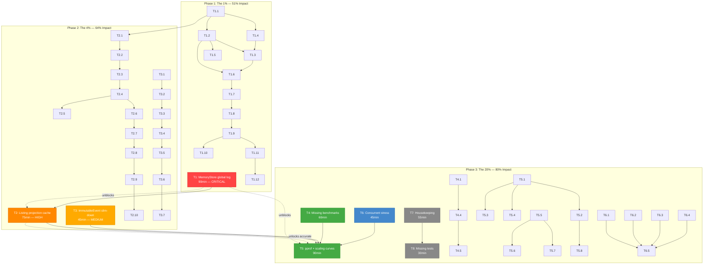

# Performance Optimization Plan — go-cqrs-lite

> Generated: 2026-06-03 02:25  
> Focus: **Benchmark-driven performance optimization** — measure, optimize, verify.  
> All tasks max 100min, split into subtasks max 15min.

---

## Pareto Analysis

### The 1% that delivers 51% of the result

**`MemoryStore.collectAllSorted()` is THE bottleneck.** Every `ReadAll()` and `ReadFrom()` call sorts ALL events from scratch. This single function is the root cause of:

- Listing: 840ms / 809MB for 10K aggregates (O(n log n) sort + full scan on every `List()`)
- Projection replay: `ReadFrom` does full sort + linear scan + double copy on every catch-up
- Every test that calls `ReadAll()` through any code path

**Fix**: Maintain an append-only `[]event.Event` global log sorted by insertion order. Events are saved with monotonically increasing timestamps (ULID-based IDs). No sort needed — just append.

**Impact**: Eliminates O(n log n) from the hottest path in the library. Cascading improvement to listing, projection, and all journal consumers.

---

### The 4% that delivers 64% of the result

1. **`MemoryStore.collectAllSorted()` fix** (the 1% above)
2. **Listing projection cache** — `InMemoryAggregateReader` should maintain a `map[streamKey]AggregateStatus` that updates on event publish, not rebuild from `ReadAll()` every time. Turns O(n log n) per `List()` into O(1) lookup + O(k log k) sort of the filtered page (where k = page size).
3. **`ImmutableEvent` dead weight** — `clock` (8B), `newCodec` (16B), `deadline` (24B) = **48 bytes of dead weight on every event**. Move to a separate `eventOptions` struct stored only when needed.

---

### The 20% that delivers 80% of the result

1-3 above, plus: 4. **Missing benchmarks** — `codec/`, `watermill/`, `turso/` have zero benchmarks. Can't optimize what you don't measure. 5. **pprof profiling** — Never used. We're guessing from alloc counts. CPU and mem profiles would reveal real hotspots. 6. **Scaling curves** — Bench at 1K → 10K → 100K → 1M. Shows where performance degrades non-linearly. 7. **GC pressure analysis** — 809MB for 10K aggregates. How much is GC pause vs work? 8. **Concurrent stress tests** — MemoryStore under contention, bus with many subscribers. 9. **Housekeeping** — deprecated API removal, doc fixes, untested code (FakeStore, api-stability).

---

## Phase 1: The 1% — MemoryStore Global Log (51% impact)

### T1: Replace `collectAllSorted()` with append-only global log

**Est: 90min | Impact: CRITICAL — root cause of all O(n log n) pain**

| #     | Subtask                                                                                                                        | Est   | Depends   |
| ----- | ------------------------------------------------------------------------------------------------------------------------------ | ----- | --------- |
| T1.1  | Add `globalLog []event.Event` field to MemoryStore, append in `Save()` and `AppendBatch()` under existing lock                 | 10min | -         |
| T1.2  | Replace `collectAllSorted()` — `ReadAll()` returns `copyEvents(s.globalLog)` (no sort)                                         | 5min  | T1.1      |
| T1.3  | Replace `ReadFrom()` — binary search on globalLog by event ID (maintain `map[id.EventID]int` index), slice from idx+1, no sort | 15min | T1.1      |
| T1.4  | Add `eventIDIndex map[id.EventID]int` to MemoryStore, maintained on Save/AppendBatch                                           | 10min | T1.1      |
| T1.5  | Handle `LoadBackwards` — if it uses `collectAllSorted`, fix it; otherwise verify it still works                                | 5min  | T1.2      |
| T1.6  | Run existing MemoryStore tests — verify all pass                                                                               | 5min  | T1.2-T1.4 |
| T1.7  | Run full test suite (`go test ./... -count=1`) — verify no regressions                                                         | 10min | T1.6      |
| T1.8  | Benchmark: `MemoryStore.ReadAll` at 1K/10K/100K events — compare before/after                                                  | 10min | T1.7      |
| T1.9  | Benchmark: `MemoryStore.ReadFrom` at 1K/10K/100K events — compare before/after                                                 | 10min | T1.8      |
| T1.10 | Benchmark: `MemoryStore.Save` — verify no regression from index maintenance                                                    | 5min  | T1.7      |
| T1.11 | Run scale benchmarks — verify listing + projection improvements                                                                | 10min | T1.9      |
| T1.12 | Update `docs/benchmarks/README.md` with before/after numbers                                                                   | 5min  | T1.11     |

---

## Phase 2: The 4% — Listing Cache + Event Slim-Down (64% impact)

### T2: InMemoryAggregateReader projection cache

**Est: 75min | Impact: HIGH — turns O(n) scan per List() into O(1)**

| #     | Subtask                                                                                     | Est   | Depends |
| ----- | ------------------------------------------------------------------------------------------- | ----- | ------- |
| T2.1  | Add `cache map[streamKey]AggregateStatus` field to InMemoryAggregateReader                  | 5min  | T1      |
| T2.2  | Add `eventBus *ro.Subject[event.Event]` field, subscribe in constructor                     | 10min | T2.1    |
| T2.3  | On each event: update `cache[streamKey]` with version, count, lastEventAt, tombstone status | 10min | T2.2    |
| T2.4  | `ListWithStatus()` — read from cache instead of `ReadAll()`, filter + sort + paginate       | 10min | T2.3    |
| T2.5  | Handle tombstone detection from last event's metadata in cache update                       | 5min  | T2.3    |
| T2.6  | Run listing tests — verify all pass                                                         | 5min  | T2.4    |
| T2.7  | Run full test suite — verify no regressions                                                 | 5min  | T2.6    |
| T2.8  | Benchmark: Listing at 1K/10K/100K aggregates — compare before/after                         | 10min | T2.7    |
| T2.9  | Run scale benchmarks — verify listing improvement                                           | 10min | T2.8    |
| T2.10 | Update docs/benchmarks/README.md                                                            | 5min  | T2.9    |

### T3: Slim down ImmutableEvent — remove 48B dead weight

**Est: 45min | Impact: MEDIUM — 48B per event × millions of events = real memory savings**

| #    | Subtask                                                                                       | Est   | Depends |
| ---- | --------------------------------------------------------------------------------------------- | ----- | ------- |
| T3.1 | Create `eventOptions` struct with `clock Clock`, `newCodec codec.Codec`, `deadline time.Time` | 5min  | -       |
| T3.2 | Move `clock`, `newCodec`, `deadline` from `ImmutableEvent` into `eventOptions`                | 5min  | T3.1    |
| T3.3 | Add `opts *eventOptions` pointer field to `ImmutableEvent` (nil most of the time)             | 5min  | T3.2    |
| T3.4 | Update all accessors (`Deadline()`, internal clock/newCodec usage) to go through `e.opts`     | 10min | T3.3    |
| T3.5 | Update `buildEvent()` / `NewEvent()` / `New()` to populate `eventOptions` only when needed    | 10min | T3.4    |
| T3.6 | Run full test suite — verify no regressions                                                   | 5min  | T3.5    |
| T3.7 | Benchmark: `NewEvent` and `New()` — compare struct size impact                                | 5min  | T3.6    |

---

## Phase 3: The 20% — Benchmarks, Profiling, Quality (80% impact)

### T4: Add missing benchmarks (codec, watermill, turso)

**Est: 60min | Impact: HIGH — can't optimize what you don't measure**

| #    | Subtask                                                                                                    | Est   | Depends   |
| ---- | ---------------------------------------------------------------------------------------------------------- | ----- | --------- |
| T4.1 | Add `codec/benchmark_test.go` — `BenchmarkJSON_Encode`, `BenchmarkJSON_Decode`, `BenchmarkRaw_Passthrough` | 15min | -         |
| T4.2 | Add `watermill/benchmark_test.go` — `BenchmarkPublish`, `BenchmarkSubscribe`                               | 15min | -         |
| T4.3 | Add `turso/benchmark_test.go` — `BenchmarkConnect`, `BenchmarkSync`                                        | 15min | -         |
| T4.4 | Run all new benchmarks, record baselines in `docs/benchmarks/README.md`                                    | 10min | T4.1-T4.3 |
| T4.5 | Verify no build/lint breakage                                                                              | 5min  | T4.4      |

### T5: pprof profiling + scaling curves

**Est: 90min | Impact: HIGH — reveals REAL bottlenecks, not guessed ones**

| #    | Subtask                                                                                             | Est   | Depends   |
| ---- | --------------------------------------------------------------------------------------------------- | ----- | --------- |
| T5.1 | Create `integration/pprof_bench_test.go` with CPU + mem profiling harness                           | 15min | -         |
| T5.2 | Profile `BenchmarkRealistic_FullPipeline` — analyze CPU profile                                     | 10min | T5.1      |
| T5.3 | Profile `BenchmarkRealistic_Listing` — analyze memory profile (809MB!)                              | 10min | T5.1      |
| T5.4 | Profile `BenchmarkRealistic_ProjectionReplay` — CPU + mem                                           | 10min | T5.1      |
| T5.5 | Create scaling curve benchmark: 1K/10K/100K/1M events across MemoryStore Save/Load/ReadAll/ReadFrom | 15min | T1        |
| T5.6 | Run scaling curves, plot throughput vs event count                                                  | 10min | T5.5      |
| T5.7 | Add GC pressure benchmark: measure `runtime.MemStats` before/after listing at scale                 | 10min | T5.5      |
| T5.8 | Document findings in `docs/benchmarks/`                                                             | 10min | T5.2-T5.7 |

### T6: Concurrent stress tests

**Est: 45min | Impact: MEDIUM — verify thread safety under real load**

| #    | Subtask                                                                              | Est   | Depends   |
| ---- | ------------------------------------------------------------------------------------ | ----- | --------- |
| T6.1 | Add `MemoryStore` concurrent write benchmark — N goroutines × Save                   | 10min | -         |
| T6.2 | Add `MemoryStore` concurrent read+write benchmark — writers + readers simultaneously | 10min | -         |
| T6.3 | Add `MemoryBus` publish benchmark with 10+ subscribers                               | 10min | -         |
| T6.4 | Add projection catchup-while-writing stress test                                     | 10min | -         |
| T6.5 | Run with `-race` flag, verify no data races                                          | 5min  | T6.1-T6.4 |

### T7: Housekeeping — fix quick wins

**Est: 55min | Impact: LOW — trust polish, not performance**

| #     | Subtask                                                                      | Est   | Depends   |
| ----- | ---------------------------------------------------------------------------- | ----- | --------- |
| T7.1  | Fix ADR numbering: renumber `0007-pebble-scope-event-store-only.md` → `0009` | 3min  | -         |
| T7.2  | Fix CONTRIBUTING.md: replace `just` references with `nix run`                | 5min  | -         |
| T7.3  | Fix `integration/go.mod`: `go mod tidy`                                      | 2min  | -         |
| T7.4  | Remove deprecated `otel.TraceIDLogger` — replace callers, delete             | 5min  | -         |
| T7.5  | Remove deprecated `query.ErrQueryNotSupported` — replace callers, delete     | 5min  | -         |
| T7.6  | Remove unused `backend` field from Pebble store                              | 3min  | -         |
| T7.7  | Clean up `pebble/config.go` backward-compat aliases (20 lines)               | 5min  | -         |
| T7.8  | Update `CHANGELOG.md` with all session work                                  | 10min | -         |
| T7.9  | Update `docs/benchmarks/README.md` with final numbers                        | 10min | T7.8      |
| T7.10 | Verify full test suite passes after all changes                              | 7min  | T7.1-T7.9 |

### T8: Missing test coverage

**Est: 30min | Impact: MEDIUM — untested public code**

| #    | Subtask                                                                                | Est   | Depends   |
| ---- | -------------------------------------------------------------------------------------- | ----- | --------- |
| T8.1 | Add tests for `event/eventtest/fake_store.go` — Save/Load/ReadAll/ReadFrom/AppendBatch | 15min | -         |
| T8.2 | Add tests for `cmd/api-stability/` — basic golden file comparison                      | 10min | -         |
| T8.3 | Verify no build breakage                                                               | 5min  | T8.1-T8.2 |

---

## Summary

| Phase           | Tasks      | Subtasks | Est         | Impact                                 |
| --------------- | ---------- | -------- | ----------- | -------------------------------------- |
| **P1**: The 1%  | 1 (T1)     | 12       | 90min       | 51% — eliminates O(n log n) root cause |
| **P2**: The 4%  | 2 (T2, T3) | 17       | 120min      | 64% — listing O(1), event 48B slimmer  |
| **P3**: The 20% | 5 (T4-T8)  | 23       | 280min      | 80% — benchmarks, profiling, quality   |
| **Total**       | **8**      | **52**   | **~490min** |                                        |

---

## Execution Graph

---

## Parallel Execution Strategy

Tasks that can run in parallel (no dependencies):

| Wave       | Tasks                                                         | Est                |
| ---------- | ------------------------------------------------------------- | ------------------ |
| **Wave 1** | T1 (MemoryStore global log)                                   | 90min              |
| **Wave 2** | T2 (Listing cache) + T3 (Event slim) + T4 (Benchmarks)        | 75+45+60=180min    |
| **Wave 3** | T5 (Profiling) + T6 (Stress) + T7 (Housekeeping) + T8 (Tests) | 90+45+55+30=220min |

**Critical path**: T1 → T2 → T5 = 255min

---

## Accepted Costs (NOT optimizing)

| Item                                        | Why                                                     |
| ------------------------------------------- | ------------------------------------------------------- |
| `&ImmutableEvent{...}` heap alloc           | Struct escapes to interface — fundamental Go limitation |
| `make([]byte, len(payload))` defensive copy | Library safety guarantee                                |
| `ID.String()` 3 allocs                      | External `go-branded-id` library                        |
| `Metadata()` clone                          | Map aliasing risk is real                               |
| `findCodecOption` probe                     | Requires breaking v2 API change                         |
| SQLite allocs                               | Pure Go SQL engine overhead                             |
| Ed25519 signing time                        | Crypto library, can't optimize                          |

---

## Blocked / Future Items

These are NOT in scope for this plan:

- BuildFlow pre-commit hook fix (deferred)
- Pebble `Journal`/`SeekableJournal` implementation
- `cqrs-gen` test coverage improvement
- `ROADMAP.md` creation
- Outbox pattern / Schema Registry design docs
- All P4 items from prior plan (blocked on external action or v2 cycle)
- Godoc examples
- nolint audit
- ADR for planned features
