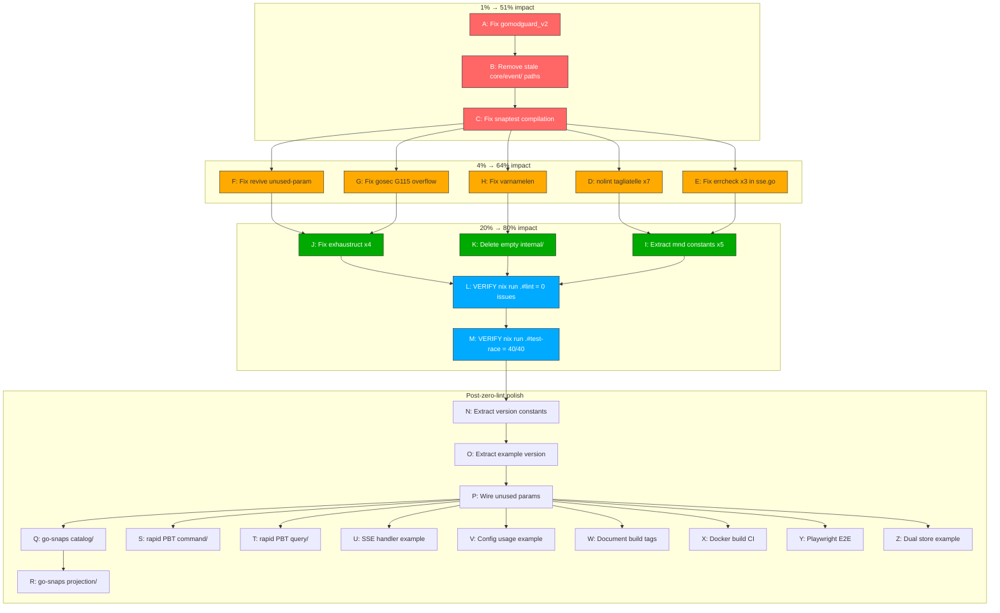

# Zero-Lint & Quality Gate Execution Plan

**Date:** 2026-06-08 02:38
**Status:** Actionable — execute in order
**Goal:** Zero lint issues, zero compilation errors, zero dead code, full CI green

---

## Pareto Analysis

### 1% that delivers 51% of the result (3 tasks, ~8 min)

| #   | Task                                                          | Why                                                                     |
| --- | ------------------------------------------------------------- | ----------------------------------------------------------------------- |
| A   | Fix `gomodguard_v2` → `gomodguard` in `.golangci.yml`         | **Blocks ALL LSP + lint across every file in the project** — 26+ errors |
| B   | Remove stale `core/event/` exclusion paths in `.golangci.yml` | Dead config referencing deleted module                                  |
| C   | Fix `snaptest.go:27` compilation error (`:=` → `=`)           | **Blocks snapshot testing entirely**                                    |

### 4% that delivers 64% of the result (+5 tasks, ~25 min)

| #   | Task                                                              | Why                                         |
| --- | ----------------------------------------------------------------- | ------------------------------------------- |
| D   | Add `//nolint:tagliatelle` to `MetricsSnapshot` (7 violations)    | Eliminates **7/22** lint issues in one shot |
| E   | Fix 3x `errcheck` in `sse.go` — handle `fmt.Fprintf` errors       | Eliminates **3/22**                         |
| F   | Fix `revive:unused-parameter` in `metrics_http.go:78` (`r` → `_`) | Eliminates **1/22**                         |
| G   | Fix `gosec:G115` integer overflow in `metrics_http.go:42`         | Security finding                            |
| H   | Fix `varnamelen` in `middleware/example_test.go` (`mw` → longer)  | Eliminates **1/22**                         |

### 20% that delivers 80% of the result (+5 tasks, ~25 min)

| #   | Task                                                                  | Why                 |
| --- | --------------------------------------------------------------------- | ------------------- |
| I   | Fix 5x `mnd` magic numbers in `middleware/` — extract named constants | Eliminates **5/22** |
| J   | Fix 4x `exhaustruct` in `middleware/` — add `//nolint` or zero-fill   | Eliminates **4/22** |
| K   | Delete empty `internal/` directory                                    | Dead directory      |
| L   | Run `nix run .#lint` → verify **0 issues**                            | Confidence gate     |
| M   | Run `nix run .#test-race` → verify **40/40 pass**                     | Confidence gate     |

After L+M: **22/22 lint issues resolved, 40/40 tests pass, zero data races.**

### The remaining 80% (post-zero-lint improvements)

These are **not required for zero-lint** but are listed for completeness.

| #   | Task                                                                                | Module     | Effort |
| --- | ----------------------------------------------------------------------------------- | ---------- | ------ |
| N   | Extract version string constant for `healthcheck_test.go` (hardcoded `"v2.2.0"` x4) | middleware | 5m     |
| O   | Extract version string for `example/user/server.go` (hardcoded `"v2.2.0"`)          | example    | 3m     |
| P   | Wire unused params in `example/user/server.go:runServer`                            | example    | 8m     |
| Q   | `go-snaps` snapshot tests on `catalog/` exports                                     | catalog    | 12m    |
| R   | `go-snaps` snapshot tests on `projection/`                                          | projection | 8m     |
| S   | `rapid` PBT on `command/`                                                           | command    | 10m    |
| T   | `rapid` PBT on `query/`                                                             | query      | 10m    |
| U   | SSE handler in `example/user/` + JS client                                          | example    | 12m    |
| V   | Config usage in `example/user/`                                                     | example    | 10m    |
| W   | Document experimental build tags                                                    | docs       | 10m    |
| X   | Docker build CI step (multi-arch)                                                   | CI         | 12m    |
| Y   | Playwright setup + health E2E                                                       | CI         | 60m    |
| Z   | Dual store runtime switching example                                                | example    | 10m    |

---

## Execution Graph

---

## Detailed Task Breakdown (max 15 min each)

### Phase 1: Broken Things (1% → 51%)

| #   | Task                               | File                               | Change                                                                    | Time |
| --- | ---------------------------------- | ---------------------------------- | ------------------------------------------------------------------------- | ---- |
| 1   | Fix `gomodguard_v2` → `gomodguard` | `.golangci.yml:61`                 | Change linter name                                                        | 2m   |
| 2   | Remove stale `core/event/` paths   | `.golangci.yml:380-381,402-403`    | Delete 4 lines                                                            | 2m   |
| 3   | Fix snaptest compilation           | `testutil/snaptest/snaptest.go:27` | `:=` → `=`                                                                | 2m   |
| 4   | Delete empty `internal/` dir       | `internal/`                        | `rmdir`                                                                   | 1m   |
| 5   | **Commit + push Phase 1**          | —                                  | `fix(config): resolve gomodguard_v2 lint config and snaptest compilation` | 3m   |

### Phase 2: Lint Elimination (4% → 64%)

| #   | Task                                  | File                               | Change                                                                                       | Time |
| --- | ------------------------------------- | ---------------------------------- | -------------------------------------------------------------------------------------------- | ---- |
| 6   | nolint tagliatelle on MetricsSnapshot | `middleware/metrics_http.go:11-22` | Add `//nolint:tagliatelle` comment                                                           | 3m   |
| 7   | Fix errcheck in SSE                   | `middleware/sse.go:137-139`        | Capture or explicitly ignore Fprintf errors                                                  | 5m   |
| 8   | Fix revive unused-param               | `middleware/metrics_http.go:78`    | `r` → `_`                                                                                    | 2m   |
| 9   | Fix gosec G115 overflow               | `middleware/metrics_http.go:42`    | Safe int64→uint64 conversion                                                                 | 5m   |
| 10  | Fix varnamelen                        | `middleware/example_test.go:17`    | `mw` → `recoveryMW`                                                                          | 2m   |
| 11  | **Commit Phase 2**                    | —                                  | `fix(middleware): resolve 12 lint issues (tagliatelle, errcheck, revive, gosec, varnamelen)` | 3m   |

### Phase 3: Remaining Lint (20% → 80%)

| #   | Task                                     | File                            | Change                                                                                            | Time |
| --- | ---------------------------------------- | ------------------------------- | ------------------------------------------------------------------------------------------------- | ---- |
| 12  | Extract mnd constants in metrics_http.go | `middleware/metrics_http.go`    | `statusCodeErr` = 400, `microsToMs` = 1000.0, `bytesPerMB` = 1024.0                               | 8m   |
| 13  | Extract mnd constant in sse.go           | `middleware/sse.go:66`          | `sseChannelBufSize` = 100                                                                         | 3m   |
| 14  | Fix exhaustruct on HealthCheckResponse   | `middleware/healthcheck.go:57`  | Add `//nolint:exhaustruct`                                                                        | 3m   |
| 15  | Fix exhaustruct on Check                 | `middleware/healthcheck.go:63`  | Add `//nolint:exhaustruct`                                                                        | 2m   |
| 16  | Fix exhaustruct on MetricsCollector      | `middleware/metrics_http.go:34` | Add `//nolint:exhaustruct`                                                                        | 2m   |
| 17  | Fix exhaustruct on SSEBroker             | `middleware/sse.go:24`          | Add `//nolint:exhaustruct`                                                                        | 2m   |
| 18  | **Commit Phase 3**                       | —                               | `fix(middleware): extract named constants and resolve remaining 9 lint issues (mnd, exhaustruct)` | 3m   |

### Phase 4: Verification

| #   | Task                           | Command               | Expected                                     | Time |
| --- | ------------------------------ | --------------------- | -------------------------------------------- | ---- |
| 19  | Verify zero lint               | `nix run .#lint`      | 0 issues across all 22 modules               | 5m   |
| 20  | Verify all tests pass          | `nix run .#test`      | 40/40 packages                               | 5m   |
| 21  | Verify no data races           | `nix run .#test-race` | 40/40 packages, 0 races                      | 5m   |
| 22  | Verify build                   | `nix run .#build`     | Success                                      | 2m   |
| 23  | Verify vet                     | `nix run .#vet`       | Success                                      | 2m   |
| 24  | **Commit verification + push** | —                     | `ci: verify zero-lint, 40/40 tests, 0 races` | 3m   |

### Phase 5: Polish (post-zero-lint, ~25 min)

| #   | Task                                            | File                             | Change                                                                       | Time |
| --- | ----------------------------------------------- | -------------------------------- | ---------------------------------------------------------------------------- | ---- |
| 25  | Extract version constant in healthcheck_test.go | `middleware/healthcheck_test.go` | Replace `"v2.2.0"` x4 with const                                             | 5m   |
| 26  | Extract version constant in server.go           | `example/user/server.go`         | Replace `"v2.2.0"` x3 with const                                             | 3m   |
| 27  | Wire unused params in server.go                 | `example/user/server.go`         | Use `cmdDisp`, `qryDisp`, `bus`                                              | 8m   |
| 28  | **Commit Phase 5**                              | —                                | `refactor(example): extract version constants and wire unused server params` | 3m   |
| 29  | Update status doc                               | `docs/status/...`                | Mark all as done                                                             | 5m   |
| 30  | **Commit + push all**                           | —                                | `docs(status): update with zero-lint achievement`                            | 3m   |

---

## Summary

| Phase                   | Tasks  | Time     | Result                                    |
| ----------------------- | ------ | -------- | ----------------------------------------- |
| Phase 1: Broken         | 5      | ~10m     | LSP works, compilation works              |
| Phase 2: Quick Lint     | 6      | ~17m     | 12/22 lint issues resolved                |
| Phase 3: Remaining Lint | 7      | ~23m     | 22/22 lint issues resolved                |
| Phase 4: Verification   | 6      | ~22m     | Full CI green                             |
| Phase 5: Polish         | 6      | ~27m     | Version constants, wired examples         |
| **Total**               | **30** | **~99m** | **Zero lint, zero errors, full CI green** |
