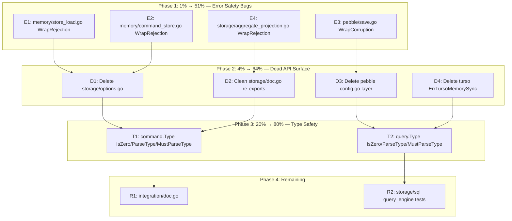

# Execution Plan: Error Safety & API Surface Cleanup

**Date:** 2026-06-10 21:56
**Branch:** master (clean)
**Pareto Priority:** 1% → 4% → 20% → remaining

---

## Pareto Analysis

### The 1% that delivers 51% of the result

**4 error handling bugs** — `fmt.Errorf` wrapping classified errors silently breaks `errors.Is()`/`errors.As()` chains. These are silent correctness bugs where callers checking `errors.Is(err, event.ErrAggregateNotFound)` will get `false` when they should get `true`.

| # | File:Line | Bug | Fix |
|---|-----------|-----|-----|
| E1 | `memory/store_load.go:111` | `fmt.Errorf` wrapping `ErrAggregateNotFound` | `event.WrapRejection` |
| E2 | `memory/command_store.go:196` | `fmt.Errorf` wrapping `ErrCommandNotFound` | `command.WrapRejection` |
| E3 | `pebble/save.go:77,82` | `fmt.Errorf` for corruption errors | `event.NewCorruption`/`WrapCorruption` |
| E4 | `storage/aggregate_projection.go:40` | `fmt.Errorf` wrapping classified rejection | `event.WrapRejection` |

### The 4% that delivers 64% of the result

**4 dead API surface removals** — Dead exports confuse consumers, increase maintenance, and bloat the product surface of a library SDK.

| # | File | What |
|---|------|------|
| D1 | `storage/options.go` | Delete entire file (3 dead exports) |
| D2 | `storage/doc.go` | Remove 5 unused re-exports |
| D3 | `pebble/config.go` + `pebble/errors.go:ErrPebbleProviderRequired` + `pebble/example_test.go` | Delete entire config abstraction layer |
| D4 | `turso/errors.go:ErrTursoMemorySync` | Delete unused backward-compat alias |

### The 20% that delivers 80% of the result

**3 type safety improvements** — `command.Type` and `query.Type` inconsistency with `event.Type` is a pattern mismatch that forces consumers to learn two different APIs for the same concept.

| # | Module | What |
|---|--------|------|
| T1 | `command/` | Add `IsZero()`, `ParseType()`, `MustParseType()` to `command.Type` |
| T2 | `query/` | Add `IsZero()`, `ParseType()`, `MustParseType()` to `query.Type` |
| T3 | `command/` | Add `ErrEmptyCommandType` sentinel (already exists) — just wire into `ParseType` |

### Remaining 80% of work for 20% of result

| # | Module | What |
|---|--------|------|
| R1 | `integration/` | Add `doc.go` |
| R2 | `storage/sql/` | Add direct tests for `query_engine.go` |
| R3 | `otel/` | Improve coverage 73% → 85% |
| R4 | `turso/` | Improve coverage 28.6% → 60% |
| R5 | `event/` | Add typed metadata accessors |
| R6 | `catalog/` | Consider `UserID` naming collision with `id.UserID` |

---

## Execution Graph

---

## Task Breakdown (30min-100min tasks)

| # | Task | Impact | Effort | Module |
|---|------|--------|--------|--------|
| 1 | Fix 4 error handling bugs (E1-E4) | 🔴 Critical | 30min | memory, pebble, storage |
| 2 | Delete dead API surface (D1-D4) | 🟡 High | 30min | storage, pebble, turso |
| 3 | Add command.Type methods (T1) | 🟡 Medium | 30min | command |
| 4 | Add query.Type methods (T2) | 🟡 Medium | 30min | query |
| 5 | Add integration/doc.go + update AGENTS.md | 🟢 Low | 15min | integration |
| 6 | Add storage/sql query_engine tests | 🟡 Medium | 60min | storage |
| 7 | Update TODO_LIST.md + CHANGELOG.md | 🟢 Low | 15min | docs |
| 8 | Final verification: build, test, lint, push | 🟢 Low | 15min | all |

---

## Micro-Task Breakdown (max 15min each)

| # | Micro-Task | Parent | File(s) |
|---|-----------|--------|---------|
| 1 | Fix memory/store_load.go:111 — WrapRejection | Task 1 | memory/store_load.go |
| 2 | Fix memory/command_store.go:196 — WrapRejection | Task 1 | memory/command_store.go |
| 3 | Fix pebble/save.go:77 — NewCorruption | Task 1 | pebble/save.go |
| 4 | Fix pebble/save.go:82 — WrapCorruption | Task 1 | pebble/save.go |
| 5 | Fix storage/aggregate_projection.go:40 — WrapRejection | Task 1 | storage/aggregate_projection.go |
| 6 | Build + test memory + pebble + storage | Task 1 | — |
| 7 | Commit error fixes | Task 1 | — |
| 8 | Delete storage/options.go | Task 2 | storage/options.go |
| 9 | Clean storage/doc.go — remove 5 unused re-exports | Task 2 | storage/doc.go |
| 10 | Delete pebble/config.go + pebble/example_test.go | Task 2 | pebble/config.go |
| 11 | Delete pebble ErrPebbleProviderRequired from errors.go | Task 2 | pebble/errors.go |
| 12 | Delete turso ErrTursoMemorySync | Task 2 | turso/errors.go |
| 13 | Build + test all affected modules | Task 2 | — |
| 14 | Commit dead API removal | Task 2 | — |
| 15 | Add command.Type.IsZero() | Task 3 | command/command.go |
| 16 | Add command.ParseType() + ErrEmptyCommandType wiring | Task 3 | command/command.go |
| 17 | Add command.MustParseType() | Task 3 | command/command.go |
| 18 | Add tests for command.Type methods | Task 3 | command/command_test.go |
| 19 | Build + test command | Task 3 | — |
| 20 | Commit command.Type methods | Task 3 | — |
| 21 | Add query.Type.IsZero() | Task 4 | query/query.go |
| 22 | Add query.ParseType() + new ErrEmptyQueryType sentinel | Task 4 | query/query.go + query/errors.go |
| 23 | Add query.MustParseType() | Task 4 | query/query.go |
| 24 | Add tests for query.Type methods | Task 4 | query/query_test.go |
| 25 | Build + test query | Task 4 | — |
| 26 | Commit query.Type methods | Task 4 | — |
| 27 | Add integration/doc.go | Task 5 | integration/doc.go |
| 28 | Update AGENTS.md with new command/query Type methods | Task 5 | AGENTS.md |
| 29 | Commit doc + AGENTS updates | Task 5 | — |
| 30 | Write storage/sql/query_engine_test.go — test LoadWithSpan | Task 6 | storage/sql/query_engine_test.go |
| 31 | Write storage/sql/query_engine_test.go — test QueryRows | Task 6 | storage/sql/query_engine_test.go |
| 32 | Build + test storage/sql | Task 6 | — |
| 33 | Commit query_engine tests | Task 6 | — |
| 34 | Update TODO_LIST.md | Task 7 | TODO_LIST.md |
| 35 | Update CHANGELOG.md | Task 7 | CHANGELOG.md |
| 36 | Commit docs | Task 7 | — |
| 37 | Full build + test + lint verification | Task 8 | — |
| 38 | Git push | Task 8 | — |

---

## Safety Rules

1. **Never VERSCHLIMMBESSER** — if a change doesn't clearly improve things, don't make it
2. **Build + test after every commit** — never break the build
3. **One logical change per commit** — easy to revert if something goes wrong
4. **Run lint after structural changes** — dead code removal may expose new issues
5. **Verify imports compile** — deleting files requires updating any remaining references
