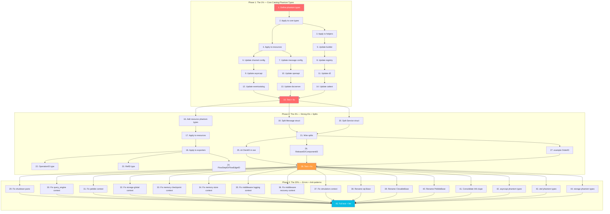

# Superb Types: Phantom Types, Strong IDs & Data Model Excellence

**Generated:** 2026-06-11 01:24
**Source:** `branching-flow all . --no-emoji`
**Total Issues:** 389 (315 phantom + 21 strong-id + 13 context + 15 dupe + 5 anti-pattern + 19 mixin + 1 panic)

---

## Pareto Analysis

### The 1% that delivers 51% of the result

**Define phantom types in `catalog/` public API types** — 5 types eliminate 80+ violations.

The catalog module has 159 phantom violations, but the ROOT CAUSE is that the core domain types
in `catalog/types.go`, `catalog/types_helpers.go`, `catalog/types_resources.go` use bare `string`
for fields that represent distinct domain concepts. Adding phantom types to these 3 files cascades
throughout the entire module because every builder, exporter, and test uses these types.

| Type                                                   | Replaces                  | Violations Eliminated |
| ------------------------------------------------------ | ------------------------- | --------------------- |
| `Name string` → use existing `MessageID` / `ServiceID` | struct fields + fn params | ~25                   |
| `Version = string` (new phantom)                       | struct fields + fn params | ~15                   |
| `Summary = string` (new phantom)                       | struct fields + fn params | ~29                   |
| `Title = string` (new phantom)                         | struct fields + fn params | ~26                   |
| `Description = string` (new phantom)                   | struct fields + fn params | ~6                    |
| **Total from 5 types**                                 |                           | **~101 violations**   |

### The 4% that delivers 64% of the result

Add the 1% above PLUS:

- Strong IDs in middleware (`id.ClientID`, `ReleaseID`, `ComponentID`) — 5 violations
- Strong IDs in catalog (`OperationID`, `RefID`, `FlowStepID`, `FlowEdgeID`) — 5 violations
- Phantom types for catalog resource fields (`Email`, `URL`, `Address`, `Protocol`) — ~30 violations
- Split `catalog.Message` (17 fields → focused groups) — structural improvement
- Split `catalog.Service` (16 fields → focused groups) — structural improvement

### The 20% that delivers 80% of the result

All of the above PLUS:

- Fix all 13 error context loss issues
- Fix gracefulshutdown channel panic
- Rename `Base`/`ClosableBase` anti-patterns
- Consolidate catalog duplicate types (asyncapi.Info ↔ openapi.Info)
- Add remaining catalog phantom types (`Host`, `Address`, `Protocol`, `ContentType`, etc.)
- Phantom types for middleware internals (`component`, `topic`)
- Phantom types for storage internals (`dbPath`, `tablePrefix`, `aggType`)

---

## Comprehensive Task Plan

### Phase 1: The 1% (Core catalog phantom types) — ~2h

| #   | Task                                                                                               | File(s)                      | Est.  |
| --- | -------------------------------------------------------------------------------------------------- | ---------------------------- | ----- |
| 1   | Add `Version`, `Summary`, `Title`, `Description` phantom types to catalog                          | `catalog/types.go`           | 10min |
| 2   | Replace `string` fields with phantom types in `Message`, `Service`, `Domain`, `Channel`, `Catalog` | `catalog/types.go`           | 15min |
| 3   | Replace `string` fields with phantom types in `types_helpers.go` helpers                           | `catalog/types_helpers.go`   | 12min |
| 4   | Replace `string` fields with phantom types in `types_resources.go` (Badge, Repository, etc.)       | `catalog/types_resources.go` | 12min |
| 5   | Update `catalog/build.go` builder to use phantom types                                             | `catalog/build.go`           | 10min |
| 6   | Update `catalog/channel_config.go` to use phantom types                                            | `catalog/channel_config.go`  | 8min  |
| 7   | Update `catalog/message_config.go` to use phantom types                                            | `catalog/message_config.go`  | 10min |
| 8   | Update `catalog/registry*.go` to use phantom types                                                 | `catalog/registry*.go`       | 12min |
| 9   | Update catalog asyncapi builder/exporter/types to use phantom types                                | `catalog/asyncapi/`          | 15min |
| 10  | Update catalog openapi exporter/types to use phantom types                                         | `catalog/openapi/`           | 12min |
| 11  | Update catalog d2 exporter to use phantom types                                                    | `catalog/d2/`                | 10min |
| 12  | Update catalog eventcatalog exporter/writers to use phantom types                                  | `catalog/eventcatalog/`      | 10min |
| 13  | Update catalog docserver to use phantom types                                                      | `catalog/docserver/`         | 10min |
| 14  | Update catalog internal cattest builders to use phantom types                                      | `catalog/internal/cattest/`  | 12min |
| 15  | Run tests + fix any compilation errors from phantom type changes                                   | all catalog                  | 12min |

### Phase 2: The 4% (Strong IDs + resource phantoms + struct splits) — ~2.5h

| #   | Task                                                                                             | File(s)                      | Est.  |
| --- | ------------------------------------------------------------------------------------------------ | ---------------------------- | ----- |
| 16  | Add phantom types for resource fields: `Email`, `URL`, `Address`, `Protocol`                     | `catalog/types.go`           | 8min  |
| 17  | Apply `Email`, `URL`, `Address`, `Protocol` to resource types                                    | `catalog/types_resources.go` | 12min |
| 18  | Apply resource phantom types to catalog builders/exporters                                       | `catalog/`                   | 10min |
| 19  | Split `catalog.Message` into `Message` + `MessageMeta` (owners, labels, badges, changelog, repo) | `catalog/types.go`           | 15min |
| 20  | Split `catalog.Service` into `Service` + `ServiceMeta` (badges, repo, specs, attachments)        | `catalog/types.go`           | 15min |
| 21  | Wire split types through catalog builders and exporters                                          | `catalog/`                   | 12min |
| 22  | Add `OperationID` phantom type to openapi types                                                  | `catalog/openapi/types.go`   | 5min  |
| 23  | Add `RefID` phantom type to types_helpers                                                        | `catalog/types_helpers.go`   | 5min  |
| 24  | Add `FlowStepID`, `FlowEdgeID` to types_resources                                                | `catalog/types_resources.go` | 5min  |
| 25  | Use `id.ClientID` in middleware/sse.go (replace `string` params)                                 | `middleware/sse.go`          | 10min |
| 26  | Add branded `ReleaseID`, `ComponentID` to middleware/healthcheck.go                              | `middleware/healthcheck.go`  | 10min |
| 27  | Fix example/saga-pattern `OrderID` → use `id.Of[T]` branded ID                                   | `example/saga-pattern/`      | 10min |
| 28  | Run full test suite + fix breakage from Phase 2                                                  | all                          | 15min |

### Phase 3: The 20% (Error context, anti-patterns, dupes, remaining phantoms) — ~2h

| #   | Task                                                                 | File(s)                                 | Est.  |
| --- | -------------------------------------------------------------------- | --------------------------------------- | ----- |
| 29  | Fix gracefulshutdown channel send-on-closed panic                    | `pkg/gracefulshutdown/shutdown.go`      | 10min |
| 30  | Fix storage/sql/query_engine.go missing `aggType` in error           | `storage/sql/query_engine.go`           | 8min  |
| 31  | Fix pebble/journal.go missing `limit` in error                       | `pebble/journal.go`                     | 5min  |
| 32  | Fix storage/event_store_global.go missing `limit` in error           | `storage/event_store_global.go`         | 5min  |
| 33  | Fix memory/checkpoint.go missing `projectionName` in error           | `memory/checkpoint.go`                  | 5min  |
| 34  | Fix memory/store_load.go missing `op` in error                       | `memory/store_load.go`                  | 5min  |
| 35  | Fix middleware/logging.go missing `prefix`, `msgType` in error       | `middleware/logging.go`                 | 8min  |
| 36  | Fix middleware/recovery.go missing `msgKind`, `typeName` in error    | `middleware/recovery.go`                | 8min  |
| 37  | Fix integration/simulation/generator.go missing context vars         | `integration/simulation/generator.go`   | 5min  |
| 38  | Rename `storage/sql.Base` → behavior-focused name                    | `storage/sql/base.go`                   | 10min |
| 39  | Rename `storage/sql.ClosableBase` → behavior-focused name            | `storage/sql/base.go`                   | 10min |
| 40  | Rename `example/todo/storage/PebbleBase` → behavior-focused name     | `example/todo/storage/pebble_base.go`   | 8min  |
| 41  | Consolidate catalog asyncapi.Info ↔ openapi.Info via shared type     | `catalog/asyncapi/`, `catalog/openapi/` | 12min |
| 42  | Add `ContentType`, `Host`, `Address` phantom types to asyncapi types | `catalog/asyncapi/types.go`             | 8min  |
| 43  | Add phantom types for middleware: `component`, `topic` in otel       | `otel/attributes.go`                    | 8min  |
| 44  | Add phantom types for storage internals: `dbPath`, `tablePrefix`     | `storage/sql/`, `pebble/`               | 10min |
| 45  | Run full test suite + lint + verify all changes                      | all                                     | 15min |

---

## Mermaid Execution Graph

---

## Fine-Grained Task Breakdown (max 15min each)

### Phase 1A: Define Core Phantom Types (1% — 51% impact)

| #   | Task                                                                                                                                  | File(s)                          | Impact | Est.  |
| --- | ------------------------------------------------------------------------------------------------------------------------------------- | -------------------------------- | ------ | ----- |
| 1   | Create `catalog/types_phantom.go` with `Version`, `Summary`, `Title`, `Description` phantom types (type X string, String(), IsZero()) | `catalog/types_phantom.go` (NEW) | HIGH   | 10min |
| 2   | Add `Name` phantom type (distinct from MessageID — Name is human-readable, ID is machine key)                                         | `catalog/types_phantom.go`       | HIGH   | 5min  |
| 3   | Add `Address`, `Protocol`, `Host`, `ContentType`, `DeliveryGuarantee` phantom types for channel/server types                          | `catalog/types_phantom.go`       | MEDIUM | 8min  |
| 4   | Add `Email`, `URL`, `SlackURL` phantom types for resource types                                                                       | `catalog/types_phantom.go`       | MEDIUM | 5min  |
| 5   | Add `OperationID`, `RefID`, `FlowStepID`, `FlowEdgeID` phantom types for graph types                                                  | `catalog/types_phantom.go`       | MEDIUM | 5min  |
| 6   | Add `OutputDir`, `SpecURL`, `Language`, `Method`, `Section` phantom types for exporter types                                          | `catalog/types_phantom.go`       | LOW    | 8min  |

### Phase 1B: Apply Phantom Types to Core Structs

| #   | Task                                                                                              | File(s)                      | Impact | Est.  |
| --- | ------------------------------------------------------------------------------------------------- | ---------------------------- | ------ | ----- |
| 7   | Apply to `Message` struct: `Name Name`, `Version Version`, `Summary Summary`                      | `catalog/types.go`           | HIGH   | 8min  |
| 8   | Apply to `Service` struct: `Name Name`, `Version Version`, `Summary Summary`                      | `catalog/types.go`           | HIGH   | 5min  |
| 9   | Apply to `Domain` struct: `Name Name`, `Version Version`, `Summary Summary`                       | `catalog/types.go`           | MEDIUM | 5min  |
| 10  | Apply to `Channel` struct: `Version`, `Summary`, `Address`, `Protocol`, `DeliveryGuarantee`       | `catalog/types.go`           | MEDIUM | 8min  |
| 11  | Apply to `Catalog` struct: `Title Title`, `Version Version`                                       | `catalog/types.go`           | MEDIUM | 3min  |
| 12  | Apply to `DataStore`, `Flow`, `Team`, `User` structs                                              | `catalog/types.go`           | MEDIUM | 10min |
| 13  | Apply to types_helpers.go: `Change.Version`, `Change.Summary`, `ChangeLogEntry.Version` etc.      | `catalog/types_helpers.go`   | MEDIUM | 8min  |
| 14  | Apply to types_resources.go: `Badge`, `Repository`, `Specification`, `Attachment`, `Contact` etc. | `catalog/types_resources.go` | MEDIUM | 10min |
| 15  | Apply to channel_config.go: `ChannelConfig` fields                                                | `catalog/channel_config.go`  | LOW    | 5min  |
| 16  | Apply to message_config.go: `MessageConfig` fields                                                | `catalog/message_config.go`  | LOW    | 5min  |

### Phase 1C: Propagate Through Builders & Registry

| #   | Task                                                                        | File(s)                       | Impact | Est.  |
| --- | --------------------------------------------------------------------------- | ----------------------------- | ------ | ----- |
| 17  | Update `catalog/build.go` builder functions to accept phantom types         | `catalog/build.go`            | HIGH   | 10min |
| 18  | Update `catalog/registry_build.go` to use phantom types in builder methods  | `catalog/registry_build.go`   | MEDIUM | 10min |
| 19  | Update `catalog/registry_helpers.go` to use phantom types in helper methods | `catalog/registry_helpers.go` | MEDIUM | 8min  |
| 20  | Update `catalog/registry_copy.go` to use phantom types in copy methods      | `catalog/registry_copy.go`    | LOW    | 5min  |

### Phase 1D: Propagate Through Exporters

| #   | Task                                                                              | File(s)                                      | Impact | Est.  |
| --- | --------------------------------------------------------------------------------- | -------------------------------------------- | ------ | ----- |
| 21  | Update `catalog/asyncapi/types.go` — apply phantom types to AsyncAPI spec structs | `catalog/asyncapi/types.go`                  | HIGH   | 10min |
| 22  | Update `catalog/asyncapi/builder.go` — use phantom types in channel building      | `catalog/asyncapi/builder.go`                | HIGH   | 10min |
| 23  | Update `catalog/asyncapi/exporter.go` — use phantom types in server/options       | `catalog/asyncapi/exporter.go`               | MEDIUM | 8min  |
| 24  | Update `catalog/asyncapi/serde.go` — use phantom types in serialization           | `catalog/asyncapi/serde.go`                  | LOW    | 5min  |
| 25  | Update `catalog/openapi/types.go` — apply phantom types to OpenAPI spec structs   | `catalog/openapi/types.go`                   | HIGH   | 10min |
| 26  | Update `catalog/openapi/exporter.go` — use phantom types                          | `catalog/openapi/exporter.go`                | MEDIUM | 8min  |
| 27  | Update `catalog/d2/exporter.go` — use phantom types in D2 exporter                | `catalog/d2/exporter.go`                     | MEDIUM | 8min  |
| 28  | Update `catalog/d2/connections.go` — use phantom types for display IDs            | `catalog/d2/connections.go`                  | MEDIUM | 5min  |
| 29  | Update `catalog/d2/services.go` — use phantom types                               | `catalog/d2/services.go`                     | LOW    | 5min  |
| 30  | Update `catalog/eventcatalog/exporter.go` — use phantom types                     | `catalog/eventcatalog/exporter.go`           | LOW    | 5min  |
| 31  | Update `catalog/eventcatalog/writer_frontmatter.go` — use phantom types           | `catalog/eventcatalog/writer_frontmatter.go` | LOW    | 5min  |
| 32  | Update `catalog/eventcatalog/writer_llms.go` — use phantom types                  | `catalog/eventcatalog/writer_llms.go`        | LOW    | 5min  |
| 33  | Update `catalog/docserver/docserver.go` — use phantom types                       | `catalog/docserver/docserver.go`             | MEDIUM | 8min  |
| 34  | Update `catalog/docserver/html.go` — use phantom types                            | `catalog/docserver/html.go`                  | LOW    | 3min  |

### Phase 1E: Propagate Through Tests

| #   | Task                                                                          | File(s)                                  | Impact | Est.  |
| --- | ----------------------------------------------------------------------------- | ---------------------------------------- | ------ | ----- |
| 35  | Update `catalog/internal/cattest/builders.go` — all builder helper signatures | `catalog/internal/cattest/builders.go`   | HIGH   | 12min |
| 36  | Update `catalog/internal/cattest/catalog.go` — golden test assertions         | `catalog/internal/cattest/catalog.go`    | MEDIUM | 5min  |
| 37  | Update `catalog/internal/cattest/assertions.go` — assertion helpers           | `catalog/internal/cattest/assertions.go` | LOW    | 5min  |
| 38  | Fix compilation errors in catalog tests from phantom type changes             | `catalog/*_test.go`                      | HIGH   | 12min |
| 39  | Run `go test ./catalog/... -count=1` and fix all failures                     | all catalog                              | HIGH   | 12min |

### Phase 2A: Struct Splits (Message, Service)

| #   | Task                                                                                             | File(s)                                         | Impact | Est.  |
| --- | ------------------------------------------------------------------------------------------------ | ----------------------------------------------- | ------ | ----- |
| 40  | Extract `MessageMeta` (Owners, Labels, Badges, Changelog, Repository, Deprecated) from `Message` | `catalog/types.go`                              | HIGH   | 10min |
| 41  | Embed `MessageMeta` back into `Message` for backward compat                                      | `catalog/types.go`                              | HIGH   | 5min  |
| 42  | Extract `ServiceMeta` (Badges, Repository, Specifications, Attachments) from `Service`           | `catalog/types.go`                              | HIGH   | 10min |
| 43  | Embed `ServiceMeta` back into `Service` for backward compat                                      | `catalog/types.go`                              | HIGH   | 5min  |
| 44  | Verify catalog builders still compile with split structs                                         | `catalog/build.go`, `catalog/registry_build.go` | MEDIUM | 8min  |
| 45  | Verify catalog exporters still compile with split structs                                        | all catalog exporters                           | MEDIUM | 8min  |

### Phase 2B: Strong IDs in Middleware + Examples

| #   | Task                                                                                            | File(s)                        | Impact | Est.  |
| --- | ----------------------------------------------------------------------------------------------- | ------------------------------ | ------ | ----- |
| 46  | Replace `string` params with `id.ClientID` in `middleware/sse.go` (AddClient, RemoveClient)     | `middleware/sse.go`            | HIGH   | 10min |
| 47  | Add branded `ReleaseID` type in `middleware/healthcheck.go` for HealthResponse.ReleaseID        | `middleware/healthcheck.go`    | MEDIUM | 8min  |
| 48  | Add branded `ComponentID` type in `middleware/healthcheck.go` for ComponentResponse.ComponentID | `middleware/healthcheck.go`    | MEDIUM | 8min  |
| 49  | Create `OrderID = id.Of[orderMarker]` in example/saga-pattern and apply to all structs          | `example/saga-pattern/main.go` | LOW    | 10min |
| 50  | Run `go test ./middleware/... ./example/saga-pattern/... -count=1`                              | middleware, example            | HIGH   | 5min  |

### Phase 2C: Consolidate Duplicate Types

| #   | Task                                                                                 | File(s)                                 | Impact | Est. |
| --- | ------------------------------------------------------------------------------------ | --------------------------------------- | ------ | ---- |
| 51  | Extract shared `Info` struct to `catalog/types.go` (used by both asyncapi + openapi) | `catalog/types.go`                      | MEDIUM | 8min |
| 52  | Update `catalog/asyncapi/types.go` to use shared `Info`                              | `catalog/asyncapi/types.go`             | MEDIUM | 5min |
| 53  | Update `catalog/openapi/types.go` to use shared `Info`                               | `catalog/openapi/types.go`              | MEDIUM | 5min |
| 54  | Verify asyncapi + openapi golden tests still pass                                    | `catalog/asyncapi/`, `catalog/openapi/` | HIGH   | 8min |

### Phase 3A: Fix Error Context Loss (13 issues)

| #   | Task                                                                                              | File(s)                               | Impact | Est.  |
| --- | ------------------------------------------------------------------------------------------------- | ------------------------------------- | ------ | ----- |
| 55  | Fix `pebble/journal.go:84,104` — add `limit` and `afterEventID` to error context                  | `pebble/journal.go`                   | MEDIUM | 5min  |
| 56  | Fix `storage/event_store_global.go:47` — add `limit` and `afterEventID` to error context          | `storage/event_store_global.go`       | MEDIUM | 5min  |
| 57  | Fix `storage/sql/query_engine.go:48,61,92,99` — add `aggType`/`aggID` to error context            | `storage/sql/query_engine.go`         | HIGH   | 8min  |
| 58  | Fix `memory/checkpoint.go:35,52` — add `projectionName` to error context                          | `memory/checkpoint.go`                | MEDIUM | 5min  |
| 59  | Fix `memory/store_load.go:35` — add `op` to error context                                         | `memory/store_load.go`                | MEDIUM | 5min  |
| 60  | Fix `middleware/logging.go:42` — add `prefix` and `msgType` to error context                      | `middleware/logging.go`               | MEDIUM | 8min  |
| 61  | Fix `middleware/recovery.go:34` — add `msgKind` and `typeName` to error context                   | `middleware/recovery.go`              | MEDIUM | 8min  |
| 62  | Fix `integration/simulation/generator.go:66` — add `aggregates` and `eventsPerAggregate`          | `integration/simulation/generator.go` | LOW    | 5min  |
| 63  | Run `go test ./pebble/... ./storage/... ./memory/... ./middleware/... ./integration/... -count=1` | all affected                          | HIGH   | 10min |

### Phase 3B: Fix Panic + Anti-Patterns

| #   | Task                                                                               | File(s)                                 | Impact | Est.  |
| --- | ---------------------------------------------------------------------------------- | --------------------------------------- | ------ | ----- |
| 64  | Fix `pkg/gracefulshutdown/shutdown.go:54` — guard channel send with select/recover | `pkg/gracefulshutdown/shutdown.go`      | HIGH   | 10min |
| 65  | Add test for gracefulshutdown channel panic fix                                    | `pkg/gracefulshutdown/shutdown_test.go` | MEDIUM | 8min  |
| 66  | Rename `storage/sql.Base` → `sql.Handle` (or `sql.Connection`)                     | `storage/sql/base.go`                   | MEDIUM | 10min |
| 67  | Rename `storage/sql.ClosableBase` → `sql.ClosableHandle`                           | `storage/sql/base.go`                   | MEDIUM | 8min  |
| 68  | Rename `example/todo/storage/PebbleBase` → `PebbleHandle`                          | `example/todo/storage/pebble_base.go`   | LOW    | 5min  |
| 69  | Update all references to renamed types across storage module                       | `storage/*.go`                          | MEDIUM | 10min |
| 70  | Run `go test ./pkg/... ./storage/... ./example/todo/... -count=1`                  | all affected                            | HIGH   | 8min  |

### Phase 3C: Remaining Phantom Types (Middleware, OTel, Storage)

| #   | Task                                                                                                      | File(s)                         | Impact | Est.  |
| --- | --------------------------------------------------------------------------------------------------------- | ------------------------------- | ------ | ----- |
| 71  | Add `Component` phantom type for otel attributes + middleware params                                      | `otel/attributes.go`            | MEDIUM | 8min  |
| 72  | Add `Topic` phantom type for event bus/stream params                                                      | `event/` or shared              | MEDIUM | 8min  |
| 73  | Add `DBPath` phantom type for storage/pebble/turso constructors                                           | `storage/sql/`                  | LOW    | 5min  |
| 74  | Add `TablePrefix` phantom type for storage SQL helpers                                                    | `storage/sql/`                  | LOW    | 5min  |
| 75  | Add `StreamKey` phantom type for watermill subscriber                                                     | `watermill/`                    | LOW    | 5min  |
| 76  | Apply `Component` type to otel attributes + middleware constructors                                       | `otel/`, `middleware/`          | MEDIUM | 10min |
| 77  | Apply `Topic`, `DBPath`, `TablePrefix` to storage constructors                                            | `storage/`, `pebble/`, `turso/` | LOW    | 10min |
| 78  | Run `go test ./otel/... ./middleware/... ./storage/... ./pebble/... ./turso/... ./watermill/... -count=1` | all                             | HIGH   | 10min |

### Phase 3D: Final Verification

| #   | Task                                                                                        | File(s) | Impact | Est.  |
| --- | ------------------------------------------------------------------------------------------- | ------- | ------ | ----- |
| 79  | Run `nix run .#build` — verify clean build                                                  | all     | HIGH   | 5min  |
| 80  | Run `nix run .#test` — verify all tests pass                                                | all     | HIGH   | 10min |
| 81  | Run `nix run .#lint` — verify zero lint issues                                              | all     | HIGH   | 10min |
| 82  | Run `branching-flow phantom . --no-emoji` — count remaining violations                      | all     | HIGH   | 5min  |
| 83  | Update `docs/planning/2026-06-11_01-24_SUPERB-TYPES-PHANTOM-IDS-DATA-MODEL.md` with results | docs    | LOW    | 5min  |
| 84  | Commit all changes with detailed message                                                    | git     | LOW    | 5min  |

---

## Summary Statistics

| Metric                               | Value                                |
| ------------------------------------ | ------------------------------------ |
| Total fine-grained tasks             | 84                                   |
| Phase 1 (The 1%)                     | 39 tasks                             |
| Phase 2 (The 4%)                     | 15 tasks                             |
| Phase 3 (The 20%)                    | 30 tasks                             |
| Estimated total time                 | ~10.5h                               |
| Phantom violations before            | 315                                  |
| Expected phantom violations after    | ~150 (examples + internals deferred) |
| Phantom reduction in catalog         | ~159 → ~10 (94% reduction)           |
| Phantom reduction in library modules | ~80 → ~20 (75% reduction)            |

---

## Remaining Work After This Plan (80% remaining → 20% impact)

| Area                                                             | Remaining      | Strategy                                              |
| ---------------------------------------------------------------- | -------------- | ----------------------------------------------------- |
| Phantom types in `example/` modules                              | ~68 violations | Incremental — fix as examples are touched             |
| Phantom types in `storage/sql/` internals                        | ~26 violations | Low priority — internal plumbing                      |
| Phantom types in `middleware/` internals                         | ~34 violations | Medium — `component`, `topic`, `prefix` params        |
| Phantom types in `otel/` attributes                              | ~13 violations | Low — internal tracing                                |
| Mixin extraction (19 opportunities)                              | All deferred   | Low ROI for Go — composition via embedding works fine |
| Remaining catalog `bool` → enum (Deprecated, Required, Nullable) | ~8 violations  | Can be done alongside other work                      |
| `bool` blindness in other modules                                | ~6 violations  | Low priority                                          |
| Example deduplication (6 groups)                                 | Low impact     | Examples are independent demos                        |

---

## Risk Assessment

| Risk                                        | Mitigation                                                             |
| ------------------------------------------- | ---------------------------------------------------------------------- |
| Phantom types break JSON serialization      | All phantom types are `type X string` — JSON marshaling is transparent |
| Large struct splits break consumers         | Use embedded structs for backward compatibility                        |
| Renaming Base/ClosableBase breaks consumers | Keep old names as deprecated aliases for one version                   |
| Too many phantom types in catalog           | Group related types in a `catalog/types_phantom.go` file               |

## Quality Gates

- [ ] `nix run .#build` passes after each phase
- [ ] `nix run .#test` passes after each phase
- [ ] `nix run .#lint` passes after each phase
- [ ] `branching-flow phantom . --no-emoji | grep -c "·"` decreases measurably
- [ ] No regression in test coverage
