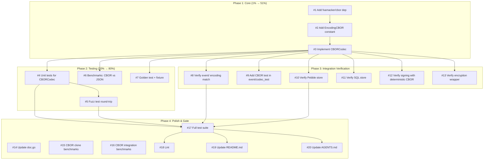

# CBOR Codec Implementation — Full Execution Plan

**Date:** 2026-06-11  
**Status:** Ready to execute  
**Branch:** master  
**Total estimated time:** ~2.5h

---

## Pareto Analysis

### The 1% that delivers 51% of the result

| Task                                                             | Why                                                                                                         |
| ---------------------------------------------------------------- | ----------------------------------------------------------------------------------------------------------- |
| `codec/cbor.go` — CBORCodec implementation (3 methods, 15 lines) | This IS the feature. Without it, nothing else exists. Everything in go-cqrs-lite is codec-agnostic already. |

### The 4% that delivers 64% of the result

| Task                                                            | Why                                                            |
| --------------------------------------------------------------- | -------------------------------------------------------------- |
| CBORCodec impl + `EncodingCBOR` constant + `fxamacker/cbor` dep | The feature compiles and can be used by consumers immediately. |

### The 20% that delivers 80% of the result

| Task                                                       | Why                                                               |
| ---------------------------------------------------------- | ----------------------------------------------------------------- |
| CBORCodec impl + dep + unit tests + fuzz test + benchmarks | The feature is safe, tested, and benchmarked. Ready for real use. |

### The remaining 80% (integration verification, docs, polish)

| Task                                                                                                  | Why                                                         |
| ----------------------------------------------------------------------------------------------------- | ----------------------------------------------------------- |
| Integration tests (run existing suites), doc.go, README, AGENTS.md, golden tests, full lint/test gate | Confidence that nothing broke. Documentation for consumers. |

---

## Execution Graph

---

## Task Breakdown (20 tasks, 7-100min each)

| #   | Task                                     | Impact         | Effort | Files Changed                              | Deps   | Sub-tasks |
| --- | ---------------------------------------- | -------------- | ------ | ------------------------------------------ | ------ | --------- |
| 1   | Add `fxamacker/cbor` dep to codec/go.mod | 🔴 Blocker     | 5min   | `codec/go.mod`, `codec/go.sum`             | None   | 1a, 1b    |
| 2   | Add `EncodingCBOR` constant              | 🔴 Blocker     | 5min   | `codec/codec.go`                           | #1     | 2a        |
| 3   | Implement CBORCodec in codec/cbor.go     | 🔴 Core        | 15min  | `codec/cbor.go` (new)                      | #1, #2 | 3a–3e     |
| 4   | Unit tests for CBORCodec                 | 🔴 Quality     | 15min  | `codec/codec_test.go`                      | #3     | 4a–4e     |
| 5   | Fuzz test for CBOR round-trip            | 🔴 Safety      | 10min  | `codec/codec_fuzz_test.go`                 | #3     | 5a–5c     |
| 6   | Benchmarks: CBOR vs JSON                 | 🟡 Validation  | 10min  | `codec/benchmark_test.go`                  | #3     | 6a–6d     |
| 7   | Golden test + fixture                    | 🟡 Regression  | 10min  | `codec/golden_test.go`, `testdata/golden/` | #3     | 7a–7d     |
| 8   | Verify event/ works with CBOR            | 🔴 Integration | 15min  | None (run tests)                           | #3     | 8a–8c     |
| 9   | Add CBOR test in event/codec_test        | 🟡 Coverage    | 10min  | `event/codec_test.go`                      | #3     | 9a–9c     |
| 10  | Verify Pebble store with CBOR            | 🔴 Integration | 10min  | None (run tests)                           | #3     | 10a–10b   |
| 11  | Verify SQL store with CBOR               | 🔴 Integration | 10min  | None (run tests)                           | #3     | 11a–11b   |
| 12  | Verify signing with deterministic CBOR   | 🔴 Critical    | 15min  | None (run tests + write test)              | #3     | 12a–12d   |
| 13  | Verify encryption wrapper with CBOR      | 🟡 Integration | 10min  | None (run tests)                           | #3     | 13a–13b   |
| 14  | Update codec/doc.go                      | 🟢 DX          | 5min   | `codec/doc.go`                             | #3     | 14a–14b   |
| 15  | CBOR clone benchmarks in event/          | 🟡 Perf        | 10min  | `event/benchmark_clone_test.go`            | #3     | 15a–15c   |
| 16  | CBOR integration benchmarks              | 🟡 Perf        | 15min  | `integration/realistic_bench_test.go`      | #3     | 16a–16d   |
| 17  | Full test suite                          | 🔴 Gate        | 10min  | None                                       | #4–#13 | 17a–17b   |
| 18  | Lint pass                                | 🟡 Quality     | 5min   | None                                       | #17    | 18a       |
| 19  | Update codec/README.md                   | 🟢 DX          | 5min   | `codec/README.md`                          | #3     | 19a–19b   |
| 20  | Update AGENTS.md                         | 🟢 Memory      | 5min   | `AGENTS.md`                                | #17    | 20a–20b   |

---

## Sub-task Breakdown (80 tasks, max 15min each)

### Task #1: Add fxamacker/cbor dep (5min)

| Sub | Action                                                       | Time |
| --- | ------------------------------------------------------------ | ---- |
| 1a  | `cd codec && GOWORK=off go get github.com/fxamacker/cbor/v2` | 2min |
| 1b  | Verify: `GOWORK=off go build ./...` passes                   | 3min |

### Task #2: Add EncodingCBOR constant (5min)

| Sub | Action                                                                       | Time |
| --- | ---------------------------------------------------------------------------- | ---- |
| 2a  | Add `EncodingCBOR Encoding = "cbor"` to `codec/codec.go` after `EncodingRaw` | 2min |

### Task #3: Implement CBORCodec (15min)

| Sub | Action                                                                  | Time |
| --- | ----------------------------------------------------------------------- | ---- |
| 3a  | Create `codec/cbor.go` with package declaration and import              | 1min |
| 3b  | Add `CBORCodec struct{}` with `var _ Codec = CBORCodec{}` compile check | 2min |
| 3c  | Implement `Encoding() Encoding { return EncodingCBOR }`                 | 1min |
| 3d  | Implement `Encode(v any) ([]byte, error)` wrapping `cbor.Marshal`       | 3min |
| 3e  | Implement `Decode(data []byte, v any) error` wrapping `cbor.Unmarshal`  | 3min |
| 3f  | Verify: `cd codec && GOWORK=off go build ./...`                         | 2min |

### Task #4: Unit tests for CBORCodec (15min)

| Sub | Action                                                          | Time |
| --- | --------------------------------------------------------------- | ---- |
| 4a  | Add `"CBOR": CBORCodec{}` to `TestInterfaceCompliance` map      | 2min |
| 4b  | Add `TestCBORCodec_Encoding` asserting `EncodingCBOR`           | 2min |
| 4c  | Add `TestCBORCodec_RoundTrip_Struct` encoding/decoding a struct | 3min |
| 4d  | Add `TestCBORCodec_RoundTrip_Map` encoding/decoding a map       | 3min |
| 4e  | Add `TestCBORCodec_DecodeReturnsIndependentCopy`                | 3min |

### Task #5: Fuzz test (10min)

| Sub | Action                                                                    | Time |
| --- | ------------------------------------------------------------------------- | ---- |
| 5a  | Add `FuzzCBORCodec_Roundtrip` following `FuzzJSONCodec_Roundtrip` pattern | 5min |
| 5b  | Add seed corpus values (structs, maps, arrays)                            | 2min |
| 5c  | Run fuzz for 30s to verify no crashes                                     | 3min |

### Task #6: Benchmarks (10min)

| Sub | Action                                                                | Time |
| --- | --------------------------------------------------------------------- | ---- |
| 6a  | Add `BenchmarkCBORCodec_Encode` with same payload as JSON bench       | 3min |
| 6b  | Add `BenchmarkCBORCodec_Decode` with same payload as JSON bench       | 3min |
| 6c  | Run benchmarks: `GOWORK=off go test -bench=Benchmark -benchmem ./...` | 3min |
| 6d  | Record results in plan                                                | 1min |

### Task #7: Golden test (10min)

| Sub | Action                                                                 | Time |
| --- | ---------------------------------------------------------------------- | ---- |
| 7a  | Add `TestGolden_CBORCodec_Encode` to `golden_test.go`                  | 3min |
| 7b  | Create golden fixture `testdata/golden/cbor_encode.bin` with `-update` | 2min |
| 7c  | Verify golden passes without `-update`                                 | 2min |
| 7d  | Check golden file into git                                             | 1min |

### Task #8: Verify event/ works with CBOR (15min)

| Sub | Action                                                             | Time |
| --- | ------------------------------------------------------------------ | ---- |
| 8a  | Run `cd event && GOWORK=off go test ./... -count=1` (baseline)     | 5min |
| 8b  | Run `go test ./event/... -count=1` (workspace mode)                | 5min |
| 8c  | Grep for any hardcoded `EncodingJSON` assumptions that could break | 5min |

### Task #9: Add CBOR test in event/codec_test (10min)

| Sub | Action                                       | Time |
| --- | -------------------------------------------- | ---- |
| 9a  | Add `TestDecodePayload_CBORCodec_RoundTrip`  | 4min |
| 9b  | Add `TestDecodePayload_CBOREncodingMismatch` | 3min |
| 9c  | Run event tests to verify                    | 3min |

### Task #10: Verify Pebble store (10min)

| Sub | Action                                               | Time |
| --- | ---------------------------------------------------- | ---- |
| 10a | Run `cd pebble && GOWORK=off go test ./... -count=1` | 5min |
| 10b | Run `go test ./pebble/... -count=1` (workspace)      | 5min |

### Task #11: Verify SQL store (10min)

| Sub | Action                                                | Time |
| --- | ----------------------------------------------------- | ---- |
| 11a | Run `cd storage && GOWORK=off go test ./... -count=1` | 5min |
| 11b | Run `go test ./storage/... -count=1` (workspace)      | 5min |

### Task #12: Verify signing with deterministic CBOR (15min)

| Sub | Action                                                                                    | Time |
| --- | ----------------------------------------------------------------------------------------- | ---- |
| 12a | Run `go test ./signing/... -count=1` (baseline)                                           | 3min |
| 12b | Write `TestDeterministicEncoding_CBOR` — encode same struct 1000x, verify identical bytes | 5min |
| 12c | Write `TestSignatureStability_CBOR` — sign event, verify, re-sign, verify still valid     | 5min |
| 12d | Run signing tests                                                                         | 2min |

### Task #13: Verify encryption wrapper (10min)

| Sub | Action                                                          | Time |
| --- | --------------------------------------------------------------- | ---- |
| 13a | Run `go test ./encryption/... -count=1`                         | 5min |
| 13b | Verify encryption codec wraps CBORCodec correctly (code review) | 5min |

### Task #14: Update doc.go (5min)

| Sub | Action                            | Time |
| --- | --------------------------------- | ---- |
| 14a | Add CBORCodec to package doc list | 3min |
| 14b | Add CBOR example snippet          | 2min |

### Task #15: CBOR clone benchmarks (10min)

| Sub | Action                                                               | Time |
| --- | -------------------------------------------------------------------- | ---- |
| 15a | Add `BenchmarkDecodePayload_CBOR` to `event/benchmark_clone_test.go` | 4min |
| 15b | Run benchmarks, record results                                       | 4min |
| 15c | Compare CBOR vs JSON decode payload numbers                          | 2min |

### Task #16: CBOR integration benchmarks (15min)

| Sub | Action                                                    | Time |
| --- | --------------------------------------------------------- | ---- |
| 16a | Add CBOR variant to `integration/realistic_bench_test.go` | 5min |
| 16b | Run integration benchmarks                                | 5min |
| 16c | Record results, compare CBOR vs JSON                      | 3min |
| 16d | Update plan with actual numbers                           | 2min |

### Task #17: Full test suite (10min)

| Sub | Action                        | Time |
| --- | ----------------------------- | ---- |
| 17a | `nix run .#test` — full suite | 5min |
| 17b | Verify all green, no flakes   | 5min |

### Task #18: Lint (5min)

| Sub | Action                            | Time |
| --- | --------------------------------- | ---- |
| 18a | `nix run .#lint` — fix any issues | 5min |

### Task #19: Update README.md (5min)

| Sub | Action                                   | Time |
| --- | ---------------------------------------- | ---- |
| 19a | Add CBORCodec section to codec/README.md | 3min |
| 19b | Add benchmark numbers                    | 2min |

### Task #20: Update AGENTS.md (5min)

| Sub | Action                                    | Time |
| --- | ----------------------------------------- | ---- |
| 20a | Add CBORCodec to codec module description | 3min |
| 20b | Add fxamacker/cbor to dependency table    | 2min |

---

## What We Will NOT Do (Deferred)

| Item                                    | Why                                                                      |
| --------------------------------------- | ------------------------------------------------------------------------ |
| Switch Pebble default from JSON to CBOR | Breaking change — existing stored events are JSON. Needs migration path. |
| Switch SQL default from JSON to CBOR    | Same — existing data.                                                    |
| Add CBOR to example apps                | Examples should show the stable default (JSON). CBOR is opt-in.          |
| Option C (custom binary envelope)       | Only if CBOR performance ceiling is too low. Measure first.              |
| FlatBuffers support                     | Phase 4 of original plan — future opt-in.                                |
| Compression threshold wrapper           | Orthogonal — separate concern.                                           |
| Pebble split-key storage                | Alternative to base64 elimination — CBOR makes it unnecessary.           |
