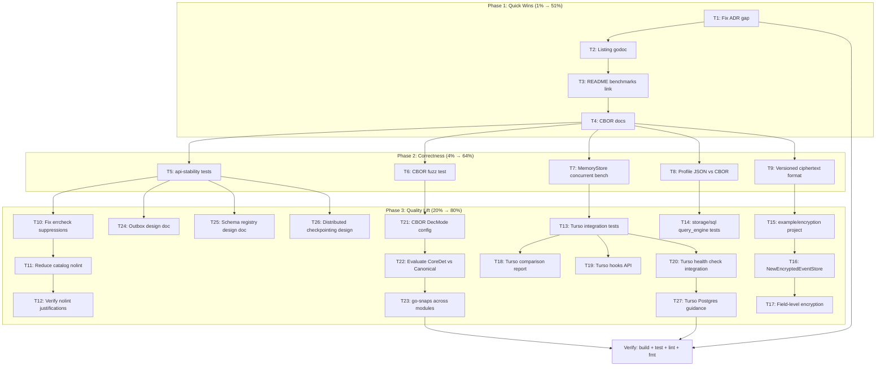

# Post-v2.3.0 Comprehensive Cleanup & Feature Plan

**Created:** 2026-06-14 03:25
**Status:** Active
**Scope:** ALL remaining open items from TODO_LIST.md (excluding v2/v3 breaking changes and BLOCKED items)

---

## Context

go-cqrs-lite is a multi-module CQRS/Event Sourcing library for Go at v2.3.0. The previous session resolved 15 audit items. This plan covers the remaining ~30 open TODO items, organized by Pareto impact.

### Exclusions (NOT in scope)

- **v2/v3 breaking changes** (6 items) — Deferred to next major version
- **Playwright E2E** — Requires Node.js/browser infrastructure (different ecosystem)
- **Arena allocation / jsonv2 / SIMD** — Experimental Go features behind build tags, need design first
- **Clean test deps from go.mod** — Go language limitation (no separate test-only require blocks)

---

## Pareto Breakdown

### 🔴 1% → 51% (4 tasks, ~40 min) — Immediate Consumer Trust

These are tiny changes that immediately improve how consumers perceive the library:

| # | Task | Impact | Effort |
|---|------|--------|--------|
| 1 | Fix ADR numbering gap (ADR-0005 missing) | Stops docs confusion | 5 min |
| 2 | Add godoc examples for `listing/` package | Direct consumer onboarding | 15 min |
| 3 | Add README section linking to `docs/benchmarks/` | Discoverability | 5 min |
| 4 | Document CBOR usage patterns in `codec/README.md` | Consumer guidance for CBOR adoption | 15 min |

### 🟡 4% → 64% (add 5 tasks, ~3 hours) — Correctness & Future-Proofing

| # | Task | Impact | Effort |
|---|------|--------|--------|
| 5 | Add cmd/api-stability basic tests | Protects API contract (tool is itself untested) | 45 min |
| 6 | Add CBOR fuzz test for pure CBOR→CBOR fidelity | Security/correctness of deterministic encoding | 30 min |
| 7 | Benchmark MemoryStore with concurrent writers | Confidence in concurrency under load | 30 min |
| 8 | Profile allocation patterns (JSON vs CBOR) | Data-driven codec recommendations | 30 min |
| 9 | Add versioned ciphertext format (prefix byte) | Future-proofs encryption algorithm changes | 45 min |

### 🟢 20% → 80% (add ~18 tasks, ~10 hours) — Broad Quality Lift

| # | Task | Impact | Effort |
|---|------|--------|--------|
| 10 | Fix nolint:errcheck suppressions in defer .Close() | 31 lazy suppressions → proper error handling | 45 min |
| 11 | Reduce catalog/ nolint suppressions (36 total) | Worst package for lint hygiene | 30 min |
| 12 | Verify all //nolint comments have justification | Audit middleware, storage, catalog, encryption | 30 min |
| 13 | Add turso integration tests (sync.go coverage) | Coverage ~75% → 90%+ | 45 min |
| 14 | Add storage/sql query_engine edge case tests | Improve storage coverage depth | 45 min |
| 15 | Add `example/encryption/` standalone project | End-to-end encryption lifecycle demo | 30 min |
| 16 | Add `storage.NewEncryptedEventStore` wrapper | Consumer convenience for encrypted stores | 45 min |
| 17 | Add field-level encryption (`encryption/fieldlevel/`) | Selective payload protection | 60 min |
| 18 | Turso indexing: comparison report generator | CLI tool for indexed vs unindexed perf | 45 min |
| 19 | Turso indexing: hooks API (`turso.WithIndexingHooks`) | Pre/post index creation callbacks | 45 min |
| 20 | Turso indexing: health check integration | Connect turso with listing/health module | 30 min |
| 21 | Add CBOR DecMode configuration | Match encode/decode expectations | 30 min |
| 22 | Evaluate CoreDetEncOptions vs CanonicalEncOptions | Signing safety decision | 30 min |
| 23 | Add go-snaps across remaining modules | Snapshot testing consistency | 90 min |
| 24 | Outbox pattern design doc | Design for reliable at-least-once publishing | 45 min |
| 25 | Schema registry design doc | Design for JSON Schema validation middleware | 45 min |
| 26 | Distributed checkpointing design doc | Design for multi-instance projections | 45 min |
| 27 | Turso indexing: Postgres/Compact guidance | Platform-specific optimization tips | 30 min |

---

## Execution Graph

---

## Micro-Task Breakdown (50+ tasks @ ≤15 min each)

Each macro-task above is broken into ≤15 min micro-tasks. Execute in order.

### Phase 1: Quick Wins

| ID | Micro-Task | Parent | Est |
|----|-----------|--------|-----|
| M1.1 | Check docs/adr/ for ADR-0005 gap; list all ADR files | T1 | 5 min |
| M1.2 | Fix ADR numbering (renumber or add placeholder) | T1 | 5 min |
| M1.3 | Update ADR README index if needed | T1 | 5 min |
| M2.1 | Read listing/ package public API (List, StatusMiddleware, InMemoryAggregateReader) | T2 | 5 min |
| M2.2 | Write listing/example_test.go with 3 godoc examples | T2 | 10 min |
| M3.1 | Check docs/benchmarks/ exists; add README link section | T3 | 5 min |
| M4.1 | Read codec/README.md; add CBOR consumer examples section | T4 | 10 min |

### Phase 2: Correctness

| ID | Micro-Task | Parent | Est |
|----|-----------|--------|-----|
| M5.1 | Read cmd/api-stability source; understand CLI interface | T5 | 10 min |
| M5.2 | Write cmd/api-stability tests (golden file comparison, flag parsing) | T5 | 15 min |
| M5.3 | Run tests; verify coverage | T5 | 5 min |
| M6.1 | Read codec_fuzz_test.go; add pure CBOR→CBOR fuzz function | T6 | 10 min |
| M6.2 | Run fuzz test to verify it works | T6 | 5 min |
| M7.1 | Write MemoryStore concurrent writer benchmark | T7 | 10 min |
| M7.2 | Run benchmark; verify no races | T7 | 5 min |
| M8.1 | Write JSON vs CBOR allocation benchmark comparison | T8 | 10 min |
| M8.2 | Run benchmarks; document findings | T8 | 10 min |
| M9.1 | Read encryption package; design versioned ciphertext prefix byte | T9 | 10 min |
| M9.2 | Implement versioned ciphertext format with backward compat | T9 | 15 min |
| M9.3 | Test versioned ciphertext round-trip | T9 | 10 min |

### Phase 3: Quality Lift

| ID | Micro-Task | Parent | Est |
|----|-----------|--------|-----|
| M10.1 | Find all 31 nolint:errcheck defer .Close() suppressions | T10 | 10 min |
| M10.2 | Fix suppressions in event/ module | T10 | 10 min |
| M10.3 | Fix suppressions in storage/ module | T10 | 10 min |
| M10.4 | Fix suppressions in remaining modules | T10 | 15 min |
| M11.1 | Find all 36 catalog/ nolint suppressions | T11 | 10 min |
| M11.2 | Fix/refactor catalog suppressions where possible | T11 | 15 min |
| M12.1 | Audit nolint in middleware/ for justifications | T12 | 10 min |
| M12.2 | Audit nolint in encryption/ for justifications | T12 | 10 min |
| M13.1 | Read turso/sync.go; identify untested paths | T13 | 10 min |
| M13.2 | Write turso sync integration tests | T13 | 15 min |
| M14.1 | Read storage/sql/query_engine.go; find edge cases | T14 | 10 min |
| M14.2 | Write query_engine edge case tests | T14 | 15 min |
| M15.1 | Verify example/encryption/ exists; check it compiles | T15 | 10 min |
| M15.2 | Fix/enhance example/encryption if needed | T15 | 15 min |
| M16.1 | Design storage.NewEncryptedEventStore wrapper API | T16 | 10 min |
| M16.2 | Implement and test the wrapper | T16 | 15 min |
| M17.1 | Design encryption/fieldlevel/ package API | T17 | 15 min |
| M17.2 | Implement field-level encryption core | T17 | 15 min |
| M18.1 | Write turso comparison report CLI tool | T18 | 15 min |
| M19.1 | Implement turso.WithIndexingHooks API | T19 | 15 min |
| M20.1 | Integrate turso with listing/health module | T20 | 15 min |
| M21.1 | Add CBOR DecMode configuration to codec/ | T21 | 15 min |
| M22.1 | Evaluate CoreDet vs Canonical; document decision | T22 | 15 min |
| M23.1 | Add go-snaps to signing/ and encryption/ | T23 | 15 min |
| M23.2 | Add go-snaps to middleware/ and storage/ | T23 | 15 min |
| M23.3 | Add go-snaps to pebble/ and turso/ | T23 | 15 min |
| M24.1 | Write docs/adr/ for outbox pattern | T24 | 15 min |
| M25.1 | Write docs/adr/ for schema registry | T25 | 15 min |
| M26.1 | Write docs/adr/ for distributed checkpointing | T26 | 15 min |
| M27.1 | Write Postgres/Compact indexing guidance doc | T27 | 15 min |

**Total: 56 micro-tasks**
