# Performance Optimization Plan — Pareto-Driven

> **Status: ✅ COMPLETED** · **Date completed:** 2026-06-14
>
> All 14 optimizations implemented in commit `4002fa87`. T3/T4 root cause
> subsequently fixed in `df6b35dd` (cached at Register() time instead of via
> type assertion). Benchmarks + report updated in `f0e512f8` + `27c39549`.
> ADR-0020 documents the patterns adopted. AGENTS.md Design Principle #16
> records the lessons learned.
>
> **Date:** 2026-06-14
> **Source:** `docs/research/2026-06-14_PERFORMANCE_CHARACTERISTICS_REPORT.html`
> **Goal:** Eliminate the highest-impact performance inefficiencies across all 28 modules without breaking the public API or existing tests.
> **Rule:** Every change must be verified with tests + benchmarks. No VERSCHLIMMBESSER.

---

## Context

The performance audit identified **11 confirmed issues** across 7 modules. All were verified by reading the actual source code. The issues range from a 2× CPU/disk waste (pebble double serialization) to per-event allocation hotspots (projection handler slices). This plan addresses every confirmed finding, ordered strictly by Pareto impact.

### Design Constraints

1. **No public API changes** — this is a library. Breaking consumers is unacceptable.
2. **No disk format changes** — existing databases must continue to work.
3. **Immutability contract preserved** — defensive cloning on public accessors stays.
4. **`sync.Pool` stays rejected** — the team explicitly decided against it for safety reasons.
5. **Every change gets benchmarked** — before/after data must prove improvement.

---

## Pareto Breakdown

### The 1% that delivers 51% of the result

| #      | Task                                   | Module | Why it's 1%                                            | Why it's 51%                                                                                                                                                  |
| ------ | -------------------------------------- | ------ | ------------------------------------------------------ | ------------------------------------------------------------------------------------------------------------------------------------------------------------- |
| **T1** | Eliminate double serialization on Save | pebble | One-method refactor: serialize once, `batch.Set` twice | Halves ALL pebble write CPU AND disk bytes. Every pebble save in every consumer benefits.                                                                     |
| **T2** | Lazy metadata map initialization       | event  | Change `NewMetadata()` to return zero-value struct     | Eliminates 1 heap allocation per event system-wide. Every event in every module benefits. Currently allocates a map even when no custom metadata is ever set. |

### The 4% that delivers 64% of the result (1% + these)

| #      | Task                                           | Module     | Why it's 4%                                            | Why it's 64%                                                                                                                                                                       |
| ------ | ---------------------------------------------- | ---------- | ------------------------------------------------------ | ---------------------------------------------------------------------------------------------------------------------------------------------------------------------------------- |
| **T3** | Cache projection handler Lookup result         | projection | Return pre-built slice instead of allocating per event | The 100K-event projection benchmark generates **91M allocations** — the single largest GC pressure source in the entire library. Eliminating this is the biggest GC win available. |
| **T4** | Projection EventTypes() return immutable slice | projection | Remove `slices.Clone`, document immutability           | Called per live event in `subscribesTo` filter. Combined with T3, eliminates ALL per-event allocations in the projection live dispatch path.                                       |

### The 20% that delivers 80% of the result (4% + these)

| #       | Task                                             | Module     | Impact                                                                     |
| ------- | ------------------------------------------------ | ---------- | -------------------------------------------------------------------------- |
| **T5**  | Cache SQL template strings per dialect           | storage    | Eliminates `fmt.Sprintf` + placeholder slice allocation on every Save/Load |
| **T6**  | Eliminate MemoryStore Load double-copy           | memory     | Removes redundant `slices.Clone` on already-fresh slice                    |
| **T7**  | Remove SSE vestigial goroutine + optimize format | middleware | Fixes goroutine leak, reduces 3× `fmt.Fprintf` allocations to 1 write      |
| **T8**  | Hoist EnsureCustom before Merge loop             | event      | Removes redundant nil-check per loop iteration                             |
| **T9**  | Pre-size FilterByTimestamp result slice          | event      | Eliminates nil-slice append growth pattern                                 |
| **T10** | Pre-allocate ScanSlice with capacity hint        | storage    | Reduces log₂(N) slice growth copies during large Loads                     |

### The remaining 80% of work for 20% of results

| #       | Task                                 | Module     | Impact                                          | Risk                                       |
| ------- | ------------------------------------ | ---------- | ----------------------------------------------- | ------------------------------------------ |
| **T11** | CircuitBreaker atomic state machine  | middleware | Eliminates mutex serialization in happy path    | MED — concurrency semantics change         |
| **T12** | MemoryBus middleware pre-computation | memory     | Eliminates per-publish middleware chain rebuild | MED — dynamic middleware addition handling |
| **T13** | Pebble ReadFrom SeekGE optimization  | pebble     | O(N) → O(log N) for projection catch-up         | MED — iteration semantics change           |
| **T14** | SQL multi-VALUES INSERT batching     | storage    | Amortizes N round-trips to 1 per batch          | MED — SQLite 999-param limit handling      |
| **T15** | Benchmark suite + report update      | all        | Verify all improvements quantitatively          | —                                          |
| **T16** | Documentation updates                | all        | AGENTS.md, performance report                   | —                                          |

---

## Execution Order

```mermaid
graph TD
    subgraph "Phase 1: 1% → 51% impact"
        T1[T1: Pebble double serialization]
        T2[T2: Event lazy metadata map]
        T1 --> T1V[Verify: pebble tests + bench]
        T2 --> T2V[Verify: event tests + bench]
    end

    subgraph "Phase 2: 4% → 64% impact"
        T3[T3: Projection Lookup cache]
        T4[T4: Projection EventTypes direct]
        T3 --> T3V[Verify: projection tests + bench]
        T4 --> T4V[Verify: projection tests]
    end

    subgraph "Phase 3: 20% → 80% impact"
        T5[T5: SQL template cache]
        T6[T6: MemoryStore double-copy]
        T7[T7: SSE goroutine + format]
        T8[T8: EnsureCustom hoist]
        T9[T9: FilterByTimestamp pre-size]
        T10[T10: ScanSlice capacity]
        T5 --> T5V[Verify: storage tests + bench]
        T6 --> T6V[Verify: memory tests + bench]
        T7 --> T7V[Verify: middleware tests]
        T8 --> T8V[Verify: event tests]
        T9 --> T9V[Verify: event tests]
        T10 --> T10V[Verify: storage tests]
    end

    subgraph "Phase 4: Remaining optimizations"
        T11[T11: CircuitBreaker atomic]
        T12[T12: MemoryBus middleware pre-compute]
        T13[T13: Pebble ReadFrom SeekGE]
        T14[T14: SQL multi-VALUES INSERT]
        T11 --> T11V[Verify: middleware tests + race]
        T12 --> T12V[Verify: memory tests]
        T13 --> T13V[Verify: pebble tests + bench]
        T14 --> T14V[Verify: storage tests + bench]
    end

    subgraph "Phase 5: Verification & docs"
        T15[T15: Full benchmark suite]
        T16[T16: Update report + AGENTS.md]
        T15 --> T16
    end

    T1V --> T3
    T2V --> T3
    T3V --> Phase3
    T4V --> Phase3
    T5V --> Phase4
    T6V --> Phase4
    T7V --> Phase4
    T8V --> Phase4
    T9V --> Phase4
    T10V --> Phase4
    T11V --> T15
    T12V --> T15
    T13V --> T15
    T14V --> T15

    style T1 fill:#f87171,color:#fff
    style T2 fill:#f87171,color:#fff
    style T3 fill:#fb923c,color:#fff
    style T4 fill:#fb923c,color:#fff
    style T15 fill:#4ade80,color:#fff
    style T16 fill:#4ade80,color:#fff
```

---

## Macro Task Table (30–100 min each)

> Sorted by impact (Pareto tier) then effort. 18 tasks total.

| ID  | Task                                             | Module     | Tier | Impact   | Status  | Commit     |
| --- | ------------------------------------------------ | ---------- | ---- | -------- | ------- | ---------- |
| T1  | Eliminate double serialization on Save           | pebble     | 1%   | CRITICAL | ✅ DONE | `4002fa87` |
| T2  | Lazy metadata map initialization                 | event      | 1%   | CRITICAL | ✅ DONE | `4002fa87` |
| T3  | Cache projection handler Lookup result           | projection | 4%   | HIGH     | ✅ DONE | `df6b35dd` |
| T4  | Projection EventTypes() return immutable slice   | projection | 4%   | HIGH     | ✅ DONE | `df6b35dd` |
| T5  | Cache SQL template strings per dialect           | storage    | 20%  | MED      | ✅ DONE | `4002fa87` |
| T6  | Eliminate MemoryStore Load double-copy           | memory     | 20%  | MED      | ✅ DONE | `4002fa87` |
| T7  | Remove SSE vestigial goroutine + optimize format | middleware | 20%  | MED      | ✅ DONE | `4002fa87` |
| T8  | Hoist EnsureCustom before Merge loop             | event      | 20%  | LOW      | ✅ DONE | `4002fa87` |
| T9  | Pre-size FilterByTimestamp result slice          | event      | 20%  | LOW      | ✅ DONE | `4002fa87` |
| T10 | Pre-allocate ScanSlice with capacity hint        | storage    | 20%  | LOW      | ✅ DONE | `4002fa87` |
| T11 | CircuitBreaker atomic state machine              | middleware | rest | HIGH     | ✅ DONE | `4002fa87` |
| T12 | MemoryBus middleware pre-computation             | memory     | rest | HIGH     | ✅ DONE | `4002fa87` |
| T13 | Pebble ReadFrom SeekGE optimization              | pebble     | rest | HIGH     | ✅ DONE | `4002fa87` |
| T14 | SQL multi-VALUES INSERT batching                 | storage    | rest | HIGH     | ✅ DONE | `4002fa87` |
| T15 | Full benchmark suite + before/after data         | all        | —    | VERIFY   | ✅ DONE | `27c39549` |
| T16 | Update performance report HTML                   | docs       | —    | DOC      | ✅ DONE | `f0e512f8` |
| T17 | Update AGENTS.md with optimization notes         | docs       | —    | DOC      | ✅ DONE | `f0e512f8` |
| T18 | Full test suite verification (28 modules)        | all        | —    | VERIFY   | ✅ DONE | `4002fa87` |

**All 18 tasks completed.** T1-T14 implemented in `4002fa87`, T3/T4 root cause fix in `df6b35dd`, benchmarks in `27c39549`, docs in `f0e512f8`.

---

## Micro Task Table (max 15 min each)

> Each macro task broken into implementable steps. 72 tasks total.

### Phase 1: 1% → 51% Impact

| ID   | Micro Task                                                           | Module | Est   | Status |
| ---- | -------------------------------------------------------------------- | ------ | ----- | ------ |
| M1.1 | Read pebble/save.go writeEventsToBatch flow                          | pebble | 5min  | ✅     |
| M1.2 | Refactor: serialize once in writeEventsToBatch, pass data to journal | pebble | 10min | ✅     |
| M1.3 | Refactor appendToJournal to accept pre-serialized []byte             | pebble | 10min | ✅     |
| M1.4 | Run pebble tests (GOWORK=off)                                        | pebble | 10min | ✅     |
| M1.5 | Run pebble benchmarks before/after                                   | pebble | 10min | ✅     |
| M2.1 | Read event/metadata.go — enumerate all write paths to Custom map     | event  | 10min | ✅     |
| M2.2 | Change NewMetadata() to return zero-value Metadata (no map alloc)    | event  | 5min  | ✅     |
| M2.3 | Verify all write paths call EnsureCustom before writing              | event  | 10min | ✅     |
| M2.4 | Run event tests (GOWORK=off)                                         | event  | 10min | ✅     |
| M2.5 | Run event benchmarks — verify alloc reduction                        | event  | 10min | ✅     |

### Phase 2: 4% → 64% Impact

| ID   | Micro Task                                                           | Module     | Est   | Status |
| ---- | -------------------------------------------------------------------- | ---------- | ----- | ------ |
| M3.1 | Read projection/handler.go Lookup + builder.go call sites            | projection | 10min | ✅     |
| M3.2 | Implement cached Lookup: pre-build combined slice at registration    | projection | 15min | ✅     |
| M3.3 | Run projection tests                                                 | projection | 10min | ✅     |
| M3.4 | Run integration scale projection benchmark                           | projection | 10min | ✅     |
| M4.1 | Change builtProjection.EventTypes() to return backing slice directly | projection | 5min  | ✅     |
| M4.2 | Add immutability documentation comment                               | projection | 5min  | ✅     |
| M4.3 | Run projection tests                                                 | projection | 10min | ✅     |

### Phase 3: 20% → 80% Impact

| ID    | Micro Task                                                                | Module     | Est   | Status |
| ----- | ------------------------------------------------------------------------- | ---------- | ----- | ------ |
| M5.1  | Read storage/event_store_scan.go insertEvents + query_engine.go           | storage    | 10min | ✅     |
| M5.2  | Cache INSERT/SELECT SQL strings per dialect at SQLEventStore construction | storage    | 15min | ✅     |
| M5.3  | Run storage tests                                                         | storage    | 10min | ✅     |
| M6.1  | Read memory/store_load.go getEvents + copyEvents flow                     | memory     | 5min  | ✅     |
| M6.2  | Remove redundant copyEvents wrapper — return getEvents result directly    | memory     | 10min | ✅     |
| M6.3  | Run memory tests                                                          | memory     | 10min | ✅     |
| M7.1  | Remove vestigial goroutine in SSE broker NewBroker                        | middleware | 5min  | ✅     |
| M7.2  | Replace 3× fmt.Fprintf with single pooled bytes.Buffer write              | middleware | 15min | ✅     |
| M7.3  | Run middleware tests                                                      | middleware | 10min | ✅     |
| M8.1  | Move EnsureCustom call before the Merge loop                              | event      | 5min  | ✅     |
| M8.2  | Run event tests                                                           | event      | 10min | ✅     |
| M9.1  | Pre-size FilterByTimestamp: make([]Event, 0, len(events))                 | event      | 5min  | ✅     |
| M9.2  | Run event tests                                                           | event      | 5min  | ✅     |
| M10.1 | Read storage/sql/reconstruction.go ScanSlice                              | storage    | 5min  | ✅     |
| M10.2 | Add initial capacity hint (make([]T, 0, 64)) to ScanSlice                 | storage    | 10min | ✅     |
| M10.3 | Run storage tests                                                         | storage    | 10min | ✅     |

### Phase 4: Remaining Optimizations

| ID    | Micro Task                                                         | Module     | Est   | Status |
| ----- | ------------------------------------------------------------------ | ---------- | ----- | ------ |
| M11.1 | Read middleware/circuit_breaker.go execute() + allow/recordSuccess | middleware | 10min | ✅     |
| M11.2 | Replace Mutex with atomic.Int32 for state + failure count          | middleware | 15min | ✅     |
| M11.3 | Refactor allow() to use atomic CAS                                 | middleware | 15min | ✅     |
| M11.4 | Refactor recordSuccess/recordFailure to use atomic ops             | middleware | 15min | ✅     |
| M11.5 | Run middleware tests + race detector                               | middleware | 15min | ✅     |
| M12.1 | Read memory/bus.go Publish + publishEvent middleware chain         | memory     | 10min | ✅     |
| M12.2 | Pre-compute middleware chain on UsePublish/Use, rebuild on change  | memory     | 15min | ✅     |
| M12.3 | Run memory tests                                                   | memory     | 10min | ✅     |
| M12.4 | Run memory bus benchmarks                                          | memory     | 10min | ✅     |
| M13.1 | Read pebble/journal.go ReadFrom iteration + journal key format     | pebble     | 10min | ✅     |
| M13.2 | Implement iter.SeekGE to journal key instead of linear skip        | pebble     | 15min | ✅     |
| M13.3 | Handle edge case: afterEventID not found in journal                | pebble     | 10min | ✅     |
| M13.4 | Run pebble tests                                                   | pebble     | 10min | ✅     |
| M13.5 | Run pebble benchmarks — verify ReadFrom improvement                | pebble     | 10min | ✅     |
| M14.1 | Read storage/sql/helpers.go SharedInsertEvents                     | storage    | 10min | ✅     |
| M14.2 | Implement multi-VALUES INSERT builder with param limit handling    | storage    | 15min | ✅     |
| M14.3 | Handle SQLite 999-param limit: chunk large batches                 | storage    | 15min | ✅     |
| M14.4 | Run storage tests (SQLite real + PostgreSQL mock)                  | storage    | 15min | ✅     |
| M14.5 | Run storage benchmarks                                             | storage    | 10min | ✅     |

### Phase 5: Verification & Documentation

| ID    | Micro Task                                                 | Module | Est   | Status |
| ----- | ---------------------------------------------------------- | ------ | ----- | ------ |
| M15.1 | Run full benchmark suite (nix run .#test or per-module)    | all    | 15min | ✅     |
| M15.2 | Compare before/after benchmark data with benchstat         | all    | 15min | ✅     |
| M15.3 | Run full test suite with race detector                     | all    | 15min | ✅     |
| M15.4 | Run lint (nix run .#lint)                                  | all    | 15min | ✅     |
| M15.5 | Format code (nix fmt)                                      | all    | 5min  | ✅     |
| M15.6 | Check module layers (nix run .#check-layers)               | all    | 10min | ✅     |
| M16.1 | Update performance report HTML with improvement data       | docs   | 15min | ✅     |
| M17.1 | Update AGENTS.md Design Principles with optimization notes | docs   | 10min | ✅     |
| M17.2 | Update CHANGELOG.md with performance improvements          | docs   | 10min | ✅     |
| M18.1 | Git commit all changes with detailed message               | all    | 10min | ✅     |
| M18.2 | Git push                                                   | all    | 5min  | ✅     |

---

## Risk Mitigation

| Risk                                                     | Mitigation                                                                                                     |
| -------------------------------------------------------- | -------------------------------------------------------------------------------------------------------------- |
| Lazy metadata map breaks nil-map writes                  | Go panics on write to nil map. All write paths already call `EnsureCustom`. Verify with grep + tests.          |
| CircuitBreaker atomic introduces race condition          | Run with `-race` flag. Add concurrent test case.                                                               |
| SQL multi-VALUES exceeds SQLite param limit              | Chunk batches at 999/10 = 99 events per INSERT. PostgreSQL has no practical limit.                             |
| Pebble ReadFrom SeekGE misses edge cases                 | Keep fallback to linear scan if SeekGE fails. Test with empty journal, single event, cursor at end.            |
| MemoryBus middleware pre-compute breaks dynamic addition | Rebuild chain on every `Use`/`UsePublish` call. Document that middleware should be added before first publish. |

---

## Expected Outcomes

| Metric                   | Before                | Expected After            | Improvement                   |
| ------------------------ | --------------------- | ------------------------- | ----------------------------- |
| Pebble Save CPU          | 2× serialization      | 1× serialization          | 50% reduction                 |
| Pebble disk usage        | 2× event bytes        | 1× event bytes            | 50% reduction                 |
| Event allocation         | 2 allocs (map always) | 1 alloc (map on demand)   | 50% reduction for common case |
| Projection 100K events   | 91M allocs            | <1M allocs                | 99% reduction                 |
| Projection live dispatch | 2+ allocs/event       | 0 allocs/event            | 100% elimination              |
| SQL Save (10 events)     | 10 INSERTs            | 1 INSERT                  | 10× fewer round-trips         |
| MemoryStore Load         | 2 slice copies        | 1 slice copy              | 50% reduction                 |
| CircuitBreaker           | 2 mutex locks/msg     | 0 atomic ops (happy path) | Lock-free fast path           |
| MemoryBus Publish        | N closure allocs      | 0 (pre-computed)          | Per-publish elimination       |
| Pebble ReadFrom          | O(cursor) per page    | O(log n) per page         | Logarithmic improvement       |
