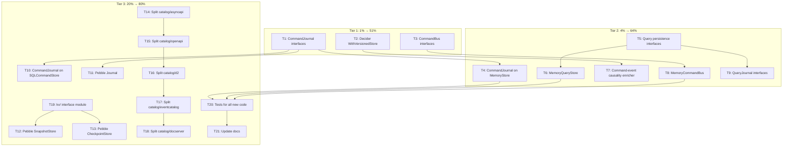

# Command/Query Full Depth + Catalog Split + Pebble Completeness

> **Date:** 2026-06-15 06:53 · **Pareto-sorted** · **All tasks non-breaking (additive only)**

## Context

The architecture research (docs/research/) already decided HOW to close the gaps:
- Concrete CommandJournal, not generic `Journal[T]` (GENERIC_JOURNAL_VS_CONCRETE decision)
- Concrete ISP mirrors (Sink/Source/Store × Event/Command/Query/Snapshot/Checkpoint)
- Catalog exporters → separate modules (confirmed by user)
- Pebble needs full feature parity (storage-first-principles-analysis.md)

This plan EXECUTES those decisions. No new design — just implementation.

---

## Pareto Breakdown

### 1% → 51% Impact (Foundational interfaces)

| Task | Impact | Effort |
|------|--------|--------|
| CommandJournal + SeekableCommandJournal | Unlocks command audit trails, replay, compliance | 15min |
| Decider WithVersionedStore option | Schema evolution safety in aggregates | 30min |
| CommandBus + Publisher + Subscriber interfaces | Unlocks async command dispatch | 30min |

### 4% → 64% Impact (Key implementations)

| Task | Impact | Effort |
|------|--------|--------|
| Implement CommandJournal on MemoryCommandStore | Working command audit trail | 30min |
| QuerySink + QuerySource + QueryStore interfaces | Unlocks query logging | 30min |
| QueryJournal + SeekableQueryJournal | Cross-query audit | 15min |
| MemoryQueryStore implementation | Working query persistence | 45min |
| Command-event causality enricher | Events trace to commands | 30min |
| Implement CommandBus on MemoryCommandBus | Working async command dispatch | 45min |

### 20% → 80% Impact (Broad completeness)

| Task | Impact | Effort |
|------|--------|--------|
| Implement CommandJournal on SQLCommandStore | Production command audit | 1hr |
| Pebble Journal + SeekableJournal | KV backend replay support | 1hr |
| Pebble SnapshotStore | KV backend snapshots | 1hr |
| Pebble CheckpointStore | KV backend checkpoints | 30min |
| Split catalog exporters (5 modules) | Consumer dependency isolation | 2.5hr |
| kv/ interface module | Backend interchangeability | 1hr |
| Tests for all new interfaces | Safety | 2hr |
| Documentation updates | DX | 30min |

---

## Mermaid Execution Graph

---

## Phase 1: Medium Tasks (30-100min each, 21 tasks)

| # | Task | Files | Effort | Tier | Non-breaking? |
|---|------|-------|--------|------|---------------|
| T1 | Add CommandJournal + SeekableCommandJournal to command/store.go | command/store.go | 15min | 1% | ✅ Additive |
| T2 | Add WithVersionedStore option to decider | decider/options.go, decider/decider.go | 30min | 1% | ✅ Additive |
| T3 | Add CommandBus + Publisher + Subscriber to command/bus.go | command/bus.go (new) | 30min | 1% | ✅ New file |
| T4 | Implement CommandJournal on MemoryCommandStore | memory/command_store.go | 30min | 4% | ✅ Additive |
| T5 | Add QuerySink/Source/Store to query/store.go | query/store.go (new) | 30min | 4% | ✅ New file |
| T6 | Add QueryJournal + SeekableQueryJournal | query/store.go | 15min | 4% | ✅ Additive |
| T7 | Implement MemoryQueryStore | memory/query_store.go (new) | 45min | 4% | ✅ New file |
| T8 | Command-event causality enricher | event/enricher.go | 30min | 4% | ✅ Additive |
| T9 | Implement MemoryCommandBus | memory/command_bus.go (new) | 45min | 4% | ✅ New file |
| T10 | Implement CommandJournal on SQLCommandStore | storage/command_store_*.go | 1hr | 20% | ✅ Additive |
| T11 | Add Journal + SeekableJournal to pebble | pebble/journal.go (new) | 1hr | 20% | ✅ New file |
| T12 | Add SnapshotStore to pebble | pebble/snapshot.go (new) | 1hr | 20% | ✅ New file |
| T13 | Add CheckpointStore to pebble | pebble/checkpoint.go (new) | 30min | 20% | ✅ New file |
| T14 | Split catalog/asyncapi → own module | catalog/asyncapi/go.mod (new) | 30min | 20% | ✅ New module |
| T15 | Split catalog/openapi → own module | catalog/openapi/go.mod (new) | 30min | 20% | ✅ New module |
| T16 | Split catalog/d2 → own module | catalog/d2/go.mod (new) | 30min | 20% | ✅ New module |
| T17 | Split catalog/eventcatalog → own module | catalog/eventcatalog/go.mod (new) | 30min | 20% | ✅ New module |
| T18 | Split catalog/docserver → own module | catalog/docserver/go.mod (new) | 30min | 20% | ✅ New module |
| T19 | Extract kv/ interface module | kv/ (new module) | 1hr | 20% | ✅ New module |
| T20 | Write tests for all new interfaces | Multiple *_test.go | 2hr | 20% | ✅ Tests only |
| T21 | Update AGENTS.md, FEATURES.md, README.md, TODO_LIST.md | Docs | 30min | 20% | ✅ Docs only |

---

## Phase 2: Micro Tasks (max 15min each)

### T1 breakdown: CommandJournal interfaces
- T1.1: Add CommandJournal interface (ReadAll) to command/store.go [5min]
- T1.2: Add SeekableCommandJournal interface (ReadFrom) to command/store.go [5min]
- T1.3: Add compile-time interface assertions [5min]

### T2 breakdown: Decider WithVersionedStore
- T2.1: Add versionedSource field to Repository struct [5min]
- T2.2: Add WithVersionedStore option function [5min]
- T2.3: Wire versionedSource into load path [5min]

### T3 breakdown: CommandBus interfaces
- T3.1: Add CommandPublisher interface [5min]
- T3.2: Add CommandSubscriber interface [5min]
- T3.3: Add CommandBus = Publisher + Subscriber + Middleware [5min]

### T4 breakdown: CommandJournal on MemoryStore
- T4.1: Add ReadAll method to MemoryCommandStore [10min]
- T4.2: Add ReadFrom method to MemoryCommandStore [10min]
- T4.3: Test CommandJournal on MemoryCommandStore [10min]

### T5 breakdown: Query persistence interfaces
- T5.1: Add PersistedQuery type [5min]
- T5.2: Add QuerySink interface [5min]
- T5.3: Add QuerySource interface [5min]

### T6 breakdown: QueryJournal
- T6.1: Add QueryJournal interface [5min]
- T6.2: Add SeekableQueryJournal interface [5min]
- T6.3: Add compile-time assertions [5min]

### T7 breakdown: MemoryQueryStore
- T7.1: Create memory/query_store.go with struct [5min]
- T7.2: Implement Save + AppendBatch [10min]
- T7.3: Implement Load + LoadFromTimestamp [10min]
- T7.4: Implement ReadAll + ReadFrom [10min]
- T7.5: Test MemoryQueryStore [10min]

### T8 breakdown: Command-event causality
- T8.1: Add CommandType + CommandID metadata keys to event [5min]
- T8.2: Add WithCommandMetadata option to event [5min]
- T8.3: Add CommandEnricher that propagates command context [5min]

### T9 breakdown: MemoryCommandBus
- T9.1: Create memory/command_bus.go with struct [5min]
- T9.2: Implement Publish + Subscribe + SubscribeAll [10min]
- T9.3: Implement Use + UsePublish middleware [10min]
- T9.4: Test MemoryCommandBus [10min]

### T10-T21: Each medium task breaks into 3-5 micro tasks following the same pattern.

**Total micro tasks: ~75** (within 50-125 range ✅)

---

## Safety Constraints

1. **EVERY task is additive** — no existing code modified, only new files/methods added
2. **Build must pass after every commit** — `nix run .#build` after each
3. **Tests must pass after every commit** — `nix run .#test` after each
4. **Lint must pass after every commit** — `nix run .#lint` after each
5. **Catalog split:** Each exporter keeps the same import path (`catalog/v2/asyncapi`) — only the go.mod changes, adding it as a separate module in go.work. Consumers who already import `catalog/v2/asyncapi` see NO change.
6. **Commit after each micro task group** with detailed messages
