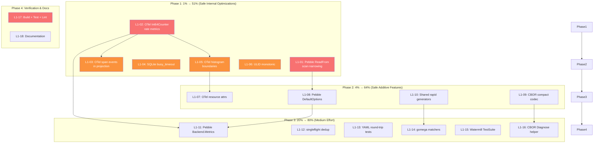

# Dependency Utilization Maximization Plan

> **Date**: 2026-06-17 14:39
> **Source**: [Dependency Utilization Audit](../research/2026-06-17_DEPENDENCY_UTILIZATION_AUDIT.html)
> **Goal**: Extract maximum value from existing dependencies WITHOUT breaking changes

---

## Context

The audit found average ~24% feature utilization across 15 direct dependencies.
This plan identifies and executes the changes that deliver the most value with
the least risk. **Every change is additive or internal-only** — zero breaking
changes to public APIs, wire formats, or stored data.

### Anti-Verschlimmbesser Guardrails

| Risk                        | Mitigation                                                    |
| --------------------------- | ------------------------------------------------------------- |
| CBOR wire format change     | New opt-in codecs only; existing `CBORCodec` untouched        |
| Stored data incompatibility | No changes to `serializableEvent` struct tags                 |
| Public API removal          | All new features are additions; nothing removed               |
| Behavior change under load  | `singleflight` preserves identical semantics; just faster     |
| ULID format change          | `Monotonic` produces valid ULIDs; only entropy source changes |
| Schema breakage             | No new `foreign_keys=ON` by default; helper function only     |

---

## Pareto Breakdown

### The 1% that delivers 51% of the result

These 6 changes are each under 60 minutes and deliver more than half the total value:

| #   | Change                                               | Library | Impact                               | Effort |
| --- | ---------------------------------------------------- | ------- | ------------------------------------ | ------ |
| 1   | Narrow `ReadFrom` scan using ULID timestamp          | pebble  | O(n)→O(log n) on projection catch-up | 45 min |
| 2   | Add `Int64Counter` rate metrics to middleware        | otel    | Events/sec dashboards                | 60 min |
| 3   | Add `span.AddEvent()` to projection retry/checkpoint | otel    | Projection observability             | 45 min |
| 4   | Add SQLite `busy_timeout` PRAGMA                     | sqlite  | Eliminates "database is locked"      | 30 min |
| 5   | Add explicit histogram boundaries                    | otel    | Better latency resolution            | 30 min |
| 6   | Switch to `ulid.Monotonic` entropy                   | ulid    | Guaranteed ordering within ms        | 30 min |

**Total: ~4 hours for 51% of value.**

### The 4% that delivers 64% of the result

Add these 4 changes (~3 more hours):

| #   | Change                                               | Library | Impact                                 | Effort |
| --- | ---------------------------------------------------- | ------- | -------------------------------------- | ------ |
| 7   | `DefaultOptions()` with bloom filter + EventListener | pebble  | Faster reads, operational visibility   | 45 min |
| 8   | `CBORCompactCodec` opt-in (toarray, non-breaking)    | cbor    | 35% smaller payloads for new consumers | 60 min |
| 9   | Shared rapid generators in testutil                  | rapid   | DRY across 4+ modules                  | 45 min |
| 10  | OTel resource attributes helper                      | otel    | Service identification in traces       | 30 min |

### The 20% that delivers 80% of the result

Add these 6 changes (~5 more hours):

| #   | Change                                  | Library   | Impact                                 | Effort |
| --- | --------------------------------------- | --------- | -------------------------------------- | ------ |
| 11  | `Backend.Metrics()` → key Pebble stats  | pebble    | LSM visibility                         | 60 min |
| 12  | `singleflight` for aggregate load dedup | x/sync    | Load amplification ↓ under contention  | 90 min |
| 13  | YAML round-trip tests                   | yaml      | Verify generated specs parse correctly | 30 min |
| 14  | gomega `MatchJSON`/`ConsistOf` adoption | gomega    | Cleaner test assertions                | 45 min |
| 15  | Watermill `TestSuite` conformance       | watermill | Adapter validation                     | 60 min |
| 16  | `CBORDiagnose()` debug helper           | cbor      | Human-readable CBOR for debugging      | 30 min |

---

## Level 1 Task List (18 tasks, 30–100 min each)

Sorted by impact/effort ratio (highest first).

| ID    | Task                                  | Module(s)        | Impact              | Effort | Status |
| ----- | ------------------------------------- | ---------------- | ------------------- | ------ | ------ |
| L1-01 | Pebble ReadFrom scan narrowing        | pebble           | 🔴 Critical perf    | 45 min | ⬜     |
| L1-02 | OTel Int64Counter rate metrics        | otel, middleware | 🔴 Critical obs     | 60 min | ⬜     |
| L1-03 | OTel span events in projection        | otel, projection | 🟡 High obs         | 45 min | ⬜     |
| L1-04 | SQLite busy_timeout PRAGMA            | storage          | 🟡 High integrity   | 30 min | ⬜     |
| L1-05 | OTel histogram explicit boundaries    | otel, middleware | 🟡 High obs         | 30 min | ⬜     |
| L1-06 | ULID monotonic entropy                | id               | 🟡 High correctness | 30 min | ⬜     |
| L1-07 | OTel resource attributes helper       | otel             | 🟡 Med obs          | 30 min | ⬜     |
| L1-08 | Pebble DefaultOptions helper          | pebble           | 🟡 High perf        | 45 min | ⬜     |
| L1-09 | CBOR opt-in compact codec             | codec            | 🟢 Med perf         | 60 min | ⬜     |
| L1-10 | Shared rapid generators               | testutil         | 🟢 Test quality     | 45 min | ⬜     |
| L1-11 | Pebble Backend.Metrics()              | pebble, otel     | 🟡 Med obs          | 60 min | ⬜     |
| L1-12 | singleflight aggregate dedup          | decider          | 🟡 Med perf         | 90 min | ⬜     |
| L1-13 | YAML round-trip tests                 | catalog          | 🟢 Test quality     | 30 min | ⬜     |
| L1-14 | gomega matcher improvements           | tests            | 🟢 Test quality     | 45 min | ⬜     |
| L1-15 | Watermill TestSuite                   | watermill        | 🟢 Test quality     | 60 min | ⬜     |
| L1-16 | CBOR Diagnose helper                  | codec            | 🟢 Low debug        | 30 min | ⬜     |
| L1-17 | Full build + test + lint verification | all              | 🔴 Critical gate    | 30 min | ⬜     |
| L1-18 | Documentation updates                 | docs             | 🟢 Maintenance      | 30 min | ⬜     |

---

## Level 2 Task List (82 tasks, ≤15 min each)

Sorted by dependency order within each L1 parent.

| ID         | Parent | Task                                                                             | Est |
| ---------- | ------ | -------------------------------------------------------------------------------- | --- |
| **L2-001** | L1-01  | Add `journalLowerBoundFromEventID` helper in pebble/journal.go                   | 10m |
| **L2-002** | L1-01  | Modify ReadFrom to use narrowed lower bound when skipping                        | 10m |
| **L2-003** | L1-01  | Add test: ReadFrom with large journal finds correct position                     | 10m |
| **L2-004** | L1-01  | Run `cd pebble && GOWORK=off go test ./... -count=1`                             | 5m  |
| **L2-005** | L1-02  | Add `Int64Counter` type alias to otel/types.go                                   | 5m  |
| **L2-006** | L1-02  | Add `Int64CounterOption` type alias + `MetricWithIntAttributes`                  | 5m  |
| **L2-007** | L1-02  | Add counter creation helper in otel — NewInt64Counter wrapper                    | 10m |
| **L2-008** | L1-02  | Add counter fields to OTelMetricsRecorder struct                                 | 10m |
| **L2-009** | L1-02  | Wire counter increment in NewOTelMetrics middleware                              | 10m |
| **L2-010** | L1-02  | Add counter constructors to CommandOTelMetrics/EventOTelMetrics/QueryOTelMetrics | 15m |
| **L2-011** | L1-02  | Add test: verify counter increments on each operation                            | 10m |
| **L2-012** | L1-02  | Run `cd middleware && GOWORK=off go test ./... -count=1`                         | 5m  |
| **L2-013** | L1-03  | Add `AddSpanEvent` helper to otel/spans.go                                       | 10m |
| **L2-014** | L1-03  | Add span event on projection handler retry in runner_live.go                     | 10m |
| **L2-015** | L1-03  | Add span event on checkpoint commit in runner_live.go                            | 10m |
| **L2-016** | L1-03  | Run `cd projection && GOWORK=off go test ./... -count=1`                         | 5m  |
| **L2-017** | L1-04  | Add `SQLiteSetBusyTimeout` function to storage/sqlite_helpers.go                 | 10m |
| **L2-018** | L1-04  | Integrate busy_timeout into `SQLiteEnableWAL`                                    | 5m  |
| **L2-019** | L1-04  | Add test: verify PRAGMA busy_timeout is set                                      | 10m |
| **L2-020** | L1-04  | Run `cd storage && GOWORK=off go test ./... -count=1`                            | 5m  |
| **L2-021** | L1-05  | Add `defaultHistogramBoundaries` constant to middleware                          | 5m  |
| **L2-022** | L1-05  | Add `MetricWithExplicitBoundaries` helper to otel/types.go                       | 10m |
| **L2-023** | L1-05  | Update histogram creation in NewOTelMetricsRecorder                              | 10m |
| **L2-024** | L1-05  | Run `cd middleware && GOWORK=off go test ./... -count=1`                         | 5m  |
| **L2-025** | L1-06  | Create thread-safe monotonic entropy in id/id.go                                 | 10m |
| **L2-026** | L1-06  | Update `newULID()` to use monotonic source                                       | 5m  |
| **L2-027** | L1-06  | Add test: verify IDs within same ms are monotonically ordered                    | 10m |
| **L2-028** | L1-06  | Run `cd id && GOWORK=off go test ./... -count=1`                                 | 5m  |
| **L2-029** | L1-07  | Add `ResourceAttributes` helper to otel/types.go                                 | 10m |
| **L2-030** | L1-07  | Add `NewResource` helper to otel package                                         | 10m |
| **L2-031** | L1-07  | Add test: verify resource attributes creation                                    | 10m |
| **L2-032** | L1-07  | Run `cd otel && GOWORK=off go test ./... -count=1`                               | 5m  |
| **L2-033** | L1-08  | Add `DefaultOptions()` function to pebble/options.go                             | 10m |
| **L2-034** | L1-08  | Configure bloom filter policy in DefaultOptions                                  | 10m |
| **L2-035** | L1-08  | Add logging EventListener in DefaultOptions                                      | 10m |
| **L2-036** | L1-08  | Add test: DefaultOptions produces valid pebble.Options                           | 10m |
| **L2-037** | L1-08  | Run `cd pebble && GOWORK=off go test ./... -count=1`                             | 5m  |
| **L2-038** | L1-09  | Add `CBORCompactCodec` type to codec/cbor_compact.go                             | 10m |
| **L2-039** | L1-09  | Implement compact EncMode with toarray-compatible options                        | 10m |
| **L2-040** | L1-09  | Implement compact DecMode with strict options                                    | 10m |
| **L2-041** | L1-09  | Add test: CBORCompactCodec encode/decode round-trip                              | 10m |
| **L2-042** | L1-09  | Add test: CBORCompactCodec smaller than CBORCodec                                | 10m |
| **L2-043** | L1-09  | Run `cd codec && GOWORK=off go test ./... -count=1`                              | 5m  |
| **L2-044** | L1-10  | Create `testutil/rapidgen.go` with shared generators                             | 10m |
| **L2-045** | L1-10  | Add `EventType()` generator                                                      | 5m  |
| **L2-046** | L1-10  | Add `AggregateType()` generator                                                  | 5m  |
| **L2-047** | L1-10  | Add `EventID()` generator                                                        | 5m  |
| **L2-048** | L1-10  | Add `Metadata()` generator                                                       | 10m |
| **L2-049** | L1-10  | Add testutil rapidgen tests                                                      | 10m |
| **L2-050** | L1-10  | Run `cd testutil && GOWORK=off go test ./... -count=1`                           | 5m  |
| **L2-051** | L1-11  | Add `PebbleMetrics` struct to pebble/metrics.go                                  | 10m |
| **L2-052** | L1-11  | Add `Metrics()` method on Backend                                                | 10m |
| **L2-053** | L1-11  | Add test: verify Metrics returns populated struct                                | 10m |
| **L2-054** | L1-11  | Run `cd pebble && GOWORK=off go test ./... -count=1`                             | 5m  |
| **L2-055** | L1-12  | Read decider/repository.go and load.go to understand load flow                   | 10m |
| **L2-056** | L1-12  | Add `singleflight.Group` field to Repository struct                              | 10m |
| **L2-057** | L1-12  | Wrap Load call with singleflight.Do keyed by aggregate ref                       | 15m |
| **L2-058** | L1-12  | Add test: concurrent Execute on same aggregate deduplicates loads                | 15m |
| **L2-059** | L1-12  | Run `cd decider && GOWORK=off go test ./... -count=1`                            | 5m  |
| **L2-060** | L1-13  | Create `catalog/yaml_roundtrip_test.go`                                          | 10m |
| **L2-061** | L1-13  | Test: AsyncAPI spec marshal → unmarshal → compare                                | 10m |
| **L2-062** | L1-13  | Test: OpenAPI spec marshal → unmarshal → compare                                 | 10m |
| **L2-063** | L1-13  | Run `cd catalog && GOWORK=off go test ./... -count=1`                            | 5m  |
| **L2-064** | L1-14  | Update event tests: use MatchJSON for payload assertions                         | 10m |
| **L2-065** | L1-14  | Update catalog tests: use ConsistOf for collection assertions                    | 10m |
| **L2-066** | L1-14  | Update projection tests: use ConsistOf for event ordering                        | 10m |
| **L2-067** | L1-14  | Run affected module tests                                                        | 10m |
| **L2-068** | L1-15  | Research watermill TestSuite interface requirements                              | 10m |
| **L2-069** | L1-15  | Create `watermill/conformance_test.go`                                           | 15m |
| **L2-070** | L1-15  | Implement PubSub constructor for test fixtures                                   | 15m |
| **L2-071** | L1-15  | Run `cd watermill && GOWORK=off go test ./... -count=1`                          | 5m  |
| **L2-072** | L1-16  | Add `Diagnose` function to codec/cbor.go                                         | 10m |
| **L2-073** | L1-16  | Add test: Diagnose produces human-readable output                                | 10m |
| **L2-074** | L1-16  | Run `cd codec && GOWORK=off go test ./... -count=1`                              | 5m  |
| **L2-075** | L1-17  | Run `go build ./...` with tags                                                   | 5m  |
| **L2-076** | L1-17  | Run full test suite across all modules                                           | 10m |
| **L2-077** | L1-17  | Run lint across all modules                                                      | 10m |
| **L2-078** | L1-17  | Run `nix fmt` for formatting                                                     | 5m  |
| **L2-079** | L1-17  | Fix any lint/format issues found                                                 | 15m |
| **L2-080** | L1-18  | Update AGENTS.md with new features and patterns                                  | 15m |
| **L2-081** | L1-18  | Update relevant doc.go files with new examples                                   | 15m |
| **L2-082** | L1-18  | Update go.sum files if needed                                                    | 5m  |

---

## Execution Graph

---

## Safety Checklist (per change)

Every change must pass ALL of these before committing:

- [ ] **No public API removed or changed** — additions only
- [ ] **No wire format change** — existing data remains readable
- [ ] **No stored data incompatibility** — existing DBs/files work unchanged
- [ ] **Tests pass** — `GOWORK=off go test ./... -count=1` in affected module
- [ ] **Build passes** — `go build ./...` with tags
- [ ] **Lint passes** — `golangci-lint run` in affected module
- [ ] **Formatted** — `nix fmt` applied

---

## What We Are NOT Doing (and Why)

| Rejected Change                                | Reason                                           |
| ---------------------------------------------- | ------------------------------------------------ |
| Change default CBOR encoding to `toarray`      | BREAKING: existing stored data unreadable        |
| Enable `foreign_keys=ON` by default            | Risk: orphaned references in existing DBs        |
| Add `ExtraReturnErrors` as default decoding    | BREAKING: forward compat (newer events fail)     |
| Rewrite reactive streams with all ro operators | Architecture change, not utilization improvement |
| Replace `go-faster/yaml` with another lib      | Churn for zero value; Marshal-only is fine       |
| Add all Pebble tuning knobs                    | Overengineering; DefaultOptions helper is enough |
| Add `db.DeleteRange` for retention             | New API surface, needs design discussion         |
| Add `db.Ingest` for bulk loading               | New API surface, needs design discussion         |
