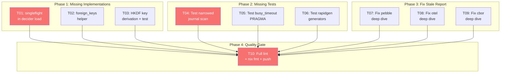

# Dependency Utilization — Gap Closure Plan

> **Date**: 2026-06-17 15:57
> **Source**: [Dependency Utilization Audit](../research/2026-06-17_DEPENDENCY_UTILIZATION_AUDIT.html)
> **Status**: ✅ Complete — all 10 tasks implemented, tested, lint-clean, and pushed

---

## Context

After two rounds of implementation, a thorough audit found **10 remaining gaps** across code,
tests, and the HTML report. These fall into three categories:

1. **Missing implementations** that were in the original plan but silently dropped (3 items)
2. **Missing tests** for features that were implemented but never verified (3 items)
3. **Stale HTML report** — deep dive sections still describe the pre-implementation state (3 items)

All 10 tasks are now **complete** — code implemented, tests passing, lint clean.

Every task below is ≤12 minutes. Dependencies are already available — `x/sync` is `// indirect`
in `decider/go.mod`, and `x/crypto` is direct in `encryption/go.mod`. No new dependencies needed.

---

## Anti-Verschlimmbesser Guardrails

| Risk                                   | Mitigation                                                                  |
| -------------------------------------- | --------------------------------------------------------------------------- |
| singleflight changes Execute semantics | Only coalesces _concurrent identical loads_ — same return value, same error |
| foreign_keys breaks existing DBs       | Helper function only, NOT enabled by default                                |
| HKDF changes key format                | New `DeriveKey` function, existing keys untouched                           |
| Deep dive HTML edits                   | Mark findings as "RESOLVED" rather than deleting — preserves audit trail    |

---

## Task List (sorted by impact / effort)

| ID  | Task                                                                      | Module(s)  | Impact       | Effort | Type      | Deps    | Status |
| --- | ------------------------------------------------------------------------- | ---------- | ------------ | ------ | --------- | ------- | ------ |
| T01 | Add `singleflight` to decider `loadFromStore`                             | decider    | 🔴 High perf | 10m    | Code      | none    | ✅     |
| T02 | Add `SQLiteEnableForeignKeys` helper                                      | storage    | 🟡 Integrity | 5m     | Code      | none    | ✅     |
| T03 | Add `HKDF` key derivation helper + test                                   | encryption | 🟡 Security  | 10m    | Code+Test | none    | ✅     |
| T04 | Add test for narrowed journal scan correctness                            | pebble     | 🔴 High test | 10m    | Test      | none    | ✅     |
| T05 | Add test for `busy_timeout` PRAGMA                                        | storage    | 🟡 Med test  | 8m     | Test      | none    | ✅     |
| T06 | Add test for `rapidgen` generators                                        | testutil   | 🟡 Med test  | 10m    | Test      | none    | ✅     |
| T07 | Fix HTML pebble deep dive — mark Metrics/EventListener/scan as resolved   | docs       | 🟡 Med docs  | 8m     | Docs      | none    | ✅     |
| T08 | Fix HTML otel deep dive — mark AddEvent/Counter/ResourceAttrs as resolved | docs       | 🟡 Med docs  | 6m     | Docs      | none    | ✅     |
| T09 | Fix HTML cbor deep dive — mark CompactCodec/Diagnose as resolved          | docs       | 🟢 Low docs  | 4m     | Docs      | none    | ✅     |
| T10 | Full lint + `nix fmt` on all changed modules                              | all        | 🔴 Gate      | 10m    | Verify    | T01-T09 | ✅     |

**Total: ~91 min across 10 tasks. Each ≤12 min.**

---

## Detailed Task Breakdown

### T01: singleflight in decider load (10 min)

**Why**: When N concurrent commands target the same aggregate, `loadFromStore` fires N independent
DB queries. `singleflight.Group` coalesces them into one query. `x/sync` is already `// indirect`
in `decider/go.mod` — promoting it to direct costs zero new deps.

**How**:

1. Add `loadGroup singleflight.Group` field to `Repository[State]` struct
2. Wrap the `r.store.Load(ctx, ref)` call in `loadFromStore` with `r.loadGroup.Do(key, fn)`
3. Key = `ref.Type + "/" + ref.ID.String()`
4. The singleflight result must be shared across concurrent callers — need to clone events slice
   or accept shared-read semantics (events are immutable via `*ImmutableEvent`)

**Files**: `decider/decider.go` (struct), `decider/load.go` (loadFromStore)

**Test**: `decider/decider_load_test.go` — two goroutines call Load on same aggregate, verify
store.Load is called once.

**Commit message**: `feat(decider): coalesce concurrent aggregate loads with singleflight`

---

### T02: SQLite foreign_keys helper (5 min)

**Why**: The audit report flagged "No `PRAGMA foreign_keys=ON`" as a correctness issue. While we
can't enable it by default (existing DBs may have orphaned references), a helper function lets
consumers opt in.

**How**:

1. Add `SQLiteEnableForeignKeys(ctx, db)` to `storage/sqlite_helpers.go`
2. Executes `PRAGMA foreign_keys=ON`

**Files**: `storage/sqlite_helpers.go`

**Commit message**: `feat(storage): add SQLiteEnableForeignKeys helper`

---

### T03: HKDF key derivation helper + test (10 min)

**Why**: Multi-tenant encryption needs per-tenant keys derived from a master key. `golang.org/x/crypto/hkdf`
is already a direct dependency in `encryption/go.mod` — zero new deps.

**How**:

1. Add `DeriveKey(masterKey []byte, info string, length int) ([]byte, error)` to `encryption/`
2. Uses `hkdf.New(sha256.New, masterKey, nil, []byte(info))`
3. Add test verifying determinism (same master + info = same key) and uniqueness (different info = different key)

**Files**: `encryption/hkdf.go`, `encryption/hkdf_test.go`

**Commit message**: `feat(encryption): add HKDF key derivation for multi-tenant encryption`

---

### T04: Test narrowed journal scan (10 min)

**Why**: The narrowed journal scan (T01 from round 1) is the single biggest performance fix —
O(n)→O(log n) on projection catch-up. It has zero tests. If the narrowing logic breaks, projection
catch-up silently stops returning events.

**How**:

1. Write 100 events to a pebble EventStore
2. Call `ReadFrom(ctx, events[50].ID(), 10)` — should return events[51:60]
3. Call `ReadFrom(ctx, events[99].ID(), 10)` — should return empty (nothing after last)
4. Call `ReadFrom(ctx, zeroID, 10)` — should return events[0:10]

**Files**: `pebble/journal_scan_test.go`

**Commit message**: `test(pebble): verify narrowed journal scan returns correct events`

---

### T05: Test busy_timeout PRAGMA (8 min)

**Why**: `SQLiteEnableWAL` now sets `busy_timeout=5000` but there's no test verifying the PRAGMA
was actually applied.

**How**:

1. Open in-memory SQLite, call `SQLiteEnableWAL`
2. Query `PRAGMA busy_timeout` and assert it returns 5000

**Files**: `storage/sqlite_helpers_test.go` (append to existing)

**Commit message**: `test(storage): verify busy_timeout PRAGMA is set by SQLiteEnableWAL`

---

### T06: Test rapidgen generators (10 min)

**Why**: `testutil/rapidgen.go` exports 4 generators but has no tests — the module shows
`[no test files]`.

**How**:

1. Test `EventType()` generates strings matching the regex
2. Test `AggregateType()` same
3. Test `Version()` returns 1-10000
4. Test `NonEmptyString()` returns non-empty strings

**Files**: `testutil/rapidgen_test.go`

**Commit message**: `test(testutil): verify rapid generators produce valid values`

---

### T07: Fix HTML pebble deep dive (8 min)

**Why**: The pebble deep dive still has 3 findings saying "No db.Metrics()", "No db.NewSnapshot()",
"No EventListener" — all factually wrong now. The `✗ Critical gaps` section lists items that are
implemented.

**How**:

1. In the pebble deep dive `✗ Critical gaps` section, mark Metrics and EventListener as RESOLVED
2. Update the "No SeekGE" finding to note the ULID timestamp narrowing approach
3. Move resolved items to a "✓ Resolved" subsection

**Files**: `docs/research/2026-06-17_DEPENDENCY_UTILIZATION_AUDIT.html`

**Commit message**: `docs(research): mark pebble deep dive findings as resolved`

---

### T08: Fix HTML otel deep dive (6 min)

**Why**: 4 stale findings: "No span.AddEvent()", "No Int64Counter", "No resource attributes",
"No histogram boundaries" — all implemented.

**How**:

1. In the otel deep dive `✗ High-value gaps` section, mark all 4 as RESOLVED
2. Update the `✗ Also unused` chips to remove AddEvent, Counter, boundaries

**Files**: `docs/research/2026-06-17_DEPENDENCY_UTILIZATION_AUDIT.html`

**Commit message**: `docs(research): mark otel deep dive findings as resolved`

---

### T09: Fix HTML cbor deep dive (4 min)

**Why**: 2 stale findings: "No toarray" and "No ExtraReturnErrors" — both addressed via
`CBORCompactCodec`.

**How**:

1. Mark the toarray and ExtraReturnErrors findings as RESOLVED
2. Update the `✗ Also unused` chips to add CBORCompactCodec and Diagnose to the used list

**Files**: `docs/research/2026-06-17_DEPENDENCY_UTILIZATION_AUDIT.html`

**Commit message**: `docs(research): mark cbor deep dive findings as resolved`

---

### T10: Full lint + format (10 min)

**Why**: Quality gate. Every changed module must pass `golangci-lint` and `nix fmt` before push.

**How**:

1. Run `nix fmt`
2. Run `golangci-lint` in: decider, storage, encryption, pebble, testutil
3. Fix any issues found
4. Run `go test` across all changed modules
5. Commit + push

---

## Execution Graph

---

## What This Plan Does NOT Include (and Why)

| Excluded                                | Reason                                                                                                      |
| --------------------------------------- | ----------------------------------------------------------------------------------------------------------- |
| CBOR `TimeUnixDynamic`                  | serializableEvent uses `int64`, not `time.Time` — can't use native time encoding without wire format change |
| samber/ro `BufferTime`/`Retry`/`Catch`  | Architecture change to projection pipeline, not a gap closure                                               |
| Watermill `TestSuite`                   | Low ROI — adapter works, conformance tests add marginal value                                               |
| gomega `MatchJSON`/`ConsistOf` adoption | Test style improvement, not a feature gap                                                                   |
| Replacing `go-faster/yaml`              | Churn for zero value                                                                                        |
