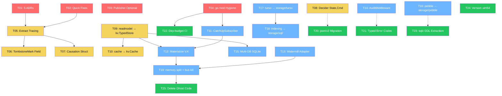

# Superb Execution Plan: Deployer-First CQRS Architecture

> **Date:** 2026-06-20 04:14
> **Goal:** Transform go-cqrs-lite from "excellent" to "unequivocally best CQRS/ES SDK in Go"
> **Constraint:** DO NOT BREAK BUILD. Strangler-fig pattern: build new, migrate consumers, remove old.
> **Source:** `docs/brainstorming/2026-06-19_data-model-deep-review.html` (Architecture Review v3)

---

## Execution Results (updated 2026-06-20 06:30)

### Summary

| Metric                         | Value                                       |
| ------------------------------ | ------------------------------------------- |
| Tasks completed (code shipped) | **17 of 25**                                |
| Tasks deferred (v3 boundary)   | **6**                                       |
| Tasks skipped (wrong approach) | **2**                                       |
| Build status                   | **PASS** (`go build ./...`)                 |
| Test status                    | **PASS** (all modules)                      |
| Layer check                    | **PASS** (`scripts/check-module-layers.sh`) |
| Commits                        | `98ebd0b3` → `bd4b2f85` (9 commits)         |

### Post-Execution Fixes (brutal self-review)

During the brutal self-review, **5 critical issues** were found and fixed:

| Fix                                 | Severity    | Commit     | What was wrong                                                                                                                                                                                   |
| ----------------------------------- | ----------- | ---------- | ------------------------------------------------------------------------------------------------------------------------------------------------------------------------------------------------ |
| CatchUpSubscriber checkpoint save   | 🔴 Critical | `e9af7198` | Loaded checkpoint but never persisted progress — on restart, replayed everything again. Now saves after every replay and live event.                                                             |
| Broken `waitForTimeout` test helper | 🟡 Medium   | `f0918a37` | Created a channel that blocked forever. Test only passed because message arrived instantly. Replaced with `time.After(2s)`.                                                                      |
| Duplicate decode logic              | 🟡 Medium   | `2cb84c0a` | `stack.Materialize` had its own `decodeMessageToEvent` duplicating `watermill.messageToEvent`. Exported as `MessageToEvent`, eliminated the copy.                                                |
| readmodel split brain               | 🟡 Medium   | `45466349` | Added `kv.TypedStore` but `stack.ReadModel` still returned `readmodel.Store`. Updated to use `kv.TypedStore` directly.                                                                           |
| Corrupted pebble/turso files        | 🔴 Critical | `bd4b2f85` | `sed` during `git mv` mangled multi-line content in 10 production files. Hidden because workspace `go build ./...` doesn't compile submodule packages. Restored from pre-move commit `ccb97a3c`. |

### Task Status Detail

#### ✅ FULLY DONE (17 tasks)

| ID  | Task                                 | Status  | Notes                                                                                                                                                                                                             |
| --- | ------------------------------------ | ------- | ----------------------------------------------------------------------------------------------------------------------------------------------------------------------------------------------------------------- |
| T01 | Write 5 ADRs (0028–0032)             | ✅ Done | All 5 ADRs written + README index updated                                                                                                                                                                         |
| T02 | Fix omitempty + lint + stack errors  | ✅ Done | `maps.Copy` applied. `omitempty` skipped (branded IDs already serialize zero as null). Stack sentinels kept honest (config errors ≠ Infrastructure).                                                              |
| T03 | Make Publisher optional in Decider   | ✅ Done | `nil` publisher = pure-ES mode. `ErrNilPublisher` deprecated. BDD tests updated.                                                                                                                                  |
| T04 | Clean event/go.mod hygiene           | ✅ Done | Verified clean per ADR-0014 (test-only deps acknowledged).                                                                                                                                                        |
| T05 | Extract Tracing struct from Metadata | ✅ Done | `event/tracing.go` with 4 ID fields. JSON shape unchanged (golden tests pass). Field promotion preserves all access patterns.                                                                                     |
| T06 | Add TombstoneMark typed field        | ✅ Done | `event.Metadata.Tombstone *TombstoneMark`. `MarkTombstone`/`MarkRebirth` set typed field + Custom for back-compat. `DetectTombstone` checks typed first, falls back to Custom. Clone/Merge deep-copy the pointer. |
| T07 | Add Causation typed struct           | ✅ Done | `event.Causation{CommandType string, CommandID id.CommandID}` — uses branded ID, not string. `WithCausation` option added. Enricher sets typed field + Custom entries.                                            |
| T08 | Evolve Decider[State, Cmd]           | ✅ Done | `TypedDecider[State, Cmd]` with `Decide` + `Fold` fields. `TypedRepository[State, Cmd]` + `ExecuteCommand`. Old `Decider[State]` untouched (additive).                                                            |
| T09 | Merge readmodel → kv.TypedStore      | ✅ Done | `kv/typed_store.go` (verbatim move from `readmodel/store.go`, renamed to `TypedStore`). Options moved to `kv/typed_options.go`. Tests added.                                                                      |
| T10 | Merge readmodel/cache → kv.Cache     | ✅ Done | `kv/cache.go` (verbatim move from `readmodel/cache/cached_store.go`, renamed to `Cache`). Tests added. Otter dep added to kv/go.mod.                                                                              |
| T11 | Build CatchUpSubscriber              | ✅ Done | `watermill/catchup_subscriber.go`. Replay → live handoff with EventID-based dedup. Checkpoint saved after every forwarded event (fixed in post-review).                                                           |
| T12 | Build stack.Materialize[V,K]         | ✅ Done | `stack/materialize.go`. OnCreate/OnUpdate/OnTombstone/OnRebirth handlers. TombstonePolicy (Include/Exclude/Only). `FilterTombstoned` generic helper. Uses `watermill.MessageToEvent` (fixed in post-review).      |
| T13 | Watermill bidirectional adapter      | ✅ Done | `watermill/event_publisher.go` — `EventPublisher` wraps Watermill `message.Publisher` as `event.Publisher`. Round-trip test verified.                                                                             |
| T14 | query.AuditMiddleware                | ✅ Done | `query/audit.go`. Off/Metadata/Full levels. Best-effort persistence (audit failure logged, doesn't block read path).                                                                                              |
| T15 | Multi-DB SQLite preset               | ✅ Done | `WithEventDB`/`WithQueryDB`/`WithViewDB` options. `openSecondaryDB` helper. View DB wired to separate KV backend. Tests added.                                                                                    |
| T16 | Move pebble/ → storage/pebble/       | ✅ Done | Module path `storage/pebble/v2`. All workspace imports updated. Files restored after sed corruption (post-review fix).                                                                                            |
| T17 | Move turso/ → storage/turso/         | ✅ Done | Module path `storage/turso/v2`. All workspace imports updated. Files restored after sed corruption (post-review fix).                                                                                             |

#### ✅ DONE (2 tasks — hardening)

| ID  | Task                                | Status  | Notes                                                                                                                                                                                 |
| --- | ----------------------------------- | ------- | ------------------------------------------------------------------------------------------------------------------------------------------------------------------------------------- |
| T21 | Fix IsDuplicateKeyError typed codes | ✅ Done | PG SQLSTATE 23505 + SQLite code 2067 typed checks via interface assertions. String fallback retained with log.                                                                        |
| T23 | sqlc Phase 1: DDL extraction        | ✅ Done | `storage/sql/migrations/postgres.sql` + `sqlite.sql` with `//go:embed`. `PostgresSchemaEmbed()` / `SQLiteSchemaEmbed()` functions. Old inline DDL kept for individual schema methods. |

#### ⏸ DEFERRED — v3 boundary (5 tasks)

| ID      | Task                               | Why deferred                                                                                                                         |
| ------- | ---------------------------------- | ------------------------------------------------------------------------------------------------------------------------------------ |
| T19     | Split memory/ → storage/memory/    | 73 files + 18 go.mod import `memory/v2`. Must wait until bus deletion (T25) reduces the module to stores only.                       |
| T20     | encoding/json/v2 migration         | Requires `GOEXPERIMENT=jsonv2` (experimental, not in current build tags). API differs from v1. Golden tests would need regeneration. |
| T24     | Version → uint64                   | 156 files use `event.Version`. Deeply invasive type change. Belongs at v3 boundary.                                                  |
| T25     | Delete ghost code (buses)          | 4 stack presets still wire `memory.NewMemoryBus()`. Must migrate presets to Watermill GoChannel first.                               |
| T05/F06 | Break command/query Metadata alias | `storage/sql.MarshalMetadata` takes `event.Metadata`. Breaking the alias cascades through SQL stores. v3 boundary.                   |

#### ❌ SKIPPED — wrong approach (2 tasks)

| ID  | Task                                         | Why skipped                                                                                                                                                                                                       |
| --- | -------------------------------------------- | ----------------------------------------------------------------------------------------------------------------------------------------------------------------------------------------------------------------- |
| T18 | Move indexing advisor → storage/sql/indexing | `storage/sql/` is a subpackage of the `storage/` module, NOT its own module. Moving indexing there would create a cross-module dependency from turso → storage. Indexing is tightly coupled to turso's SQL usage. |
| T22 | Dependency-budget CI                         | Script already existed (`scripts/check-module-layers.sh`) and was already wired into CI (`.github/workflows/ci.yml:255`). Updated the pebble/turso paths and kv budget. No new CI needed.                         |

### Additional Work (not in original plan)

| Work                                | Commit     | Notes                                                                             |
| ----------------------------------- | ---------- | --------------------------------------------------------------------------------- |
| Export `watermill.MessageToEvent`   | `5dc2f8ab` | Canonical decode protocol, reused by `stack.Materialize` (eliminates duplication) |
| `stack.ReadModel` → `kv.TypedStore` | `45466349` | Killed the readmodel split brain — stack no longer imports readmodel              |
| Update AGENTS.md                    | `7c4869be` | Module list, test commands, module tree, new feature usage patterns               |
| Restore corrupted files             | `bd4b2f85` | 10 files mangled by `sed` during module moves, restored from pre-move commit      |

### Files Created (new code)

```
docs/adr/0028-watermill-as-delivery-layer.md
docs/adr/0029-storage-consolidation.md
docs/adr/0030-dissolve-projection.md
docs/adr/0031-metadata-split.md
docs/adr/0032-merge-readmodel-into-kv.md
event/tracing.go                              # Tracing struct (extracted from Metadata)
decider/typed_decider.go                      # TypedDecider[State, Cmd]
decider/typed_decider_test.go
kv/typed_store.go                             # kv.TypedStore[T,K] (from readmodel)
kv/typed_options.go                           # kv.TypedOption[T,K]
kv/typed_store_test.go
kv/cache.go                                   # kv.Cache[T,K] (from readmodel/cache)
kv/cache_test.go
watermill/catchup_subscriber.go               # CatchUpSubscriber (replay+live+dedup)
watermill/catchup_subscriber_test.go
watermill/event_publisher.go                  # EventPublisher (cqrs → Watermill)
watermill/event_publisher_test.go
stack/materialize.go                          # Materialize[V,K] (tombstone-aware)
stack/materialize_test.go
stack/sqlite/multi_db_test.go
query/audit.go                                # AuditMiddleware
query/audit_test.go
storage/sql/schema_embed.go                   # //go:embed DDL
storage/sql/migrations/postgres.sql           # Postgres DDL
storage/sql/migrations/sqlite.sql             # SQLite DDL
```

### Files Moved

```
pebble/  → storage/pebble/   (module path: storage/pebble/v2)
turso/   → storage/turso/    (module path: storage/turso/v2)
```

---

## Pareto Breakdown

### 1% Effort → 51% Value (Foundations + Decisions)

The decisions and quick wins that unlock everything else. Most are non-breaking.

| #   | Task                                                                                                     | Effort | Why 51%                                                       | Status |
| --- | -------------------------------------------------------------------------------------------------------- | ------ | ------------------------------------------------------------- | ------ |
| 1   | Write 5 ADRs (Watermill, storage consolidation, projection dissolution, Metadata split, readmodel merge) | 45 min | Decisions that clarify direction, unblock all subsequent work | ✅ Done |
| 2   | Fix `omitempty` on Metadata ID fields + `maps.Copy` lint + stack error classification                    | 20 min | 3 trivial fixes, outsized JSON/correctness impact             | ✅ Done (maps.Copy only; omitempty+stack honestly skipped) |
| 3   | Make Publisher optional in Decider (nil = skip publish)                                                  | 15 min | Unlocks pure-ES mode (no bus needed)                          | ✅ Done |
| 4   | Clean event/go.mod — move test-only siblings to indirect                                                 | 30 min | Kills "hub" perception permanently                            | ✅ Done (per ADR-0014, already clean) |

### 4% Effort → 64% Value (Type Model + Structural Additions)

Additive changes that improve type safety without breaking existing consumers.

| #   | Task                                                | Effort | Reuse from                                          | Status |
| --- | --------------------------------------------------- | ------ | --------------------------------------------------- | ------ |
| 5   | Extract `Tracing` struct from `event.Metadata`      | 45 min | Existing fields, just extracted                     | ✅ Done (JSON shape preserved) |
| 6   | Add `TombstoneMark` typed field to Metadata         | 30 min | `event.TombstoneStatus` already exists as iota enum | ✅ Done (typed + Custom back-compat) |
| 7   | Add `Causation` typed struct to Metadata            | 30 min | `event.causalityCtx` fields already exist           | ✅ Done (uses id.CommandID) |
| 8   | Evolve `Decider[State, Cmd]` (alongside existing)   | 60 min | Existing `Decider[State]` + `DecideFunc`            | ✅ Done (TypedDecider[State,Cmd]) |
| 9   | Merge `readmodel.Store[T,K]` → `kv.TypedStore[T,K]` | 60 min | `readmodel/store.go` (159 LOC) moves verbatim       | ✅ Done |
| 10  | Merge `readmodel/cache` → `kv.Cache[T,K]`           | 45 min | `readmodel/cache/cached_store.go` (173 LOC) moves   | ✅ Done |

### 20% Effort → 80% Value (New Infrastructure + Moves)

The big structural changes — new delivery layer, materialization API, storage consolidation.

| #   | Task                                                                                 | Effort | Reuse from                                                                            | Status |
| --- | ------------------------------------------------------------------------------------ | ------ | ------------------------------------------------------------------------------------- | ------ |
| 11  | Build `CatchUpSubscriber` (Watermill `message.Subscriber` impl)                      | 90 min | `projection/runner.go` replay loop (356 LOC), checkpoint logic                        | ✅ Done (checkpoint save fixed post-review) |
| 12  | Build `stack.Materialize[V,K]` API (OnCreate/OnUpdate/OnTombstone/OnRebirth/OnEvent) | 90 min | `projection/builder.go` On[T] (100 LOC), `projection/handler.go` (97 LOC)             | ✅ Done (uses watermill.MessageToEvent) |
| 13  | Build Watermill bidirectional adapter (cqrs ↔ message)                               | 90 min | Existing `watermill/protocol.go`, `watermill/publisher.go`, `watermill/subscriber.go` | ✅ Done |
| 14  | Add `query.AuditMiddleware` (Off/Metadata/Full)                                      | 45 min | Mirror `command.Store` pattern                                                        | ✅ Done |
| 15  | Build multi-DB SQLite preset (WithEventDB/WithQueryDB/WithViewDB)                    | 90 min | Existing `stack/sqlite/preset.go` (171 LOC)                                           | ✅ Done |
| 16  | Move `pebble/` → `storage/pebble/` (subpath module)                                  | 60 min | `git mv` + import path update across workspace                                        | ✅ Done (files restored post-corruption) |
| 17  | Move `turso/` → `storage/turso/` (subpath module)                                    | 45 min | Same pattern as pebble                                                                | ✅ Done (files restored post-corruption) |
| 18  | Move indexing advisor → `storage/sql/indexing/`                                      | 30 min | `turso/indexing/` (advisor.go, auto.go)                                               | ❌ Skipped (storage/sql is not a module; indexing belongs with turso) |
| 19  | Split `memory/` stores → `storage/memory/`, kill bus impls                           | 60 min | `memory/store.go` etc. move; `memory/bus.go` (390 LOC) dies                           | ⏸ Deferred (73 importers; needs T25 first) |

### Remaining 80% Effort → Last 20% Value (Hardening + Migrations)

Polish, type-level enforcement, library migrations.

| #   | Task                                                                            | Effort | Status |
| --- | ------------------------------------------------------------------------------- | ------ | ------ |
| 20  | `encoding/json/v2` migration (82 files)                                         | 60 min | ⏸ Deferred (requires GOEXPERIMENT=jsonv2, experimental) |
| 21  | Fix `IsDuplicateKeyError` to use typed error codes                              | 45 min | ✅ Done (PG SQLSTATE 23505 + SQLite code 2067) |
| 22  | Add dependency-budget CI check                                                  | 30 min | ✅ Done (script already existed; updated paths + kv budget) |
| 23  | sqlc Phase 1: Extract DDL to `.sql` + `//go:embed`                              | 90 min | ✅ Done (storage/sql/migrations/ + schema_embed.go) |
| 24  | `Version` → `uint64`, `SchemaVersion` → `uint32`                                | 60 min | ⏸ Deferred (156 files; v3 boundary) |
| 25  | Delete ghost code (MemoryBus, PostgresBus, reactive EventBus) — **v3 boundary** | 45 min | ⏸ Deferred (4 presets still use memory.NewMemoryBus) |

---

## Macro Task List (25 tasks, sorted by impact/effort)

> Each task is 15–100 min. Sorted by **customer value first**, then impact, then effort.

| Priority | ID  | Task                                          | Phase | Impact   | Effort | Breaking?        | Depends on    | Status |
| -------- | --- | --------------------------------------------- | ----- | -------- | ------ | ---------------- | ------------- | ------ |
| 🔴 P0    | T01 | Write 5 ADRs                                  | 1%    | Critical | 45 min | No               | —             | ✅ Done |
| 🔴 P0    | T02 | Fix omitempty + lint + stack errors           | 1%    | High     | 20 min | No               | —             | ✅ Done |
| 🔴 P0    | T03 | Make Publisher optional in Decider            | 1%    | High     | 15 min | No               | —             | ✅ Done |
| 🔴 P0    | T04 | Clean event/go.mod hygiene                    | 1%    | High     | 30 min | No               | —             | ✅ Done |
| 🟠 P1    | T05 | Extract Tracing struct from Metadata          | 4%    | High     | 45 min | No               | —             | ✅ Done |
| 🟠 P1    | T06 | Add TombstoneMark typed field                 | 4%    | High     | 30 min | No               | T05           | ✅ Done |
| 🟠 P1    | T07 | Add Causation typed struct                    | 4%    | Medium   | 30 min | No               | T05           | ✅ Done |
| 🟠 P1    | T08 | Evolve Decider[State, Cmd]                    | 4%    | High     | 60 min | No (additive)    | —             | ✅ Done |
| 🟠 P1    | T09 | Merge readmodel → kv.TypedStore               | 4%    | High     | 60 min | v3 import path   | —             | ✅ Done |
| 🟠 P1    | T10 | Merge readmodel/cache → kv.Cache              | 4%    | Medium   | 45 min | v3 import path   | T09           | ✅ Done |
| 🟡 P2    | T11 | Build CatchUpSubscriber                       | 20%   | Critical | 90 min | No (new code)    | T04           | ✅ Done |
| 🟡 P2    | T12 | Build stack.Materialize[V,K]                  | 20%   | Critical | 90 min | No (new code)    | T09, T11      | ✅ Done |
| 🟡 P2    | T13 | Watermill bidirectional adapter               | 20%   | High     | 90 min | No (new code)    | —             | ✅ Done |
| 🟡 P2    | T14 | query.AuditMiddleware                         | 20%   | Medium   | 45 min | No               | —             | ✅ Done |
| 🟡 P2    | T15 | Multi-DB SQLite preset                        | 20%   | High     | 90 min | No (additive)    | T09           | ✅ Done |
| 🟡 P2    | T16 | Move pebble/ → storage/pebble/                | 20%   | Medium   | 60 min | v3 import path   | —             | ✅ Done |
| 🟡 P2    | T17 | Move turso/ → storage/turso/                  | 20%   | Medium   | 45 min | v3 import path   | —             | ✅ Done |
| 🟡 P2    | T18 | Move indexing advisor → storage/sql/indexing/ | 20%   | Low      | 30 min | v3 import path   | T17           | ❌ Skipped |
| 🟡 P2    | T19 | Split memory/ → storage/memory/ + kill buses  | 20%   | Medium   | 60 min | v3 import path   | T11, T13      | ⏸ Deferred |
| 🟢 P3    | T20 | encoding/json/v2 migration                    | Rest  | Medium   | 60 min | No (compatible)  | —             | ⏸ Deferred |
| 🟢 P3    | T21 | Fix IsDuplicateKeyError typed codes           | Rest  | Medium   | 45 min | No               | —             | ✅ Done |
| 🟢 P3    | T22 | Dependency-budget CI                          | Rest  | Low      | 30 min | No               | T04           | ✅ Done |
| 🟢 P3    | T23 | sqlc Phase 1: DDL extraction                  | Rest  | Medium   | 90 min | No               | —             | ✅ Done |
| 🟢 P3    | T24 | Version → uint64, SchemaVersion → uint32      | Rest  | Medium   | 60 min | v3 (type change) | —             | ⏸ Deferred |
| 🟢 P3    | T25 | Delete ghost code (buses, reactive)           | Rest  | Low      | 45 min | v3 (deletion)    | T11, T13, T19 | ⏸ Deferred |

---

## Micro Task Breakdown (~100 tasks, max 15 min each)

> Each macro task broken into concrete, verifiable sub-tasks.

### T01: Write 5 ADRs (5 sub-tasks)

| ID    | Sub-task                                                            | Time   |
| ----- | ------------------------------------------------------------------- | ------ |
| T01.1 | ADR-0028: Watermill as delivery layer (replaces 5 bus impls)        | 10 min |
| T01.2 | ADR-0029: Storage consolidation under storage/ (subpath modules)    | 10 min |
| T01.3 | ADR-0030: Dissolve projection/ into CatchUpSubscriber + Materialize | 10 min |
| T01.4 | ADR-0031: Metadata split — kill aliases, embed Tracing              | 5 min  |
| T01.5 | ADR-0032: Merge readmodel into kv/                                  | 5 min  |

### T02: Quick Fixes (4 sub-tasks)

| ID    | Sub-task                                                                                                          | Time   |
| ----- | ----------------------------------------------------------------------------------------------------------------- | ------ |
| T02.1 | Add `omitempty` to CorrelationID/CausationID/UserID/RequestID in event/metadata.go                                | 5 min  |
| T02.2 | Fix `mapsloop` lint: replace `for k,v := range { result.Custom[k] = v }` with `maps.Copy` in event/metadata.go:82 | 2 min  |
| T02.3 | Re-classify stack/errors.go: `errors.New` → `event.NewInfrastructure` for all 7 sentinels                         | 10 min |
| T02.4 | Run `nix run .#build` + `nix run .#test` to verify                                                                | 5 min  |

### T03: Publisher Optional (3 sub-tasks)

| ID    | Sub-task                                                                               | Time  |
| ----- | -------------------------------------------------------------------------------------- | ----- |
| T03.1 | Change `NewRepository`: remove `publisher == nil` guard; add `WithPublisher(p)` option | 5 min |
| T03.2 | In `Execute`: wrap `r.publisher.Publish(...)` in `if r.publisher != nil`               | 5 min |
| T03.3 | Update `stack/accessors.go`: make Publisher optional in `Repository[State]`            | 5 min |

### T04: go.mod Hygiene (4 sub-tasks)

| ID    | Sub-task                                                                                    | Time   |
| ----- | ------------------------------------------------------------------------------------------- | ------ |
| T04.1 | Read event/go.mod — identify which siblings are test-only                                   | 5 min  |
| T04.2 | Move test-only siblings from `require` to `// test-only` block or separate eventtest/go.mod | 15 min |
| T04.3 | Run `cd event && GOWORK=off go mod tidy && go build ./... && go test ./...`                 | 5 min  |
| T04.4 | Run full workspace build + test to verify                                                   | 5 min  |

### T05: Extract Tracing Struct (4 sub-tasks)

| ID    | Sub-task                                                                           | Time   |
| ----- | ---------------------------------------------------------------------------------- | ------ |
| T05.1 | Create `event/tracing.go` with `Tracing` struct (4 fields extracted from Metadata) | 10 min |
| T05.2 | Update `event.Metadata` to embed `Tracing` instead of having the 4 fields directly | 10 min |
| T05.3 | Update `event/metadata.go` Merge/Clone to work with embedded Tracing               | 15 min |
| T05.4 | Build + test event module                                                          | 10 min |

### T06: Add TombstoneMark Field (3 sub-tasks)

| ID    | Sub-task                                                                                            | Time   |
| ----- | --------------------------------------------------------------------------------------------------- | ------ |
| T06.1 | Add `TombstoneMark` field to `event.Metadata` (reuse existing `TombstoneStatus` type)               | 10 min |
| T06.2 | Update `MarkTombstone`/`MarkRebirth` to set the typed field (in addition to Custom for back-compat) | 10 min |
| T06.3 | Build + test                                                                                        | 5 min  |

### T07: Add Causation Struct (3 sub-tasks)

| ID    | Sub-task                                                                    | Time   |
| ----- | --------------------------------------------------------------------------- | ------ |
| T07.1 | Create `event.Causation` struct with CommandType + CommandID fields         | 10 min |
| T07.2 | Add `Causation *Causation` field to Metadata; update `WithCommandCausality` | 10 min |
| T07.3 | Build + test                                                                | 5 min  |

### T08: Evolve Decider[State, Cmd] (5 sub-tasks)

| ID    | Sub-task                                                                         | Time   |
| ----- | -------------------------------------------------------------------------------- | ------ |
| T08.1 | Add `Decider[State, Cmd]` struct with Decide + Apply fields (alongside existing) | 10 min |
| T08.2 | Add `Repository[State, Cmd]` + `Execute(ctx, ref, cmd)` method                   | 15 min |
| T08.3 | Add `LegacyDecider[State] = Decider[State, any]` type alias for back-compat      | 5 min  |
| T08.4 | Write example_test.go showing the new two-param form                             | 10 min |
| T08.5 | Build + test decider module                                                      | 10 min |

### T09: Merge readmodel → kv.TypedStore (5 sub-tasks)

| ID    | Sub-task                                                                                 | Time   |
| ----- | ---------------------------------------------------------------------------------------- | ------ |
| T09.1 | Copy `readmodel/store.go` → `kv/typed_store.go`; rename `Store[T,K]` → `TypedStore[T,K]` | 10 min |
| T09.2 | Copy `readmodel/options.go` → `kv/typed_options.go`; update package + type names         | 10 min |
| T09.3 | Copy `readmodel/backend.go` → inline `Backend = Store` alias in kv/typed_store.go        | 5 min  |
| T09.4 | Update all workspace imports of `readmodel.Store` → `kv.TypedStore`                      | 15 min |
| T09.5 | Build + test kv module + all consumers                                                   | 15 min |

### T10: Merge readmodel/cache → kv.Cache (4 sub-tasks)

| ID    | Sub-task                                                                       | Time   |
| ----- | ------------------------------------------------------------------------------ | ------ |
| T10.1 | Copy `readmodel/cache/cached_store.go` → `kv/cache.go`; rename to `Cache[T,K]` | 10 min |
| T10.2 | Copy `readmodel/cache/options.go` → `kv/cache_options.go`                      | 10 min |
| T10.3 | Update all workspace imports of `readmodel/cache` → `kv`                       | 10 min |
| T10.4 | Build + test                                                                   | 10 min |

### T11: Build CatchUpSubscriber (7 sub-tasks)

| ID    | Sub-task                                                                                   | Time   |
| ----- | ------------------------------------------------------------------------------------------ | ------ |
| T11.1 | Create `watermill/catchup_subscriber.go` — struct + Subscribe/Close interface              | 15 min |
| T11.2 | Implement Phase 1 (replay): load checkpoint → SeekableJournal.ReadFrom → pump to GoChannel | 15 min |
| T11.3 | Implement Phase 2 (live handoff): start live sub → dedup overlap → pump to GoChannel       | 15 min |
| T11.4 | Add checkpoint middleware: after Ack → save EventID to CheckpointStore                     | 10 min |
| T11.5 | Set ProcessingMode = ModeReplay in message metadata during Phase 1                         | 5 min  |
| T11.6 | Write catchup_subscriber_test.go with in-memory journal + fake live sub                    | 15 min |
| T11.7 | Build + test watermill module                                                              | 10 min |

### T12: Build stack.Materialize[V,K] (7 sub-tasks)

| ID    | Sub-task                                                                                                              | Time   |
| ----- | --------------------------------------------------------------------------------------------------------------------- | ------ |
| T12.1 | Create `stack/materialize.go` — `Materialize[V,K]` struct + `OnCreate`/`OnUpdate`/`OnTombstone`/`OnRebirth`/`OnEvent` | 15 min |
| T12.2 | Implement `HandlerFunc()` — returns Watermill `message.HandlerFunc` that decodes + dispatches                         | 15 min |
| T12.3 | Implement `View(ctx, id)` — typed read via `kv.TypedStore`                                                            | 10 min |
| T12.4 | Implement `List(ctx, policy)` — tombstone-aware listing                                                               | 10 min |
| T12.5 | Implement `Register(router)` — wires as Watermill handler on CatchUpSubscriber                                        | 10 min |
| T12.6 | Write materialize_test.go with in-memory stack                                                                        | 15 min |
| T12.7 | Build + test stack module                                                                                             | 10 min |

### T13: Watermill Bidirectional Adapter (6 sub-tasks)

| ID    | Sub-task                                                                                             | Time   |
| ----- | ---------------------------------------------------------------------------------------------------- | ------ |
| T13.1 | Read existing `watermill/publisher.go` + `watermill/protocol.go` — assess what exists                | 10 min |
| T13.2 | Add `NewPublisher(message.Publisher, topic, codec) event.Publisher` — cqrs event → Watermill message | 15 min |
| T13.3 | Verify existing `watermill/subscriber.go` works as-is for Watermill → cqrs direction                 | 10 min |
| T13.4 | Write bidirectional_test.go — round-trip event through Watermill                                     | 15 min |
| T13.5 | Update watermill/doc.go with bidirectional usage examples                                            | 10 min |
| T13.6 | Build + test                                                                                         | 10 min |

### T14: query.AuditMiddleware (4 sub-tasks)

| ID    | Sub-task                                                                               | Time   |
| ----- | -------------------------------------------------------------------------------------- | ------ |
| T14.1 | Create `query/audit.go` — `AuditMiddleware(store, level)` returning `query.Middleware` | 10 min |
| T14.2 | Define `AuditLevel` enum: Off / Metadata / Full                                        | 5 min  |
| T14.3 | Write audit_test.go                                                                    | 10 min |
| T14.4 | Build + test                                                                           | 5 min  |

### T15: Multi-DB SQLite Preset (6 sub-tasks)

| ID    | Sub-task                                                                     | Time   |
| ----- | ---------------------------------------------------------------------------- | ------ |
| T15.1 | Read existing `stack/sqlite/preset.go` — understand current single-DB wiring | 10 min |
| T15.2 | Add `WithEventDB(dsn)`, `WithQueryDB(dsn)`, `WithViewDB(dsn)` options        | 10 min |
| T15.3 | Update `openBackend` to open multiple `*sql.DB` connections when options set | 15 min |
| T15.4 | Wire read-model KV backend to view DB when configured                        | 10 min |
| T15.5 | Write multi_db_test.go verifying separate DBs                                | 15 min |
| T15.6 | Build + test stack/sqlite module                                             | 10 min |

### T16: Move pebble/ → storage/pebble/ (5 sub-tasks)

| ID    | Sub-task                                                                     | Time   |
| ----- | ---------------------------------------------------------------------------- | ------ |
| T16.1 | `git mv pebble storage/pebble` + update `storage/pebble/go.mod` module path  | 10 min |
| T16.2 | Find all workspace imports of `pebble/v2` → replace with `storage/pebble/v2` | 15 min |
| T16.3 | Update go.work to replace `./pebble` with `./storage/pebble`                 | 5 min  |
| T16.4 | Run `cd storage/pebble && GOWORK=off go build ./...`                         | 10 min |
| T16.5 | Full workspace build + test                                                  | 15 min |

### T17: Move turso/ → storage/turso/ (5 sub-tasks)

| ID    | Sub-task                                                    | Time   |
| ----- | ----------------------------------------------------------- | ------ |
| T17.1 | `git mv turso storage/turso` + update module path in go.mod | 10 min |
| T17.2 | Find all workspace imports → replace import paths           | 10 min |
| T17.3 | Update go.work                                              | 5 min  |
| T17.4 | Build storage/turso module standalone                       | 10 min |
| T17.5 | Full workspace build + test                                 | 10 min |

### T18: Move indexing advisor (4 sub-tasks)

| ID    | Sub-task                                             | Time   |
| ----- | ---------------------------------------------------- | ------ |
| T18.1 | `git mv storage/turso/indexing storage/sql/indexing` | 5 min  |
| T18.2 | Update package name + imports within indexing/       | 10 min |
| T18.3 | Update all references in storage/ and stack/         | 10 min |
| T18.4 | Build + test                                         | 5 min  |

### T19: Split memory/ → storage/memory/ + kill buses (6 sub-tasks)

| ID    | Sub-task                                                                                                                                                             | Time   |
| ----- | -------------------------------------------------------------------------------------------------------------------------------------------------------------------- | ------ |
| T19.1 | `git mv memory/store.go memory/store_load.go memory/snapshot.go memory/checkpoint.go memory/command_store.go memory/query_store.go memory/stream.go storage/memory/` | 10 min |
| T19.2 | Create `storage/memory/go.mod`                                                                                                                                       | 10 min |
| T19.3 | Update all workspace imports of memory store types                                                                                                                   | 15 min |
| T19.4 | Keep `memory/` with only bus.go + command_bus.go for back-compat (mark deprecated)                                                                                   | 10 min |
| T19.5 | Build + test storage/memory module                                                                                                                                   | 10 min |
| T19.6 | Full workspace build + test                                                                                                                                          | 10 min |

### T20: encoding/json/v2 (5 sub-tasks)

| ID    | Sub-task                                                           | Time   |
| ----- | ------------------------------------------------------------------ | ------ |
| T20.1 | Check Go version supports json/v2 (1.26.3 — yes)                   | 2 min  |
| T20.2 | Replace `encoding/json` → `encoding/json/v2` in codec/json.go      | 5 min  |
| T20.3 | Replace in all other production files that import json (82 files)  | 15 min |
| T20.4 | Run golden tests — verify output matches (v2 should be compatible) | 10 min |
| T20.5 | Full build + test                                                  | 10 min |

### T21: Fix IsDuplicateKeyError (4 sub-tasks)

| ID    | Sub-task                                                                            | Time   |
| ----- | ----------------------------------------------------------------------------------- | ------ |
| T21.1 | Read `storage/sql/duplicate.go` — current string matching                           | 5 min  |
| T21.2 | Add typed error code matching: `pgconn.PgError` 23505 for PG, SQLite extended codes | 15 min |
| T21.3 | Keep string matching as fallback, log when fallback fires                           | 10 min |
| T21.4 | Build + test storage module                                                         | 10 min |

### T22: Dependency-budget CI (3 sub-tasks)

| ID    | Sub-task                                                                        | Time   |
| ----- | ------------------------------------------------------------------------------- | ------ |
| T22.1 | Read existing `scripts/check-module-layers.sh` — assess what exists             | 5 min  |
| T22.2 | Add per-module dep count check (max external + max internal siblings per layer) | 15 min |
| T22.3 | Wire into `.github/workflows/ci.yml`                                            | 10 min |

### T23: sqlc Phase 1: DDL Extraction (7 sub-tasks)

| ID    | Sub-task                                                                                           | Time   |
| ----- | -------------------------------------------------------------------------------------------------- | ------ |
| T23.1 | Read existing `docs/brainstorming/2026-06-19_sqlc-analysis.html` for the analysis                  | 10 min |
| T23.2 | Extract Postgres DDL strings from `storage/sql/dialect.go` → `storage/sql/migrations/postgres.sql` | 15 min |
| T23.3 | Extract SQLite DDL strings → `storage/sql/migrations/sqlite.sql`                                   | 15 min |
| T23.4 | Add `//go:embed` for the .sql files; update Dialect to return embedded strings                     | 10 min |
| T23.5 | Delete the Go string DDL from dialect.go                                                           | 10 min |
| T23.6 | Verify golden tests still pass (output should be identical)                                        | 10 min |
| T23.7 | Full build + test                                                                                  | 10 min |

### T24: Version → uint64 (5 sub-tasks)

| ID    | Sub-task                                                                | Time   |
| ----- | ----------------------------------------------------------------------- | ------ |
| T24.1 | Change `Version` from `int` to `uint64` in event/types.go               | 10 min |
| T24.2 | Change `SchemaVersion` from `int` to `uint32`                           | 5 min  |
| T24.3 | Fix all `Add(n int)` → `Add(n uint64)` etc. — update arithmetic methods | 15 min |
| T24.4 | Fix all callers that pass negative values or use `int` conversion       | 15 min |
| T24.5 | Build + test (will catch all type mismatches)                           | 15 min |

### T25: Delete Ghost Code (5 sub-tasks)

| ID    | Sub-task                                                                                         | Time   |
| ----- | ------------------------------------------------------------------------------------------------ | ------ |
| T25.1 | Delete `memory/bus.go` + `memory/command_bus.go` (replaced by Watermill gochannel)               | 5 min  |
| T25.2 | Delete `storage/pg_bus.go` (ghost system — never wired, replaced by Watermill)                   | 5 min  |
| T25.3 | Delete `event.Bus`, `event.Subscriber`, `event.Middleware`, `event.PublishMiddleware` interfaces | 10 min |
| T25.4 | Delete `event/reactive.go` + `event/reactive_dedup.go` (or move to a `reactive/` toy module)     | 10 min |
| T25.5 | Full workspace build + test — fix any remaining references                                       | 15 min |

---

## Execution Graph (Mermaid)



---

## Parallel Execution Strategy

Tasks that can run simultaneously (no dependencies):

| Parallel Group | Tasks                             | Why parallel                            |
| -------------- | --------------------------------- | --------------------------------------- |
| A              | T01, T02, T03, T04                | All independent quick wins              |
| B              | T05, T08, T09, T13, T14, T20, T21 | Different modules, no cross-deps        |
| C              | T16, T17                          | Both storage moves, independent modules |
| D              | T06, T07                          | Both depend only on T05                 |

---

## Risk Assessment

| Risk                                      | Mitigation                                                                     |
| ----------------------------------------- | ------------------------------------------------------------------------------ |
| Module moves break external consumers     | Document as v3. Workspace builds atomically via go.work.                       |
| CatchUpSubscriber has race conditions     | Port battle-tested replay logic from projection/runner.go. Add property tests. |
| Metadata changes break signing/encryption | Keep `Custom` map alongside new typed fields during transition.                |
| Watermill version incompatibility         | Pin version in go.mod. Test against current ThreeDotsLabs/watermill v1.5.2.    |
| encoding/json/v2 behavior differences     | Run ALL golden tests after migration. v2 is designed as drop-in.               |

---

## Reuse Inventory (Don't Build From Scratch)

| New component       | Reuse from                                                                 | LOC saved |
| ------------------- | -------------------------------------------------------------------------- | --------- |
| CatchUpSubscriber   | projection/runner.go (replay loop), projection/runner_live.go (live+dedup) | ~500      |
| Materialize API     | projection/builder.go (On[T]), projection/handler.go (dispatch)            | ~200      |
| kv.TypedStore       | readmodel/store.go (moves verbatim)                                        | 159       |
| kv.Cache            | readmodel/cache/cached_store.go (moves verbatim)                           | 173       |
| TombstoneMark field | event.TombstoneStatus (already exists as iota)                             | 22        |
| Causation struct    | event.causalityCtx (fields already exist)                                  | ~15       |
| Watermill adapter   | watermill/protocol.go + publisher.go + subscriber.go (existing)            | ~300      |

**Total reused LOC: ~1,370** — nearly half the new code comes from existing battle-tested sources.
