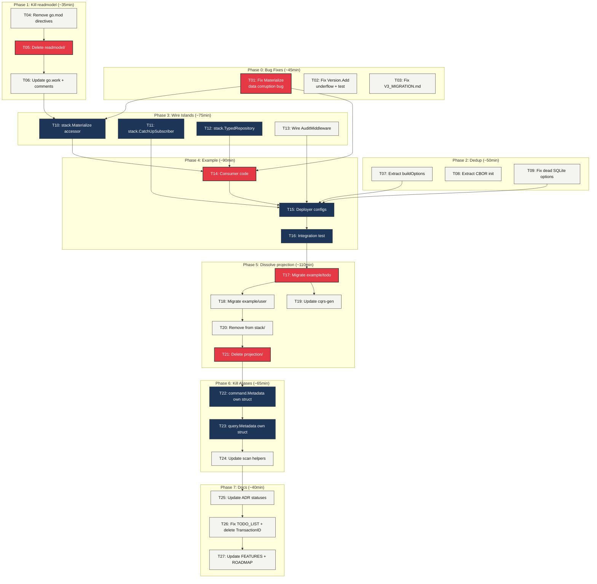

# Deployer-First Architecture Completion Plan

> **Goal:** Make go-cqrs-lite "The Best CQRS/ES SDK in Go" — composable, powerful, deployer-first.
>
> **North Star:** "Consumers of this lib should NOT decide on the implementation of infrastructure.
> They should have a simple API that allows the person deploying the app to decide where they want
> to keep their data and what they want to store."

## Pareto Breakdown

### The 1% that delivers 51%

| # | Task | Why | Effort |
|---|------|-----|--------|
| T01 | Fix Materialize error-misclassification bug | Silent data corruption in the projection replacement. Without this fix, dissolving projection/ is unsafe. | 15min |
| T04-T06 | Kill readmodel↔kv split brain | 6 clone groups (27% of all duplication). ZERO production Go consumers. Types are character-for-character identical. Stack already uses kv.TypedStore. | 35min |
| T03 | Fix V3_MIGRATION.md | Broken example (memory.NewMemoryBus() doesn't compile) + ghost-code lie (pg_bus is live). | 10min |

**Total: ~60min. Fixes the biggest bug, eliminates the biggest source of waste, restores consumer trust.**

### The 4% that delivers 64%

The above PLUS:

| # | Task | Why | Effort |
|---|------|-----|--------|
| T02 | Fix Version.Add underflow + rapid property test | Type safety regression from uint64 change | 20min |
| T07-T09 | Extract remaining duplication (buildOptions, CBOR init, dead config) | 3 clone groups, dead code | 50min |
| T10-T13 | Wire island types into stack/ (Materialize, CatchUpSubscriber, TypedDecider, AuditMiddleware) | Makes the new architecture reachable from the composition root | 75min |

**Total: ~3.5h. All island types become reachable, all duplication eliminated, all bugs fixed.**

### The 20% that delivers 80%

The above PLUS:

| # | Task | Why | Effort |
|---|------|-----|--------|
| T14-T16 | Build deployer-first example | Validates the entire architecture end-to-end. The safety net for dissolution. | 90min |
| T17-T21 | Dissolve projection/ | Eliminates the biggest architectural lie (~1343 LOC). Only safe after example validates. | 110min |
| T22-T24 | Kill metadata aliases | Type safety for commands/queries. Only 4 consumer files. | 65min |

**Total: ~7h. The architectural vision is complete.**

### Remaining 20% (80% → 100%)

| # | Task | Why | Effort |
|---|------|-----|--------|
| T25-T27 | ADR status updates, TODO_LIST fixes, FEATURES/ROADMAP | Consumer trust, accurate docs | 40min |

---

## High-Level Plan — 27 Tasks (30-100min each)

Sorted by impact/effort/customer-value.

| ID | Phase | Task | Impact | Effort | Customer Value |
|----|-------|------|--------|--------|----------------|
| T01 | 0 | Fix Materialize error-misclassification bug (stack/materialize.go:132) | Critical | 15min | Prevents silent data corruption |
| T02 | 0 | Fix Version.Add underflow + add rapid property test | High | 20min | Type safety |
| T03 | 0 | Fix V3_MIGRATION.md (broken example + ghost-code lie) | High | 10min | Consumer trust |
| T04 | 1 | Remove readmodel from all go.mod replace directives (12 files) | High | 15min | Eliminates dead dependency |
| T05 | 1 | Delete readmodel/ + readmodel/cache/ directories | High | 10min | Eliminates 6 clone groups |
| T06 | 1 | Update go.work + fix comments referencing readmodel | Medium | 10min | Clean module graph |
| T07 | 2 | Extract buildOptions to shared helper (stack/sqlite ↔ stack/postgres) | Medium | 20min | Eliminates clone group |
| T08 | 2 | Extract CBOR decoder init dedup (codec ↔ pebble) | Low | 15min | Eliminates clone group |
| T09 | 2 | Fix dead WithEventDB/WithQueryDB in sqlite preset | Medium | 15min | Deployer-first DX |
| T10 | 3 | Add stack.Materialize() accessor (wire Materialize into Bundle) | High | 20min | Makes island reachable |
| T11 | 3 | Add stack.CatchUpSubscriber() option (wire into stack) | High | 20min | Makes island reachable |
| T12 | 3 | Add stack.TypedRepository() accessor (for TypedDecider) | High | 20min | Makes island reachable |
| T13 | 3 | Wire AuditMiddleware into sqlite preset | Medium | 15min | Deployer-first DX |
| T14 | 4 | Build example/deployer-first/ — consumer code (repository + materialize) | Critical | 40min | Validates architecture |
| T15 | 4 | Build deployer configs (SQLite multi-DB + Pebble + Memory) | High | 30min | Validates deployer-first |
| T16 | 4 | Write integration test verifying all configs produce identical behavior | High | 20min | Proves consumer-identical promise |
| T17 | 5 | Migrate example/todo to Materialize + Watermill Router | Critical | 30min | Proves replacement works |
| T18 | 5 | Migrate example/user to Materialize + Watermill Router | High | 25min | Proves replacement works |
| T19 | 5 | Update cqrs-gen to emit Materialize code instead of projection.On | Medium | 20min | Codegen consistency |
| T20 | 5 | Remove ProjectionRunner from stack/accessors.go + bundle.go | High | 15min | Clean composition root |
| T21 | 5 | Delete projection/ module entirely | Critical | 20min | Eliminates 1343 LOC architectural lie |
| T22 | 6 | Create command.Metadata as own struct (embeds Tracing, no alias) | High | 25min | Type safety |
| T23 | 6 | Create query.Metadata as own struct (embeds Tracing, no CausationID) | High | 25min | Type safety |
| T24 | 6 | Update storage scan helpers for new Metadata types | High | 15min | Serialization compat |
| T25 | 7 | Update ADR statuses (0029→Implemented, 0032→Implemented, 0031→Partial) | Medium | 10min | Accurate decision log |
| T26 | 7 | Fix TODO_LIST.md + delete TransactionID ghost type | Medium | 15min | Accurate status tracking |
| T27 | 7 | Update FEATURES.md + ROADMAP.md | Low | 15min | Consumer-facing accuracy |

---

## Sub-Task Breakdown — 74 Tasks (max 15min each)

### Phase 0: Critical Bug Fixes (8 sub-tasks)

| ID | Parent | Sub-Task | Effort |
|----|--------|----------|--------|
| S01 | T01 | Read stack/materialize.go:130-144, understand the bug | 5min |
| S02 | T01 | Fix: change `if err != nil` to `if errors.Is(err, kv.ErrNotFound)` + return other errors | 5min |
| S03 | T01 | Add test: inject non-ErrNotFound error, assert it propagates (not triggers OnCreate) | 5min |
| S04 | T02 | Read event/types.go Add/Sub methods | 5min |
| S05 | T02 | Fix Add(n int) → guard negative or change to Add(n uint64) | 5min |
| S06 | T02 | Add rapid property test for Add/Sub invariants | 5min |
| S07 | T03 | Fix V3_MIGRATION.md:34 — replace memory.NewMemoryBus() with working example | 5min |
| S08 | T03 | Fix V3_MIGRATION.md:17,94 — remove pg_bus from ghost-code list | 5min |

### Phase 1: Kill readmodel↔kv Split Brain (7 sub-tasks)

| ID | Parent | Sub-Task | Effort |
|----|--------|----------|--------|
| S09 | T04 | Remove readmodel replace from example/todo/go.mod | 5min |
| S10 | T04 | Remove readmodel replace from stack/{memory,sqlite,pebble,postgres}/go.mod | 10min |
| S11 | T04 | Remove readmodel replace from stack/bench/go.mod + cmd/api-stability | 5min |
| S12 | T05 | Delete readmodel/ directory (git rm -r) | 5min |
| S13 | T05 | Delete readmodel/cache/ directory (git rm -r) | 5min |
| S14 | T06 | Remove readmodel + readmodel/cache from go.work | 5min |
| S15 | T06 | Fix comments in stack/pebble/preset.go, storage/pebble/backend.go, kv/typed_store.go | 5min |

### Phase 2: Eliminate Remaining Duplication (7 sub-tasks)

| ID | Parent | Sub-Task | Effort |
|----|--------|----------|--------|
| S16 | T07 | Create stack/sql/build_options.go with shared BuildOptionsFromBackend() | 10min |
| S17 | T07 | Update stack/sqlite/preset.go to call shared helper | 5min |
| S18 | T07 | Update stack/postgres/preset.go to call shared helper | 5min |
| S19 | T08 | Export codec CBOR decoder mode or create shared init helper | 10min |
| S20 | T08 | Update storage/pebble/serialization.go to use shared helper | 5min |
| S21 | T09 | Wire WithEventDB in sqlite preset to open separate backend | 10min |
| S22 | T09 | Wire WithQueryDB in sqlite preset to open separate backend | 5min |

### Phase 3: Wire Island Types into stack/ (10 sub-tasks)

| ID | Parent | Sub-Task | Effort |
|----|--------|----------|--------|
| S23 | T10 | Add Materialize[V,K](bundle) accessor to stack/accessors.go | 10min |
| S24 | T10 | Add WithMaterialize option to stack/options.go | 5min |
| S25 | T10 | Write test: stack.Materialize() works with Bundle | 5min |
| S26 | T11 | Add CatchUpSubscriber() constructor to stack/accessors.go | 10min |
| S27 | T11 | Add WithCatchUpSubscriber option to stack/options.go | 5min |
| S28 | T11 | Write test: stack.CatchUpSubscriber() creates valid subscriber | 5min |
| S29 | T12 | Add TypedRepository[State,Cmd](bundle, decider) to stack/accessors.go | 10min |
| S30 | T12 | Write test: stack.TypedRepository() delegates correctly | 5min |
| S31 | T13 | Wire query.AuditMiddleware into sqlite preset as opt-in option | 10min |
| S32 | T13 | Write test: audit middleware persists queries in sqlite | 5min |

### Phase 4: Deployer-First Example (11 sub-tasks)

| ID | Parent | Sub-Task | Effort |
|----|--------|----------|--------|
| S33 | T14 | Create example/deployer-first/ directory + go.mod | 5min |
| S34 | T14 | Write domain types (User aggregate, events, state) | 10min |
| S35 | T14 | Write TypedDecider for User (Decide + Fold) | 10min |
| S36 | T14 | Write Materialize for UserView (OnCreate + OnUpdate + OnTombstone) | 10min |
| S37 | T14 | Write consumer main.go (repo.Execute + mat.View) | 5min |
| S38 | T15 | Write sqlite preset config (multi-DB: events.db + views.db) | 10min |
| S39 | T15 | Write pebble preset config (single DB) | 10min |
| S40 | T15 | Write memory preset config (all in-memory) | 5min |
| S41 | T15 | Wire Watermill Router + CatchUpSubscriber for materialization | 10min |
| S42 | T16 | Write test: all 3 configs produce same consumer-visible state | 10min |
| S43 | T16 | Run full test suite, verify build passes | 5min |

### Phase 5: Dissolve projection/ (15 sub-tasks)

| ID | Parent | Sub-Task | Effort |
|----|--------|----------|--------|
| S44 | T17 | Read example/todo/cmd/api/setup.go projection wiring | 5min |
| S45 | T17 | Replace projection.Runner with stack.Materialize + Watermill Router in example/todo | 15min |
| S46 | T17 | Update example/todo projections to use Materialize callbacks | 10min |
| S47 | T17 | Run example/todo tests, verify green | 5min |
| S48 | T18 | Read example/user/handlers.go + projection.go | 5min |
| S49 | T18 | Replace projection.Runner with Materialize in example/user | 15min |
| S50 | T18 | Update example/user projections to use Materialize callbacks | 10min |
| S51 | T18 | Run example/user tests, verify green | 5min |
| S52 | T19 | Update cqrs-gen generate.go to emit stack.Materialize code | 15min |
| S53 | T19 | Update cqrs-gen golden tests | 5min |
| S54 | T20 | Remove ProjectionRunner() from stack/accessors.go | 5min |
| S55 | T20 | Remove projection compile-time assertion from stack/bundle.go | 5min |
| S56 | T21 | Update integration tests that import projection | 10min |
| S57 | T21 | Delete projection/ directory (git rm -r) | 5min |

### Phase 6: Kill Metadata Aliases (10 sub-tasks)

| ID | Parent | Sub-Task | Effort |
|----|--------|----------|--------|
| S58 | T22 | Define command.Metadata as own struct (embeds event.Tracing + Custom map) | 10min |
| S59 | T22 | Add WithRetryCount/WithIdempotencyKey Options | 5min |
| S60 | T22 | Update command/store.go to use new Metadata type | 5min |
| S61 | T22 | Update command/doc.go with new Metadata examples | 5min |
| S62 | T22 | Run command module tests standalone | 5min |
| S63 | T23 | Define query.Metadata as own struct (embeds event.Tracing + Custom map) | 10min |
| S64 | T23 | Update query/store.go to use new Metadata type | 5min |
| S65 | T23 | Update query/doc.go | 5min |
| S66 | T23 | Run query module tests standalone | 5min |
| S67 | T24 | Update storage/command_store_scan.go for new command.Metadata | 5min |
| S68 | T24 | Update storage/query_store_scan.go for new query.Metadata | 5min |
| S69 | T24 | Update storage/pebble command/query serialization | 5min |

### Phase 7: Documentation & Cleanup (6 sub-tasks)

| ID | Parent | Sub-Task | Effort |
|----|--------|----------|--------|
| S70 | T25 | Update ADR-0029 status → Implemented | 5min |
| S71 | T25 | Update ADR-0032 status → Implemented (readmodel now deleted) | 5min |
| S72 | T26 | Delete id/transaction_id.go (ghost type) | 5min |
| S73 | T26 | Fix TODO_LIST.md — remove TransactionID [x], update statuses | 5min |
| S74 | T27 | Update FEATURES.md + ROADMAP.md with completed work | 10min |

---

## Execution Graph



## Critical Path

The critical path (longest dependency chain) is:

```
T01 (fix Materialize bug)
  → T10 (wire Materialize into stack)
    → T14 (build example consumer)
      → T15 (build deployer configs)
        → T16 (integration test)
          → T17 (migrate example/todo)
            → T20 (remove from stack)
              → T21 (delete projection/)
                → T22 (command.Metadata)
                  → T23 (query.Metadata)
                    → T24 (update scan helpers)
                      → T25-T27 (docs)
```

**11 steps on the critical path. Each must complete before the next.**

## Anti-Verschlimmbessern Checklist

Before each phase, verify:
- [ ] Build passes before starting
- [ ] Each commit keeps build green
- [ ] No `any` types introduced where typed interfaces existed
- [ ] No new ghost code created (every new type has a consumer)
- [ ] Deletions verified with grep first
- [ ] Tests pass after each change

## Estimated Total

| Phase | Tasks | Effort | Cumulative |
|-------|-------|--------|------------|
| 0 — Bug Fixes | 3 | 45min | 45min |
| 1 — Kill readmodel | 3 | 35min | 1h20m |
| 2 — Dedup | 3 | 50min | 2h10m |
| 3 — Wire Islands | 4 | 75min | 3h25m |
| 4 — Example | 3 | 90min | 4h55m |
| 5 — Dissolve projection | 5 | 110min | 6h45m |
| 6 — Kill Aliases | 3 | 65min | 7h50m |
| 7 — Docs | 3 | 40min | 8h30m |
| **Total** | **27** | **~8.5h** | |
