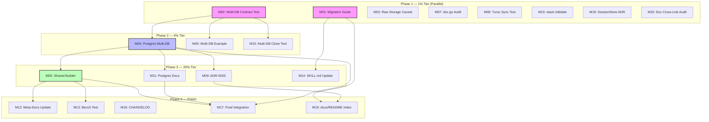

# Stack Adoption & Multi-DB Hardening — Pareto Execution Plan

**Date:** 2026-06-23 19:21
**Goal:** *"Consumers should NOT decide on infrastructure. Deployer chooses where data lives. Library should have recommendations. Must support SQLite + Memory, ideally multiple SQLite DBs."*
**Assessment baseline:** Architecture B+, Adoption F (0/3 consumers use `stack/`), multi-DB routing bug fixed but needs contract tests + Postgres parity.

---

## Context

The `stack.Bundle` abstraction is architecturally excellent — 5 presets (memory, sqlite, pebble, postgres, turso), contract-tested parity, one-line backend swap. But **zero of three real consumers use it** (DiscordSync, SEC, cqrs-htmx/usermgmt all hand-wire infrastructure). Every consumer reimplements the same boilerplate: projection replay + dedup (~260 lines), schema migration discovery, dialect mapping.

This plan closes the adoption gap by: (1) proving correctness with contract tests, (2) showing consumers how to migrate, (3) completing feature parity across all SQL presets, and (4) paying down code debt.

---

## Step 1: Pareto Breakdown

### The 1% that delivers 51% of the result

| Item | Why it's 1% | Why it delivers 51% |
|------|------------|---------------------|
| **Migration guide** (`docs/MIGRATION_TO_STACK.md`) | One doc file, no code changes | Directly unblocks adoption — the #1 reason consumers don't use `stack/` is they don't know how. Shows the "replace 260 lines with 5" transformation. |
| **Multi-DB contract test** (`contracttest.RunMultiDBSuite`) | ~80 lines of test code | Proves the flagship multi-DB routing feature works for ALL SQL presets. Without this, the routing bug we just fixed could silently regress. Trust is the adoption prerequisite. |

### The 4% that delivers 64% of the result

| Item | Why it adds to 4% | Why it reaches 64% |
|------|-------------------|---------------------|
| **Postgres multi-DB split** | Schema-based separation in preset.go | Completes parity — all 3 SQL presets (sqlite, turso, postgres) support multi-DB. No asymmetry. |
| **Multi-DB example variant** | Copy of deployer-first with 3 extra lines | Proves the pattern end-to-end. Consumers can copy-paste a working example. |
| **Raw storage migration caveat** | 3 doc cross-references | Every consumer hits this ("why doesn't storage.NewSQLiteEventStore auto-migrate?"). Prevents the #1 surprise. |

### The 20% that delivers 80% of the result

| Item | Impact |
|------|--------|
| **Shared multi-DB builder** (dedup sqlite + turso — 109 lines duplicated) | Maintains code quality, prevents drift between presets |
| **doc.go phantom reference audit** | Catches broken godoc links across all presets |
| **Turso sync contract test** | NewSync() is currently untested |
| **stack.Validate() method** | Catches incoherent multi-DB config at construction time |
| **ADR-0033: Multi-DB design rationale** | Documents WHY, not just WHAT |
| **CatchUpSubscriber canonical pattern docs** | The projection pattern all 3 consumers should use |
| **FEATURES.md + AGENTS.md + SKILL.md updates** | Keeps docs honest with code |
| **Bench: single-DB vs multi-DB** | Data-driven recommendation |
| **CHANGELOG entry** | Release hygiene |

### Everything else (the remaining 80% of work that delivers 20% of value)

- Branded DSN types (compile-time safety) — DEFERRED: marginal value, breaking API change
- SessionStore ADR — DEFERRED: decision doc only, no code impact
- Doc cross-link audit — LOW: cheap but low ROI unless links are actually broken
- gRPC/NATS transport adapters — OUT OF SCOPE: separate modules, different goal

---

## Step 2: Medium Plan (20 tasks, 30–90 min each)

Sorted by **impact/effort ratio** (highest first).

| # | Task | Impact | Effort | Est | Dependencies | Tier |
|---|------|--------|--------|-----|--------------|------|
| M01 | Write migration guide (`docs/MIGRATION_TO_STACK.md`) | ⭐⭐⭐⭐⭐ | Medium | 90min | — | 1% |
| M02 | Add `contracttest.RunMultiDBSuite` | ⭐⭐⭐⭐⭐ | Small | 60min | — | 1% |
| M03 | Document raw storage migration caveat | ⭐⭐⭐⭐⭐ | Tiny | 30min | — | 4% |
| M04 | Add Postgres multi-DB split (schema-based) | ⭐⭐⭐⭐ | Medium | 90min | M02 | 4% |
| M05 | Write multi-DB example variant (`example/deployer-first-multidb/`) | ⭐⭐⭐⭐ | Medium | 60min | M02 | 4% |
| M06 | Extract shared multi-DB builder into `stack/sqlbuilder.go` | ⭐⭐⭐⭐ | Medium | 90min | M04 | 20% |
| M07 | Audit all doc.go files for phantom function references | ⭐⭐⭐ | Small | 45min | — | 20% |
| M08 | Add Turso sync contract test | ⭐⭐⭐ | Small | 45min | — | 20% |
| M09 | Write ADR-0033: Multi-DB split design rationale | ⭐⭐⭐ | Small | 30min | M04 | 20% |
| M10 | Add `stack.Validate()` method for config coherence | ⭐⭐⭐ | Small | 30min | — | 20% |
| M11 | Update PRESETS.md + INFRA docs for Postgres multi-DB | ⭐⭐⭐ | Small | 30min | M04 | 20% |
| M12 | Update FEATURES.md + AGENTS.md + TODO_LIST.md | ⭐⭐ | Small | 30min | M04, M06 | 20% |
| M13 | Add bench: single-DB vs multi-DB performance | ⭐⭐ | Small | 30min | M06 | 20% |
| M14 | Update SKILL.md with stack/multi-DB decision matrix | ⭐⭐⭐ | Small | 30min | M01 | 20% |
| M15 | Add multi-DB Close correctness test | ⭐⭐ | Small | 30min | M02 | 20% |
| M16 | Write CHANGELOG entry for multi-DB split | ⭐⭐ | Tiny | 15min | All | 20% |
| M17 | Final integration: all 5 presets through full suite | ⭐⭐⭐⭐ | Small | 30min | M04, M06 | 20% |
| M18 | Write SessionStore decision doc (ADR-0034) | ⭐⭐ | Small | 30min | — | 20% |
| M19 | Update docs/README.md index with all new docs | ⭐⭐ | Tiny | 15min | M01, M09 | 20% |
| M20 | Audit and fix remaining stale doc cross-references | ⭐⭐ | Small | 30min | — | 20% |

**Total estimated effort:** ~855 min (~14 hours)

---

## Step 3: Fine Plan (80 subtasks, max 15 min each)

### M01: Migration Guide (7 subtasks)

| ID | Subtask | Est |
|----|---------|-----|
| F01 | Read all 3 consumer projects for migration pain points | 15min |
| F02 | Write migration guide outline + section headers | 10min |
| F03 | Write "Replace hand-wired event store with `sqlite.New()`" section | 15min |
| F04 | Write "Replace projection runner with `CatchUpSubscriber` + `Materialize`" section | 15min |
| F05 | Write "Replace hand-wired query/command layers with Bundle accessors" section | 10min |
| F06 | Write before/after LOC comparison table + decision checklist | 10min |
| F07 | Review, polish, add cross-links to PRESETS.md + INFRA docs | 15min |

### M02: Multi-DB Contract Test (5 subtasks)

| ID | Subtask | Est |
|----|---------|-----|
| F08 | Design `RunMultiDBSuite(t, factory)` API in contracttest/contract.go | 10min |
| F09 | Write test: events route to event DB, NOT query/view DB | 15min |
| F10 | Write test: commands+queries route to query DB, NOT event DB | 10min |
| F11 | Write test: views route to view DB via `cqrs_kv` table | 10min |
| F12 | Wire `RunMultiDBSuite` into sqlite_test.go and turso_test.go | 15min |

### M03: Raw Storage Caveat (3 subtasks)

| ID | Subtask | Est |
|----|---------|-----|
| F13 | Add migration caveat section to `storage/doc.go` | 10min |
| F14 | Add cross-reference callout in `docs/PRESETS.md` | 10min |
| F15 | Add cross-reference callout in `docs/INFRASTRUCTURE_RECOMMENDATIONS.md` | 10min |

### M04: Postgres Multi-DB Split (7 subtasks)

| ID | Subtask | Est |
|----|---------|-----|
| F16 | Read `stack/postgres/preset.go` to understand current structure | 10min |
| F17 | Design `WithEventSchema`/`WithQuerySchema`/`WithViewSchema` API | 15min |
| F18 | Add config fields + option functions to preset.go | 10min |
| F19 | Implement `openEventStores`/`openQueryStores` for postgres (schema-scoped) | 15min |
| F20 | Wire schema-scoped stores into `newBundle` override logic | 15min |
| F21 | Write postgres multi-DB routing regression test | 15min |
| F22 | Verify postgres preset passes `RunSuite` + `RunMultiDBSuite` | 10min |

### M05: Multi-DB Example (5 subtasks)

| ID | Subtask | Est |
|----|---------|-----|
| F23 | Create `example/deployer-first-multidb/` module skeleton (go.mod, doc.go) | 10min |
| F24 | Implement deployer section: `sqlite.New("app.db", WithEventDB(...), WithQueryDB(...), WithViewDB(...))` | 15min |
| F25 | Implement consumer section (reuse deployer-first pattern) | 15min |
| F26 | Write test verifying events/commands/views land in correct DBs | 10min |
| F27 | Add example to `docs/PRESETS.md` multi-DB section | 10min |

### M06: Shared Multi-DB Builder (7 subtasks)

| ID | Subtask | Est |
|----|---------|-----|
| F28 | Read sqlite `multidb.go` + turso `multidb.go` — identify shared logic | 10min |
| F29 | Design `stack.MultiDBConfig` + `stack.MultiDBBuilder` types | 15min |
| F30 | Implement shared `openEventStores`/`openQueryStores` in stack/ | 15min |
| F31 | Migrate sqlite preset to use shared builder | 15min |
| F32 | Migrate turso preset to use shared builder | 15min |
| F33 | Run all existing tests to verify no regression | 10min |
| F34 | Remove duplicated `multidb.go` from both presets | 10min |

### M07: doc.go Audit (4 subtasks)

| ID | Subtask | Est |
|----|---------|-----|
| F35 | Grep all `doc.go` files for function/method references | 10min |
| F36 | Verify each referenced symbol exists via `go doc` | 15min |
| F37 | Fix any phantom references found | 10min |
| F38 | Document the audit process for future use | 10min |

### M08: Turso Sync Test (4 subtasks)

| ID | Subtask | Est |
|----|---------|-----|
| F39 | Design test for `NewSync` constructor (local LibSQL) | 10min |
| F40 | Implement sync mode basic roundtrip test | 15min |
| F41 | Verify `Sync()` method returns valid handle | 10min |
| F42 | Wire into turso_test.go suite | 10min |

### M09: ADR-0033 (3 subtasks)

| ID | Subtask | Est |
|----|---------|-----|
| F43 | Write context + decision sections | 15min |
| F44 | Write alternatives considered + consequences | 10min |
| F45 | Link ADR from PRESETS.md + sqlite/turso doc.go | 5min |

### M10: stack.Validate() (3 subtasks)

| ID | Subtask | Est |
|----|---------|-----|
| F46 | Design `Bundle.Validate()` method — checks non-nil required fields | 10min |
| F47 | Implement validation logic (at minimum: EventSink+EventSource required) | 10min |
| F48 | Write test for Validate() — nil fields, all-present, multi-DB coherence | 10min |

### M11: Postgres Multi-DB Docs (3 subtasks)

| ID | Subtask | Est |
|----|---------|-----|
| F49 | Update `docs/PRESETS.md` with Postgres multi-DB section | 10min |
| F50 | Update `docs/INFRASTRUCTURE_RECOMMENDATIONS.md` Postgres section | 10min |
| F51 | Update `stack/postgres/doc.go` with WithEventSchema etc. | 10min |

### M12: Meta-Docs Update (3 subtasks)

| ID | Subtask | Est |
|----|---------|-----|
| F52 | Update `FEATURES.md` — multi-DB status for all presets | 10min |
| F53 | Update `AGENTS.md` — multi-DB pattern examples | 10min |
| F54 | Update `TODO_LIST.md` — mark completed items | 10min |

### M13: Bench Test (3 subtasks)

| ID | Subtask | Est |
|----|---------|-----|
| F55 | Design bench: single-DB vs 3-DB write+read+project | 10min |
| F56 | Implement bench test in `stack/bench/` | 15min |
| F57 | Document results in `docs/PRESETS.md` | 5min |

### M14: SKILL.md Update (3 subtasks)

| ID | Subtask | Est |
|----|---------|-----|
| F58 | Read current `SKILL.md` for structure | 5min |
| F59 | Add stack preset decision matrix (which preset for which scenario) | 15min |
| F60 | Add multi-DB composition recipe | 10min |

### M15: Multi-DB Close Test (3 subtasks)

| ID | Subtask | Est |
|----|---------|-----|
| F61 | Write test: all closers fire on `Close()` with multi-DB | 10min |
| F62 | Write test: `Close()` is idempotent with multi-DB | 10min |
| F63 | Verify no file handle leaks (reopen after close) | 10min |

### M16: CHANGELOG (2 subtasks)

| ID | Subtask | Est |
|----|---------|-----|
| F64 | Write CHANGELOG entry for multi-DB split + contract tests | 10min |
| F65 | Add migration guide link to CHANGELOG | 5min |

### M17: Final Integration (3 subtasks)

| ID | Subtask | Est |
|----|---------|-----|
| F66 | Write test runner exercising all 5 presets through `RunSuite` | 10min |
| F67 | Run `RunMultiDBSuite` on all 3 SQL presets (sqlite, turso, postgres) | 10min |
| F68 | Verify all green, no race conditions (`-race` flag) | 10min |

### M18: SessionStore Decision (3 subtasks)

| ID | Subtask | Est |
|----|---------|-----|
| F69 | Analyze usermgmt's `SQLSessionStore` for common patterns | 10min |
| F70 | Write ADR-0034: SessionStore is application-layer, document pattern | 15min |
| F71 | Link ADR from migration guide | 5min |

### M19: docs/README Index (2 subtasks)

| ID | Subtask | Est |
|----|---------|-----|
| F72 | Add migration guide link to `docs/README.md` | 5min |
| F73 | Add ADR-0033, ADR-0034 links to `docs/README.md` | 10min |

### M20: Doc Cross-Reference Audit (7 subtasks)

| ID | Subtask | Est |
|----|---------|-----|
| F74 | Grep all `docs/` for internal markdown links | 10min |
| F75 | Verify all links resolve to actual files | 10min |
| F76 | Fix any broken links found | 10min |
| F77 | Grep all `.go` doc.go for package references | 5min |
| F78 | Verify package paths are correct (v3 suffix) | 10min |
| F79 | Check ADR cross-references (ADR-0009, ADR-0017, etc.) | 10min |
| F80 | Final review of all changed docs for consistency | 10min |

---

## Step 4: Execution Graph

### Parallelization Strategy

| Phase | Tasks | Can run in parallel? |
|-------|-------|---------------------|
| Phase 1 | M01, M02, M03, M07, M08, M10, M18, M20 | ✅ All independent |
| Phase 2 | M04, M05, M15 | ✅ All depend only on M02 |
| Phase 3 | M06, M09, M11, M14 | ✅ Depend on M04 or M01 |
| Phase 4 | M12, M13, M16, M17, M19 | ✅ Depend on M06 or all |

---

## Risk Assessment

| Risk | Mitigation |
|------|-----------|
| Postgres schema-based multi-DB breaks existing queries | Test against existing contract suite before merging |
| Shared builder extraction introduces subtle behavior change | Run all existing tests after migration; keep old code until verified |
| Turso sync test needs remote server | Use local LibSQL mode (no network required) |
| doc.go audit finds more broken refs than expected | Fix incrementally, don't block on any single fix |
| File size limit (350 lines) exceeded by new code | Split into helper files like turso/multidb.go pattern |

---

## Verschlimmbesserung Guardrails

These items are explicitly **NOT** in scope to avoid making things worse:

1. **Branded DSN types** — Breaking API change for marginal compile-time safety. Current string DSNs work. DEFERRED.
2. **Renaming config fields** — Would break existing consumers for zero functional gain.
3. **Adding a Provider interface** — Presets are ordinary functions by design (see stack/doc.go).
4. **Auto-migrating raw `storage.NewSQLiteEventStore`** — Would surprise consumers who expect manual control. Document instead.
5. **Consumer project migrations** (SEC, DiscordSync, usermgmt) — Separate repos. This plan improves the LIBRARY so consumers WANT to migrate.
