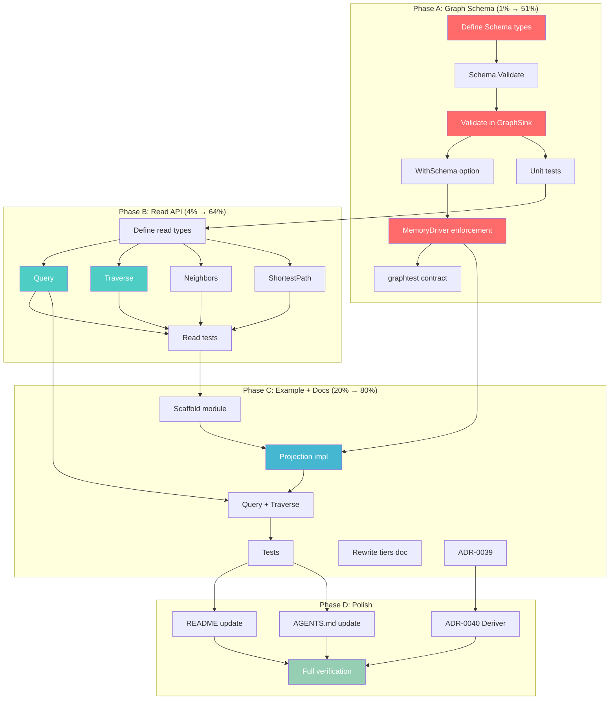
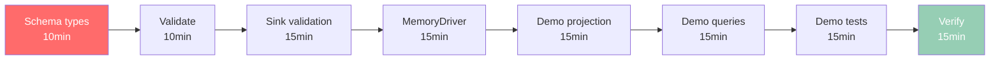

# Graph Projection Tier: TypeDB-Inspired Hardening

> **Plan date:** 2026-06-28 20:37
> **Theme:** Adopt TypeDB lessons to bring the graph projection tier to relational-tier parity
> **Source research:** [`docs/research/2026-06-28_TYPEDB_LESSONS_FOR_PROJECTIONS.md`](../research/2026-06-28_TYPEDB_LESSONS_FOR_PROJECTIONS.md)
> **Status:** APPROVED — executing in full

---

## Executive Summary

The graph projection tier (`graph/`) is the **least-typed of the three projection tiers**. Events have `catalog/` + `schema.Validator`. Relational has `RelationalSchema` + column-name validation (shipped today). Document/KV has `TypedStore[T,K]`. **Graph has `NodeRef{Label string, KeyProp string, KeyValue any}` and `props map[string]any`** — strings and `any` everywhere.

TypeDB's existence proof: graph-shaped read models don't require abandoning strong types. TypeDB achieves this by owning its engine (strongly-typed PERA model, query-time type checking, reasoning engine). go-cqrs-lite is a **library**, so we adopt the **boundary-typing** lesson (validate at the sink, like the relational tier) and reject the **engine-owning** lesson (no query language for backends we don't control).

**Two high-leverage additions:**
1. **`graph.Schema`** — validate every `MergeNode`/`MergeEdge`/`SetNodeProperty` against a declared schema at the sink boundary. Catches phantom-node bugs (typos in labels/props). Mirrors the relational-tier pattern shipped today.
2. **`MemoryDriver` read API** — typed `Query`/`Traverse`/`Neighbors`/`ShortestPath`. Right now the in-memory graph exposes only `Snapshot()` (raw `*graphData`) — it's effectively write-only. This makes the v3.x ship target actually queryable and unblocks the "zero real consumers" problem.

---

## Pareto Breakdown

### 1% that delivers 51%

**`graph.Schema` + sink validation.** One pattern, already proven in the relational tier. Closes the worst type-safety hole in the newest tier. Without this, a typo in a label silently creates a phantom node that no query will ever find.

### 4% that delivers 64%

Add **`MemoryDriver` read API**. Without reads, the graph tier is a write-only data structure. No consumer can use it. The v3.x "graph tier is done" claim is hollow. A typed read API (Go-native predicates, NOT a query language) makes `MemoryDriver` queryable for tests and single-process apps.

### 20% that delivers 80%

Add **`example/graph-demo/`** (first real consumer, validates end-to-end), **rewrite `docs/projection-tiers.md`** (opinionated comparison), **write ADRs** (lock in decisions), update docs.

---

## Medium Task Plan (23 tasks, 30–100min each)

> Sorted by impact/effort. Phases are sequential (A → B → C → D), tasks within phases are parallelizable.

### Phase A — Graph Schema (the 1%)

| # | Task | Impact | Effort | Why |
|---|------|--------|--------|-----|
| A1 | Define `graph.Schema` types: `Schema`, `NodeType`, `EdgeType`, `PropertyType` | Critical | 30min | Foundation; mirrors `RelationalSchema` shape |
| A2 | Implement `Schema.Validate()`: duplicate labels, empty names, key prop declared | Critical | 30min | Catches schema-declaration bugs early |
| A3 | Add validation to `GraphSink`: check label/prop/key against schema in `MergeNode`/`MergeEdge`/`SetNodeProperty` | Critical | 45min | The actual type-safety enforcement at boundary |
| A4 | Add `WithSchema` option to `NewGraphProjection` + `NewMemoryDriver` | High | 30min | Schema is opt-in (zero breaking changes) |
| A5 | Wire schema into `MemoryDriver`: `schemaSink` wrapper validates before write | High | 45min | Runtime enforcement for reference driver |
| A6 | Add `SchemaValidation` contract to `graphtest` suite | High | 40min | Every future driver validates schema |
| A7 | Comprehensive schema unit tests (valid, unknown label, unknown prop, edge mismatch, missing key) | High | 45min | Verify all error paths |

### Phase B — MemoryDriver Read API (the rest of 4%)

| # | Task | Impact | Effort | Why |
|---|------|--------|--------|-----|
| B1 | Define read API types: `Pattern`, `NodeView`, `EdgeView`, `ReadableDriver` interface | Critical | 30min | The typed read surface; Go-native, not a DSL |
| B2 | Implement `MemoryDriver.Query(Pattern) []NodeView` — label filter + predicate function | Critical | 45min | The basic read operation; replaces raw Snapshot |
| B3 | Implement `MemoryDriver.Traverse(from, edgeType, maxDepth) []NodeView` — BFS traversal | High | 45min | Variable-depth traversal (reply chains, social graph) |
| B4 | Implement `MemoryDriver.Neighbors(of) ([]NodeView, []EdgeView)` — 1-hop adjacency | High | 30min | The most common graph query |
| B5 | Implement `MemoryDriver.ShortestPath(from, to) ([]NodeRef, error)` — BFS shortest path | Medium | 45min | Causation DAGs, dependency chains |
| B6 | Read API unit tests (query, traverse, neighbors, shortest path, empty graph, depth 0) | High | 60min | Verify correctness on real graph shapes |

### Phase C — Example + Docs (the 20%)

| # | Task | Impact | Effort | Why |
|---|------|--------|--------|-----|
| C1 | Create `example/graph-demo/` module scaffolding (`go.mod`, `main.go`, README) | High | 30min | First real graph consumer; validates entire tier |
| C2 | Implement graph-demo: define Schema, project events → graph via GraphProjection | High | 60min | Proves Schema + Projection work together |
| C3 | Implement graph-demo: Query + Traverse + display results via read API | High | 45min | Proves read API is usable for real queries |
| C4 | Write graph-demo test (`main_test.go` asserting graph shape + query results) | Medium | 45min | End-to-end validation |
| C5 | Rewrite `docs/projection-tiers.md` with opinionated "why three tiers" comparison | Medium | 45min | Closes the "no doc helps consumers CHOOSE" gap |
| C6 | Write ADR-0039: Graph Schema (decision, constraints, what we rejected from TypeDB) | Medium | 40min | Lock in design decisions |

### Phase D — Polish + Verification

| # | Task | Impact | Effort | Why |
|---|------|--------|--------|-----|
| D1 | Update `graph/README.md` with Schema + Read API sections + examples | Medium | 30min | Module docs match new capabilities |
| D2 | Update `AGENTS.md`: graph module description + Key Patterns + layer graph | Medium | 30min | Session-level context stays current |
| D3 | Write ADR-0040: Deriver module design (TypeDB rule model as reference) | Low | 40min | Capture TypeDB's when/then lesson for future Deriver |
| D4 | Full verification: build + vet + test (race) + lint + check-arch + check-layers | Critical | 30min | DO NOT BREAK BUILD |

**Total estimated effort:** ~13.5 hours across 23 tasks

---

## Fine-Grained Task Breakdown (82 tasks, max 15min each)

> Each medium task decomposed into 15-minute actionable steps. Sorted within phases by dependency order.

### Phase A — Graph Schema (28 tasks)

| Sub# | Task | Parent | Est |
|------|------|--------|-----|
| A1.1 | Create `graph/schema.go` with `Schema struct { Nodes []NodeType; Edges []EdgeType }` | A1 | 10m |
| A1.2 | Define `NodeType struct { Label, KeyProp string; Properties []PropertyType }` | A1 | 10m |
| A1.3 | Define `EdgeType struct { Type, FromLabel, ToLabel string; Properties []PropertyType }` | A1 | 10m |
| A1.4 | Define `PropertyType struct { Name string; Required bool }` | A1 | 5m |
| A1.5 | Add `Schema.NodeType(label) *NodeType` and `Schema.EdgeType(typ) *EdgeType` lookups | A1 | 10m |
| A1.6 | Write package doc comment for schema types (mirror RelationalColumn doc style) | A1 | 10m |
| A2.1 | Implement `Schema.Validate()`: check ≥1 node type, no empty labels/types | A2 | 10m |
| A2.2 | Add duplicate-label detection in `Validate()` | A2 | 10m |
| A2.3 | Add duplicate-edge-type detection in `Validate()` | A2 | 10m |
| A3.1 | Add `Schema` field to `memorySink` (nil = unvalidated, backward-compatible) | A3 | 10m |
| A3.2 | Implement `validateNode(schema, ref)` — label exists, key prop matches | A3 | 15m |
| A3.3 | Implement `validateNodeProps(schema, ref, props)` — prop names declared | A3 | 15m |
| A3.4 | Implement `validateEdge(schema, ref)` — type exists, endpoints match FromLabel/ToLabel | A3 | 15m |
| A3.5 | Add validation calls in `memorySink.MergeNode` before write | A3 | 10m |
| A3.6 | Add validation calls in `memorySink.MergeEdge` before write | A3 | 10m |
| A3.7 | Add validation calls in `memorySink.SetNodeProperty` before write | A3 | 10m |
| A4.1 | Define `ProjectionOption func(*projectionConfig)` with `WithSchema(*Schema)` | A4 | 10m |
| A4.2 | Add `schema *Schema` field to `GraphProjection`; pass to driver tx | A4 | 10m |
| A4.3 | Define `MemoryDriverOption` with `WithSchema` for standalone driver use | A4 | 10m |
| A5.1 | Add `schema *Schema` field to `MemoryDriver` | A5 | 5m |
| A5.2 | Modify `RunInTx` to wrap sink with validation when schema is set | A5 | 15m |
| A5.3 | Update `NewMemoryDriver(opts ...MemoryDriverOption)` signature | A5 | 10m |
| A5.4 | Verify backward compat: `NewMemoryDriver()` still works (nil schema) | A5 | 10m |
| A6.1 | Add `SchemaConfig` to `graphtest.Config` (optional schema for validation tests) | A6 | 10m |
| A6.2 | Add `SchemaRejectsUnknownLabel` contract test | A6 | 15m |
| A6.3 | Add `SchemaRejectsUnknownProp` contract test | A6 | 15m |
| A6.4 | Add `SchemaRejectsEdgeEndpointMismatch` contract test | A6 | 10m |

### Phase A — Tests (7 tasks)

| Sub# | Task | Parent | Est |
|------|------|--------|-----|
| A7.1 | Test: valid schema accepts all valid writes | A7 | 10m |
| A7.2 | Test: unknown label rejected with clear error | A7 | 10m |
| A7.3 | Test: unknown prop rejected with clear error | A7 | 10m |
| A7.4 | Test: edge endpoint type mismatch rejected | A7 | 10m |
| A7.5 | Test: missing required prop rejected | A7 | 10m |
| A7.6 | Test: nil schema = backward-compatible (no validation) | A7 | 10m |
| A7.7 | Test: Schema.Validate() catches duplicate labels | A7 | 10m |

### Phase B — Read API (26 tasks)

| Sub# | Task | Parent | Est |
|------|------|--------|-----|
| B1.1 | Define `Pattern struct { Label string; Where func(map[string]any) bool }` | B1 | 10m |
| B1.2 | Define `NodeView struct { Ref NodeRef; Props map[string]any }` | B1 | 5m |
| B1.3 | Define `EdgeView struct { Ref EdgeRef; Props map[string]any }` | B1 | 5m |
| B1.4 | Define `ReadableDriver interface { Query; Traverse; Neighbors; ShortestPath }` | B1 | 15m |
| B1.5 | Write doc comments explaining: Go-native predicates, NOT a query language | B1 | 10m |
| B2.1 | Implement `MemoryDriver.Query(p Pattern) []NodeView` — scan + filter | B2 | 15m |
| B2.2 | Handle empty-label Pattern (match all labels) | B2 | 10m |
| B2.3 | Handle nil Where (match all nodes of label) | B2 | 10m |
| B2.4 | Return defensive copies of props (clone, not shared reference) | B2 | 10m |
| B3.1 | Implement `MemoryDriver.Traverse(from NodeRef, via string, maxDepth int) []NodeView` | B3 | 15m |
| B3.2 | BFS implementation with visited-set (cycle safety) | B3 | 15m |
| B3.3 | Handle maxDepth=0 (immediate neighbors only) and maxDepth<0 (unlimited) | B3 | 10m |
| B3.4 | Handle missing from-node (return empty, not error) | B3 | 5m |
| B4.1 | Implement `MemoryDriver.Neighbors(of NodeRef) ([]NodeView, []EdgeView)` | B4 | 15m |
| B4.2 | Collect both incoming and outgoing edges | B4 | 10m |
| B4.3 | Return edges with their types and props | B4 | 5m |
| B5.1 | Implement `MemoryDriver.ShortestPath(from, to NodeRef) ([]NodeRef, error)` | B5 | 15m |
| B5.2 | BFS with parent-tracking for path reconstruction | B5 | 15m |
| B5.3 | Return `ErrPathNotFound` sentinel when no path exists | B5 | 10m |
| B5.4 | Handle from==to (return single-node path) | B5 | 5m |
| B6.1 | Test: Query by label returns matching nodes | B6 | 15m |
| B6.2 | Test: Query with Where predicate filters correctly | B6 | 15m |
| B6.3 | Test: Traverse follows edges to correct depth | B6 | 15m |
| B6.4 | Test: Traverse handles cycles without infinite loop | B6 | 15m |
| B6.5 | Test: Neighbors returns all 1-hop nodes + edges | B6 | 15m |
| B6.6 | Test: ShortestPath finds shortest, returns ErrPathNotFound when disconnected | B6 | 15m |

### Phase C — Example + Docs (13 tasks)

| Sub# | Task | Parent | Est |
|------|------|--------|-----|
| C1.1 | Create `example/graph-demo/go.mod` (depends on graph/v3, event/v3, projection/v3) | C1 | 15m |
| C1.2 | Create `example/graph-demo/main.go` skeleton with imports + main func | C1 | 15m |
| C2.1 | Define domain types: User, Message, Reply event types + payloads | C2 | 15m |
| C2.2 | Define graph Schema: User nodes, Message nodes, AUTHORED_BY + REPLY_TO edges | C2 | 15m |
| C2.3 | Implement projection handler: events → MergeNode + MergeEdge via sink | C2 | 15m |
| C2.4 | Wire GraphProjection with Schema + MemoryDriver + handler | C2 | 15m |
| C3.1 | Add Query call: find all Message nodes, display | C3 | 15m |
| C3.2 | Add Traverse call: follow REPLY_TO chain from a message, display depth | C3 | 15m |
| C3.3 | Add ShortestPath call: find path between two users via AUTHORED_BY | C3 | 15m |
| C4.1 | Write `main_test.go`: seed events, run projections, assert graph shape | C4 | 15m |
| C4.2 | Add query assertions: Query returns expected nodes, Traverse expected depth | C4 | 15m |
| C5.1 | Rewrite `docs/projection-tiers.md`: add "Why three tiers, not one" section | C5 | 15m |
| C5.2 | Add TypeDB-informed comparison: graph schema = closed-world when Schema set | C5 | 15m |

### Phase D — Polish (8 tasks)

| Sub# | Task | Parent | Est |
|------|------|--------|-----|
| D1.1 | Add Schema section to `graph/README.md` with code example | D1 | 15m |
| D1.2 | Add Read API section to `graph/README.md` with code example | D1 | 15m |
| D2.1 | Update `AGENTS.md` graph module description (add Schema, Read API mentions) | D2 | 15m |
| D2.2 | Update `AGENTS.md` Key Patterns: add graph Schema + Query examples | D2 | 15m |
| D3.1 | Write `docs/adr/0039-graph-schema.md` (decision, constraints, rejected TypeDB features) | D3 | 15m |
| D3.2 | Write `docs/adr/0040-deriver-design.md` (TypeDB when/then reference, composable API) | D3 | 15m |
| D4.1 | Run `nix run .#build && nix run .#test && nix run .#vet && nix run .#lint` | D4 | 15m |
| D4.2 | Run `nix run .#check-arch && nix run .#check-layers` — verify module boundaries | D4 | 15m |

---

## Execution Graph

## Dependency Critical Path

---

## Design Constraints (Anti-Verschlimmbesserung Checklist)

> "If you VERSCHLIMMBESSER this system, I will cut off your balls!"

| Constraint | Why |
|---|---|
| **Schema is OPT-IN** (`WithSchema`, nil = no validation) | Zero breaking changes. Existing consumers see no diff. |
| **No query language** — Go-native `func(map[string]any) bool` predicates | We don't own the engine. A DSL for a library is scope creep. |
| **Read API is `MemoryDriver`-only** (via `ReadableDriver` interface) | ADR-0038 "reads native" still holds for Neo4j/Memgraph. |
| **No TypeDB constraint grammar** (`@regex`, `@values`, cardinality ranges) | DB-engine concerns, not sink-validation concerns. Keep it minimal. |
| **No n-ary relations / typed roles** | Breaks openCypher MERGE portability = the graph tier's thesis. |
| **No inheritance polymorphism** | YAGNI for read models. |
| **No new production dependencies** | Graph module stays zero-dep. |
| **Max 350 lines/file** | CI-enforced. Split if needed. |
| **`map[string]any` stays as the prop container** | The validation is the value, not the container type. TypeDB stores typed attrs because it's a DB; we validate at the boundary. |

---

## What This Plan Does NOT Include (Explicitly Deferred)

| Item | Why deferred | Source |
|---|---|---|
| Neo4j/Memgraph driver | Consumer-pulled; no Go driver for TypeDB | ADR-0038 |
| N-ary relations / hyperedges | Breaks MERGE portability | TypeDB research §R1 |
| Cross-backend query language | Research problem, not engineering | ADR-0038 |
| Deriver module implementation | Design doc only (ADR-0040); 1-2 day build | TODO C11 |
| Inheritance in graph schema | YAGNI for projections | TypeDB research §R3 |
| Full-text search (FTS5) | Separate concern; relational-tier gap | Status B5 |
| Relational JOIN support | Denormalization documented as decision | Status A7 |
