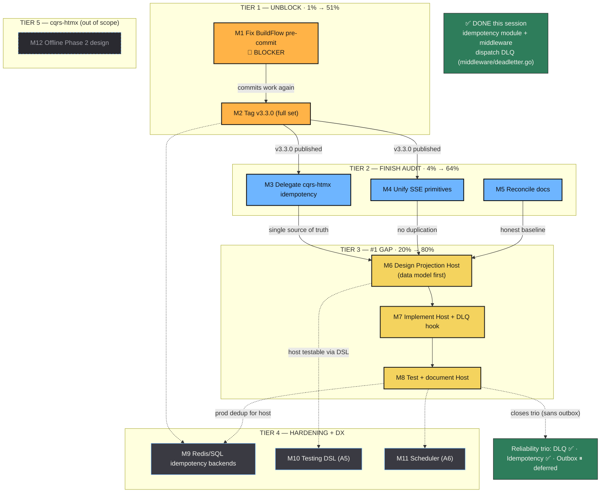

# Library Pareto Execution Plan — go-cqrs-lite × cqrs-htmx

**Generated:** 2026-06-29 00:54 · **Mode:** Exploration → Full Execution
**Scope:** All open work across **go-cqrs-lite** (the CQRS/ES library, 49 modules) and **cqrs-htmx** (the HTMX layer, 6 modules)
**Revision:** v2 — Transactional Outbox (A2) **deferred** ("not worth it now"). Reliability trio is now 2/3 complete; outbox was the only open leg and is optional.

> Sorted by impact / effort / customer-value. Two granularities: **medium** (12 tasks, 30–100 min each) and **fine** (86 tasks, ≤15 min each). Then execute top-down.

---

## Step 2 — Pareto Breakdown (1% → 51%, 4% → 64%, 20% → 80%)

### The 1% that delivers 51% — UNBLOCK

- **Fix BuildFlow pre-commit** (every commit currently needs `--no-verify`).
- **Tag v3.3.0** (full multi-module set: `event`, `command`, `idempotency` + transitive).

These two unlock every downstream task. ~50 min of work restores clean commits and publishes the new module so cqrs-htmx can consume it.

### The 4% that delivers 64% — FINISH THE AUDIT

- **Delegate cqrs-htmx idempotency** → upstream aliases (154 lines → 5 aliases).
- **Unify SSE primitives** — promote cqrs-htmx's branded `SSEEventID` + zero-alloc writer upstream, then delegate.
- **Reconcile docs** — module count 45→49, add DLQ feature row.

Closes the stated cross-repo goal: zero harmful duplication, single source of truth, honest docs. ~2.5 h.

### The 20% that delivers 80% — THE #1 FRAMEWORK GAP

- **Managed Projection Host (A1)** + projection-tier DLQ hook — "the last loop every consumer rewrites." Turns the library into an ES runtime. Highest leverage per the gap analysis. Design the data model first.

### Everything else we still need to get done (the remaining tail)

- **Redis/SQL IdempotencyStore backends** (prod dedup).
- **Scenario-testing DSL (A5)** — Given/When/Then adoption multiplier.
- **Scheduled commands / durable deadlines (A6)** — niche but classic.
- **cqrs-htmx offline-first Phase 2** — SharedWorker (separate track, out of audit scope).

**Explicitly deferred this revision:** Transactional Outbox (A2). The relay-over-outbox choice stands; revisit only if a concrete consumer hits the dual-write gap.

---

## Plan-altering findings (verified, not assumed)

| #   | Finding                                                                                                                     | Impact on plan                                                |
| --- | --------------------------------------------------------------------------------------------------------------------------- | ------------------------------------------------------------- |
| 1   | BuildFlow fails because `flake.nix` (flake-parts) exposes **no `packages.default`**; `.buildflow.yml` has no skip key.      | T1 is a small, well-understood fix.                           |
| 2   | "Tag v3.3.0" is a **tag set**, not one tag (`idempotency` requires `event`+`command` at v3.3.0 + transitive).               | T2 enumerates the full set.                                   |
| 3   | Dispatch-tier **DLQ already exists** (`middleware/deadletter.go` + `deadletter_sql.go` + tests). Gap analysis A4 was stale. | Only the _projection-tier_ DLQ hook remains → folded into T6. |
| 4   | **Idempotency module already shipped** this session. A3 closed.                                                             | T3 is pure delegation; T7 adds backends.                      |
| 5   | Real module count = **49**. FEATURES.md header stale at 45; omits DLQ feature.                                              | T5 reconciliation owed.                                       |
| 6   | cqrs-htmx's `sse_event.go` is **better** than upstream (branded types, zero-alloc).                                         | T4 promotes downstream → upstream.                            |

---

## Step 3 — Comprehensive Plan (medium granularity, 12 tasks × 30–100 min)

| ID      | Medium Task                                                    | Tier | Impact | Effort | Cust. Value | Depends  | Min |
| ------- | -------------------------------------------------------------- | ---- | ------ | ------ | ----------- | -------- | --- |
| **M1**  | Fix BuildFlow nix-build pre-commit 🔴BLOCKER                   | T1   | High   | Low    | Med         | —        | 45  |
| **M2**  | Tag go-cqrs-lite v3.3.0 (full tag set)                         | T1   | High   | Low    | Med         | M1       | 55  |
| **M3**  | Delegate cqrs-htmx idempotency → upstream aliases              | T2   | Med    | Low    | Med         | M2       | 65  |
| **M4**  | Unify SSE primitives (promote branded types upstream)          | T2   | Med    | Med    | Med         | M2       | 95  |
| **M5**  | Reconcile docs (count 45→49, add DLQ feature)                  | T2   | Low    | Low    | Low         | —        | 36  |
| **M6**  | Design Managed Projection Host data model + module skeleton    | T3   | High   | Med    | High        | M2,M3,M4 | 60  |
| **M7**  | Implement Managed Projection Host + projection DLQ hook        | T3   | High   | High   | High        | M6       | 95  |
| **M8**  | Test + document Managed Projection Host                        | T3   | High   | Med    | High        | M7       | 90  |
| **M9**  | Redis/SQL IdempotencyStore backends                            | T4   | Med    | Med    | Med         | M2       | 88  |
| **M10** | Scenario-testing DSL (A5) — Given/When/Then                    | T4   | Med    | Med    | Med         | M6       | 94  |
| **M11** | Scheduled commands / durable deadlines (A6)                    | T4   | Med    | Med    | Low         | —        | 74  |
| **M12** | cqrs-htmx offline-first Phase 2 design (SharedWorker decision) | T5   | Med    | Med    | Med         | —        | 45  |

**Totals:** 12 tasks · ~842 min (~14 h). Tier order: M1→M2 → M3→M4→M5 → M6→M7→M8 → M9/M10/M11/M12.

---

## Step 4 — Detailed Breakdown (fine granularity, 86 tasks × ≤15 min)

### M1 · Fix BuildFlow nix-build pre-commit 🔴

| ID  | Task                                                                                                | Min | Dep |
| --- | --------------------------------------------------------------------------------------------------- | --- | --- |
| F1  | Read `flake.nix` fully + `.buildflow.yml`; understand flake-parts `perSystem` packaging shape       | 8   | —   |
| F2  | Decide approach: add `packages.default` vs buildflow skip key; check buildflow docs for skip option | 10  | F1  |
| F3  | Implement fix (add `packages.default` meta/pkg OR buildflow skip config)                            | 12  | F2  |
| F4  | Test: trivial change, `git commit` (NO `--no-verify`), confirm hook passes                          | 8   | F3  |
| F5  | Commit + push BuildFlow fix                                                                         | 5   | F4  |

### M2 · Tag go-cqrs-lite v3.3.0 (full tag set)

| ID  | Task                                                                                       | Min | Dep |
| --- | ------------------------------------------------------------------------------------------ | --- | --- |
| F6  | Determine exact tag set: which modules does `idempotency` require at v3.3.0                | 10  | M1  |
| F7  | Verify full workspace build: `go build ./...`                                              | 5   | F6  |
| F8  | Verify each affected module builds in `GOWORK=off` CI-isolation mode                       | 10  | F7  |
| F9  | Run full test suite with `-race` in workspace + isolation modes                            | 12  | F8  |
| F10 | Create version tags: `event/v4.3.0`, `command/v4.3.0`, `idempotency/v4.3.0` (+ transitive) | 8   | F9  |
| F11 | Push tags: `git push --tags`                                                               | 3   | F10 |
| F12 | Verify tags resolve externally: `go list -m .../idempotency/v4@v3.3.0`                     | 5   | F11 |

### M3 · Delegate cqrs-htmx idempotency → upstream aliases

| ID  | Task                                                                                        | Min | Dep |
| --- | ------------------------------------------------------------------------------------------- | --- | --- |
| F13 | Read current `cqrs-htmx/idempotency.go` + `idempotency_test.go` fully                       | 8   | M2  |
| F14 | Add `require .../idempotency/v4 v3.3.0` to `cqrs-htmx/go.mod`; `go mod tidy`                | 10  | F13 |
| F15 | Rewrite `idempotency.go` as type aliases (Store, MemoryStore, ErrDuplicate, ctor)           | 10  | F14 |
| F16 | Fix `idempotency_test.go`: remove internal field access (`store.mu`/`entries`) → public API | 12  | F15 |
| F17 | Run cqrs-htmx root test suite with `-race`                                                  | 10  | F16 |
| F18 | Run all 4 cqrs-htmx modules to confirm no breakage                                          | 10  | F17 |
| F19 | Commit + push delegation                                                                    | 5   | F18 |

### M4 · Unify SSE primitives

| ID  | Task                                                                                   | Min | Dep |
| --- | -------------------------------------------------------------------------------------- | --- | --- |
| F20 | Diff `cqrs-htmx/sse_event.go` vs `go-cqrs-lite/transport/http/sse_event.go`            | 8   | M2  |
| F21 | Read upstream `sse_event.go` + `sse.go` consumers + tests                              | 10  | F20 |
| F22 | Promote branded `SSEEventID` + zero-alloc `WriteSSEEvent` + `ParseSSEEventID` upstream | 12  | F21 |
| F23 | Update/add upstream tests for branded types + zero-alloc                               | 12  | F22 |
| F24 | Run go-cqrs-lite `transport/http` tests + full build                                   | 10  | F23 |
| F25 | Tag `transport/http` at needed version (confirm scheme covers it)                      | 8   | F24 |
| F26 | Delegate `cqrs-htmx/sse_event.go` to upstream (alias/rewrite)                          | 10  | F25 |
| F27 | Fix cqrs-htmx tests referencing local SSE internals                                    | 10  | F26 |
| F28 | Run both repos' SSE-related tests with `-race`                                         | 10  | F27 |
| F29 | Commit + push SSE unification to both repos                                            | 8   | F28 |

### M5 · Reconcile docs

| ID  | Task                                                                          | Min | Dep |
| --- | ----------------------------------------------------------------------------- | --- | --- |
| F30 | Count actual `go.mod` files: confirm 49                                       | 5   | —   |
| F31 | Reconcile FEATURES.md (45) vs AGENTS.md (49) → correct count                  | 8   | F30 |
| F32 | Update FEATURES.md header + add DLQ FULLY_FUNCTIONAL section                  | 10  | F31 |
| F33 | Update ROADMAP.md: mark A3 (idempotency) + dispatch-DLQ done; defer A2 outbox | 8   | F32 |
| F34 | Commit + push doc reconciliation                                              | 5   | F33 |

### M6 · Design Managed Projection Host data model + skeleton

| ID  | Task                                                                                                         | Min | Dep      |
| --- | ------------------------------------------------------------------------------------------------------------ | --- | -------- |
| F35 | Read existing pieces: `projection/`, `stack/materialize.go`, `watermill/catchup_subscriber.go`               | 12  | M2,M3,M4 |
| F36 | Read checkpoint interfaces: `event.Checkpoint`/`CheckpointStore`, DistributedRunner                          | 10  | F35      |
| F37 | Read `middleware/deadletter.go` to design the projection-tier DLQ hook                                       | 12  | F35      |
| F38 | **Design data model FIRST**: HostConfig, ProjectionWorker, lifecycle states (invalid states unrepresentable) | 12  | F35-37   |
| F39 | Design lifecycle: per-projection goroutines, auto-restart, exponential backoff, graceful drain               | 12  | F38      |
| F40 | Design health/liveness + ordered vs parallel routing policy                                                  | 10  | F39      |
| F41 | Create module skeleton: `projectionhost/` go.mod + doc.go + go.work wire + AGENTS.md tree                    | 8   | F40      |

### M7 · Implement Managed Projection Host + projection DLQ hook

| ID  | Task                                                                                  | Min | Dep |
| --- | ------------------------------------------------------------------------------------- | --- | --- |
| F42 | Implement checkpoint management (load/save per projection, persistence)               | 12  | M6  |
| F43 | Implement subscription lifecycle (subscribe via CatchUpSubscriber, handle, ack/nack)  | 12  | F42 |
| F44 | Implement crash auto-restart with exponential backoff                                 | 12  | F43 |
| F45 | Implement projection-tier DLQ hook (capture poison event, advance checkpoint, replay) | 12  | F43 |
| F46 | Implement graceful drain on shutdown (ctx cancel, drain in-flight, stop)              | 12  | F43 |
| F47 | Implement ordered vs parallel routing policy                                          | 10  | F43 |
| F48 | Implement health/liveness reporting (running/stopped/error + lag)                     | 10  | F46 |

### M8 · Test + document Managed Projection Host

| ID  | Task                                                     | Min | Dep |
| --- | -------------------------------------------------------- | --- | --- |
| F49 | Tests: lifecycle happy path (start → process → stop)     | 12  | M7  |
| F50 | Tests: crash auto-restart + backoff                      | 12  | F49 |
| F51 | Tests: checkpoint persistence across restart             | 12  | F49 |
| F52 | Tests: poison message → DLQ, checkpoint advances         | 12  | F49 |
| F53 | Tests: graceful drain completes in-flight, no event loss | 12  | F49 |
| F54 | Tests: concurrent projections + race detector            | 12  | F49 |
| F55 | Write README: quick start, config, recipes               | 12  | F54 |
| F56 | Update AGENTS.md + SKILL.md + FEATURES.md                | 10  | F55 |

### M9 · Redis/SQL IdempotencyStore backends

| ID  | Task                                                                                  | Min | Dep     |
| --- | ------------------------------------------------------------------------------------- | --- | ------- |
| F57 | Design: confirm `Store` is backend-agnostic; design Redis atomic op (`SET NX EX`/Lua) | 10  | M2      |
| F58 | Design SQL schema + atomic query (`INSERT ... ON CONFLICT DO NOTHING`)                | 10  | F57     |
| F59 | Implement `RedisStore` (atomic `CheckAndRecord`)                                      | 12  | F57     |
| F60 | Tests for RedisStore (miniredis/testcontainers, atomicity, TTL)                       | 12  | F59     |
| F61 | Implement `SQLStore` (Postgres + SQLite, atomic tx)                                   | 12  | F58     |
| F62 | Tests for SQLStore (in-memory SQLite, atomicity, TTL)                                 | 12  | F61     |
| F63 | Backend selection docs + connection config options                                    | 10  | F60,F62 |
| F64 | Full build + test + tag + commit                                                      | 8   | F63     |

### M10 · Scenario-testing DSL (A5)

| ID  | Task                                                                        | Min | Dep |
| --- | --------------------------------------------------------------------------- | --- | --- |
| F65 | Design fluent API: `decider.Given(evts...).When(cmd).Then(expected, state)` | 12  | M6  |
| F66 | Design projection replay assertion kit + bus tester                         | 10  | F65 |
| F67 | Create module skeleton: `testing/` go.mod + doc.go + go.work                | 8   | F66 |
| F68 | Implement AggregateTester / DeciderTester (Given/When/Then)                 | 12  | F67 |
| F69 | Implement ProjectionTester (replay events, assert state)                    | 12  | F68 |
| F70 | Implement BusTester (publish/subscribe assertions)                          | 10  | F69 |
| F71 | Tests for the DSL itself                                                    | 12  | F70 |
| F72 | README + examples                                                           | 10  | F71 |
| F73 | Full build + test + tag + commit                                            | 8   | F72 |

### M11 · Scheduled commands / durable deadlines (A6)

| ID  | Task                                                                 | Min | Dep |
| --- | -------------------------------------------------------------------- | --- | --- |
| F74 | Design: timer store (events at future time) + dispatcher poll loop   | 12  | —   |
| F75 | Create module skeleton: `scheduling/` go.mod + doc.go + go.work      | 8   | F74 |
| F76 | Implement TimerStore (memory + SQL)                                  | 12  | F75 |
| F77 | Implement scheduler dispatcher (poll due timers → dispatch commands) | 12  | F76 |
| F78 | Tests (scheduling, ordering, crash recovery)                         | 12  | F77 |
| F79 | README + docs                                                        | 10  | F78 |
| F80 | Full build + test + tag + commit                                     | 8   | F79 |

### M12 · cqrs-htmx offline-first Phase 2 design

| ID  | Task                                                                           | Min | Dep |
| --- | ------------------------------------------------------------------------------ | --- | --- |
| F81 | Resolve Q2: SharedWorker vs Service Worker + Background Sync — design decision | 12  | —   |
| F82 | Write ADR for Phase 2 approach                                                 | 10  | F81 |
| F83 | Decompose into Phase 2 execution tasks (separate plan)                         | 8   | F82 |
| F84 | Verify Phase 1 server-side code still green (regression guard)                 | 10  | —   |
| F85 | Update cqrs-htmx TODO_LIST.md with Phase 2 decision                            | 8   | F83 |
| F86 | Commit + push                                                                  | 5   | F85 |

**Fine total:** 86 tasks · ~842 min. (Transactional Outbox's 12 subtasks removed in this revision.)

---

## Execution Graph (mermaid)

---

## Recommended execution order

1. **M1 → M2 now** (~50 min): clean commits + publish. Highest leverage by a wide margin.
2. **M3 → M4 → M5** (~3 h): finish the cross-repo audit — zero harmful duplication, honest docs.
3. **M6 → M7 → M8** (~4 h): the Managed Projection Host. Data model first (F38).
4. **M9 / M10 / M11 / M12** (parallelizable tail): prod hardening + DX + cqrs-htmx track.

**Deferred:** Transactional Outbox (A2) — relay-over-outbox stands. Revisit only on a concrete dual-write consumer need.

---

_Generated with the Pareto planning skill · sources: gap analysis (framework-os-gaps.html), TODO_LIST.md ×2, FEATURES.md, repo grep (DLQ/SSE/BuildFlow). Reliability-trio status verified against source._
