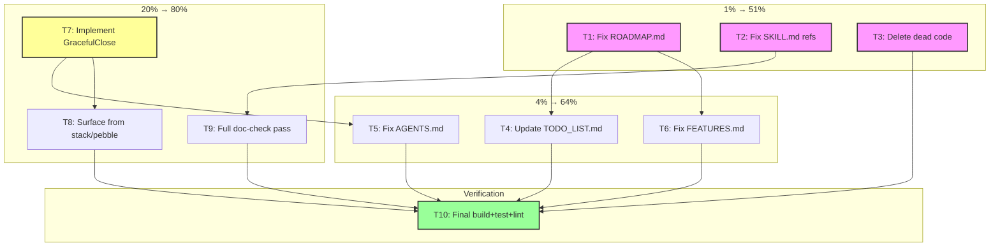

# Truth Reconciliation Plan — 2026-07-05

> **Goal:** Make every doc match reality. No phantom APIs, no stale versions, no dead code.
> **Constraint:** DO NOT VERSCHLIMMBESSERN. Fix what's broken. Don't add complexity.

## Context

The library code is solid — build passes, lint passes (0 issues), 482 test files. But the documentation layer has drifted severely from v3.1.0 (June 25) to v3.6.0 (July 5). Five shipped modules are listed as "raw ideas." The strategic docs claim version v3.3.0 when the actual tag is v3.6.0. An API (`GracefulClose`) is documented in AGENTS.md but doesn't exist in code. Three symbols are dead code flagged by LSP.

This plan fixes all of it — docs matching code, dead code removed, one documented-but-missing API implemented — without adding unnecessary features.

---

## Pareto Breakdown

### 1% effort → 51% value (The "stop lying" tier)

These are the changes that fix the most embarrassing problems in minutes:

| Task                                   | Why it's 1% effort | Why it's 51% value                          |
| -------------------------------------- | ------------------ | ------------------------------------------- |
| Fix ROADMAP.md version + shipped items | Text edits, 10 min | The #1 strategic doc is actively misleading |
| Fix SKILL.md 3 broken doc references   | Text edits, 5 min  | doc-check fails on default CI path          |
| Delete 3 dead code symbols             | `rm` lines, 5 min  | LSP warnings gone, no confusion             |

### 4% effort → 64% value (The "solid foundation" tier)

| Task                                  | Why                         | Value                                |
| ------------------------------------- | --------------------------- | ------------------------------------ |
| Update TODO_LIST.md to v3.6.0 reality | Text edits, 15 min          | Open items list is trustworthy again |
| Fix AGENTS.md phantom GracefulClose   | Remove or implement, 15 min | Consumer-facing docs stop lying      |
| Fix FEATURES.md module count (53→47)  | Text edit, 5 min            | Feature inventory is accurate        |

### 20% effort → 80% value (The "real improvement" tier)

| Task                                               | Why                | Value                              |
| -------------------------------------------------- | ------------------ | ---------------------------------- |
| Implement pebble.Backend.GracefulClose(ctx)        | ~15 lines of Go    | Documented API becomes real        |
| Surface Checkpoint/GracefulClose from stack/pebble | ~10 lines          | ROADMAP operability item closed    |
| Full doc-check pass on all files                   | Run tool, fix refs | CI green on doc-check default path |

---

## Level 1: Task Breakdown (7-27 tasks, 30-100 min each)

| #   | Task                                                                       | Tier | Impact   | Effort | Depends on |
| --- | -------------------------------------------------------------------------- | ---- | -------- | ------ | ---------- |
| T1  | Fix ROADMAP.md: version, dates, shipped items, operability                 | 1%   | Critical | 30 min | —          |
| T2  | Fix SKILL.md: 3 broken doc-check references                                | 1%   | Critical | 15 min | —          |
| T3  | Delete 3 dead code symbols (errRelational, errUnmarshalResult, mustOpenDB) | 1%   | High     | 15 min | —          |
| T4  | Update TODO_LIST.md to v3.6.0 reality                                      | 4%   | High     | 30 min | T1         |
| T5  | Fix AGENTS.md: remove or mark phantom GracefulClose                        | 4%   | High     | 15 min | T7         |
| T6  | Fix FEATURES.md: module count, verify key claims                           | 4%   | Medium   | 30 min | T1         |
| T7  | Implement pebble.Backend.GracefulClose(ctx)                                | 20%  | High     | 30 min | —          |
| T8  | Surface Checkpoint/GracefulClose from stack/pebble preset                  | 20%  | Medium   | 30 min | T7         |
| T9  | Full doc-check pass: fix all broken refs across all docs                   | 20%  | High     | 30 min | T2         |
| T10 | Final verification: build + test + lint + doc-check                        | —    | Critical | 30 min | All        |

**Total: 10 tasks, ~4 hours estimated**

---

## Level 2: Subtask Breakdown (50-125 tasks, max 15 min each)

### T1: Fix ROADMAP.md (8 subtasks)

| #    | Subtask                                                                        | Est   |
| ---- | ------------------------------------------------------------------------------ | ----- |
| T1.1 | Update version header: v3.3.0 → v3.6.0                                         | 2 min |
| T1.2 | Update "Last updated" date to 2026-07-05                                       | 1 min |
| T1.3 | Move Scheduler from "Raw Ideas" to completed                                   | 2 min |
| T1.4 | Move Deriver from "Raw Ideas" to completed                                     | 2 min |
| T1.5 | Move Managed Projection Host from "remaining gaps" to completed                | 2 min |
| T1.6 | Move Scenario-testing DSL from "remaining gaps" to completed                   | 2 min |
| T1.7 | Update "Current State" section to reflect v3.6.0 features                      | 5 min |
| T1.8 | Mark operability items: Checkpoint done (on Backend), GracefulClose pending T7 | 3 min |

### T2: Fix SKILL.md broken references (4 subtasks)

| #    | Subtask                                                                  | Est   |
| ---- | ------------------------------------------------------------------------ | ----- |
| T2.1 | Fix `query.QueryRecovery()` → `middleware.QueryRecovery()`               | 2 min |
| T2.2 | Fix `query.QueryLogging(logger)` → `middleware.QueryLogging(logger)`     | 2 min |
| T2.3 | Fix `query.QueryMetrics(recorder)` → `middleware.QueryMetrics(recorder)` | 2 min |
| T2.4 | Run doc-check to verify fix                                              | 2 min |

### T3: Delete dead code (5 subtasks)

| #    | Subtask                                                               | Est   |
| ---- | --------------------------------------------------------------------- | ----- |
| T3.1 | Read storage/relational/projection.go around errRelational definition | 3 min |
| T3.2 | Delete unused `errRelational` var                                     | 2 min |
| T3.3 | Read transport/grpc/client.go around errUnmarshalResult               | 3 min |
| T3.4 | Delete unused `errUnmarshalResult` var                                | 2 min |
| T3.5 | Delete unused `mustOpenDB` from storage/view/testhelpers_test.go      | 3 min |

### T4: Update TODO_LIST.md (6 subtasks)

| #    | Subtask                                                           | Est   |
| ---- | ----------------------------------------------------------------- | ----- |
| T4.1 | Update "Updated" date to 2026-07-05                               | 1 min |
| T4.2 | Update footer: v3.1.0 → v3.6.0                                    | 2 min |
| T4.3 | Remove or mark scheduling/deriver/projectionhost/scenario as done | 5 min |
| T4.4 | Verify remaining open items are still actually open               | 5 min |
| T4.5 | Add DOMAIN_LANGUAGE.md rebuild to completed section               | 2 min |
| T4.6 | Add doc-check fix to completed section                            | 2 min |

### T5: Fix AGENTS.md (4 subtasks)

| #    | Subtask                                                               | Est   |
| ---- | --------------------------------------------------------------------- | ----- |
| T5.1 | Find all GracefulClose references in AGENTS.md                        | 3 min |
| T5.2 | Verify if GracefulClose was implemented in T7                         | 1 min |
| T5.3 | If implemented: verify AGENTS.md example matches actual API signature | 5 min |
| T5.4 | If not implemented: remove or mark as planned                         | 5 min |

### T6: Fix FEATURES.md (4 subtasks)

| #    | Subtask                                          | Est    |
| ---- | ------------------------------------------------ | ------ |
| T6.1 | Fix module count: 53 → 47                        | 2 min  |
| T6.2 | Update "Last audited" date                       | 1 min  |
| T6.3 | Spot-check 3 random features against actual code | 10 min |
| T6.4 | Fix any discrepancies found                      | 5 min  |

### T7: Implement pebble.Backend.GracefulClose(ctx) (5 subtasks)

| #    | Subtask                                                          | Est    |
| ---- | ---------------------------------------------------------------- | ------ |
| T7.1 | Read pebble Backend.Close() implementation                       | 5 min  |
| T7.2 | Implement GracefulClose(ctx) — bounds Close with context timeout | 10 min |
| T7.3 | Write test for GracefulClose (success + timeout)                 | 10 min |
| T7.4 | Verify build + test                                              | 5 min  |
| T7.5 | Commit                                                           | 2 min  |

### T8: Surface Checkpoint/GracefulClose from stack/pebble (4 subtasks)

| #    | Subtask                                                             | Est    |
| ---- | ------------------------------------------------------------------- | ------ |
| T8.1 | Read stack/pebble/preset.go to understand Bundle wrapping           | 5 min  |
| T8.2 | Add Checkpoint/GracefulClose accessors if pebble Backend is wrapped | 10 min |
| T8.3 | Write test verifying the accessor works                             | 10 min |
| T8.4 | Verify build + test                                                 | 5 min  |

### T9: Full doc-check pass (4 subtasks)

| #    | Subtask                                                      | Est    |
| ---- | ------------------------------------------------------------ | ------ |
| T9.1 | Run `cd cmd/doc-check && GOWORK=off go run .` (default path) | 2 min  |
| T9.2 | Fix any broken references found                              | 10 min |
| T9.3 | Run doc-check on DOMAIN_LANGUAGE.md specifically             | 2 min  |
| T9.4 | Verify 0 broken refs across all files                        | 2 min  |

### T10: Final verification (4 subtasks)

| #     | Subtask                    | Est    |
| ----- | -------------------------- | ------ |
| T10.1 | Run `nix run .#build`      | 5 min  |
| T10.2 | Run `nix run .#test`       | 10 min |
| T10.3 | Run `nix run .#lint`       | 5 min  |
| T10.4 | Run doc-check default path | 2 min  |

**Total: 48 subtasks, ~3.5 hours estimated**

---

## Execution Graph

---

## What This Plan Does NOT Do

- No new features beyond GracefulClose (which is already documented)
- No refactoring of working code
- No dependency upgrades
- No public-release work (license, CONTRIBUTING, etc. — blocked on user decision)
- No coverage improvements (separate effort)

## VERSCHLIMMBESSERN Guard

Every change must pass this test:

1. Does it fix something that is **demonstrably wrong**?
2. Does it **remove** complexity rather than add it?
3. Would a **consumer be surprised** by this change?

If any answer is "no", the change doesn't go in.
