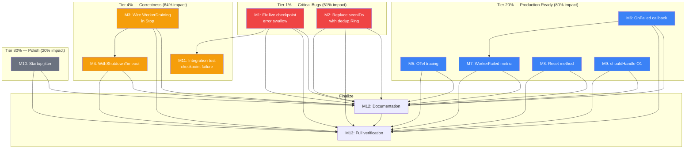

# Projectionhost Production Hardening Plan

**Date:** 2026-07-06 01:55
**Status:** Active — executing all tasks
**Scope:** `projectionhost/` module — bugs, observability gaps, and production readiness

---

## Context

`projectionhost/` is the "last loop every consumer rewrites" — managed lifecycle for projection workers. It reads from `event.SeekableJournal`, tracks per-projection checkpoints, handles crashes with backoff, and captures poison messages to a DLQ.

An architecture review identified **10 gaps**: 3 correctness bugs (silent data loss, dead code, OOM risk), 4 production-readiness gaps (no tracing, no failure notification, no reset, hardcoded timeout), and 3 polish items.

### What's Already Fixed (This Session)

The `dedup/` module was just extracted (commit `7ca5a2d8`) from inline ring implementations in `transport/http` and `watermill/`. It provides a bounded O(1) ring buffer — exactly what `projectionhost/` needs to replace its unbounded `seenIDs` map.

---

## Pareto Breakdown

### 1% → 51% of the Result (Critical bugs — data loss + OOM)

| ID     | Fix                                            | Why                                            |
| ------ | ---------------------------------------------- | ---------------------------------------------- |
| **M1** | Live checkpoint error swallowed → return error | Silent reprocessing storm on crash restart     |
| **M2** | Replace unbounded `seenIDs` with `dedup.Ring`  | OOM on cold-start replay of millions of events |

### 4% → 64% of the Result (Correctness + trivial wins)

| ID      | Fix                                             | Why                                             |
| ------- | ----------------------------------------------- | ----------------------------------------------- |
| **M3**  | Implement `WorkerDraining` transition           | Exported constant that's never set — lying API  |
| **M4**  | `WithShutdownTimeout` option                    | Hardcoded 30s kills slow projections mid-flight |
| **M11** | Integration test for checkpoint-failure restart | Proves M1 works end-to-end                      |

### 20% → 80% of the Result (Production observability + ops)

| ID      | Fix                                        | Why                                              |
| ------- | ------------------------------------------ | ------------------------------------------------ |
| **M5**  | OTel tracing (per-event + per-batch spans) | Projection loop is a trace blind spot            |
| **M6**  | `OnFailed` callback hook                   | "Runs forever" host must notify, not just record |
| **M7**  | `WorkerFailed` metric                      | Terminal failure invisible to dashboards         |
| **M8**  | `Reset(name)` for projection rebuilds      | Routine ops need — no rebuild path exists        |
| **M9**  | `shouldHandle` O(n) → O(1) map lookup      | Free perf on every event                         |
| **M12** | Full verification (build + lint + race)    | Prove nothing broke                              |

### 80% → 20% of the Result (Polish)

| ID      | Fix                        | Why                                 |
| ------- | -------------------------- | ----------------------------------- |
| **M10** | Startup jitter for workers | Minor thundering herd avoidance     |
| **M13** | Documentation update       | AGENTS.md, README, SKILL.md, doc.go |

---

## Medium Task Table (12 tasks, 30–90 min each)

| #   | Task                                         | Impact   | Effort | Tier | Depends |
| --- | -------------------------------------------- | -------- | ------ | ---- | ------- |
| M1  | Fix live checkpoint error swallow            | Critical | 30min  | 1%   | —       |
| M2  | Replace `seenIDs` map with `dedup.Ring`      | Critical | 45min  | 1%   | —       |
| M3  | Wire `WorkerDraining` in Stop() path         | High     | 30min  | 4%   | —       |
| M4  | Add `WithShutdownTimeout` option             | Medium   | 30min  | 4%   | M3      |
| M5  | Add OTel tracing to worker lifecycle         | High     | 90min  | 20%  | —       |
| M6  | Add `OnFailed` callback hook                 | High     | 45min  | 20%  | —       |
| M7  | Add `WorkerFailed` to `MetricsRecorder`      | Medium   | 15min  | 20%  | M6      |
| M8  | Add `Reset(name)` method                     | Medium   | 60min  | 20%  | —       |
| M9  | Optimize `shouldHandle` with type set        | Low      | 30min  | 20%  | —       |
| M10 | Add startup jitter                           | Low      | 15min  | 80%  | —       |
| M11 | Integration test: checkpoint failure         | High     | 30min  | 4%   | M1      |
| M12 | Update docs (AGENTS, README, SKILL, doc.go)  | Medium   | 45min  | —    | M1-M10  |
| M13 | Full verification: build + lint + race tests | High     | 30min  | —    | All     |

**Total estimated effort:** ~495 min (~8 hours)

---

## Fine Task Table (56 tasks, max 15 min each)

### M1: Fix live checkpoint error swallow (4 tasks)

| #   | Task                                                                 | Est   |
| --- | -------------------------------------------------------------------- | ----- |
| F1  | Read `processLive` checkpoint error path (`worker.go:427`)           | 2min  |
| F2  | Change Warn+nil to return `saveErr` in `processLive`                 | 5min  |
| F3  | Write test: checkpoint save failure in live mode causes error return | 10min |
| F4  | Run projectionhost tests with `-race -count=1`                       | 5min  |

### M2: Replace unbounded seenIDs with dedup.Ring (6 tasks)

| #   | Task                                                                        | Est  |
| --- | --------------------------------------------------------------------------- | ---- |
| F5  | Add `dedup/v4` to `projectionhost/go.mod`                                   | 2min |
| F6  | Replace `seenIDs map` + `seenMu` fields with `*dedup.Ring` in worker struct | 5min |
| F7  | Replace `markSeen`/`wasSeen` calls with `ring.Add`/`ring.Has`               | 5min |
| F8  | Initialize ring in `Register()` with `dedup.DefaultCapacity`                | 5min |
| F9  | Remove `seenMu`, `markSeen`, `wasSeen` methods                              | 3min |
| F10 | Run tests — verify dedup at replay→live boundary                            | 5min |

### M3: Implement WorkerDraining transition (4 tasks)

| #   | Task                                                             | Est   |
| --- | ---------------------------------------------------------------- | ----- |
| F11 | Set `WorkerDraining` in `Stop()` before `close(w.stop)`          | 5min  |
| F12 | Set `WorkerDraining` in `run()` defer (before `WorkerStopped`)   | 5min  |
| F13 | Write test: `Status()` returns "draining" during shutdown window | 10min |
| F14 | Run tests                                                        | 3min  |

### M4: Add WithShutdownTimeout (4 tasks)

| #   | Task                                                 | Est   |
| --- | ---------------------------------------------------- | ----- |
| F15 | Add `shutdownTimeout` to `hostOptions` (default 30s) | 3min  |
| F16 | Add `WithShutdownTimeout(d)` `HostOption` function   | 5min  |
| F17 | Replace hardcoded `30 * time.Second` in `Stop()`     | 3min  |
| F18 | Write test: custom timeout respected                 | 10min |

### M5: Add OTel tracing (8 tasks)

| #   | Task                                                                    | Est   |
| --- | ----------------------------------------------------------------------- | ----- |
| F19 | Add `otel/v4` direct dep to `projectionhost/go.mod`                     | 3min  |
| F20 | Add `tracer cqrsotel.Tracer` to `hostOptions` + `WithTracer` option     | 5min  |
| F21 | Add per-batch span in `process()` around journal `ReadFrom` loop        | 10min |
| F22 | Add per-event span in `applyWithRetry` around `projection.Handle`       | 10min |
| F23 | Add span attributes (projection name, event type, batch size, duration) | 5min  |
| F24 | Add span on checkpoint `Save` in both drain and live paths              | 5min  |
| F25 | Record error on span when `Handle` fails (before retry/DLQ)             | 5min  |
| F26 | Write test: spans created with correct names/attributes                 | 10min |

### M6: Add OnFailed callback (4 tasks)

| #   | Task                                                                   | Est   |
| --- | ---------------------------------------------------------------------- | ----- |
| F27 | Add `onFailed func(projectionName, lastError string)` to `hostOptions` | 3min  |
| F28 | Add `WithOnFailed(fn)` `HostOption`                                    | 5min  |
| F29 | Call `onFailed` in `run()` when `WorkerFailed` state is reached        | 5min  |
| F30 | Write test: `OnFailed` fires on max-restarts-exceeded                  | 10min |

### M7: Add WorkerFailed metric (3 tasks)

| #   | Task                                                           | Est  |
| --- | -------------------------------------------------------------- | ---- |
| F31 | Add `WorkerFailed(name string)` to `MetricsRecorder` interface | 5min |
| F32 | Call `m.WorkerFailed` in `run()` alongside `onFailed`          | 3min |
| F33 | Update existing test mocks for new interface method            | 5min |

### M8: Add Reset method (6 tasks)

| #   | Task                                                                           | Est   |
| --- | ------------------------------------------------------------------------------ | ----- |
| F34 | Define optional `Resettable interface { Reset(ctx) error }`                    | 5min  |
| F35 | Implement `Host.Reset(ctx, name)`: delete checkpoint + call Resettable if impl | 10min |
| F36 | Guard: `Reset` returns error if name not registered or already started         | 5min  |
| F37 | Write test: `Reset` drops checkpoint → next Start replays from zero            | 10min |
| F38 | Write test: `Reset` calls `Resettable.Reset()` if projection implements it     | 10min |
| F39 | Document `Reset` and `Resettable` in `doc.go`                                  | 5min  |

### M9: Optimize shouldHandle (4 tasks)

| #   | Task                                                                                      | Est  |
| --- | ----------------------------------------------------------------------------------------- | ---- |
| F40 | Build `map[event.Type]struct{}` once in worker constructor from `projection.EventTypes()` | 5min |
| F41 | Replace `slices.Contains` in `shouldHandle` with map lookup                               | 5min |
| F42 | Handle nil/empty EventTypes → "all events" (already works, verify)                        | 3min |
| F43 | Run tests to verify no regression                                                         | 3min |

### M10: Add startup jitter (3 tasks)

| #   | Task                                                                 | Est   |
| --- | -------------------------------------------------------------------- | ----- |
| F44 | Add random `time.Duration` jitter (0–100ms) before each `go w.run()` | 5min  |
| F45 | Write test: workers launch with staggered timing                     | 10min |
| F46 | Verify no race condition with `-race`                                | 3min  |

### M11: Integration test — checkpoint failure (2 tasks)

| #   | Task                                                                                         | Est   |
| --- | -------------------------------------------------------------------------------------------- | ----- |
| F47 | Write integration test: live checkpoint Save fails → worker returns error → restart triggers | 10min |
| F48 | Run test with `-race -count=1`                                                               | 3min  |

### M12: Documentation update (5 tasks)

| #   | Task                                                       | Est   |
| --- | ---------------------------------------------------------- | ----- |
| F49 | Update `projectionhost/doc.go` with new options and types  | 10min |
| F50 | Update `AGENTS.md` projectionhost description              | 5min  |
| F51 | Update `projectionhost/README.md` with new features        | 10min |
| F52 | Update `.agents/skills/go-cqrs-lite/references/modules.md` | 5min  |
| F53 | Run `cmd/doc-check` to verify all import paths valid       | 5min  |

### M13: Full verification (3 tasks)

| #   | Task                                              | Est  |
| --- | ------------------------------------------------- | ---- |
| F54 | Run `nix run .#build`                             | 5min |
| F55 | Run `nix run .#lint`                              | 5min |
| F56 | Run `go test ./projectionhost/... -race -count=1` | 5min |

---

## Execution Graph

## Execution Order

1. **M1 + M2** (parallel — independent bug fixes)
2. **M3 + M4** (sequential — M4 depends on M3's draining semantics)
3. **M5 + M6 + M7** (sequential — M7 depends on M6)
4. **M8 + M9 + M10** (parallel — independent)
5. **M11** (depends on M1)
6. **M12** (depends on all code tasks)
7. **M13** (final gate)
