# V4 Release Execution Plan

> **Created:** 2026-07-11 20:37
> **Status:** READY FOR EXECUTION
> **Total effort:** ~4.5 hours (critical path), ~5.5 hours (with polish)
> **Risk level:** LOW if executed in phase order. The 3 code breaking changes are already DONE — this is mostly mechanical path migration + safety nets + documentation.

---

## Pareto Analysis

### The 1% that delivers 51%

**Envelope safety net + tag.** If you do NOTHING else, these 4 tasks produce a safe, tagged v4:

| # | Task | Effort |
|---|---|---|
| 1 | Fix envelope magic string (`"cqrs"` → `"cqrs-envelope-v1"`) | 5 min |
| 2 | Envelope backward-compat integration test (raw JSON → CBOR default) | 30 min |
| 3 | `/v3` → `/v4` module path migration (49 go.mod files) | 2 hrs |
| 4 | `git tag v4.0.0` | 2 min |

**Without these:** no safe v4 exists. The envelope magic string is a data-corruption risk. The path migration IS the version cut. Everything else is polish.

### The 4% that delivers 64%

**Above + documentation + the small breaking change.** Now it's safe AND documented AND complete:

| # | Task | Effort |
|---|---|---|
| 5 | ADR for codec default flip | 15 min |
| 6 | CHANGELOG `[v4.0.0]` section | 20 min |
| 7 | BackfillHandler → `*SSEBroker` (approved v4 breaking change) | 25 min |
| 8 | Backfill missing v3 git tags | 10 min |

### The 20% that delivers 80%

**Above + polish that makes the release feel professional:**

| # | Task | Effort |
|---|---|---|
| 9 | HealthCheck on `OwnedDBHandle` (inheritable by all SQL stores) | 20 min |
| 10 | Test `WithShutdownDependency` through real `sqlite.New()` | 20 min |
| 11 | Update FEATURES.md for v4 | 30 min |
| 12 | Update migration guide with `/v3` → `/v4` path note | 10 min |
| 13 | Final build + test + lint + api-stability verification | 15 min |

### The other 20% to reach 100%

**Deferred items — NOT blocking v4:**

| Task | When | Why deferred |
|---|---|---|
| Storage/ split (3 packages) | v4.1 | Structural, not behavioral. Can ship with deprecated re-exports as a minor version. Doing it in the same cut as path migration doubles risk. |
| Parquet/DuckDB modules | v4.1 | Additive, no breaking changes. Design complete at `docs/research/`. |
| License swap (PROPRIETARY → Apache-2.0) | Post-v4 | User decision, irreversible, explicitly after v4. |
| Git history scrub | Post-v4 | User decision, irreversible, explicitly after v4. |
| Postgres CI matrix | Post-v4 | Nice-to-have, not blocking. |
| README polish to "sales page" | Post-v4 | Cosmetic. |
| NATS/ValKey transport | Future | New modules, no breaking changes. |

---

## Strategic Decision: Storage/ Split is DEFERRED to v4.1

**Reasoning:** The `/v3` → `/v4` path migration touches all 49 `go.mod` files and every import path in every `.go` file. The storage/ split ALSO touches import paths (creates `storage/eventstore/`, `storage/readmodel/`). Doing both simultaneously means debugging two independent sets of import failures at once. That's how you verschlimmbessern a system.

**The smart sequence:**
1. **v4 (now):** Path migration + 3 code breaking changes + BackfillHandler. Clean, mechanical, debuggable.
2. **v4.1 (next):** Storage/ split with deprecated re-exports. Can even ship as v4.0.1 if the re-exports make it non-breaking.

---

## Execution Graph

```mermaid
graph TD
    subgraph "Phase 1: Safety Nets — BLOCKER"
        A1[1.1 Fix envelope magic string<br/>cqrs → cqrs-envelope-v1]
        A2[1.2 Update envelope tests]
        A3[1.3 Backward-compat test: raw JSON → CBOR read]
        A4[1.4 Backward-compat test: mixed envelope+raw]
        A1 --> A2 --> A3 --> A4
    end

    subgraph "Phase 2: BackfillHandler Breaking Change"
        B1[2.1 Change signature: *SSEBroker]
        B2[2.2 Update tests]
        B1 --> B2
    end

    subgraph "Phase 3: Path Migration — THE BIG ONE"
        C1[3.1 Script: go.mod /v3→/v4]
        C2[3.2 Execute on all 49 modules]
        C3[3.3 Update all .go import paths]
        C4[3.4 Update go.work]
        C5[3.5 go mod tidy all modules]
        C6[3.6 Update tool module lists]
        C7[3.7 Update flake.nix + scripts]
        C8[3.8 Full build + test + lint]
        C1 --> C2 --> C3 --> C4 --> C5 --> C6 --> C7 --> C8
    end

    subgraph "Phase 4: Documentation"
        D1[4.1 ADR-0053: codec default flip]
        D2[4.2 CHANGELOG v4.0.0]
        D3[4.3 Update FEATURES.md]
        D4[4.4 Update migration guide]
        D1 --> D2 --> D3 --> D4
    end

    subgraph "Phase 5: Polish"
        E1[5.1 HealthCheck on OwnedDBHandle]
        E2[5.2 Shutdown ordering integration test]
        E1 --> E2
    end

    subgraph "Phase 6: Release"
        F1[6.1 Backfill v3 tags]
        F2[6.2 api-stability golden update]
        F3[6.3 Tag v4.0.0]
        F1 --> F2 --> F3
    end

    A4 --> B1
    B2 --> C1
    C8 --> D1
    D4 --> E1
    E2 --> F1

    style A1 fill:#ff6b6b,color:#fff
    style A3 fill:#ff6b6b,color:#fff
    style C1 fill:#feca57,color:#000
    style C3 fill:#feca57,color:#000
    style F3 fill:#51cf66,color:#fff
```

**Red** = data-safety critical. **Yellow** = biggest mechanical effort. **Green** = the finish line.

---

## Comprehensive Plan (30-100 min tasks)

> Sorted by execution dependency first, then impact, then effort.

| Phase | # | Task | Impact (1-5) | Effort (min) | Customer Value | Notes |
|---|---|---|---|---|---|---|
| 1 | 1 | **Envelope safety nets** — Fix magic string + backward-compat tests | 5 | 35 | Critical | Prevents silent data corruption on upgrade |
| 2 | 2 | **BackfillHandler → `*SSEBroker`** — Signature change + test updates | 3 | 25 | Medium | Approved v4 breaking change |
| 3 | 3 | **`/v3` → `/v4` path migration** — 49 go.mod + all imports + tools + scripts | 5 | 100 | Critical | THE version cut. Biggest mechanical effort |
| 4 | 4 | **Documentation sweep** — ADR + CHANGELOG + FEATURES.md + migration guide | 4 | 45 | High | Consumers need this to upgrade |
| 5 | 5 | **Polish** — HealthCheck on OwnedDBHandle + shutdown ordering test | 3 | 35 | Medium | Professional finish |
| 6 | 6 | **Release** — Backfill v3 tags + api-stability golden + tag v4.0.0 | 5 | 20 | Critical | The actual release act |
| — | 7 | **DEFERRED: Storage/ split** | 3 | 240 | Low | v4.1 — doubles risk if bundled with path migration |
| — | 8 | **DEFERRED: Parquet/DuckDB** | 4 | 600+ | High | v4.1 — additive, no breaking changes |
| — | 9 | **DEFERRED: License swap + scrub** | 5 | 60 | Critical | Post-v4, user approval, irreversible |
| — | 10 | **DEFERRED: README + Postgres CI** | 2 | 120 | Medium | Post-v4 polish |

**Critical path total:** ~4.5 hours (phases 1-6)

---

## Micro-Task Breakdown (max 12 min each)

> Every task is independently executable, independently verifiable.
> Sort within each phase is execution order.

### Phase 1: Safety Nets (35 min) — BLOCKER

| # | Task | Effort | Verify |
|---|---|---|---|
| 1.1 | Change `envelopeMagic` from `"cqrs"` to `"cqrs-envelope-v1"` in `codec/envelope.go:10` | 3 min | `go build ./codec/...` |
| 1.2 | Update `envelope.json` field tag: `json:"$"` still works — verify existing tests pass | 2 min | `go test ./codec/...` |
| 1.3 | Write test: encode a value with `JSONCodec` (raw, no envelope), read through `UnwrapDecode` with `CBORCodec` fallback — verify round-trip | 12 min | Test passes |
| 1.4 | Write test: mix envelope-wrapped CBOR data + raw JSON data in same byte stream, verify both decode correctly | 10 min | Test passes |
| 1.5 | Run full codec + kv + snapshot + command + query test suites | 5 min | All pass |

### Phase 2: BackfillHandler Breaking Change (25 min)

| # | Task | Effort | Verify |
|---|---|---|---|
| 2.1 | Change `BackfillHandler` signature: `func BackfillHandler(broker *SSEBroker) http.Handler` — extract journal from broker | 12 min | `go build ./transport/http/...` |
| 2.2 | Make `BackfillHandlerWithTransform` delegate to new `BackfillHandler` (transform already on broker) | 5 min | `go build` |
| 2.3 | Update `BackfillHandler` tests to pass `*SSEBroker` instead of journal | 8 min | `go test ./transport/http/...` |

### Phase 3: Path Migration — `/v3` → `/v4` (100 min)

> **This is the critical mechanical path.** Every `go.mod`, every import, every tool config.
> Execute as scripted passes, NOT manual editing. Verify after each pass.

| # | Task | Effort | Verify |
|---|---|---|---|
| 3.1 | Write `sed` command: replace `/v3` → `/v4` in module declaration line of all 49 `go.mod` files | 5 min | `grep -r '/v3' **/go.mod` returns 0 |
| 3.2 | Execute module declaration change across all `go.mod` files | 2 min | `go work sync` succeeds |
| 3.3 | Write `sed` command: replace all import paths `go-cqrs-lite/X/v3` → `go-cqrs-lite/X/v4` in all `.go` files | 5 min | — |
| 3.4 | Execute import path replacement across all `.go` files | 2 min | `grep -r '/v3' --include='*.go' .` returns 0 matches (excluding vendor) |
| 3.5 | Update `go.work` — all `use` directives stay the same (directory paths), but `go.work.sum` needs regen | 3 min | `go work sync` succeeds |
| 3.6 | Run `go mod tidy -e` in all 49 modules (event/ has nested eventtest) | 12 min | All `go.sum` files updated |
| 3.7 | Update `cmd/api-stability/main.go` — 48 module paths `/v3` → `/v4` in the hardcoded list | 10 min | `go build ./cmd/api-stability/...` |
| 3.8 | Update `cmd/doc-check/main.go` — module path references `/v3` → `/v4` | 10 min | `go build ./cmd/doc-check/...` |
| 3.9 | Update `scripts/check-module-layers.sh` — module paths in DEP_BUDGET and LAYER maps | 5 min | Script runs without errors |
| 3.10 | Update `flake.nix` — `testModules` list paths `/v3` → `/v4` | 5 min | `nix run .#test` finds all modules |
| 3.11 | Update `docs/api_surface.txt` — regenerate with `api-stability -update` | 5 min | File updated |
| 3.12 | Full workspace build: `go build -tags "goexperiment.arenas goexperiment.jsonv2" ./...` | 5 min | Zero errors |
| 3.13 | Full workspace test: `go test -tags "goexperiment.arenas goexperiment.jsonv2" ./... -count=1` | 12 min | All pass |
| 3.14 | Full workspace lint: `nix run .#lint` | 12 min | 0 new issues |
| 3.15 | Run `cmd/api-stability` (no -update) — verify export count matches | 5 min | PASS |
| 3.16 | Run `cmd/doc-check` — verify all references valid | 5 min | PASS |

### Phase 4: Documentation (45 min)

| # | Task | Effort | Verify |
|---|---|---|---|
| 4.1 | Write ADR-0053: "Codec Default Flip (JSON → CBOR)" — rationale, backward-compat via envelopes, migration path | 12 min | File at `docs/adr/0053-codec-default-flip.md` |
| 4.2 | Write CHANGELOG `[v4.0.0]` section: 4 breaking changes (aliases, blind store codec, event codec, BackfillHandler), migration link | 12 min | Section above `[Unreleased]` |
| 4.3 | Update FEATURES.md: add envelope wrapping, codec flip, health checks, shutdown ordering, BackfillHandler change | 12 min | Audit date updated |
| 4.4 | Update `docs/migration/MIGRATION-GUIDE.md`: add `/v3` → `/v4` import path change section | 5 min | Guide covers all 4 breaking changes + path migration |

### Phase 5: Polish (35 min)

| # | Task | Effort | Verify |
|---|---|---|---|
| 5.1 | Add `HealthCheck(ctx) error` method to `OwnedDBHandle` in `storage/sql/base.go` — delegates to `db.PingContext` | 10 min | `go build ./storage/...` |
| 5.2 | Remove redundant `HealthCheck` from `*SQLEventStore` (now inherited via `OwnedDBHandle` embed) | 3 min | `go build` |
| 5.3 | Test: verify `HealthCheck` works on all SQL store types (event, snapshot, checkpoint, command, query) | 10 min | Tests pass |
| 5.4 | Write integration test: `WithShutdownDependency` through real `sqlite.New()` constructor (not struct literal) | 12 min | Test passes |

### Phase 6: Release (20 min)

| # | Task | Effort | Verify |
|---|---|---|---|
| 6.1 | Find commit SHAs for v3.3.0–v3.8.0 from CHANGELOG dates + `git log --before` | 10 min | SHAs identified |
| 6.2 | Tag missing v3 releases: `git tag v3.3.0 <sha>` etc. | 5 min | `git tag --list 'v3*'` shows all |
| 6.3 | Run `cmd/api-stability -update` for final golden (captures BackfillHandler signature change) | 2 min | api_surface.txt updated |
| 6.4 | `git tag v4.0.0` | 1 min | Tag exists |
| 6.5 | `git push origin master --tags` | 2 min | Tags pushed |

---

## Risk Assessment

| Risk | Probability | Impact | Mitigation |
|---|---|---|---|
| Path migration breaks hidden import | Medium | Medium | Phased sed passes + full test after each phase |
| Envelope magic string change breaks existing consumer data | Low | Critical | Backward-compat test (task 1.3) proves old data reads |
| `go mod tidy` pulls unexpected deps | Low | Low | Run in workspace mode, check diff |
| Storage/ split attempted alongside path migration | HIGH if attempted | HIGH | **DEFERRED to v4.1** — this IS the mitigation |
| v3 tag backfill points to wrong commit | Medium | Low | Tags are cheap, can be deleted + recreated |

---

## What NOT to Do

> "If you VERSCHLIMMBESSER this system, I will cut off your balls."

1. **Do NOT bundle storage/ split with path migration.** Two independent import-path changes in one cut = debug hell. Deferred to v4.1.
2. **Do NOT manually edit import paths.** Use `sed` with precise patterns, then verify with `grep`. Manual editing of 500+ import lines introduces typos.
3. **Do NOT skip the envelope backward-compat test.** Without it, consumers upgrading to v4 may silently lose data. This is the single most important test in the entire plan.
4. **Do NOT touch the event/ module structure.** Explicitly decided: DO NOT SPLIT. 27 importers, real cohesion.
5. **Do NOT do Parquet/DuckDB in v4.** It's additive (no breaking changes). v4 stays focused on cleanup. Ship as v4.1.
6. **Do NOT refactor working code during the path migration.** Mechanical sed only. No "while I'm in here" improvements.

---

## Post-v4 Roadmap (not in this plan)

| Version | Content | Effort |
|---|---|---|
| v4.1 | Storage/ split (3 packages with deprecated re-exports) | ~4 hrs |
| v4.2 | Parquet journal (`storage/parquet`) | ~3-4 days |
| v4.3 | DuckDB materializations (`storage/duckdb` + `stack/duckdb`) | ~4-5 days |
| Post-v4 | License swap + git history scrub | ~1 hr (user approval needed) |
| Post-v4 | README "sales page" rewrite + Postgres CI | ~2 hrs |
