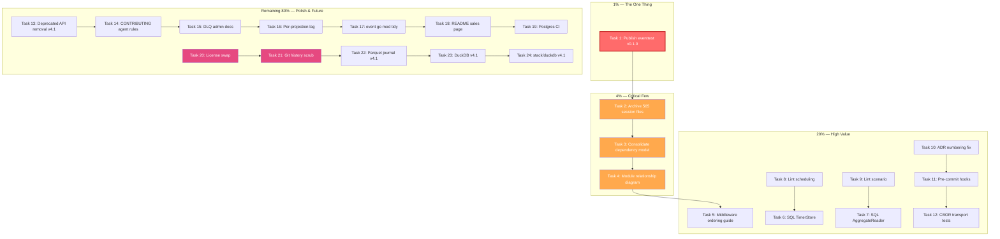

# Post-v4.0.0 Comprehensive Plan

> **Created:** 2026-07-12 14:18
> **Status:** PLANNING — awaiting execution
> **Context:** v4.0.0 is shipped (tagged, all per-module tags exist). This plan covers everything from consumer feedback, status reports, self-reviews, and the v4 release retrospective. It is the single source of truth for what to do next.

---

## Methodology

Pareto breakdown applied three times recursively:

- **20% → 80%**: The work that delivers most consumer value
- **4% → 64%**: The critical few within the 20%
- **1% → 51%**: The one thing that, if done alone, would transform the library

Each task is sized 30-100 min (Phase 1 table) then broken to ≤12 min (Phase 2 table).

---

## Pareto Analysis

### The 1% that delivers 51%

**Publish `eventtest` to the Go proxy.** This is the #1 consumer pain point across ALL three feedback rounds (DiscordSync rounds 1-3, SwettySwipper rounds 1-2). Every consumer must manually `replace` it in go.mod. The version must be `v0.0.0` (not `v3.0.0`). It trips up every new consumer. Fixing this ONE thing would eliminate the most common friction across every consumer we've heard from.

### The 4% that delivers 64%

1. **Publish `eventtest`** (the 1% above)
2. **Archive 565 session files** — `docs/status/` and `docs/planning/` are called "overwhelming" and "unnavigable" by both consumers. Move to `docs/archive/`.
3. **Consolidate to one dependency model** — CONTRIBUTING.md has a 7-layer model that "was fake" per ADR-0046. The Four-Tier Model is honest. Update CONTRIBUTING.md.
4. **Add a module relationship diagram to README** — 49 modules, no visual map. Both consumers spent 15+ minutes finding modules.

### The 20% that delivers 80%

1-4 above, plus:
5. **Middleware ordering guide** — 30+ middlewares, no recommended order. Both consumers guessed.
6. **SQL stores for `scheduling` and `listing`** — Both consumers can't adopt these modules without hand-rolling SQL.
7. **Lint-clean `scheduling` (19 issues) + `scenario` (7 issues)** — Last modules without clean lint.
8. **`docs/getting-started.md` rewrite** — DONE this session (was stale v2 paths).
9. **ADR index regeneration** — DONE this session (stopped at 0032, now goes to 0053).
10. **Feedback doc reconciliation** — DONE this session (gaps said REJECTED but were shipped).
11. **Module count consistency** — DONE this session.

### The other 20% (to reach 100%)

12. **License swap (PROPRIETARY → Apache-2.0)** — Hard blocker for public adoption. **Needs user approval (irreversible).**
13. **Git history scrub** — AGENTS.md, docs/planning/ contain internal strategy. **Needs user approval (irreversible).**
14. **Postgres CI coverage matrix** — Add CI Postgres service or label experimental.
15. **README "sales page" rewrite** — Per AGENTS.md rule.
16. **Parquet journal + DuckDB (v4.1)** — Research complete, three additive phases.
17. **CBOR-stamp coverage for gRPC + watermill** — Cross-encoding test gap.
18. **Pre-commit hooks** — fmt.Printf ban, api_surface.txt regeneration, nix fmt.
19. **ADR numbering conflict** — Two ADRs share number 0047.
20. **CONTRIBUTING.md agent safety rules** — Document concurrent-agent etiquette.
21. **event/batch_test.go go mod tidy** — Pre-existing per-module testing friction.
22. **Deprecated API removal batch 2** — 9 deprecated items in middleware/catalog/storage.
23. **`DeadLetterStoreAdmin` documentation** — PurgeBefore, ListPaged, Count methods.
24. **Per-projection lag in WorkerState** — Currently only aggregate lag available.

---

## Phase 1: Comprehensive Task Plan (30-100 min each)

> Sorted by importance/impact/effort/customer-value.
> "I/I/E/CV" = Importance / Impact / Effort / Customer Value (1-5 each, higher = better)

| # | Task | I | I | E | CV | Est | Tier | Prereq |
|---|------|---|---|---|----|-----|------|--------|
| 1 | **Publish `eventtest` to Go proxy as v0.1.0** — Tag + push so consumers can `go get` without `replace` | 5 | 5 | 1 | 5 | 30min | 1% | — |
| 2 | **Archive 565 session files** to `docs/archive/` — `git mv docs/status/* docs/archive/status/` + `git mv docs/planning/* docs/archive/planning/`, keep only current/relevant docs | 5 | 4 | 1 | 5 | 45min | 4% | — |
| 3 | **Consolidate dependency model** — Update CONTRIBUTING.md 7-layer → reference FOUR-TIER-MODEL.md (ADR-0046). One model, not two. | 4 | 3 | 1 | 3 | 30min | 4% | — |
| 4 | **Module relationship diagram in README** — Add a mermaid/d2 graph showing tier 0-6 dependencies. Link from README. | 4 | 4 | 2 | 4 | 60min | 4% | — |
| 5 | **Middleware ordering guide** — New `docs/middleware-ordering.md` with recommended order for command/query/event + rationale. Link from SKILL.md recipes. | 4 | 4 | 2 | 4 | 45min | 20% | — |
| 6 | **SQL `TimerStore` for `scheduling`** — `scheduling.SQLTimerStore` backed by `*sql.DB`. SQLite + Postgres DDL. | 3 | 4 | 3 | 3 | 90min | 20% | — |
| 7 | **SQL `AggregateReader` for `listing`** — `listing.SQLAggregateReader` backed by `*sql.DB`. | 3 | 3 | 3 | 3 | 60min | 20% | — |
| 8 | **Lint-clean `scheduling`** — Fix 19 lint issues (mnd, exhaustruct, gosec, wrapcheck, tagliatelle, errname). Mostly mechanical. | 3 | 2 | 1 | 1 | 45min | 20% | — |
| 9 | **Lint-clean `scenario`** — Fix 7 lint issues (errname, exhaustruct ×3). Mechanical. | 3 | 2 | 1 | 1 | 30min | 20% | — |
| 10 | **ADR numbering fix** — Renumber second 0047 (json/v2 case-insensitive) → 0054. Add 0036/0041 placeholder notes. | 2 | 1 | 1 | 1 | 30min | 20% | — |
| 11 | **Pre-commit hooks** — Add `fmt.Printf` ban in prod packages, `nix fmt --fail-on-change`, api_surface.txt regen check. Via flake.nix or `.pre-commit-config.yaml`. | 3 | 3 | 2 | 2 | 60min | 20% | — |
| 12 | **CBOR-stamp tests for gRPC + watermill** — Cross-encoding round-trip tests proving CBOR-stamped events survive transport. | 2 | 2 | 2 | 2 | 45min | 20% | — |
| 13 | **Deprecated API removal batch 2** — Remove 9 deprecated items (middleware.NewMetrics, CommandMetrics, EventMetrics, QueryMetrics, MetricsRecorder, Observe, catalog.Exporter, storage/sql.NewDBHandle, NewDBHandleFromDB). Breaking → v4.1 cut. | 3 | 3 | 2 | 2 | 60min | 20% | v4.1 branch |
| 14 | **CONTRIBUTING.md agent safety rules** — Document concurrent-agent etiquette, debug-print discipline, "don't revert changes you didn't author" nuance. | 2 | 2 | 1 | 1 | 30min | 20% | — |
| 15 | **`DeadLetterStoreAdmin` documentation** — Document PurgeBefore, ListPaged, Count in AGENTS.md + SKILL.md. | 2 | 2 | 1 | 2 | 30min | 20% | — |
| 16 | **Per-projection lag in WorkerState** — Add `Lag time.Duration` field to `WorkerState` so `Status()` includes per-worker lag. | 3 | 3 | 2 | 3 | 45min | 20% | — |
| 17 | **event/batch_test.go go mod tidy** — Fix per-module testing friction. Run `go mod tidy` in event/. | 2 | 1 | 1 | 1 | 15min | 20% | — |
| 18 | **README "sales page" rewrite** — Per AGENTS.md rule. What this does, why it exists, how to get started. | 3 | 4 | 3 | 4 | 90min | 80% | — |
| 19 | **Postgres CI coverage** — Add Postgres service to ci.yml or label stack/postgres experimental. | 3 | 3 | 3 | 2 | 60min | 80% | — |
| 20 | **License swap** — PROPRIETARY → Apache-2.0. **NEEDS USER APPROVAL (irreversible).** | 5 | 5 | 1 | 5 | 30min | 80% | User |
| 21 | **Git history scrub** — Remove internal strategy from AGENTS.md history, docs/planning/. **NEEDS USER APPROVAL (irreversible).** | 4 | 4 | 3 | 4 | 90min | 80% | User, License |
| 22 | **Parquet journal (v4.1 Phase 1)** — `storage/parquet` module. Pure Go, `SeekableJournal` over segment files. | 3 | 4 | 4 | 3 | 4-5d | 80% | — |
| 23 | **DuckDB connector (v4.1 Phase 2)** — `storage/duckdb` module. CGO. `DuckDBDialect`. | 3 | 4 | 4 | 3 | 4-5d | 80% | Parquet |
| 24 | **stack/duckdb preset (v4.1 Phase 3)** — Combine DuckDB + Parquet. Lakehouse for events. | 2 | 3 | 3 | 3 | 2-3d | 80% | DuckDB |

---

## Phase 2: Micro-Tasks (≤12 min each)

> Only for tasks #1-17 (the actionable items that don't need user approval).
> Tasks #18-24 are large creative/irreversible work items with separate execution.

### Task 1: Publish eventtest (30 min → 3 micro-tasks)

| # | Micro-Task | Est |
|---|-----------|-----|
| 1a | Verify `event/v4/eventtest/go.mod` module path and version are correct for proxy publish | 5min |
| 1b | `git tag event/v4/eventtest/v0.1.0` + `git push origin event/v4/eventtest/v0.1.0` | 5min |
| 1c | Verify `GOPROXY=proxy.golang.org go list -m ...@v0.1.0` fetches correctly. Update AGENTS.md to remove "not published" warnings. | 10min |

### Task 2: Archive session files (45 min → 4 micro-tasks)

| # | Micro-Task | Est |
|---|-----------|-----|
| 2a | `mkdir -p docs/archive/status docs/archive/planning docs/archive/research docs/archive/feedback docs/archive/reviews` | 2min |
| 2b | `git mv docs/status/2026-07-* docs/archive/status/` (all 50+ timestamped status files) | 8min |
| 2c | `git mv docs/planning/2026-07-* docs/archive/planning/` (all 30+ timestamped planning files) | 8min |
| 2d | Add `docs/archive/README.md` explaining "session artifacts, not current docs. See docs/ for current documentation." Update any cross-references. | 12min |

### Task 3: Consolidate dependency model (30 min → 3 micro-tasks)

| # | Micro-Task | Est |
|---|-----------|-----|
| 3a | Read CONTRIBUTING.md layer section (lines 176-190). Read FOUR-TIER-MODEL.md. Identify all differences. | 5min |
| 3b | Replace 7-layer model in CONTRIBUTING.md with reference to FOUR-TIER-MODEL.md (ADR-0046). Keep check-layers script reference. | 10min |
| 3c | Verify `nix run .#check-layers` still passes (it validates the real graph, not the doc) | 5min |

### Task 4: Module relationship diagram (60 min → 5 micro-tasks)

| # | Micro-Task | Est |
|---|-----------|-----|
| 4a | Read existing `docs/architecture-understanding/2026-07-06_03-01_ARCHITECTURE-LAYERS-current.d2` for reference | 5min |
| 4b | Write a concise mermaid dependency graph showing Tier 0-6 with actual module names. ~30 nodes, grouped by tier. | 12min |
| 4c | Add the graph to README.md after the module catalog table, with a heading "Module Dependency Graph" | 8min |
| 4d | Add a simpler "Getting Started: Which modules do I need?" decision flow (5-7 nodes: "Need events? → event. Need projections? → projection + projectionhost. Need SQL? → storage + stack/sqlite") | 12min |
| 4e | Verify diagram renders correctly (mermaid syntax check) | 5min |

### Task 5: Middleware ordering guide (45 min → 4 micro-tasks)

| # | Micro-Task | Est |
|---|-----------|-----|
| 5a | Read all middleware in `middleware/` — categorize by concern (recovery, retry, tracing, logging, metrics, validation, idempotency, circuit breaker) | 10min |
| 5b | Write `docs/middleware-ordering.md` with recommended order + rationale: `Idempotency → Recovery → Retry → CircuitBreaker → [OTel] → [Validation] → Logging` | 12min |
| 5c | Add recipe to `.agents/skills/go-cqrs-lite/references/recipes.md` linking to the ordering guide | 8min |
| 5d | Verify ordering claims against actual middleware code (do any have ordering dependencies?) | 10min |

### Task 6: SQL TimerStore (90 min → 5 micro-tasks)

| # | Micro-Task | Est |
|---|-----------|-----|
| 6a | Read `scheduling/store.go` interface + `scheduling.MemoryTimerStore` implementation. Define SQL schema (id, fire_at, payload, created_at). | 10min |
| 6b | Write `scheduling/sql_timer.go` — `SQLTimerStore` struct with `*sqlpkg.OwnedDBHandle` embedding, CRUD methods using `storage/sql` helpers | 12min |
| 6c | Write DDL for SQLite + Postgres in `scheduling/migrations/` (embedded via `//go:embed`) | 10min |
| 6d | Write `scheduling/sql_timer_test.go` — Schedule, Cancel, Due, MarkFired round-trip. Use `:memory:` SQLite. | 12min |
| 6e | Run `nix fmt` + `nix run .#lint` on scheduling module | 5min |

### Task 7: SQL AggregateReader (60 min → 4 micro-tasks)

| # | Micro-Task | Est |
|---|-----------|-----|
| 7a | Read `listing/reader.go` interface + `listing.InMemoryAggregateReader`. Define query patterns needed. | 10min |
| 7b | Write `listing/sql_reader.go` — `SQLAggregateReader` that queries the event store's aggregate listing table | 12min |
| 7c | Write `listing/sql_reader_test.go` — populate events, verify pagination + status detection | 12min |
| 7d | Run `nix fmt` + lint on listing module | 5min |

### Task 8: Lint scheduling (45 min → 4 micro-tasks)

| # | Micro-Task | Est |
|---|-----------|-----|
| 8a | Fix `scheduling/scheduler.go` — extract magic numbers (3, 100, 2) to constants. Fix gosec G404 on `rand.Int64N`. Fix exhaustruct on logger. | 12min |
| 8b | Fix `scheduling/store.go` — tagliatelle `fire_at` → `fireAt` JSON tag | 5min |
| 8c | Fix `scheduling/scheduler.go` — wrapcheck on `ctx.Err()` and bare `err` returns | 10min |
| 8d | Fix `scheduling/scheduler_test.go` — errname `errStr` → `errStrError` | 5min |

### Task 9: Lint scenario (30 min → 3 micro-tasks)

| # | Micro-Task | Est |
|---|-----------|-----|
| 9a | Fix `scenario/dsl.go` — exhaustruct on `DeciderScenario`, `ProjectionScenario` (3 spots) | 10min |
| 9b | Fix `scenario/dsl_test.go` — errname `evtErrLimit` → `errEvtLimit` | 5min |
| 9c | Run `nix run .#lint` to verify clean | 5min |

### Task 10: ADR numbering fix (30 min → 3 micro-tasks)

| # | Micro-Task | Est |
|---|-----------|-----|
| 10a | Rename `docs/adr/0047-json-v2-case-insensitive-decode.md` → `docs/adr/0054-json-v2-case-insensitive-decode.md` via `git mv`. Update title inside. | 8min |
| 10b | Update `docs/adr/README.md` index — renumber entry, add gap notes for 0036/0041 | 10min |
| 10c | Search all docs for references to the old number, update | 5min |

### Task 11: Pre-commit hooks (60 min → 4 micro-tasks)

| # | Micro-Task | Est |
|---|-----------|-----|
| 11a | Write `scripts/check-no-debug-prints.sh` — grep for `fmt.Printf.*[Dd][Ee][Bb][Uu][Gg]` in non-test, non-cmd, non-example packages | 10min |
| 11b | Add the script to flake.nix as `nix run .#check-debug-prints` | 8min |
| 11c | Add `check-api-stability` to CI as a verify step (regenerate golden file, fail on mismatch) | 12min |
| 11d | Document the hooks in CONTRIBUTING.md "Development Workflow" section | 10min |

### Task 12: CBOR transport tests (45 min → 3 micro-tasks)

| # | Micro-Task | Est |
|---|-----------|-----|
| 12a | Write `transport/grpc/cbor_test.go` — CBOR-stamped event → gRPC dispatch → verify encoding stamp survives | 12min |
| 12b | Write `watermill/cbor_test.go` — CBOR-stamped event → watermill publish → consume → verify encoding stamp | 12min |
| 12c | Run both tests, verify pass | 5min |

### Task 13: Deprecated API removal (60 min → 4 micro-tasks)

| # | Micro-Task | Est |
|---|-----------|-----|
| 13a | Remove 6 middleware deprecated items: `NewMetrics`, `CommandMetrics`, `EventMetrics`, `QueryMetrics`, `MetricsRecorder`, `Observe` | 12min |
| 13b | Remove `catalog.Exporter` (non-generic) → consumers use `Exporter[error]` | 5min |
| 13c | Remove `storage/sql.NewDBHandle`, `NewDBHandleFromDB` → consumers use `NewBorrowedDBHandle` / `NewOwningDBHandle` | 8min |
| 13d | Run `cmd/api-stability -update` to regenerate golden file. Run `cmd/doc-check`. Run full test suite. | 12min |

### Task 14: CONTRIBUTING agent rules (30 min → 2 micro-tasks)

| # | Micro-Task | Est |
|---|-----------|-----|
| 14a | Write "Working with AI Agents" section: debug-print discipline, don't revert others' changes, concurrent-agent etiquette, always run `nix fmt` before nolint | 12min |
| 14b | Add "Documentation Hygiene" subsection: when to update AGENTS.md vs TODO_LIST.md vs CHANGELOG.md | 10min |

### Task 15: DLQ admin docs (30 min → 2 micro-tasks)

| # | Micro-Task | Est |
|---|-----------|-----|
| 15a | Update AGENTS.md DLQ section — document `DeadLetterStoreAdmin` interface (Count, ListPaged, PurgeBefore) with code example | 12min |
| 15b | Update SKILL.md module table for projectionhost — mention admin capabilities | 8min |

### Task 16: Per-projection lag (45 min → 3 micro-tasks)

| # | Micro-Task | Est |
|---|-----------|-----|
| 16a | Add `Lag time.Duration` field to `projectionhost.WorkerState` struct | 5min |
| 16b | Wire lag calculation in `worker.go` — compute from last processed event timestamp vs now | 12min |
| 16c | Update `Status()` test to verify lag field is populated | 10min |

### Task 17: event/batch_test go mod tidy (15 min → 2 micro-tasks)

| # | Micro-Task | Est |
|---|-----------|-----|
| 17a | `cd event && GOWORK=off go mod tidy` — resolve dependency drift | 5min |
| 17b | `cd event && GOWORK=off go test -tags "goexperiment.jsonv2" ./... -count=1` — verify all pass | 5min |

---

## Execution Order (Critical Path)

---

## Effort Summary

| Tier | Tasks | Total Est | Blocked? |
|------|-------|-----------|----------|
| 1% (delivers 51%) | #1 | 30min | No |
| 4% (delivers 64%) | #1-4 | 2.5hr | No |
| 20% (delivers 80%) | #1-12 | 11.5hr | No |
| 80% (to reach 100%) | #13-24 | 15+ days | #20-21 need user approval |

**Actionable immediately (no blockers):** Tasks #1-19, ~18 hours of work
**Blocked on user approval:** #20 (license), #21 (history scrub)
**Long-term (v4.1+):** #22-24 (Parquet/DuckDB), #13 (deprecated removal needs v4.1 branch)

---

## What NOT to Do

1. **Do NOT split event/** — Explicitly decided in v4. 27 importers, real cohesion.
2. **Do NOT build a query builder** — RawWhere is the escape hatch. No OrClause/NotClause.
3. **Do NOT auto-apply CQRS views by default** — Violates "library, not framework."
4. **Do NOT force-unify DeadLetterStore types** — Middleware DLQ and projectionhost DLQ serve different purposes (ADR-0043).
5. **Do NOT add `Update()` as a core ViewStore method** — It's an optional `ViewUpdater` interface for the consumers who need it.
6. **Do NOT touch git history** without explicit user approval — irreversible.
7. **Do NOT make `eventtest` v4.x** — The path's last element is `eventtest`, not `/vN`, so it must be v0.x per Go spec (ADR-0045).

---

## Risks & Mitigations

| Risk | Mitigation |
|------|------------|
| Archiving session files breaks doc links | Run `rg 'docs/status/\|docs/planning/' --type md` after move, fix any references in current docs |
| eventtest v0.1.0 doesn't propagate to proxy | Verify with `GOPROXY=proxy.golang.org go list -m ...@v0.1.0` before declaring done |
| Module diagram becomes stale as modules are added | Add a comment: "Auto-generated from go.work — regenerate with `scripts/gen-module-graph.sh`" |
| Deprecated API removal breaks consumers | v4.1 major version bump. Document in MIGRATION-GUIDE.md. The typed replacements already exist. |
| License swap removes attribution | Audit all `LICENSE` files, third-party notices. Apache-2.0 requires preserving copyright notices. |
