# CQRS-Lint: Execution Plan

> **Date**: 2026-07-16
> **Goal**: Build a domain-aware linter for go-cqrs-lite consumers
> **Companion docs**: [Linter Research](../research/domain-linter-research.md), [Consumer Analysis](../../../docs/go-cqrs-lite-consumer-projects-analysis.md)

---

## 1. Pareto Breakdown: What Actually Matters

### 1% that delivers 51% of the result

| Item | Why | Impact |
|------|-----|--------|
| **5 correctness rules working against real projects** (C001-C003, C005, C006) | Catches actual bugs: silent data loss (DiscordSync), broken idempotency (Kernovia), corrupt streams (KeyCountdown), raw json.Unmarshal (storbi) | Immediate bug detection in 6+ projects |
| **`event.Single()` library function** | Eliminates B001/B011/B012 (single-event helper) across ALL 22 consumers — the #1 most universal boilerplate | Removes the #1 boilerplate pattern ecosystem-wide |
| **CQRSRegistry + package loading** | Foundation every rule depends on. Without this, nothing works. | Enabler for all 47 rules |

### 4% that delivers 64% of the result

| Item | Why | Impact |
|------|-----|--------|
| **5 API misuse rules** (A001, A002, A003, A004, A007) | Catches the most common anti-patterns: manual command interface, NewEvent vs New, untyped register, dual model | A001+A007 affect the 2 largest consumers |
| **Auto-fix for C006** (manual version arithmetic) | Pure mechanical replacement, zero false positives, immediately improves 4 projects | Instant value, zero risk |
| **Auto-fix for C003** (silent unknown event fold) | Add error in default case — unambiguous | Instant value, zero risk |
| **SARIF output for GitHub CI** | go-finding provides this for free. Enables PR annotations. | CI integration with zero code |
| **Health score** | Single number for tracking improvement | Drives adoption and prioritization |
| **`decider.StrictFold[T]()` library function** | Eliminates C003 across ALL projects by default | Library-level fix, not just lint |

### 20% that delivers 80% of the result

| Item | Why |
|------|-----|
| All 12 correctness rules (C001-C012) | Complete bug detection coverage |
| Top 10 API misuse rules | Covers every project with significant issues |
| Suppression comments (`//cqrs-lint:ignore`) | Required for real-world adoption (false positives) |
| Config file (`.cqrs-lint.json`) | Per-project rule configuration |
| Pre-commit `--fast` mode | Developer workflow integration |
| Test fixtures for all implemented rules | Proves detection works |
| Integration tests against 5 real consumer projects | Validates against real code |

### The remaining 20% (to reach 100%)

| Item | Why |
|------|-----|
| Remaining 15 boilerplate rules | Nice-to-have, not blocking |
| 5 consistency rules | Polish |
| 7 architecture rules | Valuable but complex cross-module analysis |
| 3 security rules | Important but lower frequency |
| golangci-lint plugin (go/analysis bridge) | Alternative integration path |
| LSP editor integration | Real-time feedback |
| Recommendation engine | Migration suggestions |
| `command.RegisterAll()` library helper | Eliminates B007 |
| Deprecate `dispatcher.Register` | Eliminates A004 at source |

---

## 2. Level 1 Plan: Tasks (100-30 min each)

Sorted by importance/impact/effort/customer-value.

| # | Task | Impact | Effort (min) | Dependencies | Phase |
|---|------|--------|-------------|--------------|-------|
| L01 | **Module setup**: `cmd/cqrs-lint/` go.mod, directory structure, deps (go-finding, go-error-family, cmdguard, x/tools) | Critical | 30 | None | 1 |
| L02 | **CQRSRegistry builder**: load packages via go/packages, scan AST for commands/events/deciders/folds/projections, build cross-referenced registry | Critical | 100 | L01 | 1 |
| L03 | **AnalysisContext**: struct holding registry + packages + fset + project info, passed to all detectors | High | 30 | L02 | 1 |
| L04 | **Rule: C006** (manual version arithmetic) — simplest rule, proves the detector pattern | High | 30 | L03 | 1 |
| L05 | **Rule: C003** (silent unknown event fold) | High | 45 | L03 | 1 |
| L06 | **Rule: C002** (broken command ID) | Critical | 45 | L03 | 1 |
| L07 | **Rule: C001/C012** (missing tx commit) | Critical | 45 | L03 | 1 |
| L08 | **Rule: C005** (raw json.Unmarshal payload) | High | 45 | L03 | 1 |
| L09 | **CLI scaffold**: cmdguard CLI with lint command, flags, config file loading | Critical | 60 | L04 | 1 |
| L10 | **Pipeline wiring**: go-finding/pipeline.Config with Processors (GeneratedFileFilter, suppression, severity), detector registration | Critical | 45 | L09, L04-L08 | 1 |
| L11 | **Output**: console (FormatText), JSON, SARIF via go-finding built-in formatters | High | 30 | L10 | 1 |
| L12 | **Health score**: compute from finding severities, display | Medium | 30 | L10 | 1 |
| L13 | **Test fixtures**: bad.go/good.go/expected.json for C001, C002, C003, C005, C006 | High | 60 | L04-L08 | 1 |
| L14 | **Integration test**: run against Kernovia, DiscordSync, bank-sync, storbi, crush-daily | High | 45 | L13 | 1 |
| L15 | **Rule: A001** (manual command interface) | High | 45 | L03 | 2 |
| L16 | **Rule: A002** (event.NewEvent manual marshal) | Medium | 30 | L03 | 2 |
| L17 | **Rule: A003** (explicit codec in decode) | Medium | 30 | L03 | 2 |
| L18 | **Rule: A004** (untyped dispatch register) | Medium | 45 | L03 | 2 |
| L19 | **Rule: A007** (dual model OO + functional) | Critical | 60 | L03 | 2 |
| L20 | **CQRSFixProvider**: implement FixProvider with BeforeCode/AfterCode substring matching | High | 60 | L10 | 2 |
| L21 | **Auto-fix for C006**: version.Increment() replacement via FixProvider | High | 30 | L20 | 2 |
| L22 | **Auto-fix for C003**: add error in fold default case | High | 30 | L20 | 2 |
| L23 | **Suppression parser**: `//cqrs-lint:ignore(rule-id) reason` as FindingTransformer | High | 45 | L10 | 2 |
| L24 | **Rule: C007** (time.Now in decider) | Medium | 45 | L03 | 2 |
| L25 | **Rule: C009** (panic in production) | Medium | 30 | L03 | 2 |
| L26 | **Rule: C010** (swallowed error in fold) | Medium | 30 | L03 | 2 |
| L27 | **Test fixtures**: bad.go/good.go for A001-A004, A007, C007, C009, C010 | High | 90 | L15-L19, L24-L26 | 2 |
| L28 | **Library: `event.Single()`** in go-cqrs-lite event module | High | 45 | None | 2 |
| L29 | **Library: `decider.StrictFold[T]()`** in go-cqrs-lite decider module | Medium | 45 | None | 2 |
| L30 | **Rule: A008** (parallel type system) | Critical | 45 | L03 | 3 |
| L31 | **Rule: A005** (custom projection runner) | High | 45 | L03 | 3 |
| L32 | **Rule: A006** (adapter layer wrapping) | Medium | 45 | L03 | 3 |
| L33 | **Rule: C004** (checkpoint before async) | High | 45 | L03 | 3 |
| L34 | **Rule: C008** (float64 for money) | Medium | 30 | L03 | 3 |
| L35 | **Rule: E005** (command without handler) | High | 45 | L02 | 3 |
| L36 | **Rule: E004** (event not in catalog) | Medium | 45 | L02 | 3 |
| L37 | **Rules: B001-B003** (boilerplate detection) | Low | 90 | L03 | 3 |
| L38 | **Config file schema**: `.cqrs-lint.json` formal spec + loader via pipeline.ConfigFromFile | Medium | 45 | L10 | 3 |
| L39 | **Pre-commit `--fast` mode**: run only Critical+High correctness rules | Medium | 30 | L10 | 3 |
| L40 | **GitHub Actions workflow**: SARIF upload example + CI integration | Medium | 30 | L11 | 3 |
| L41 | **Rules: D001-D005** (consistency) | Low | 60 | L03 | 4 |
| L42 | **Rules: E001-E003, E006-E007** (architecture) | Medium | 90 | L02 | 4 |
| L43 | **Rules: S001-S003** (security) | Medium | 60 | L03 | 4 |
| L44 | **Rules: B004-B015** (remaining boilerplate) | Low | 90 | L03 | 4 |
| L45 | **Rules: A009-A020** (remaining API misuse) | Low | 90 | L03 | 4 |
| L46 | **golangci-lint plugin**: go/analysis wrapper via go-finding/analysis bridge | Low | 60 | L10 | 4 |
| L47 | **LSP mode**: `cqrs-lint lsp` using finding.ToLSP() | Low | 60 | L10 | 4 |
| L48 | **README + docs**: quickstart, rule reference, migration guide | Medium | 60 | L14 | 4 |
| L49 | **Recommendation engine**: pattern triggers + migration plan JSON output | Low | 60 | L10 | 4 |
| L50 | **Doctor command**: via cmdguard.DoctorCommand — verify go.mod has go-cqrs-lite, verify go/packages can load | Low | 30 | L09 | 4 |

**Total estimated effort: ~37 hours (50 tasks)**

---

## 3. Level 2 Plan: Tasks (max 12 min each)

Each Level 1 task decomposed into implementation steps. Sorted by importance/impact/effort.

### Phase 1: MVP — 5 correctness rules + CLI + pipeline (L01-L14)

| # | Task | Parent | Effort (min) |
|---|------|--------|-------------|
| S01 | Create `cmd/cqrs-lint/go.mod` with module path + replace directives for local siblings | L01 | 5 |
| S02 | Create directory structure: `pkg/analyzer/`, `pkg/rules/correctness/`, `pkg/rules/api/`, `pkg/fix/`, `pkg/suppression/`, `internal/ast/`, `testdata/` | L01 | 5 |
| S03 | Add dependencies: go-finding, go-finding/pipeline, go-error-family, cmdguard, x/tools/go/packages, x/tools/go/ast | L01 | 5 |
| S04 | Write `pkg/analyzer/types.go`: CommandInfo, EventInfo, FoldInfo, DeciderInfo, ProjectionInfo structs | L02 | 10 |
| S05 | Write `pkg/analyzer/registry.go`: CQRSRegistry struct with Commands/Events/Folds/Deciders/Projections slices | L02 | 10 |
| S06 | Write `pkg/analyzer/builder.go`: iterate packages, call scanGenDecl + scanFuncDecl per file | L02 | 12 |
| S07 | Write `internal/ast/scan.go`: scanGenDecl — find type declarations, identify command/event/struct types (from cqrs-gen pattern) | L02 | 12 |
| S08 | Write `internal/ast/scan.go`: scanFuncDecl — find fold functions by signature `func(S, event.Event) (S, error)` | L02 | 12 |
| S09 | Write `internal/ast/scan.go`: scanCallExpr — find event.New/NewEvent, RegisterTyped, catalog.Event calls | L02 | 12 |
| S10 | Write `pkg/analyzer/builder.go`: crossReference() — link commands to handlers, events to projections | L02 | 12 |
| S11 | Write `pkg/analyzer/context.go`: AnalysisContext struct + constructor that takes []*packages.Package | L03 | 8 |
| S12 | Write `internal/ast/loader.go`: loadPackages() — packages.Load with NeedTypes|NeedTypesInfo|NeedSyntax|NeedImports | L03 | 10 |
| S13 | Write `pkg/rules/correctness/c006.go`: detect `event.Version(X.Int()+1)` AST pattern | L04 | 10 |
| S14 | Write `pkg/rules/correctness/c006_test.go`: unit test with inline AST | L04 | 10 |
| S15 | Write `pkg/rules/correctness/c003.go`: detect fold with switch default returning nil error | L05 | 12 |
| S16 | Write `pkg/rules/correctness/c003_test.go` | L05 | 10 |
| S17 | Write `pkg/rules/correctness/c002.go`: detect `ID()` returning zero CommandID{} | L06 | 12 |
| S18 | Write `pkg/rules/correctness/c002_test.go` | L06 | 10 |
| S19 | Write `pkg/rules/correctness/c001.go`: detect BeginTx without Commit on success path | L07 | 12 |
| S20 | Write `pkg/rules/correctness/c001_test.go` | L07 | 10 |
| S21 | Write `pkg/rules/correctness/c012.go`: general C001 — BeginTx without Commit OR Rollback | L07 | 8 |
| S22 | Write `pkg/rules/correctness/c005.go`: detect json.Unmarshal(evt.Payload()) | L08 | 12 |
| S23 | Write `pkg/rules/correctness/c005_test.go` | L08 | 10 |
| S24 | Write `cmd/cqrs-lint/main.go`: cmdguard CLI definition with CQRSLintConfig struct | L09 | 12 |
| S25 | Write `cmd/cqrs-lint/commands.go`: lint command RunE — load packages, build registry, create detectors, run pipeline | L09 | 12 |
| S26 | Write `cmd/cqrs-lint/commands.go`: fix command (lint with --fix), health-score command | L09 | 10 |
| S27 | Write `cmd/cqrs-lint/commands.go`: rules command (list all available rules with descriptions) | L09 | 8 |
| S28 | Write `pkg/rules/register.go`: RegisterAllRules — create DetectorRegistry, register all detectors, return sorted list | L10 | 10 |
| S29 | Write `cmd/cqrs-lint/pipeline.go`: buildPipeline — Config with Processors, ParallelDetectors, GracefulDegradation | L10 | 12 |
| S30 | Write `cmd/cqrs-lint/output.go`: formatOutput — switch on cfg.Format, call FormatText/PrettyJSON/WriteSARIF | L11 | 10 |
| S31 | Write `cmd/cqrs-lint/health.go`: computeHealthScore — iterate findings, apply point deductions | L12 | 10 |
| S32 | Write `cmd/cqrs-lint/health.go`: formatHealthScore — display score + breakdown + comparison table | L12 | 10 |
| S33 | Create `testdata/C006_manual-version-arithmetic/bad.go` | L13 | 5 |
| S34 | Create `testdata/C006_manual-version-arithmetic/good.go` | L13 | 5 |
| S35 | Create `testdata/C006_manual-version-arithmetic/expected.json` | L13 | 5 |
| S36 | Create `testdata/C001_missing-tx-commit/bad.go` + `good.go` + `expected.json` | L13 | 10 |
| S37 | Create `testdata/C002_broken-command-id/bad.go` + `good.go` + `expected.json` | L13 | 10 |
| S38 | Create `testdata/C003_silent-unknown-event-fold/bad.go` + `good.go` + `expected.json` | L13 | 10 |
| S39 | Create `testdata/C005_raw-json-unmarshal/bad.go` + `good.go` + `expected.json` | L13 | 10 |
| S40 | Write `pkg/rules/rule_test.go`: TestRules — walk testdata/, run linter, compare expected.json | L13 | 12 |
| S41 | Write `testdata/integration/kernovia_test.go`: run linter on /home/lars/projects/Kernovia, verify C002+A001 | L14 | 12 |
| S42 | Write `testdata/integration/discordsync_test.go`: run linter on DiscordSync, verify C001+C012 | L14 | 12 |
| S43 | Write `testdata/integration/bank-sync_test.go`: run linter on bank-sync, verify zero findings | L14 | 10 |
| S44 | Write `testdata/integration/storbi_test.go`: run linter on storbi, verify A001+C005 | L14 | 10 |

### Phase 2: API misuse rules + auto-fix + suppression (L15-L29)

| # | Task | Parent | Effort (min) |
|---|------|--------|-------------|
| S45 | Write `pkg/rules/api/a001.go`: detect manual Type()/AggregateID()/ID() without BasicCommand embedding | L15 | 12 |
| S46 | Write `pkg/rules/api/a001_test.go` | L15 | 10 |
| S47 | Write `pkg/rules/api/a002.go`: detect event.NewEvent with json.Marshal argument | L16 | 10 |
| S48 | Write `pkg/rules/api/a002_test.go` | L16 | 8 |
| S49 | Write `pkg/rules/api/a003.go`: detect DecodePayload[T] with explicit codec arg | L17 | 8 |
| S50 | Write `pkg/rules/api/a003_test.go` | L17 | 8 |
| S51 | Write `pkg/rules/api/a004.go`: detect dispatcher.Register with type assertion in handler | L18 | 12 |
| S52 | Write `pkg/rules/api/a004_test.go` | L18 | 10 |
| S53 | Write `pkg/rules/api/a007.go`: detect OO aggregate (uncommittedEvents) + functional decider coexisting | L19 | 12 |
| S54 | Write `pkg/rules/api/a007_test.go` | L19 | 10 |
| S55 | Write `pkg/fix/provider.go`: CQRSFixProvider struct, CanHandle, Edits methods | L20 | 12 |
| S56 | Write `pkg/fix/provider.go`: Edits — BeforeCode/AfterCode substring match, fallback to Metadata-based | L20 | 12 |
| S57 | Write `pkg/fix/provider_test.go` | L20 | 10 |
| S58 | Wire CQRSFixProvider into pipeline FixApplier in pipeline.go | L20 | 5 |
| S59 | Add fix data to C006 findings: WithBeforeCode/WithAfterCode in detector | L21 | 8 |
| S60 | Add fix data to C003 findings: WithBeforeCode/WithAfterCode in detector | L22 | 8 |
| S61 | Write `pkg/suppression/parser.go`: parse `//cqrs-lint:ignore(rule-id) reason` from AST comments | L23 | 12 |
| S62 | Write `pkg/suppression/filter.go`: NewSuppressionFilter — FindingTransformer that attaches Suppression | L23 | 10 |
| S63 | Write `pkg/suppression/filter_test.go` | L23 | 10 |
| S64 | Wire suppression filter into pipeline Processors | L23 | 5 |
| S65 | Write `pkg/rules/correctness/c007.go`: detect time.Now() inside decider closures | L24 | 12 |
| S66 | Write `pkg/rules/correctness/c007_test.go` | L24 | 10 |
| S67 | Write `pkg/rules/correctness/c009.go`: detect panic() in non-test non-init code | L25 | 8 |
| S68 | Write `pkg/rules/correctness/c009_test.go` | L25 | 8 |
| S69 | Write `pkg/rules/correctness/c010.go`: detect `_, := decode(evt)` in fold functions | L26 | 10 |
| S70 | Write `pkg/rules/correctness/c010_test.go` | L26 | 8 |
| S71 | Create testdata fixtures for A001, A002, A003, A004, A007 | L27 | 12 |
| S72 | Create testdata fixtures for C007, C009, C010 | L27 | 12 |
| S73 | Create false_positive/ testdata for C007 (time.Now outside decider) | L27 | 8 |
| S74 | Write `event/single.go`: `func Single(eventType Type, aggID id.AggregateID, aggType string, ver Version, payload any, opts ...Option) ([]Event, error)` | L28 | 10 |
| S75 | Write `event/single_test.go` | L28 | 10 |
| S76 | Update event/ README + AGENTS.md with event.Single documentation | L28 | 8 |
| S77 | Write `decider/strict_fold.go`: `func StrictFold[T any](fold FoldFunc[T]) FoldFunc[T]` — wraps fold to error on unknown events | L29 | 12 |
| S78 | Write `decider/strict_fold_test.go` | L29 | 10 |

### Phase 3: Architecture rules + config + CI (L30-L40)

| # | Task | Parent | Effort (min) |
|---|------|--------|-------------|
| S79 | Write `pkg/rules/api/a008.go`: detect custom AggregateID/Version/CommandType types duplicating go-cqrs-lite | L30 | 12 |
| S80 | Write `pkg/rules/api/a008_test.go` | L30 | 10 |
| S81 | Write `pkg/rules/api/a005.go`: detect bus.SubscribeAll + switch without projectionhost | L31 | 12 |
| S82 | Write `pkg/rules/api/a005_test.go` | L31 | 10 |
| S83 | Write `pkg/rules/api/a006.go`: detect WrapEvent/UnwrapEvent/ToEvent adapter methods | L32 | 10 |
| S84 | Write `pkg/rules/api/a006_test.go` | L32 | 8 |
| S85 | Write `pkg/rules/correctness/c004.go`: detect SendStmt/GoStmt in projection Handle returning nil | L33 | 12 |
| S86 | Write `pkg/rules/correctness/c004_test.go` | L33 | 10 |
| S87 | Write `pkg/rules/correctness/c008.go`: detect float64 fields with monetary names | L34 | 10 |
| S88 | Write `pkg/rules/correctness/c008_test.go` | L34 | 8 |
| S89 | Write `pkg/rules/architecture/e005.go`: diff command types vs RegisterTyped calls | L35 | 12 |
| S90 | Write `pkg/rules/architecture/e005_test.go` | L35 | 10 |
| S91 | Write `pkg/rules/architecture/e004.go`: diff emitted event types vs catalog.Event calls | L36 | 12 |
| S92 | Write `pkg/rules/architecture/e004_test.go` | L36 | 10 |
| S93 | Write `pkg/rules/boilerplate/b001.go`: detect single-event helper pattern | L37 | 12 |
| S94 | Write `pkg/rules/boilerplate/b002.go`: detect manual repository wiring sequence | L37 | 12 |
| S95 | Write `pkg/rules/boilerplate/b003.go`: detect SubscribeAll + >5 switch cases | L37 | 10 |
| S96 | Write config schema doc: `.cqrs-lint.json` JSON schema with rules/severity/ignore/fix sections | L38 | 10 |
| S97 | Write `cmd/cqrs-lint/config.go`: load .cqrs-lint.json, merge with flags, pass to pipeline | L38 | 12 |
| S98 | Write `cmd/cqrs-lint/fast.go`: --fast flag selects only Critical+High correctness detectors | L39 | 8 |
| S99 | Write `.github/workflows/cqrs-lint.yml`: example SARIF upload workflow | L40 | 10 |
| S100 | Write `docs/cqrs-lint-ci.md`: CI integration guide with GitHub Actions example | L40 | 10 |

### Phase 4: Polish + remaining rules + library helpers (L41-L50)

| # | Task | Parent | Effort (min) |
|---|------|--------|-------------|
| S101 | Write D001-D005 consistency rules (one file each) | L41 | 12 |
| S102 | Write E001 layer violation rule (parse go.mod, map tiers) | L42 | 12 |
| S103 | Write E002-E003, E006-E007 architecture rules | L42 | 12 |
| S104 | Write S001 hardcoded secrets rule (field name pattern + entropy) | L43 | 12 |
| S105 | Write S002-S003 security rules (missing encryption/signing) | L43 | 12 |
| S106 | Write B004-B015 boilerplate rules | L44 | 12 |
| S107 | Write A009-A020 remaining API misuse rules | L45 | 12 |
| S108 | Write `cmd/cqrs-lint/golangci_plugin.go`: go/analysis.Analyzer wrapping go-finding/analysis bridge | L46 | 12 |
| S109 | Write `cmd/cqrs-lint/lsp.go`: LSP server mode using finding.ToLSP() | L47 | 12 |
| S110 | Write `README.md` for cqrs-lint: quickstart, install, rule reference | L48 | 12 |
| S111 | Write `docs/cqrs-lint-rules.md`: full rule reference with examples | L48 | 12 |
| S112 | Write recommendation engine: trigger detection + suggestion output | L49 | 12 |
| S113 | Write doctor command via cmdguard.DoctorCommand | L50 | 10 |
| S114 | Write `command/register_all.go`: `func RegisterAll(d *Dispatcher, registrations ...Registration)` | L29 | 10 |
| S115 | Update AGENTS.md with cqrs-lint module entry | L48 | 5 |
| S116 | Update go.work with cqrs-lint module | L01 | 3 |
| S117 | Final: run `nix run .#build` to verify entire workspace compiles | L48 | 5 |

---

## 4. Mermaid Execution Graph

```mermaid
graph TD
    subgraph "Phase 1: MVP (1% → 51%)"
        L01[L01: Module Setup] --> L02[L02: CQRSRegistry Builder]
        L02 --> L03[L03: AnalysisContext]
        L03 --> L04[L04: Rule C006]
        L03 --> L05[L05: Rule C003]
        L03 --> L06[L06: Rule C002]
        L03 --> L07[L07: Rule C001/C012]
        L03 --> L08[L08: Rule C005]
        L04 --> L09[L09: CLI Scaffold]
        L09 --> L10[L10: Pipeline Wiring]
        L04 & L05 & L06 & L07 & L08 --> L10
        L10 --> L11[L11: Output Formats]
        L10 --> L12[L12: Health Score]
        L04 & L05 & L06 & L07 & L08 --> L13[L13: Test Fixtures]
        L13 --> L14[L14: Integration Tests]
    end

    subgraph "Phase 2: API Rules + Fix (4% → 64%)"
        L03 --> L15[L15: Rule A001]
        L03 --> L16[L16: Rule A002]
        L03 --> L17[L17: Rule A003]
        L03 --> L18[L18: Rule A004]
        L03 --> L19[L19: Rule A007]
        L10 --> L20[L20: CQRSFixProvider]
        L20 --> L21[L21: Auto-fix C006]
        L20 --> L22[L22: Auto-fix C003]
        L10 --> L23[L23: Suppression Parser]
        L03 --> L24[L24: Rule C007]
        L03 --> L25[L25: Rule C009]
        L03 --> L26[L26: Rule C010]
        L15 & L16 & L17 & L18 & L19 & L24 & L25 & L26 --> L27[L27: Test Fixtures Phase 2]
        L28[L28: event.Single Library Fn]
        L29[L29: decider.StrictFold Library Fn]
    end

    subgraph "Phase 3: Architecture + Config (20% → 80%)"
        L03 --> L30[L30: Rule A008]
        L03 --> L31[L31: Rule A005]
        L03 --> L32[L32: Rule A006]
        L03 --> L33[L33: Rule C004]
        L03 --> L34[L34: Rule C008]
        L02 --> L35[L35: Rule E005]
        L02 --> L36[L36: Rule E004]
        L03 --> L37[L37: Rules B001-B003]
        L10 --> L38[L38: Config File Schema]
        L10 --> L39[L39: Pre-commit Fast Mode]
        L11 --> L40[L40: GitHub Actions]
    end

    subgraph "Phase 4: Polish (remaining 20%)"
        L03 --> L41[L41: Consistency D001-D005]
        L02 --> L42[L42: Architecture E001-E007]
        L03 --> L43[L43: Security S001-S003]
        L03 --> L44[L44: Boilerplate B004-B015]
        L03 --> L45[L45: API A009-A020]
        L10 --> L46[L46: golangci-lint Plugin]
        L10 --> L47[L47: LSP Mode]
        L14 --> L48[L48: README + Docs]
        L10 --> L49[L49: Recommendation Engine]
        L09 --> L50[L50: Doctor Command]
    end

    L14 --> L15
    L27 --> L30
    L40 --> L41
```

---

## 5. Risk Mitigation

| Risk | Mitigation |
|------|------------|
| **go/packages too slow on large repos** | Fast mode (C001+C002+C003+C005 only). Skip non-CQRS projects via go.mod check. |
| **False positives frustrate users** | Confidence scoring from day 1. Suppression comments. `--min-confidence high` for CI. |
| **Auto-fix breaks compilation** | go-finding FixApplier backs up + rolls back. VerifyAfterFix re-runs detectors. |
| **event.Single() API is wrong** | Prototype against bank-sync's singleEvent helper first. Match the proven pattern. |
| **AST detection misses edge cases** | Integration tests against 5 real consumer projects. False-positive fixtures. |
| **Scope creep (47 rules is a lot)** | Phased delivery. Phase 1 ships with 5 rules. Each phase is independently useful. |

---

## 6. Definition of Done

### Phase 1 Done
- [ ] `cqrs-lint ./...` runs on any go-cqrs-lite consumer and produces findings
- [ ] C001, C002, C003, C005, C006 detect real issues in real projects
- [ ] Console output works (FormatText)
- [ ] JSON output works (PrettyJSON)
- [ ] SARIF output works (WriteSARIF)
- [ ] Health score displays
- [ ] Integration tests pass against Kernovia, DiscordSync, bank-sync, storbi
- [ ] `nix run .#build` compiles

### Phase 2 Done
- [ ] A001, A002, A003, A004, A007 detect real issues
- [ ] `--fix` applies C006 and C003 auto-fixes with rollback safety
- [ ] `//cqrs-lint:ignore(rule-id)` suppression works
- [ ] C007, C009, C010 detect real issues
- [ ] `event.Single()` exists in go-cqrs-lite event module
- [ ] `decider.StrictFold[T]()` exists in go-cqrs-lite decider module
- [ ] All new rules have test fixtures

### Phase 3 Done
- [ ] A005, A006, A008, C004, C008, E004, E005 detect real issues
- [ ] `.cqrs-lint.json` config file loads and applies
- [ ] `--fast` mode runs in <2 seconds
- [ ] GitHub Actions workflow example published

### Phase 4 Done
- [ ] All 47 rules implemented
- [ ] golangci-lint plugin works
- [ ] README + rule reference published
- [ ] Doctor command works
- [ ] No regressions in `nix run .#build` or `nix run .#test`
