# cqrs-lint Scanner Foundation & CLI Hardening — Pareto Execution Plan

<!-- historical-artifact-banner -->

> **Historical session artifact.** This is a point-in-time snapshot from a past
> session. Many items marked TODO / Open / Not Started / Broken have since been
> resolved. See [CHANGELOG.md](../../CHANGELOG.md) and
> [TODO_LIST.md](../../TODO_LIST.md) for current state.
> Last documentation health audit: 2026-07-16.

**Date:** 2026-07-16 18:20
**Goal:** Fix root-cause false positives, make findings actionable, professional CLI output

---

## Pareto Analysis

### 1% effort → 51% value

**Fix `scanGenDecl` line 61-66.** Six lines register EVERY Go struct as an "event" in `Registry.Events`. This pollutes three rules:

- **S002** (PII check) fires on any struct with `Email`/`Phone` field — DB models, API types, config structs
- **E003** (module boundary) inflates construct counts with phantom events
- **E006** (event-without-projection) flags every struct name as "emitted but unprojected"

Fix: only register structs that appear as payload arguments to `event.New()` / `event.NewEvent()` calls.

### 4% effort → 64% value

Above + populate `Registry.Projections` (currently empty — breaks C004/E003/E006) + fix `go.mod:1:1` finding locations on the 6 most-fired rules (S002, S003, E006, D001, D004, D005).

### 20% effort → 80% value

All scanner fixes + snippets on all 61 detectors + CLI improvements (module grouping, verbose timing, output reorganization).

---

## Execution Graph

```mermaid
graph TD
    subgraph "Epic A: Scanner Foundation (60 min)"
        A1[A1: Add EventPayloadTypes map to registry] --> A2[A2: Capture payload type from event.New args]
        A2 --> A3[A3: Remove blind Events registration from scanGenDecl]
        A3 --> A4[A4: Populate Registry.Projections from NewProjection calls]
        A4 --> A5[A5: Build + test scanner fixes]
    end

    subgraph "Epic B: Rule Accuracy (45 min)"
        B1[B1: Fix S002 — only check event payloads] --> B2[B2: Fix S003 — check Save/Publish not folds]
        B2 --> B3[B3: Fix D001 literal filename]
        B3 --> B4[B4: Fix E006 finding location]
        B4 --> B5[B5: Build + test rule fixes]
    end

    subgraph "Epic C: Snippets (45 min)"
        C1[C1: Snippets for API detectors] --> C2[C2: Snippets for boilerplate]
        C2 --> C3[C3: Snippets for consistency + architecture]
        C3 --> C4[C4: Snippets for S002/S003]
        C4 --> C5[C5: Build + test snippets]
    end

    subgraph "Epic D: CLI Polish (40 min)"
        D1[D1: Move outputFindings to output.go] --> D2[D2: Module grouping in monorepo]
        D2 --> D3[D3: Verbose mode implementation]
        D3 --> D4[D4: SourceLine caching]
        D4 --> D5[D5: Build + test CLI]
    end

    subgraph "Epic E: Docs & Tests (25 min)"
        E1[E1: Update README 52→61 rules] --> E2[E2: Update AGENTS.md]
        E2 --> E3[E3: Analyzer scanner tests]
        E3 --> E4[E4: Build + test + commit]
    end

    A5 --> B1
    B5 --> C1
    C5 --> D1
    D5 --> E1
    E4 --> F1[F1: nix fmt + lint + push]

    style A3 fill:#ff6b6b,color:#fff
    style A4 fill:#ff6b6b,color:#fff
    style B1 fill:#ffa502,color:#fff
    style B2 fill:#ffa502,color:#fff
```

---

## Epic A: Scanner Foundation (60 min)

The root cause of all false positives. `scanGenDecl` blindly appends every struct to `Registry.Events`.

| Task | Description                                                                                   | Est    | Deps |
| ---- | --------------------------------------------------------------------------------------------- | ------ | ---- |
| A1   | Add `EventPayloadTypes map[string]bool` to `CQRSRegistry`                                     | 3 min  | —    |
| A2   | Extend `scanCallExpr`: capture payload struct type from `event.New()` arg[4]                  | 10 min | A1   |
| A3   | Remove blind `Registry.Events` append from `scanGenDecl` line 61-66                           | 5 min  | A2   |
| A4   | Populate `Registry.Projections` from `projection.NewProjection()` and `bus.Subscribe()` calls | 12 min | A3   |
| A5   | Build + test scanner fixes                                                                    | 5 min  | A4   |

---

## Epic B: Rule Accuracy (45 min)

Fix rules that read from polluted registry data or point at useless locations.

| Task | Description                                                                              | Est    | Deps  |
| ---- | ---------------------------------------------------------------------------------------- | ------ | ----- |
| B1   | Fix S002: iterate `EventPayloadTypes` instead of all structs; point at struct definition | 10 min | A5    |
| B2   | Fix S003: check for `Save()`/`Publish()` calls instead of non-empty Folds                | 8 min  | A5    |
| B3   | Fix D001: replace `"project"` with `filepath.Join(ctx.ProjectRoot, "go.mod")`            | 2 min  | A5    |
| B4   | Fix E006: use `EventTypesEmitted` map (already correct) instead of `Registry.Events`     | 8 min  | A5    |
| B5   | Build + test rule fixes                                                                  | 5 min  | B1-B4 |

---

## Epic C: Source Snippets (45 min)

Add `.WithSnippet(ctx.SourceLine(pos.Filename, pos.Line))` to all detectors that lack it.

| Task | Description                                                 | Est    | Deps  |
| ---- | ----------------------------------------------------------- | ------ | ----- |
| C1   | Snippets for API detectors (8 files: a001-a019)             | 12 min | B5    |
| C2   | Snippets for boilerplate detectors (5 files)                | 10 min | B5    |
| C3   | Snippets for consistency + architecture detectors (5 files) | 10 min | B5    |
| C4   | Snippets for S002/S003                                      | 4 min  | B5    |
| C5   | Build + test snippets                                       | 3 min  | C1-C4 |

---

## Epic D: CLI Polish (40 min)

| Task | Description                                                                     | Est    | Deps  |
| ---- | ------------------------------------------------------------------------------- | ------ | ----- |
| D1   | Move `outputFindings()` from main.go → output.go                                | 5 min  | C5    |
| D2   | Add module grouping: print `=== services/api ===` before each module's findings | 10 min | C5    |
| D3   | Implement `--verbose`: per-module file counts, total timing, skipped modules    | 12 min | D2    |
| D4   | Add file caching to `SourceLine()` (sync.Map of filename → lines)               | 8 min  | C5    |
| D5   | Build + test CLI                                                                | 3 min  | D1-D4 |

---

## Epic E: Documentation & Tests (25 min)

| Task | Description                                                                              | Est    | Deps  |
| ---- | ---------------------------------------------------------------------------------------- | ------ | ----- |
| E1   | Update README.md: 52→61 rules, new CLI features (--only, --exclude, --color, init, fang) | 10 min | D5    |
| E2   | Update AGENTS.md rule count for cqrs-lint module                                         | 3 min  | D5    |
| E3   | Add analyzer scanner tests (scanGenDecl, scanCallExpr)                                   | 10 min | D5    |
| E4   | Build + test + commit all                                                                | 5 min  | E1-E3 |

---

## Final Steps

| Task | Description                         | Est   | Deps |
| ---- | ----------------------------------- | ----- | ---- |
| F1   | `nix fmt` on all changed files      | 3 min | E4   |
| F2   | Final lint check (`nix run .#lint`) | 5 min | F1   |
| F3   | Git commit + push                   | 5 min | F2   |

**Total estimated time: ~3.5 hours**

---

## What I Will NOT Do ( Verschlimmbessern Prevention)

1. **Will NOT rewrite the scanner from scratch** — surgical fixes only, extend what exists
2. **Will NOT change the Finding/Severity/Confidence type system** — it works, don't touch it
3. **Will NOT add new rules** — fix existing ones first
4. **Will NOT refactor the pipeline** — it works
5. **Will NOT change the test harness** — `BuildContextFromSource` works fine
6. **Will NOT remove `Registry.Handlers`** — 0 consumers, harmless, might be useful later
7. **Will NOT change go.mod replace directives** — they work
