# cqrs-lint: Comprehensive Quality Plan — Scanner, Tests, Architecture

<!-- historical-artifact-banner -->

> **Historical session artifact.** This is a point-in-time snapshot from a past
> session. Many items marked TODO / Open / Not Started / Broken have since been
> resolved. See [CHANGELOG.md](../../CHANGELOG.md) and
> [TODO_LIST.md](../../TODO_LIST.md) for current state.
> Last documentation health audit: 2026-07-16.

**Date:** 2026-07-16 20:47
**Goal:** Fix all remaining scanner bugs, achieve full test coverage, clean architecture, and professional CLI.

---

## Pareto Analysis

### 1% effort → 51% value

**Fix `detectFoldFunc` and `isLikelyDecider` false-positive patterns.** These two heuristic functions are the source of most false positives. `detectFoldFunc` matches any type containing "Event" (matches `EventBus`, `EventCounter`). `isLikelyDecider` matches any function with "decide" anywhere in its name (`decidedToLeave`).

### 4% effort → 64% value

Above + **add positive tests for the 9 rules that only have smoke tests** (A012, A013, A016, A018, A019, B002, B003, B004, B005). Each test is 5-10 lines. Without positive tests, rules can silently break (as C004 and A007 did).

### 20% effort → 80% value

All scanner fixes + all test coverage + remove `nodeString` dead code + consolidate catalog + improve finding locations for the 6 most impactful rules.

### Remaining 20% → 100%

CLI polish (debug flag, CI mode, baseline diff), documentation, SARIF golden file, monorepo fixture, cobra removal.

---

## Execution Graph

```mermaid
graph TD
    subgraph "Phase 1: Scanner Accuracy (P0+P1, ~40min)"
        S1[S1: Fix detectFoldFunc — require event.Event type] --> S2[S2: Fix isLikelyDecider — prefix match only]
        S2 --> S3[S3: Implement Type method scanning]
        S3 --> S4[S4: Implement AggregateID method scanning]
        S4 --> S5[S5: Build + test scanner fixes]
    end

    subgraph "Phase 2: Test Coverage (P1, ~30min)"
        T1[T1: Fix A013 broken test] --> T2[T2: Add A012 positive test]
        T2 --> T3[T3: Add B002/B003 positive tests]
        T3 --> T4[T4: Add B004/B005 positive tests]
        T4 --> T5[T5: Add A016/A018/A019 positive tests]
        T5 --> T6[T6: Add E001/E005/E006 positive tests]
        T6 --> T7[T7: Build + test all]
    end

    subgraph "Phase 3: Architecture Cleanup (P2, ~25min)"
        A1[A1: Remove nodeString or rewrite for all Node types] --> A2[A2: Consolidate 3 catalog files into 1]
        A2 --> A3[A3: Build + test cleanup]
    end

    subgraph "Phase 4: Finding Locations (P2, ~20min)"
        F1[F1: D001 point at first mixed event] --> F2[F2: D003 point at first mixed import]
        F2 --> F3[F3: B013/B014 point at construction sites]
        F3 --> F4[F4: Build + test locations]
    end

    subgraph "Phase 5: CLI Polish (P3, ~20min)"
        C1[C1: Add --debug flag] --> C2[C2: Add exit code docs to --help]
        C2 --> C3[C3: Build + test CLI]
    end

    subgraph "Phase 6: Integration Tests (P3, ~15min)"
        I1[I1: SARIF golden file] --> I2[I2: Monorepo fixture test]
        I2 --> I3[I3: Build + test integration]
    end

    subgraph "Phase 7: Final (P4, ~10min)"
        R1[R1: nix fmt + lint] --> R2[R2: commit + push]
    end

    S5 --> T1
    T7 --> A1
    A3 --> F1
    F4 --> C1
    C3 --> I1
    I3 --> R1

    style S1 fill:#ff6b6b,color:#fff
    style S2 fill:#ff6b6b,color:#fff
    style T1 fill:#ffa502,color:#fff
    style T2 fill:#ffa502,color:#fff
    style A1 fill:#f0db4f,color:#000
    style F1 fill:#7bed9f,color:#000
```

---

## Phase Breakdown (100min → 12min tasks)

### Phase 1: Scanner Accuracy (P0+P1)

| Task | Description                                                                           | Impact   | Effort | Deps |
| ---- | ------------------------------------------------------------------------------------- | -------- | ------ | ---- |
| S1   | Fix `detectFoldFunc`: check for `event.Event` exact type, not string contains "Event" | Critical | 12min  | —    |
| S2   | Fix `isLikelyDecider`: require prefix match, not contains match                       | Critical | 8min   | S1   |
| S3   | Implement `Type()` method scanning in `scanFuncDecl` (like `scanIDMethod`)            | High     | 12min  | S2   |
| S4   | Implement `AggregateID()` method scanning in `scanFuncDecl`                           | High     | 8min   | S3   |
| S5   | Build + test scanner accuracy fixes                                                   | —        | 5min   | S4   |

### Phase 2: Test Coverage (P1)

| Task | Description                                           | Impact | Effort | Deps  |
| ---- | ----------------------------------------------------- | ------ | ------ | ----- |
| T1   | Fix A013 broken test (currently `_ = findings`)       | High   | 8min   | S5    |
| T2   | Add A012 positive test (fold without tombstone check) | Med    | 12min  | S5    |
| T3   | Add B002/B003 positive tests                          | Med    | 12min  | S5    |
| T4   | Add B004/B005 positive tests                          | Med    | 12min  | S5    |
| T5   | Add A016/A018/A019 positive tests                     | Med    | 12min  | S5    |
| T6   | Add E001/E005/E006 positive tests                     | Med    | 12min  | S5    |
| T7   | Build + test all coverage additions                   | —      | 5min   | T1-T6 |

### Phase 3: Architecture Cleanup (P2)

| Task | Description                                                                          | Impact | Effort | Deps |
| ---- | ------------------------------------------------------------------------------------ | ------ | ------ | ---- |
| A1   | Delete `nodeString` (replace with `ast.Inspect` inline, as done for `isOOAggregate`) | Med    | 12min  | T7   |
| A2   | Consolidate 3 catalog files into 1 `catalog.go`                                      | Med    | 12min  | A1   |
| A3   | Build + test cleanup                                                                 | —      | 5min   | A2   |

### Phase 4: Finding Locations (P2)

| Task | Description                                                           | Impact | Effort | Deps |
| ---- | --------------------------------------------------------------------- | ------ | ------ | ---- |
| F1   | D001: point at first mixed-convention event emission                  | Med    | 8min   | A3   |
| F2   | D003: point at first mixed logging import                             | Med    | 8min   | F1   |
| F3   | B013/B014: track NewRepository/Use/UsePublish in scanner, point there | Med    | 12min  | F2   |
| F4   | Build + test location improvements                                    | —      | 5min   | F3   |

### Phase 5: CLI Polish (P3)

| Task | Description                                                                         | Impact | Effort | Deps |
| ---- | ----------------------------------------------------------------------------------- | ------ | ------ | ---- |
| C1   | Add `--debug` flag: dump scanner registry (commands, events, projections, deciders) | Low    | 12min  | F4   |
| C2   | Add exit code documentation to `--help` text                                        | Low    | 5min   | C1   |
| C3   | Build + test CLI polish                                                             | —      | 5min   | C2   |

### Phase 6: Integration Tests (P3)

| Task | Description                                   | Impact | Effort | Deps |
| ---- | --------------------------------------------- | ------ | ------ | ---- |
| I1   | SARIF golden file test                        | Med    | 12min  | C3   |
| I2   | Monorepo fixture test (2-module testdata dir) | Med    | 12min  | I1   |
| I3   | Build + test integration                      | —      | 5min   | I2   |

### Phase 7: Final

| Task | Description                  | Impact | Effort | Deps |
| ---- | ---------------------------- | ------ | ------ | ---- |
| R1   | `nix fmt` + `nix run .#lint` | —      | 5min   | I3   |
| R2   | Git commit + push            | —      | 5min   | R1   |

---

## What I Will NOT Do (Verschlimmbessern Prevention)

1. **Will NOT add `types.Info` resolution** — massive complexity, minimal benefit for AST-pattern linter
2. **Will NOT rewrite the scanner pipeline** — surgical fixes only
3. **Will NOT change the Finding/Severity type system** — it works
4. **Will NOT add new rules** — fix existing ones first
5. **Will NOT remove cobra** — it's 2 lines, not worth the risk
6. **Will NOT auto-generate catalog from constructors** — too risky, manual catalog works
7. **Will NOT refactor the pipeline config** — it works, metrics are wired
