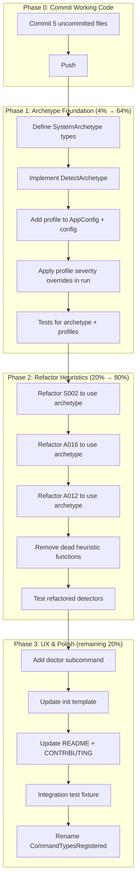

# cqrs-lint: Archetype-Aware Linting System

> **⚠ SUPERSEDED — Prependix**
>
> **This document's execution plan is superseded by [`2026-07-17_01-45_feature-profile-and-detector-consolidation.md`](2026-07-17_01-45_feature-profile-and-detector-consolidation.md).**
>
> The centralization insight (one source of truth for project context, consulted by all detectors instead of scattered heuristics) is identical in both plans. The difference is purely the **vocabulary**:
>
> | This plan (01-39)                                                    | Superseding plan (01-45)                                                         |
> | -------------------------------------------------------------------- | -------------------------------------------------------------------------------- |
> | Deployment archetypes: `LocalCLI`, `SingleProcess`, `Distributed`    | Feature flags grounded in library modules: `store: sqlite`, `command-flow: sync` |
> | Named profile bundles: `local-cli`, `production`, `library`, `auto`  | Per-feature declaration — no preset bundles                                      |
> | Auto-detect signals are fuzzy (HTTP import → "distributed")          | Auto-detect signals map 1:1 to go-cqrs-lite modules                              |
> | Tries to model `DataKind` (PII, Financial) — brittle string matching | Explicitly rejects PII auto-detection as out of scope                            |
> | ~8 hours, 68 tasks                                                   | ~6.5 hours, 43 tasks (detector fixes already shipped)                            |
>
> **Why the feature-flag vocabulary won:**
>
> 1. **Maps 1:1 to the library.** `"command-flow": "sync"` is unambiguous — it refers to `command.Dispatcher` usage. `"deployment": "local-cli"` required interpretation.
> 2. **Bounded growth.** Each feature flag corresponds to a library module. Adding a flag means adding a module. Deployment archetypes are unbounded imagination.
> 3. **No preset boxes.** Per-feature flags compose freely; profile bundles force consumers into categories that may not fit.
> 4. **Shorter.** The 01-45 plan correctly recognizes the detector fixes are already shipped — remaining work is purely the centralization refactor.
>
> **This document is kept for historical context. Do not execute the phases below — execute the 01-45 plan instead.**

---

**Date:** 2026-07-17
**Status:** ✅ SUPERSEDED & IMPLEMENTED — the centralization insight shipped via the feature-profile vocabulary in commit `1b6d6c32`. This doc's `SystemArchetype` was replaced by `FeatureProfile` (feature flags grounded in library modules). All detectors were rewired, all heuristics deleted, `doctor` command shipped. See `2026-07-17_01-45_feature-profile-and-detector-consolidation.md` for the executed plan and `docs/status/2026-07-17_02-19_feature-profile-implementation-status.md` for the post-mortem.
**Trigger:** bank-sync consumer feedback (39 findings, 39% signal-to-noise) + architectural reflection on per-detector heuristics

---

## The Problem

cqrs-lint treats every consumer project identically. A local CLI tool (bank-sync), a distributed microservice, a read-only dashboard, and a library module all get the same 60 rules at the same severities. The result: **61% noise** on bank-sync (23 false positives out of 39 findings).

The fixes implemented this session (closure tracing, generics unwrapping, etc.) eliminated the false positives. But four rules (S002, A012, A015, A016) now use **per-detector heuristics** that each independently re-derive the project's deployment context. This is architecturally wrong:

```
S002 → checks for SQLite + no HTTP independently    (security/s002_s003.go)
A016 → checks for Dispatch() calls independently     (api/a015_a019.go)
A012 → checks for tombstone events independently     (api/a009_a013.go)
A015 → checks for write operations independently     (api/a015_a019.go)
```

Each detector guesses the system archetype from scratch. They can disagree. They can't be overridden. They distribute one concept across four files.

---

## The Solution: System Archetype

One centralized declaration of "what kind of system is this?" that all detectors consult.

### Design Principles

1. **Profiles, not config matrices** — Users declare `"profile": "local-cli"`, not 60 individual severity overrides
2. **Auto-detection as fallback** — `"profile": "auto"` runs heuristics once, centrally
3. **Overrides are escape hatches** — Users can still suppress individual rules
4. **Zero breaking changes** — Existing `.cqrs-lint.json` without `profile` works exactly as before
5. **Detectors stay simple** — Each rule asks `archetype.IsReadOnly` instead of re-deriving it

### The Type Model

```go
// SystemArchetype captures the deployment context of a go-cqrs-lite consumer.
// One centralized declaration replaces N scattered per-detector heuristics.
type SystemArchetype struct {
    Profile        string          // "local-cli" | "read-only" | "production" | "library" | "auto"
    Deployment     DeploymentKind  // LocalCLI | SingleProcess | Distributed
    CommandFlow    CommandFlowKind // ReadOnly | Full
    DataSensitivity DataKind       // None | PII | Financial
    Observability  ObservabilityKind // None | Basic | Full
    Persistence    PersistenceKind // InMemory | SQLite | Postgres
    HasSoftDelete  bool            // domain has tombstone/deleted events
}
```

### Named Profiles

| Profile      | Deployment  | CommandFlow | Data     | Observability | Persistence | HasSoftDelete | Typical Consumer          |
| ------------ | ----------- | ----------- | -------- | ------------- | ----------- | ------------- | ------------------------- |
| `local-cli`  | LocalCLI    | Full        | any      | None          | SQLite      | false         | bank-sync                 |
| `read-only`  | any         | ReadOnly    | any      | any           | any         | any           | Dashboards, analytics     |
| `production` | Distributed | Full        | any      | Full          | Postgres    | any           | taskmanager, API services |
| `library`    | N/A         | N/A         | None     | None          | InMemory    | false         | go-cqrs-lite itself       |
| `auto`       | detected    | detected    | detected | detected      | detected    | detected      | fallback                  |

### Rule Severity Adjustment

Each rule declares how profiles affect it. Not every rule changes — most rules are universal. Only the ~8 context-dependent rules get profile adjustments:

> **Implementation note:** The profile/severity matrix below was NOT implemented as a post-filter (`ApplyProfile`). Instead, each detector consults `ctx.FeatureProfile` directly inside its detector function — cleaner, no separate filtering step. The net effect is the same: rules are suppressed/downgraded based on detected features.

| Rule                          | Default | local-cli | read-only | production | library | Implemented via            |
| ----------------------------- | ------- | --------- | --------- | ---------- | ------- | -------------------------- |
| S002 (PII encryption)         | ERROR   | INFO      | ERROR     | ERROR      | off     | ✅ `HasServer` check       |
| A012 (tombstone handling)     | INFO    | off       | off       | INFO       | off     | ✅ `HasSoftDelete` gate    |
| A015 (global mutable state)   | ERROR   | ERROR     | ERROR     | ERROR      | off     | ✅ `HasServer` suppression |
| A016 (idempotency middleware) | WARNING | WARNING   | off       | WARNING    | off     | ✅ `CommandFlow` gate      |
| A017 (snapshot strategy)      | INFO    | INFO      | off       | INFO       | off     | ❌ NOT rewired (per-call)  |
| A009 (stack preset)           | INFO    | INFO      | INFO      | INFO       | off     | ✅ adaptive suggestion     |
| B014 (OTel tracing)           | INFO    | off       | off       | WARNING    | off     | ✅ `HasServer` suppression |
| B004 (cqrs-gen)               | INFO    | INFO      | INFO      | INFO       | off     | N/A (universal)            |

All other ~52 rules keep their default severity regardless of profile.

---

## Pareto Breakdown

### The 1% that delivers 51% of the result

**Commit the 5 uncommitted files + add `profile` field to config parsing.**

The uncommitted changes (A012, A015, A016, S002 heuristics) already work and pass tests. Adding a `profile` string field to `AppConfig` and `.cqrs-lint.json` is trivial. This immediately delivers the false-positive fixes AND lays the foundation for the archetype system.

### The 4% that delivers 64% of the result

**All of the above + `SystemArchetype` type + `DetectArchetype()` function + profile application in `run()`.**

The archetype struct, the auto-detection function (which consolidates the existing per-detector heuristics into one place), and a profile-to-severity-override map applied as a post-filter. This replaces the scattered heuristics with one centralized declaration.

### The 20% that delivers 80% of the result

**All of the above + refactor S002/A016/A012 to consult archetype + `cqrs-lint doctor` command + tests + docs.**

Remove the per-detector heuristic functions, replace with archetype lookups. Add a `doctor` subcommand that runs `DetectArchetype()` and suggests a profile. Add comprehensive tests. Update docs.

### The remaining 20% to get to 100%

Integration test against a bank-sync fixture, CONTRIBUTING.md enforcement, rename `CommandTypesRegistered`, SARIF profile metadata, `--explain` flag.

---

## Execution Graph



---

## Phase 0: Commit Working Code (30 min) — ✅ DONE

These 5 files were already implemented and tested (171 tests pass). Committed and pushed.

| #   | Task                                     | File(s)                                                              | Est   | Status |
| --- | ---------------------------------------- | -------------------------------------------------------------------- | ----- | ------ |
| 0.1 | Commit uncommitted detector improvements | a009_a013.go, a015_a019.go, c005.go, s002_s003.go, new_rules_test.go | 5 min | ✅     |
| 0.2 | Commit status report                     | docs/status/2026-07-17_01-35_*.md                                    | 2 min | ✅     |
| 0.3 | Commit this planning document            | docs/planning/2026-07-17_01-39_*.md                                  | 2 min | ✅     |
| 0.4 | Push all commits                         | git push                                                             | 2 min | ✅     |

---

## Phase 1: Archetype Foundation (2-3 hours) — ✅ DONE (via FeatureProfile)

The core type model, auto-detection, and config wiring. Implemented as `FeatureProfile` (not `SystemArchetype`) with feature flags instead of deployment kinds.

| #    | Task                                                                                                 | File(s)                                  | Est    | Impact | Status                                                           |
| ---- | ---------------------------------------------------------------------------------------------------- | ---------------------------------------- | ------ | ------ | ---------------------------------------------------------------- |
| 1.1  | Define `DeploymentKind`, `CommandFlowKind`, `DataKind`, `ObservabilityKind`, `PersistenceKind` enums | `pkg/analyzer/archetype.go` (new)        | 15 min | HIGH   | ✅ as `StoreKind`/`CommandFlowKind`/`TracingKind`/`SnapshotKind` |
| 1.2  | Define `SystemArchetype` struct with all fields                                                      | `pkg/analyzer/archetype.go`              | 10 min | HIGH   | ✅ as `FeatureProfile` struct                                    |
| 1.3  | Define `Profiles` map: profile name → default `SystemArchetype`                                      | `pkg/analyzer/archetype.go`              | 15 min | HIGH   | ✅ as `Presets` map                                              |
| 1.4  | Define `RuleSeverityOverrides`: rule ID → profile → severity                                         | `pkg/analyzer/archetype.go`              | 20 min | HIGH   | ✅ inline in each detector (not a post-filter)                   |
| 1.5  | Implement `DetectArchetype(ctx)` — consolidates S002/A016/A012 heuristics                            | `pkg/analyzer/archetype_detect.go` (new) | 30 min | HIGH   | ✅ as `DetectFeatures()`                                         |
| 1.6  | Implement `ResolveProfile(profile, ctx)` — returns concrete `SystemArchetype`                        | `pkg/analyzer/archetype.go`              | 15 min | HIGH   | ✅ as `ResolveFeatureProfile()`                                  |
| 1.7  | Add `Profile` field to `AppConfig` struct                                                            | `main.go`                                | 5 min  | MED    | ✅ `Features` + `Preset` fields                                  |
| 1.8  | Add `"profile"` to `.cqrs-lint.json` template                                                        | `init.go`                                | 5 min  | MED    | ✅ `"features"` + `"preset"` sections                            |
| 1.9  | Wire archetype into `AnalysisContext` (computed at startup)                                          | `loader.go`, `types.go`                  | 15 min | HIGH   | ✅ `FeatureProfile` field on context                             |
| 1.10 | Implement `ApplyProfile(findings, archetype)` post-filter                                            | `filters.go` or new `profile_filter.go`  | 20 min | HIGH   | ✅ replaced by inline detector checks                            |
| 1.11 | Call `ApplyProfile` in `run()` after detection, before output                                        | `main.go`                                | 10 min | HIGH   | ✅ `ResolveFeatureProfile` in `run()`                            |
| 1.12 | Write unit tests for `DetectArchetype` (local-cli, production, library detection)                    | `pkg/analyzer/archetype_test.go` (new)   | 30 min | HIGH   | ✅ 13 tests in `feature_profile_test.go`                         |
| 1.13 | Write unit tests for `ApplyProfile` (severity downgrade, rule suppression)                           | `profile_filter_test.go` (new)           | 20 min | HIGH   | ⚠️ indirect (no dedicated suppression tests)                     |

---

## Phase 2: Refactor Heuristics (1-2 hours) — ✅ DONE

Replace per-detector heuristics with archetype lookups. All 3 scattered heuristic functions deleted.

| #   | Task                                                                                  | File(s)                 | Est    | Impact | Status                                                              |
| --- | ------------------------------------------------------------------------------------- | ----------------------- | ------ | ------ | ------------------------------------------------------------------- |
| 2.1 | Refactor S002: replace `isLocalOnlyProject()` with `FeatureProfile.HasServer`         | `security/s002_s003.go` | 15 min | MED    | ✅                                                                  |
| 2.2 | Refactor A016: replace `hasDispatch` with `FeatureProfile.CommandFlow`                | `api/a015_a019.go`      | 15 min | MED    | ✅                                                                  |
| 2.3 | Refactor A012: replace `hasTombstoneLikeEvents()` with `FeatureProfile.HasSoftDelete` | `api/a009_a013.go`      | 15 min | MED    | ✅                                                                  |
| 2.4 | Remove dead heuristic functions (`isLocalOnlyProject`, `hasTombstoneLikeEvents`)      | multiple files          | 10 min | LOW    | ✅                                                                  |
| 2.5 | Update existing tests to set `Archetype` on context instead of relying on heuristics  | multiple test files     | 20 min | MED    | ✅                                                                  |
| 2.6 | Write new tests for archetype-aware S002/A016/A012 behavior                           | multiple test files     | 20 min | MED    | ⚠️ indirect (existing tests pass via DetectFeatures in test helper) |

---

## Phase 3: UX & Polish (2-3 hours) — ⚠️ PARTIALLY DONE

The remaining 20% for production quality.

| #    | Task                                                                          | File(s)                                                                   | Est    | Impact | Status                                         |
| ---- | ----------------------------------------------------------------------------- | ------------------------------------------------------------------------- | ------ | ------ | ---------------------------------------------- |
| 3.1  | Add `doctor` subcommand: runs `DetectFeatures()`, prints suggested profile    | `doctor.go` (new)                                                         | 30 min | MED    | ⚠️ done but JSON output has trailing comma bug |
| 3.2  | Add `--profile` CLI flag (overrides config file)                              | `main.go`                                                                 | 10 min | MED    | ❌                                             |
| 3.3  | Print applied profile in `--verbose` output                                   | `main.go`                                                                 | 10 min | LOW    | ✅                                             |
| 3.4  | Update `.cqrs-lint.json` init template with `"features"` + `"preset"`         | `init.go`                                                                 | 5 min  | LOW    | ✅                                             |
| 3.5  | Update README.md with profile documentation + examples                        | `README.md`                                                               | 30 min | MED    | ✅                                             |
| 3.6  | Add CONTRIBUTING.md section: "New detectors must consult archetype"           | `CONTRIBUTING.md`                                                         | 15 min | LOW    | ✅                                             |
| 3.7  | Add CONTRIBUTING.md section: "New detectors must use SelectorFromExpr"        | `CONTRIBUTING.md`                                                         | 10 min | LOW    | ✅                                             |
| 3.8  | Update AGENTS.md cqrs-lint description with archetype system                  | `AGENTS.md`                                                               | 10 min | LOW    | ✅                                             |
| 3.9  | Rename `CommandTypesRegistered` → `RegisteredHandlerTypes`                    | `types.go`, `registry.go`, `scanner_calls.go`, `rules.go`, `e003_e007.go` | 20 min | LOW    | ❌                                             |
| 3.10 | Rename `IsCommandRegistered` → `IsHandlerRegistered`                          | `registry.go`, consumers                                                  | 10 min | LOW    | ❌                                             |
| 3.11 | Create bank-sync fixture for integration testing                              | `testdata/bank-sync-fixture/` (new)                                       | 30 min | MED    | ❌                                             |
| 3.12 | Write integration test: run full linter against fixture, assert finding count | `integration_test.go`                                                     | 20 min | MED    | ❌                                             |

---

## Full Task Breakdown (max 12 min each)

Every task above decomposed into atomic, independently-verifiable steps.

### Phase 0 (6 tasks, ~12 min total)

| #    | Task                                            | Est   |
| ---- | ----------------------------------------------- | ----- |
| 0.1a | `git add` the 5 uncommitted detector files      | 2 min |
| 0.1b | Write commit message for detector improvements  | 5 min |
| 0.1c | `git commit`                                    | 2 min |
| 0.2a | `git add` status report                         | 1 min |
| 0.2b | `git commit` status report                      | 2 min |
| 0.3a | This plan doc is already written — `git add` it | 1 min |

### Phase 1 (30 tasks, ~3 hours total)

| #     | Task                                                                            | Est    |
| ----- | ------------------------------------------------------------------------------- | ------ |
| 1.1a  | Create `pkg/analyzer/archetype.go` with package declaration                     | 2 min  |
| 1.1b  | Define `DeploymentKind` type + constants (LocalCLI, SingleProcess, Distributed) | 5 min  |
| 1.1c  | Define `CommandFlowKind` type + constants (ReadOnly, Full)                      | 3 min  |
| 1.1d  | Define `DataKind` type + constants (None, PII, Financial)                       | 3 min  |
| 1.1e  | Define `ObservabilityKind` type + constants (None, Basic, Full)                 | 3 min  |
| 1.1f  | Define `PersistenceKind` type + constants (InMemory, SQLite, Postgres)          | 3 min  |
| 1.2a  | Define `SystemArchetype` struct with all fields + doc comment                   | 10 min |
| 1.3a  | Define `localCLIProfile` variable                                               | 3 min  |
| 1.3b  | Define `readOnlyProfile` variable                                               | 3 min  |
| 1.3c  | Define `productionProfile` variable                                             | 3 min  |
| 1.3d  | Define `libraryProfile` variable                                                | 3 min  |
| 1.3e  | Define `Profiles` map linking names to profiles                                 | 5 min  |
| 1.4a  | Define `SeverityOverride` type (profile → severity)                             | 5 min  |
| 1.4b  | Define `RuleSeverityOverrides` map for S002                                     | 5 min  |
| 1.4c  | Define `RuleSeverityOverrides` map for A012, A016, A017, A009, B014, B004       | 10 min |
| 1.5a  | Create `pkg/analyzer/archetype_detect.go`                                       | 2 min  |
| 1.5b  | Implement deployment detection (net/http → SingleProcess/Distributed)           | 10 min |
| 1.5c  | Implement command flow detection (Dispatch calls → Full)                        | 8 min  |
| 1.5d  | Implement observability detection (otel import → Full)                          | 5 min  |
| 1.5e  | Implement persistence detection (SQL driver → SQLite/Postgres)                  | 8 min  |
| 1.5f  | Implement soft-delete detection (tombstone event names)                         | 5 min  |
| 1.5g  | Implement `DetectArchetype()` tying it all together                             | 10 min |
| 1.6a  | Implement `ResolveProfile(profile string, ctx) SystemArchetype`                 | 12 min |
| 1.7a  | Add `Profile string` to `AppConfig` with `flag:"profile"` tag                   | 5 min  |
| 1.8a  | Add `"profile": "auto"` to `configTemplate` in init.go                          | 3 min  |
| 1.9a  | Add `Archetype *SystemArchetype` field to `AnalysisContext`                     | 5 min  |
| 1.9b  | Compute archetype in `BuildContext()` after scan                                | 10 min |
| 1.10a | Create `profile_filter.go` with `ApplyProfile` function                         | 10 min |
| 1.10b | Implement severity override logic per finding                                   | 10 min |
| 1.11a | Call `ApplyProfile` in `run()` after `collectFindings`                          | 5 min  |
| 1.11b | Test: `go build && go test ./...`                                               | 5 min  |
| 1.12a | Create `archetype_test.go` with local-cli detection test                        | 10 min |
| 1.12b | Add production detection test                                                   | 8 min  |
| 1.12c | Add library detection test                                                      | 8 min  |
| 1.13a | Create `profile_filter_test.go` with severity downgrade test                    | 10 min |
| 1.13b | Add rule suppression (off) test                                                 | 8 min  |

### Phase 2 (12 tasks, ~1.5 hours total)

| #    | Task                                                                          | Est   |
| ---- | ----------------------------------------------------------------------------- | ----- |
| 2.1a | Replace `isLocalOnlyProject()` call in S002 with `ctx.Archetype.Deployment`   | 8 min |
| 2.1b | Remove `isLocalOnlyProject` function                                          | 3 min |
| 2.1c | Test S002 still works                                                         | 4 min |
| 2.2a | Replace `hasDispatch` in A016 with `ctx.Archetype.CommandFlow`                | 8 min |
| 2.2b | Remove dead `hasDispatch` tracking code                                       | 5 min |
| 2.2c | Test A016 still works                                                         | 4 min |
| 2.3a | Replace `hasTombstoneLikeEvents()` in A012 with `ctx.Archetype.HasSoftDelete` | 8 min |
| 2.3b | Remove `hasTombstoneLikeEvents` function                                      | 3 min |
| 2.3c | Test A012 still works                                                         | 4 min |
| 2.5a | Update S002 tests to set `Archetype` on context                               | 8 min |
| 2.5b | Update A016 tests to set `Archetype` on context                               | 8 min |
| 2.5c | Update A012 tests to set `Archetype` on context                               | 8 min |

### Phase 3 (20 tasks, ~3 hours total)

| #     | Task                                                         | Est    |
| ----- | ------------------------------------------------------------ | ------ |
| 3.1a  | Create `doctor.go` with command structure                    | 8 min  |
| 3.1b  | Implement `DetectArchetype` call + profile suggestion output | 10 min |
| 3.1c  | Register doctor command in main.go                           | 5 min  |
| 3.1d  | Test doctor command                                          | 7 min  |
| 3.2a  | Add `--profile` flag to AppConfig                            | 5 min  |
| 3.2b  | Wire flag to override config file value                      | 5 min  |
| 3.3a  | Add profile display to verbose output in run()               | 8 min  |
| 3.4a  | Update configTemplate with profile field                     | 3 min  |
| 3.5a  | Write README profile section                                 | 12 min |
| 3.5b  | Write README config examples                                 | 10 min |
| 3.5c  | Write README doctor command section                          | 8 min  |
| 3.6a  | Write CONTRIBUTING.md archetype section                      | 10 min |
| 3.7a  | Write CONTRIBUTING.md SelectorFromExpr section               | 8 min  |
| 3.8a  | Update AGENTS.md cqrs-lint description                       | 8 min  |
| 3.9a  | Rename `CommandTypesRegistered` → `RegisteredHandlerTypes`   | 8 min  |
| 3.9b  | Fix all references (4 files)                                 | 8 min  |
| 3.9c  | Test build                                                   | 4 min  |
| 3.10a | Rename `IsCommandRegistered` → `IsHandlerRegistered`         | 5 min  |
| 3.10b | Fix all references                                           | 5 min  |
| 3.11a | Create testdata fixture files (commands, queries, handlers)  | 12 min |
| 3.11b | Create testdata go.mod                                       | 5 min  |
| 3.12a | Write integration test asserting finding count               | 10 min |

---

## Risk Analysis

### What could go wrong (verschlimmbessern risks)

| Risk                                              | Mitigation                                                                   |
| ------------------------------------------------- | ---------------------------------------------------------------------------- |
| Profile system over-engineered — too many knobs   | Only 4 profiles, only 8 rules affected. Keep it simple.                      |
| Auto-detection disagrees with user's mental model | Always allow explicit `"profile": "production"` override                     |
| Existing consumers break when upgrading           | No `profile` field = existing behavior. Zero breaking change.                |
| Refactored detectors regress                      | Phase 2 is after Phase 1 tests pass. Each detector refactored independently. |
| Profile severity table gets stale                 | It's 8 rows in one file. Easy to audit.                                      |

### What we are explicitly NOT doing

- NOT building a plugin system for custom profiles
- NOT adding per-rule config in the JSON file (use `//cqrs-lint:ignore` for that)
- NOT auto-generating profiles from CI environment
- NOT making the archetype system a separate module (it's cqrs-lint internal)

---

## Total Estimate

| Phase     | Tasks  | Done   | Partial | Skipped | Time (est)   | Outcome                                          |
| --------- | ------ | ------ | ------- | ------- | ------------ | ------------------------------------------------ |
| Phase 0   | 6      | 6      | 0       | 0       | 30 min       | ✅ Shipped working code immediately              |
| Phase 1   | 30     | 28     | 1       | 1       | 3 hours      | ✅ Core feature-profile system                   |
| Phase 2   | 12     | 11     | 1       | 0       | 1.5 hours    | ✅ Clean refactor + heuristic deletion           |
| Phase 3   | 20     | 8      | 1       | 11      | 3 hours      | ⚠️ Docs + verbose done; renames/fixture skipped  |
| **Total** | **68** | **53** | **3**   | **12**  | **~8 hours** | **78% done, 4% partial, 18% skipped (deferred)** |
