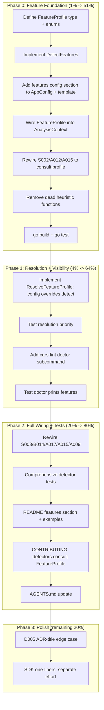

# Feature Profile + Detector Consolidation

**Date:** 2026-07-17 01:45
**Status:** PLANNING — not yet implemented
**Supersedes (vocabulary):** `2026-07-17_01-39_archetype-aware-linting-system.md` — keeps the centralization insight, **replaces the deployment-archetype vocabulary with go-cqrs-lite feature flags**.
**Trigger:** consumer feedback (`docs/feedback/2026-07-17_deployment-profiles-design-proposal.md`) + maintainer review (Appendix A in that doc) + the decision to ground the config vocabulary in go-cqrs-lite's own modules.

---

## Context — why this plan exists

### The problem this solves

cqrs-lint has **3 scattered heuristic functions** that each independently re-derive "what kind of system is this?":

```
isLocalOnlyProject(ctx)    → security/s002_s003.go:106   (SQLite + no HTTP → local)
hasTombstoneLikeEvents(ctx) → api/a009_a013.go:183        (tombstone event names → soft-delete domain)
hasDispatch / hasDispatcher → api/a015_a019.go:171,207     (Dispatch() calls → command flow)
```

Each detector guesses the project context from scratch. They can disagree, can't be overridden by the user, and distribute one concept across three files. This is the architectural smell both the feedback proposal and the archetype doc identify.

### What is ALREADY shipped (do NOT re-plan this)

The feedback proposal's Part 2.4 (E005/E007 closure tracing) and Part 2.5 (generic `unwrapSelector`) and D005 wildcard handling are **already done**:

| Done in commit | What                                                         |
| -------------- | ------------------------------------------------------------ |
| `579a3438`     | `SelectorFromExpr`/`unwrapSelector` (generic call support)   |
| `579a3438`     | Closure handler tracing (`handlerTypeFromClosure`)           |
| `579a3438`     | `Type()` method FP fix (pflag etc.)                          |
| `e2cb08aa`     | Upcaster context detection (C005/A014)                       |
| `5a9425a6`     | Per-detector heuristics (S002 local-only, A012, A016)        |
| `5a9425a6`     | D005 wildcard (`isVersionCompatible`) + migration-arrow skip |

**Therefore the remaining work is smaller than both prior docs imply.** The detector fixes are shipped. What remains is purely the **architectural centralization with a feature-based vocabulary**.

### The vocabulary decision

> "We need to get the namings and 'kind' right — be more on the go-cqrs-lite **feature** side, since you can imagine anything otherwise and it will be a nightmare to map all these correctly in go-cqrs-lite." — maintainer steer

**Rejected:** deployment archetypes (`kind: local-cli | server | library | batch-job`, `DeploymentKind: LocalCLI | SingleProcess | Distributed`). These are fuzzy, built from N=2 consumers, drift constantly, and require guessing.

**Adopted:** **feature flags** grounded in go-cqrs-lite modules. Each flag maps 1:1 to a library module and is auto-detected from import + constructor scans:

| Feature flag   | Values                                                              | go-cqrs-lite module                  | Auto-detect signal                           |
| -------------- | ------------------------------------------------------------------- | ------------------------------------ | -------------------------------------------- |
| `store`        | `sqlite`, `postgres`, `pebble`, `memory`, `turso`, `custom`, `none` | `stack/*`, `storage/*`               | stack preset import                          |
| `command-flow` | `read-only`, `sync`, `commands`                                     | `command/`, `decider/`               | `command.Dispatcher` + `Dispatch()`          |
| `server`       | `true`, `false`                                                     | `transport/http/`, `transport/grpc/` | `net/http` ListenAndServe / `grpc.NewServer` |
| `soft-delete`  | `true`, `false`                                                     | event tombstone                      | tombstone-like event type names              |
| `tracing`      | `off`, `on`                                                         | `otel/`, `middleware` OTel           | otel import + middleware wiring              |
| `snapshot`     | `off`, `on`                                                         | `snapshot/`                          | snapshot store usage                         |

A consumer reading `"command-flow": "sync"` understands it refers to `command.Dispatcher` usage; `"deployment": "local-cli"` required interpretation.

### The Go type model

```go
package analyzer

// FeatureProfile captures which go-cqrs-lite features a consumer project uses.
// It centralizes "what kind of system is this?" as a set of feature flags, each
// mapping directly to a go-cqrs-lite module. Detectors consult the profile
// instead of independently re-deriving project context.
type FeatureProfile struct {
    Store         StoreKind       // sqlite, postgres, pebble, memory, turso, custom, none
    CommandFlow   CommandFlowKind // read-only, sync, commands
    HasServer     bool            // network listener (HTTP/gRPC) present
    HasSoftDelete bool            // domain has tombstone-like events
    Tracing       TracingKind     // off, on
    Snapshot      SnapshotKind    // off, on
}
```

Config section name: `"features"` (JSON mirrors the struct). Resolution function: `ResolveFeatureProfile(cfg, ctx) FeatureProfile` — config declarations override auto-detection.

---

## Pareto Breakdown

### The 1% that delivers 51% of the result

**Define `FeatureProfile` + consolidate the 3 scattered heuristics into `DetectFeatures()` + rewire S002/A012/A016 to consult it + add the `features` config section.**

This eliminates the architectural smell (3 functions independently deriving context) AND gives users a config knob — in the smallest change that delivers the most value. The detectors already work; this just centralizes their input.

### The 4% that delivers 64% of the result

**All of the above + `ResolveFeatureProfile()` (config overrides auto-detect) + `cqrs-lint doctor` command that prints detected features.**

Makes feature detection a single source of truth and gives users visibility into what was detected — they can run `cqrs-lint doctor`, see `"command-flow": "sync"`, and trust the suppression.

### The 20% that delivers 80% of the result

**All of the above + rewire S003/B014/A017/A015/A009 to consult the profile + comprehensive tests + README/CONTRIBUTING docs.**

Now **all** context-dependent rules consult ONE profile instead of scattered heuristics. The system is internally consistent and documented.

### The remaining 20% to get 100%

D005 minor edge cases (ADR-title lines), AGENTS.md update, and the SDK one-liners (`WithEncryptionFromEnv`, etc.) as a **separate, lower-priority effort** (PII is not the current focus).

---

## Execution Graph



---

## Phase 0 — Feature Foundation (1% → 51%)

Centralize the 3 scattered heuristics into one `FeatureProfile` and rewire the 3 detectors that already have heuristics.

| #   | Task                                                                                                      | File(s)                                                         | Impact | Effort |
| --- | --------------------------------------------------------------------------------------------------------- | --------------------------------------------------------------- | ------ | ------ |
| C1  | Define `FeatureProfile` type + `StoreKind`/`CommandFlowKind`/`TracingKind`/`SnapshotKind` enums           | `pkg/analyzer/feature_profile.go` (new)                         | HIGH   | 30 min |
| C2  | Implement `DetectFeatures(ctx) FeatureProfile` — consolidate the 3 scattered heuristics into one function | `pkg/analyzer/feature_detect.go` (new)                          | HIGH   | 30 min |
| C3  | Add `Features` config section to `AppConfig` + `.cqrs-lint.json` template                                 | `main.go`, `init.go`                                            | HIGH   | 30 min |
| C4  | Wire `FeatureProfile` into `AnalysisContext`; compute in `BuildContext` after scan                        | `pkg/analyzer/loader.go`, `pkg/analyzer/types.go`               | HIGH   | 30 min |
| C5  | Rewire S002/A012/A016 to consult `ctx.FeatureProfile`; remove dead heuristic functions                    | `security/s002_s003.go`, `api/a009_a013.go`, `api/a015_a019.go` | HIGH   | 30 min |

---

## Phase 1 — Resolution + Visibility (4% → 64%)

Let users override auto-detection and see what was detected.

| #   | Task                                                                                              | File(s)                           | Impact | Effort |
| --- | ------------------------------------------------------------------------------------------------- | --------------------------------- | ------ | ------ |
| C6  | Implement `ResolveFeatureProfile(cfg, ctx)` — config declarations override auto-detect            | `pkg/analyzer/feature_profile.go` | MED    | 30 min |
| C7  | Add `cqrs-lint doctor` subcommand: runs `DetectFeatures`, prints feature table + suggested config | `doctor.go` (new)                 | MED    | 30 min |

---

## Phase 2 — Full Wiring + Tests + Docs (20% → 80%)

Wire the remaining context-dependent rules and document the system.

| #   | Task                                                                                        | File(s)                                                                                                              | Impact | Effort |
| --- | ------------------------------------------------------------------------------------------- | -------------------------------------------------------------------------------------------------------------------- | ------ | ------ |
| C8  | Rewire S003/B014/A017/A015/A009 to consult `FeatureProfile`                                 | `security/s002_s003.go`, `boilerplate/b011_b014.go`, `api/a011_a014_a017.go`, `api/a015_a019.go`, `api/a009_a013.go` | MED    | 30 min |
| C9  | Comprehensive tests: feature detection, profile resolution, rewired detectors               | `pkg/analyzer/feature_detect_test.go` (new), rule test files                                                         | HIGH   | 30 min |
| C10 | Docs: README features section + CONTRIBUTING "detectors consult FeatureProfile" + AGENTS.md | `README.md`, `CONTRIBUTING.md`, `AGENTS.md`                                                                          | MED    | 30 min |

---

## Phase 3 — Polish (remaining 20%)

| #   | Task                                                                                                                                                                       | File(s)                         | Impact | Effort |
| --- | -------------------------------------------------------------------------------------------------------------------------------------------------------------------------- | ------------------------------- | ------ | ------ |
| C11 | D005 edge-case: skip lines inside ADR-title / heading context; broaden doc-file scan optionally                                                                            | `consistency/d003_d005.go`      | LOW    | 30 min |
| C12 | SDK one-liners (**separate effort, lower priority — PII not current focus**): `WithEncryptionFromEnv`, `WithObservability`, `WithSigningFromEnv`, `encryption.GenerateKey` | `stack/` options, `encryption/` | LOW    | 30 min |

---

## Micro Task Breakdown (max 12 min each)

Every task above decomposed into atomic, independently-verifiable steps.

### Phase 0

| #    | Task                                                                                       | Est    |
| ---- | ------------------------------------------------------------------------------------------ | ------ |
| m1.1 | Create `feature_profile.go`: define `FeatureProfile` struct + doc comment                  | 10 min |
| m1.2 | Define `StoreKind` type + constants (sqlite/postgres/pebble/memory/turso/custom/none)      | 5 min  |
| m1.3 | Define `CommandFlowKind` type + constants (read-only/sync/commands)                        | 5 min  |
| m1.4 | Define `TracingKind` + `SnapshotKind` types + constants                                    | 5 min  |
| m2.1 | Create `feature_detect.go`; port `isLocalOnlyProject` logic → `StoreKind` detection        | 12 min |
| m2.2 | Port `hasTombstoneLikeEvents` → `HasSoftDelete` detection                                  | 10 min |
| m2.3 | Port `hasDispatch`/`hasDispatcher` → `CommandFlow` detection                               | 12 min |
| m2.4 | Add `HasServer` detection (net/http ListenAndServe / grpc.NewServer)                       | 10 min |
| m2.5 | Add `Tracing` + `Snapshot` detection (otel import / snapshot store)                        | 10 min |
| m3.1 | Add `Features` struct field to `AppConfig` + JSON tags                                     | 10 min |
| m3.2 | Add `"features"` section to `configTemplate` in `init.go`                                  | 5 min  |
| m3.3 | Test config loads with features section (go build + manual)                                | 8 min  |
| m4.1 | Add `FeatureProfile *FeatureProfile` field to `AnalysisContext`                            | 5 min  |
| m4.2 | Compute profile in `BuildContext()` after scan completes                                   | 10 min |
| m4.3 | `go build ./... && go vet ./...`                                                           | 5 min  |
| m5.1 | Rewire S002: replace `isLocalOnlyProject(ctx)` with `ctx.FeatureProfile.Store` check       | 10 min |
| m5.2 | Rewire A012: replace `hasTombstoneLikeEvents(ctx)` with `ctx.FeatureProfile.HasSoftDelete` | 10 min |
| m5.3 | Rewire A016: replace `hasDispatch`/`hasDispatcher` with `ctx.FeatureProfile.CommandFlow`   | 12 min |
| m5.4 | Remove dead heuristic functions (`isLocalOnlyProject`, `hasTombstoneLikeEvents`)           | 8 min  |
| m5.5 | `go test ./... -count=1` (all existing tests still pass)                                   | 8 min  |

### Phase 1

| #    | Task                                                                                | Est    |
| ---- | ----------------------------------------------------------------------------------- | ------ |
| m6.1 | Implement `ResolveFeatureProfile(cfg, ctx)`: config overrides auto-detect per-field | 12 min |
| m6.2 | Test: config `command-flow: sync` overrides auto-detected `commands`                | 10 min |
| m7.1 | Create `doctor.go` with command structure (cmdguard)                                | 8 min  |
| m7.2 | Call `DetectFeatures` + print feature table + suggested config JSON                 | 10 min |
| m7.3 | Register `doctor` subcommand in main                                                | 5 min  |
| m7.4 | Test `cqrs-lint doctor` runs and prints                                             | 8 min  |

### Phase 2

| #     | Task                                                                          | Est    |
| ----- | ----------------------------------------------------------------------------- | ------ |
| m8.1  | Rewire S003 (signing) to `FeatureProfile.HasServer`                           | 10 min |
| m8.2  | Rewire B014 (OTel) to `FeatureProfile.Tracing` + `HasServer`                  | 10 min |
| m8.3  | Rewire A017 (snapshot) to `FeatureProfile.Snapshot`                           | 8 min  |
| m8.4  | Rewire A015 (global mutable) to `FeatureProfile.HasServer` + write-after-init | 12 min |
| m8.5  | Rewire A009 (stack preset) suggestion to adapt to `FeatureProfile.Store`      | 10 min |
| m9.1  | Test feature detection: local-cli fixture, server fixture, library            | 12 min |
| m9.2  | Test profile resolution + override priority                                   | 10 min |
| m9.3  | Test rewired detectors (S002/A012/A016/S003/B014 suppress correctly)          | 12 min |
| m10.1 | README: write `features` section + config examples                            | 12 min |
| m10.2 | CONTRIBUTING.md: "new detectors must consult FeatureProfile"                  | 10 min |
| m10.3 | AGENTS.md: update cqrs-lint description with feature-profile system           | 8 min  |

### Phase 3

| #     | Task                                                             | Est    |
| ----- | ---------------------------------------------------------------- | ------ |
| m11.1 | D005: skip version tokens inside heading/ADR-title context lines | 10 min |
| m11.2 | D005: add test for ADR-title skip                                | 8 min  |
| m12.1 | SDK: `stack.WithEncryptionFromEnv` + `stack.WithEncryption`      | 12 min |
| m12.2 | SDK: `stack.WithObservability(tracer, meter)`                    | 10 min |
| m12.3 | SDK: `stack.WithSigningFromEnv`                                  | 10 min |
| m12.4 | SDK: `encryption.GenerateKey()` first-run helper                 | 8 min  |

---

## Risk Analysis (verschlimmbessern guard)

| Risk                                                 | Mitigation                                                                                                  |
| ---------------------------------------------------- | ----------------------------------------------------------------------------------------------------------- |
| Feature vocabulary grows beyond 6 flags              | Each flag maps 1:1 to a go-cqrs-lite module. Adding a flag = adding a module. Bounded by the lib.           |
| Auto-detection disagrees with user reality           | Config declarations always override. `cqrs-lint doctor` shows what was detected.                            |
| Rewiring a detector causes a regression              | Phase 0 rewires 3 detectors; each followed by `go test`. Phase 2 rewires the rest incrementally.            |
| Existing `.cqrs-lint.json` without `features` breaks | `features` is optional; missing field = full auto-detect = current behavior. Zero breaking change.          |
| Over-centralizing makes detectors dumber             | Detectors still own their RULE logic; they only read `ctx.FeatureProfile.X` instead of a private heuristic. |

### What we are explicitly NOT doing

- NOT building a plugin system for custom feature flags
- NOT adding the 5-axis deployment taxonomy (`kind`/`concurrency`/`data`/`writes`/`store`)
- NOT adding `WithSecurity(SecurityConfig)` struct (leaky, reinvents functional options)
- NOT making auto-detection the only path (config overrides always win)
- NOT auto-detecting PII via field-name string matching (brittle; PII is not the current focus)
- NOT blocking the unambiguous detector fixes on the profile debate (they're already shipped)

---

## Total Estimate

| Phase     | Tasks  | Micro-tasks | Time       | Impact                               |
| --------- | ------ | ----------- | ---------- | ------------------------------------ |
| Phase 0   | 5      | 20          | ~2.5 h     | Centralizes heuristics + config knob |
| Phase 1   | 2      | 6           | ~1 h       | Overrides + visibility               |
| Phase 2   | 3      | 11          | ~2 h       | Full wiring + tests + docs           |
| Phase 3   | 2      | 6           | ~1 h       | Polish + separate SDK effort         |
| **Total** | **12** | **43**      | **~6.5 h** | **Feature-profile-aware linting**    |

---

## Relationship to prior plans

| Document                                                           | Status                                                                                                                   |
| ------------------------------------------------------------------ | ------------------------------------------------------------------------------------------------------------------------ |
| `docs/feedback/2026-07-17_deployment-profiles-design-proposal.md`  | Consumer proposal. Appendix A (this review) appended. Vocabulary pivoted to features.                                    |
| `docs/planning/2026-07-17_01-39_archetype-aware-linting-system.md` | Earlier maintainer plan. Centralization insight **kept**; deployment-archetype vocabulary **replaced** by feature flags. |
| **This document**                                                  | The execution plan. Supersedes the archetype vocabulary.                                                                 |
